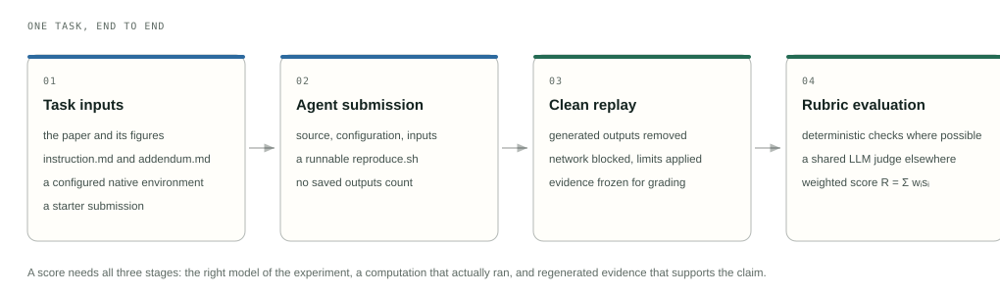

# How the Expanded Set Evaluates Scientific Reproduction

[Overview](../README.md) · [Quickstart](quickstart.md) · [Task catalog](tasks.md)

PaperBench High-Difficulty and Expanded Tasks evaluates whether an agent can turn a published scientific description
into an **executable experiment whose regenerated evidence supports the requested
claim**. A correct-looking number, successful command, or polished final report is
not sufficient by itself.

## The Protocol at a Glance



*Only evidence regenerated by the clean replay is graded. The task construction
method, from a published claim through reference replay, calibration and
independent expert review, is described in the [blog post](https://pipelinelab.ai/blog/paperbench-expanded).*

## The Evaluation Pipeline

**Scientific contract → authored workflow → clean replay → frozen evidence → numerical and rubric assessment.**

### 1. Define the Scientific Experiment

`instruction.md`, the paper, and the addendum state the scientific targets,
permitted methods, modeled conditions, and deliverables. The same outer interface
does not make the science uniform: geometry, boundary conditions, material models,
sampling, convergence, and extraction depend on the research area.

The verifier should assess these stated obligations, not invent new scientific
requirements during grading. Paper benchmarks and explicitly defined proxy
experiments must remain distinguishable; reproducing a proxy is not a claim of
full reproduction of every setting in the paper.

### 2. Submit the Experiment, Not Just Its Results

The agent authors source, configuration, permitted inputs, and the public entrypoint:

```bash
bash /home/submission/reproduce.sh
```

Generated artifacts must be reproducible from that entrypoint. A saved plot,
self-reported metric table, or reference solution copied into the environment
cannot replace the workflow that actually produced the evidence.

### 3. Replay from a Clean State

The verifier removes the task's generated-output roots and reruns the submission
with task-specific resource and isolation limits. Required dependencies, data,
weights, and authored code must already be available before the offline replay.

Source-integrity checks, restricted execution, native logs, and task-specific
execution records establish which experiment ran. The generated evidence is
frozen for assessment; outputs saved before the clean replay are not
accepted as regenerated evidence. Inspect the task's verifier for its exact user,
network, filesystem, and timing rules.

### 4. Check Evidence Against the Rubric

Each task ships `tests/rubric.json` and the corresponding grading resources.
Hierarchical criteria connect scientific requirements to concrete evidence.

- **Deterministic checks** assess directly testable properties, such as numeric
  comparisons, trajectory metrics, artifact schemas, and consistency of retained
  arrays or native outputs.
- **Independent model-based review** examines scientific implementation and
  interpretation using the rubric, task references, and read-only evidence tools.
- **Task-specific aggregation** combines the criteria using that task's weights,
  thresholds, and gates. There is no universal set of scientific weights or
  tolerances that overrides the individual task contract.

`python run.py run ...` invokes the trusted verifier and its configured judge as
part of the Harbor trial. Configure `JUDGE_MODEL`, `JUDGE_API_KEY`,
`JUDGE_BASE_URL`, and the correct `JUDGE_TRANSPORT` before running. The judge is
separate from the solving agent; it assesses evidence rather than supplying a
solution. Model-based grading does not replace directly computable checks.

### 5. Replay a Packaged Reference Solution (Oracle Check)

This public release does not include a reference solution. An oracle replay is
available only for a task package that supplies a `solution/` directory. The
oracle adapter installs that directory into the task container and lets the same
verifier assess it, which checks that the task, its environment and its verifier
agree end to end. It calls no agent model, so no `AGENT_*` settings are needed;
the judge and the task's own assets still are. The observed result and logs
must be inspected separately: packaging does not certify scientific success,
and an Oracle trial is not a solving-agent benchmark result.

## Public Files Versus Agent-Visible Files

All 12 demo packages are public so the community can inspect the methodology.
That is different from what an agent sees during a controlled trial:

| Location | Role during a trial |
|---|---|
| `instruction.md` | Agent task request |
| `task.toml` | Harness budget and environment configuration |
| `environment/` | Agent-visible paper, starter, inputs, and runtime build context |
| `tests/` | Trusted verifier, rubric, references, and checks; separate from the solving image |

Public availability is **not a secrecy guarantee**. If an agent obtains public
grading resources or public reference solutions outside the controlled task
environment, disclose that access when reporting results. Do not compare a
rubric-informed debugging run with a paper-only controlled evaluation without
stating the difference.

## Read Results Without Hiding Failures

```bash
python run.py summary jobs/YOUR_JOB_NAME
```

The summarizer reports valid scores, the number of scored and unscored trials,
and failure categories. A valid zero is a scientific score; a missing score,
license/resource failure, replay-infrastructure error, or unavailable judge is
not automatically a scientific zero.

Report the mean **together with coverage and failure counts**. Incomplete coverage
must not be presented as a completed benchmark. Preserve per-task logs and
configuration when investigating a low score or a scoring anomaly; do not
change scientific thresholds just to make a reference or candidate pass.

## Reporting a Community Evaluation

Include enough context for another researcher to interpret and reproduce the run:

1. The evaluated task IDs and the exact task/verifier version used.
2. Solving model, adapter, judge model, provider protocols, and relevant settings.
3. Compute resources, environment prerequisites, budgets, attempts, and retries.
4. Valid per-task scores, coverage, failures, and the distinction between paper
   targets and task-defined proxies.
5. Any access to public rubric/reference material beyond the controlled agent
   inputs, and any changes to the task or evaluator.

Exclude credentials, commercial software, restricted datasets, and private
evaluation resources from publicly shared logs or archives.

## Public Development Set and Restricted Evaluation Set

The **12 public tasks** support community evaluation, workflow debugging, and
inspection of task requirements and scoring mechanisms. The remaining **81 tasks**
are maintained as a restricted evaluation set with limited access to reduce
evaluation contamination and preserve longer-term discriminative value.

The restricted task contents and references are not part of this repository.
Access is managed separately by the maintainers. Public demos do not confer
automatic access, and a public-demo mean is not a score on the restricted set.
