# SCIENTIFIC REPORTS

OPEN

# Broadband diffusion metasurface based on a single anisotropic element and optimized by the Simulated Annealing algorithm

Yi Zhao1,\*, Xiangyu Cao1,\*, Jun Gao1, Yu Sun1, HuanhuanYang1,2, Xiao Liu1, Yulong Zhou1, Tong Han1 & Wei Chen1

We propose a new strategy to design broadband and wide angle diffusion metasurfaces. An anisotropic structure which has opposite phases under x- and y-polarized incidence is employed as the “0” and “1” elements base on the concept of coding metamaterial. To obtain a uniform backward scattering under normal incidence, Simulated Annealing algorithm is utilized in this paper to calculate the optimal layout. The proposed method provides an efficient way to design diffusion metasurface with a simple structure, which has been proved by both simulations and measurements.

A metasurface is an ultrathin planar artificial structure which is composed of sub-wavelength particles. Recently, it has been of great interest both in academic and engineering field owning to its extraordinary capability of manipulating electromagnetic wave at will. By introducing abrupt phase shift to the surface, numerous functions can be achieved such as anomalous reflection/refraction1,2, polarization conversion3–6, lensing7 , propagating wave to surface wave conversion8 and so on. One of the potential applications of metasurface is to reduce the radar cross section (RCS) of an object, which is of great significance in military field.

Generally, there are two different ways to achieve RCS reduction. One of them is the absorptive method that transforms the scattering energy into heat. The other is reshaping the scattering pattern to suppress the detected level within a critical area. For the absorptive method, the typical implement is called Salisbury screen, which employs a resistive sheet put above a metallic surface with a distance of a quarter of the wavelength9 . However, its bulky structure and narrow working band hinder its practical application. High impedance surfaces loaded with lumped resistances10 and perfect absorbing metamaterial with lossy substrate11 offer an effective way to reduce the thickness of the structure, but the band is still limited since their working principle is based on structure resonance. For the reshaping scattering pattern method, the most direct way is to reshape the appearance of an object. But this approach is extremely restricted by the other engineering aspects such as weight, volume and aerodynamic performance. Consequently, it is necessary to develop thin planar metasurface to control the scattering pattern without changing the appearance of an object dramatically.

In 2007, Panquay et al. proposed a checkerboard-like structure using a staggered combination of artificial magnetic conductors (AMC) and perfect electric conductors (PEC)12. The surface successfully disperses the scattering energy into several off-normal directions. However, this design shows a narrow band RCS reduction just around the frequency of AMC resonance. To broaden the working band, a combination of dual-AMC structure working at different frequencies is introduced to compose the chessboard13–16. All the chessboard structures show a common scattering pattern: a low scattering area around normal direction with four lobes in the diagonal planes. For bistatic detection, the strong lobes can be easily detected. In order to suppress these lobes, a metasurface that can scatter the incoming energy in all directions is required. Recently, this goal has been achieved by the metasurface with randomly arranged layout17–20. In refs 17–19, diffusion metasurfaces are developed by using units of various dimensions. The phase of each unit is chosen to be distributed randomly, leading to low RCS in broadband and wide angle. Reference 20 demonstrates a diffusion metasurface by perturbing the periodic arrangement of the AMC tiles. It is shown that the aperiodic structure has 3-dB lower maximum bistatic RCS compared to the periodic one. More recently, the concept of coding metamaterial has been reported21,22.

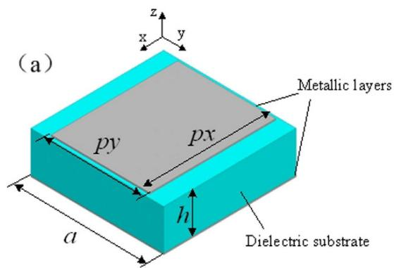

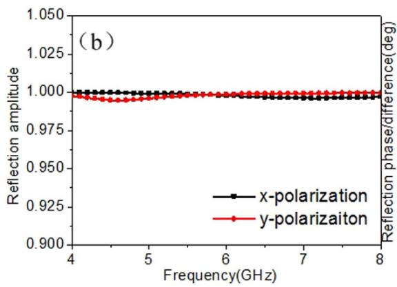

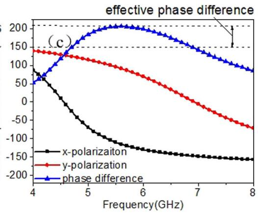  
Figure 1. Geometry of anisotropic element and its reflection properties. (a) Geometry of anisotropic element. The dimensions of the structure are a = 10 mm, $\mathrm { p x } = 9 . 5$ mm, $\mathrm { p y } = 7 .$ 4mm and h= 3mm. The reflection phases of x- and y-polarized incident waves can be easily adjusted by changing px and py, respectively. (b) Reflection amplitude versus frequency. (c) Reflection phases for both x- and y-polarizations and their difference.

Scattering patterns can be manipulated by designing the “0” and “1” sequences of digital elements. Based on this idea, diffusion metasurfaces have been realized with the aid of optimization methods18,23,24.

At present, polarization conversion surface are widely studied. It is composed of an anisotropic structure which shows diverse resonant states according to incident polarization states25–27. Reference 28 proposed a transmissive metasurface composed by anisotropic nanoposts to achieve complete control of waves. Inspired by this property, we exploit a single anisotropic element to build broadband diffusion metasurface. Instead of employing several different isotropic elements, the necessary phase difference can be obtained by simply rotating the anisotropic structures. Moreover, In order to obtain the uniform backward scattering, Simulated Annealing algorithm is utilized in this paper to calculate the optimal layout. The proposed method provides an efficient way to design diffusion metasurfaces with simple structures, which is confirmed by both simulations and measurements.

## Results

Anisotropic element, layout optimization and diffusion metasurface. To our knowledge, arbitrary asymmetric geometry leads to different phase responses under the x- and y-polarized incident wave. To concisely demonstrate our design method and facilitate the simulation procedure, we choose a simple rectangular patch structure as candidate, which is shown in Fig. 1a. The middle layer is a dielectric substrate with dielectric constant 2.65 and loss tangent 0.001. The bottom of the substrate is covered with a full metallic ground. Figure 1b,c depict the reflection characters of the structure calculated by Ansys HFSS. Due to full metallic ground on the back, the entire structure is perfectly reflective for incident waves. The amplitude remains above 0.99 for both x- and y-polarized incidence as shown in Fig. 1b. Figure 1c gives the reflection phases of both polarizations as well as their difference. One can see that the structure yields around 180° phase difference over a broad spectral band. Based on the concept of coding metamaterial, for normal incidence of given polarization, we can nominate the structure as “0” element while just rotate it by 90° along its center axis to obtain “1” element. To satisfy the periodic boundary in the element simulation, a lattice which contains 4 × 4 anisotropic elements in the same orientation is generated. Hence, the different coding sequence can be translated into orientation of lattices (90° rotation or not) for final fabrication.

Once the lattice has been prepared, we are going to seek for the optimal layout of the diffusion metasurface. It is known that a traditional conducting surface has a uniform reflection phase when a plane wave impinges on it, leading to a strong directive scattering pattern. In order to manipulate the reflect beam direction, a phase gradient is introduced into the interface to fully control the equiphase wavefront based on the generalized Snell’s law1 . Here, our goal is to redirect the scattering energy in all directions to minimize directional reflection. Based on this idea, the reflection phase from each part of the surface should be distorted as much as possible rather than in an equal or gradient shifting manner. The simplest way is to generate a matrix of random phase distribution. However, it cannot guarantee an optimal result and the continuous changed phases are hard to yield in reality. Here, we adopt a comprehensive approach to solve this issue that includes array theory, coding matrix and optimization algorithm. Considering a $. \mathbf { M } \times \mathbf { N }$ array composed of lattices of opposite reflection phase (0° or 180°) but equal magnitude under normal incidence. According to the array theory29, the total scattering field of the metasurface can be expressed as

$$
E _ { t o t a l } = E F \cdot A F\tag{1}
$$

where EF represents the pattern function of a lattice. In our model, we assume that the EF is fixed. AF represents the array factor which can be described as

$$
A F = \sum _ { m = 1 } ^ { M } \sum _ { n = 1 } ^ { N } e ^ { j [ ( m - 1 / 2 ) ( k d \sin \theta \cos \varphi ) + ( n - 1 / 2 ) ( k d \sin \theta \sin \varphi ) + \phi ( m , n ) ] }\tag{2}
$$

where d is the distance between two adjacent lattices, θ and $\varphi$ are the elevation and azimuth angles, respectively. φ(m, n) is the reflection phase of each lattice which can be translated into $^ { \mathfrak { c } } 0 ^ { \mathfrak { p } }$ or “1”. Then, the whole surface can be represented by a M × N coding matrix. Here, we employ a Simulated Annealing algorithm to find the optimal coding matrix due to its merits of simple description and high efficiency.

Simulated Annealing is a method for local searching proposed by Kirkpatrick30. It begins with an initial solution that is randomly modified in an iterative process. The main parameters of Simulated Annealing are the initial temperature T, the decreasing rate in each iteration $\alpha ,$ the final temperature $\mathrm { T } _ { \mathrm { f } }$ the number of iterations I and the merit function. In our model, we define an initial coding matrix with equal number of $^ { \ast } { } ^ { \alpha } 0 ^ { \ast }$ and $^ { \mathfrak { a } } 1 ^ { \mathfrak { d } } .$ Then it is upgraded by exchanging the positions of an arbitrary pair of $^ { \ast } { } ^ { \alpha } 0 ^ { \ast }$ and “1”. The parameters $\mathrm { T } , \alpha , \mathrm { T } _ { \mathrm { f } }$ and I are set as 100, 0.9, 0 and 1000, respectively. For low RCS performance, good diffusion pattern is expected. Thus, our goal is to find the optimal coding matrix $( M _ { b e s t } )$ that leading to a desired scattering field with smallest maximum value. Thus, the issue is a min-max problem in which the merit function can be expressed as $\mathrm { F } ( M _ { b e s t } ) = \operatorname* { m i n } ( A F _ { \operatorname* { m a x } } ) .$ where $A F _ { m a x }$ is the maximum value of AF corresponding to given coding matrix. Figure 2(a) shows the flow chart of the proposed method for optimizing the coding matrix. Generally, the bigger the array size, the better the obtained diffusion effect. However, considering the time cost of the simulation procedure and the overall scale of the metasurface, we deem that an array which contains $6 \times 6$ lattices $( \mathrm { M } = \mathrm { N } = 6 )$ is appropriate to illustrate our design method. The evolution plot of $A F _ { m a x }$ is given in Fig. 2(b). It can be seen that the curve declines rapidly during the inception phase and then it tends to stabilize, proving the high efficiency of the algorithm. Furthermore, compared with the $A F _ { m a x }$ of initial coding matrix, the final $\hat { A } F _ { m a x }$ gets significant suppressed after optimization. As a result, the maximum value of the scattered field can be reduced due to energy conversation. Figure 3 show the calculated scattering fields of the uniform coding matrix (representing metallic surface), the initial coding matrix and the optimal coding matrix. It can be seen clearly that the uniform coding matrix leads to a strong reflection beam toward the normal direction, while the pattern of initial coding matrix presents two main beams as illustrated in Fig. 3a,b, respectively. The optimal coding matrix and its pattern are shown in Fig. 3c. It can be clearly seen that our model successfully finds an optimized solution which leads to a perfect diffusion pattern.

By employing the proposed anisotropic element and the optimal coding matrix, the metasurface is built up as shown in Fig. 4. In our model, we choose the lattice with x-oriented patches as $^ { \mathfrak { c } _ { 1 } \mathfrak { n } }$ element, while its orthogonally arranged counterpart is $^ { \alpha } 0 ^ { \it { p } }$ element. Of cause, interchanging the assignment would also be acceptable. The overall dimensions of the metasurafce is 240 mm × 240 mm × 3 mm (about $ 4 . 6 \lambda \times 4 . 6 \lambda \times 0 . 0 5 8 \lambda$ , λ is the wavelength of incident wave at 5.8 GHz).

Simulations and measurement. Figure 5 shows the RCS of the metasurface as well as a same-size metallic surface with plane wave normally impinging. Obvious reduction is obtained from 4–8 GHz for both polarizations. The 10 dB reduction band is 5.2 GHz–6.86 GHz and 5.44 GHz–6.9 GHz for x- and y-polarized incident wave, respectively. The most sufficient cancelation happens when the phase difference of the different lattices is exactly 180°, causing the two dips in the RCS curve. The frequency deviation between the dips and the 180° phase difference is attributed to the different boundary conditions. Figure 6a,b show the surface current distributions of proposed metasurface and the same-size metallic surface under normal incidence at 5.86 GHz. It demonstrates that the elements on the metasurface present different resonant states, which is critical to disturb the equiphase reflection (see Fig. 6c,d). As a result, the metasurface generates a diffuse scattering pattern in the far-field with suppressed amplitude as depicted in Fig. 6e,f. The patterns obtained by full wave simulation are in agreement with the results of the optimization algorithm, proving the effectiveness of our design method.

Angular performances are investigated to give a comprehensive understanding of our metasurface. TM waves impinging from 15°, 30°, and $4 5 ^ { \circ }$ in the xoz plane are considered. Figure 7a shows that the phase difference decreases apparently along with the incident angle increases, proving the sensitivity of the anisotropic element to incident angles. Figure 7b shows the RCS reduction at the specular directions versus frequency. It can be observed that the specular reflection can be suppressed in broadband and wide angles. Along with the incident angle increases, the dips shift and the suppression effect is weakened, which is attributed to the phase difference alteration. To verify the diffusion effect of our metasurface, the scattering spectra in the backward space are shown in Fig. 8. The results of the metallic surface are also shown in the same color map scale for comparison. It reveals that the suppression of specular reflections is achieved in wide angles through distributing most of the scattered energy to various off-specular directions. It is worth noting that though the scattering may get enhanced at some directions, the values are small enough to avoid being detected, providing a viable solution in practice.

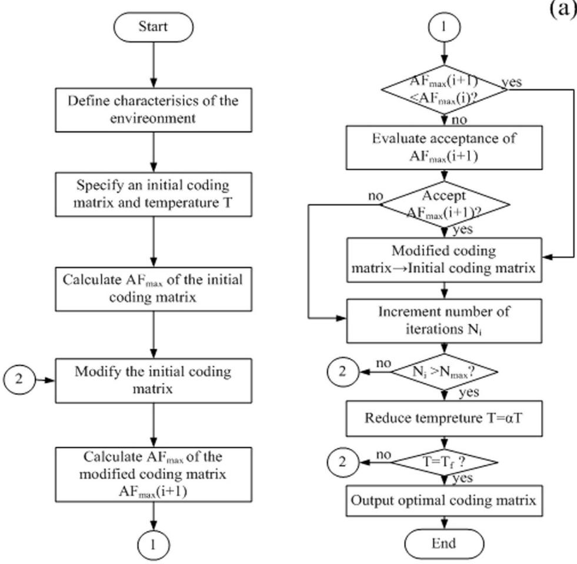

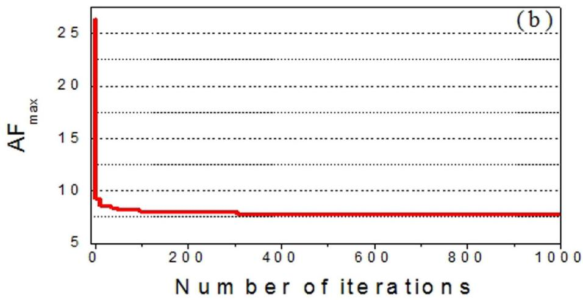  
Figure 2. The Simulated Annealing algorithm for finding the optimal coding matrix. (a) Flowchart of the optimization algorithm. (b) The evolution plot of $\mathrm { A F _ { m a x } . }$

To validate the predicted performance of our diffusion metasurface, a sample is fabricated and its performance under normal incidence is measured. Figure 9 shows the photo of the sample and the measurement setup. The sample is manufactured by printed circuit board processing technology. The dielectric substrate is F4B board with a dielectric constant 2.65 and a loss tangent 0.001. The metal patches and ground are 0.036 mm-thick copper layers. For measurement, two identical horn antennas are utilized as transmitting and receiving devices, respectively. Then, the scattering performance is evaluated by the transmission coefficients obtained by vector network analyzer. A same-size metallic board is also measured as reference. Figure 10(a) shows the measured RCS reduction versus frequency under normal incidence. The simulated results are also depicted. The measured 10 dB RCS reduction bandwidths for the x- and y-polarizations are 5.26–6.80 GHz and 5.56–6.82 GHz, respectively. The fractional bandwidth for 6 dB reduction is more than 35% for both cases. Good agreement can be found between the results of measurement and simulation. The results of oblique incidence are shown in Fig. 10(b). With the of the incident angle increase, the change tendency is consistent with the simulation results. The deviation in value can be attributed to the measurement and fabrication errors. At this point, the good performance of the proposed metasurface is confirmed.

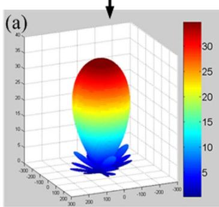

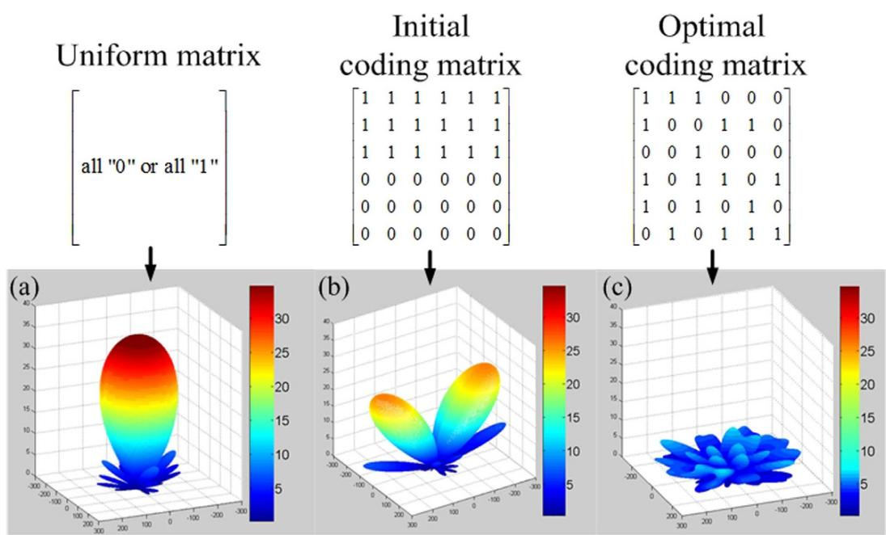

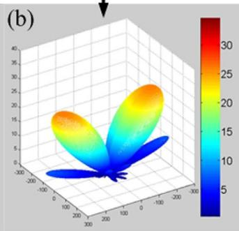

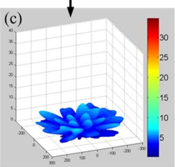  
Figure 3. Coding matrices and their corresponding patterns. (a) Uniform matrix. The matrix is composed of all $ { { \mathrm { \acute { \alpha } } } } _ { 0 } { } ^ { , }$ or all $^ { \mathfrak { c } _ { 1 } \mathfrak { n } }$ elements, resulting in strong reflected beam at normal direction. (b) Initial coding matrix. The matrix is composed of equal number of $^ { \alpha } 0 ^ { \gamma }$ and “1” which arranged in the lower half and upper half. Its pattern shows two symmetric beams at oblique directions. (c) Optimal coding matrix. The coding matrix is composed of $" 0 "$ and ${ } ^ { \mathfrak { a } } { } _ { 1 } { } ^ { \mathfrak { n } }$ in optimized distribution. There is no obvious beam in its pattern.

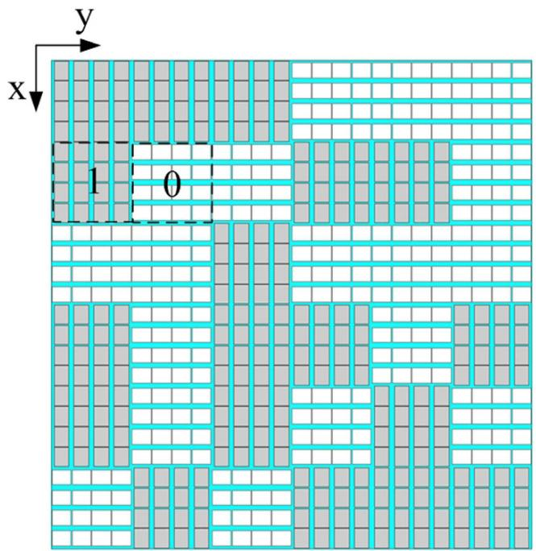  
Figure 4. Geometry of proposed diffusion metasurface. For an intuitive view, the different oriented lattices are distinguished by gray and white colors.

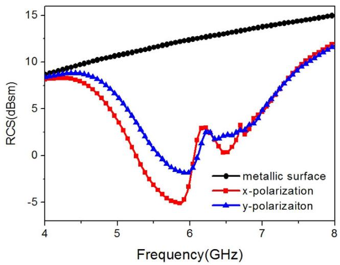  
Figure 5. Simulated RCS for normal incidence of both x- and y-polarization.

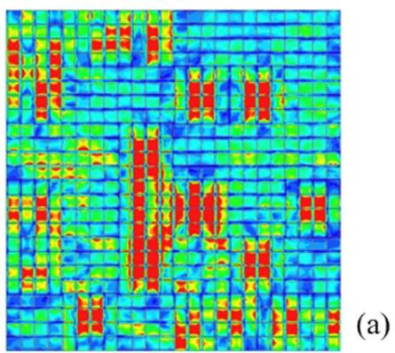

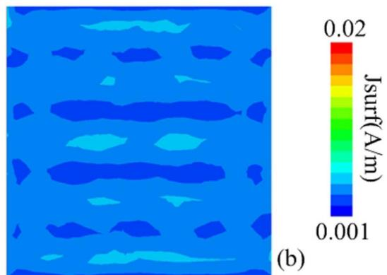

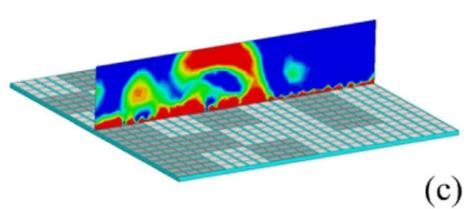

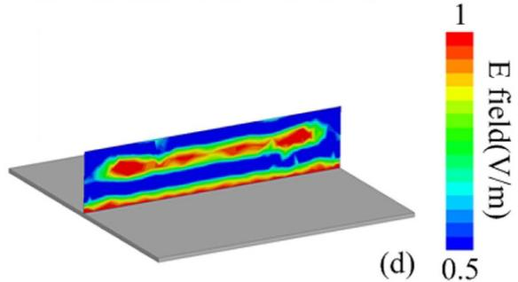

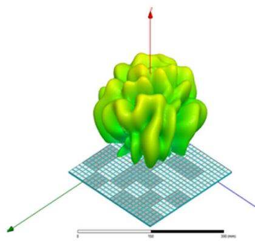  
(e)

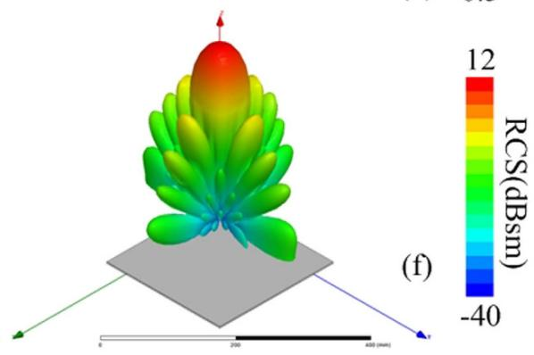  
Figure 6. Simulated near-field and far-field patterns under x-polarized normal incidence. (a,b) The surface current distributions of the metasurface and metallic surface, respectively. (c,d) The near-electric-field distributions. (e,f) The far-field scattering patterns.

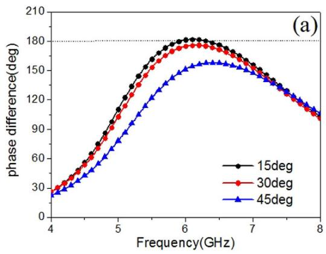

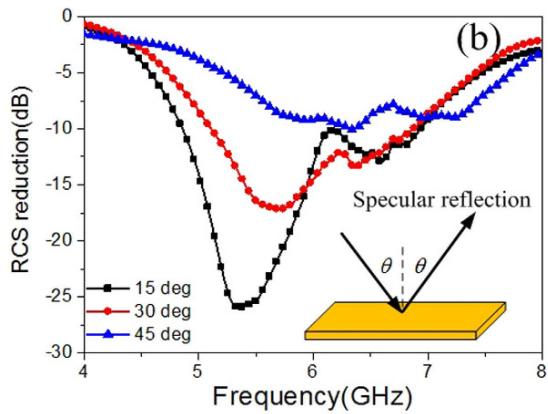  
Figure 7. Angular performances of the metasurface. (a) The phase difference of the anisotropic element under oblique incidences. (b) The RCS reduction versus frequency. The observation angle is equal to the incident angle to detect the specular reflection.

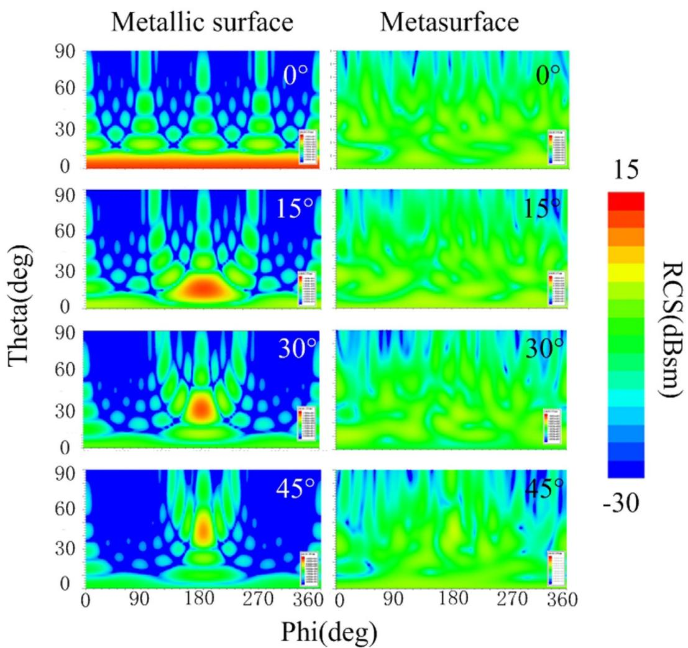  
Figure 8. Scattering spectra in the backward space. The spectra are depicted in the same color map scale at 5.86 GHz. The observation area is $0 ^ { \circ } - 9 0 ^ { \circ }$ in elevation and $0 ^ { \circ } - 3 6 0 ^ { \circ }$ in azimuth.

## Conclusion

A thin diffusion metasurface has been proposed for RCS reduction in broadband and wide angle. An anisotropic element was employed in the metasurface based on its two-state reflection property, which can be assigned as “0” and “1” according the concept of coding metamaterial. Array theory and Simulated Annealing algorithm were adopted to optimize the coding matrix mathematically and find the best layout. A sample was built up for full-wave simulation and fabricated for measurement. Both the simulated and measured results demonstrated the effectiveness of the proposed metasurface. It is worth mentioning that we choose the rectangular patch structure as basic element due to its simple geometry. It can be modified or replaced by other anisotropic structures with better performances on band or angular stability, so that the performance of the entire metasurface can be enhanced further. On the other hand, in our work we choose a 6 × 6 array size considering the efficiency of optimization procedure and computing capability of our hardware. We believe that better performance can be achieved by expanding the array size.

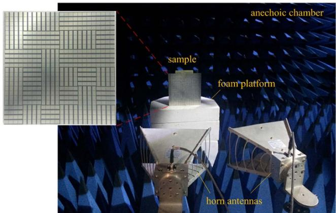  
Figure 9. The fabricated metasurface and measurement setup. The height of the sample is kept the same with the antennas and the distance is far enough to satisfy the far field measurement requirement. For normal incidence, nearly 5 degree is maintained in practice due to the volume of the horn antennas.

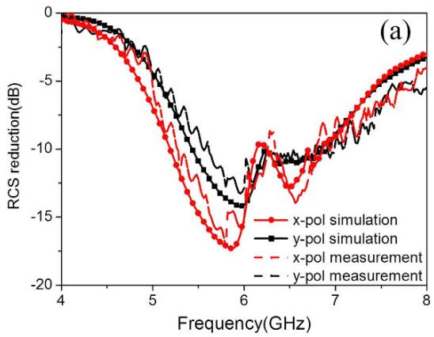

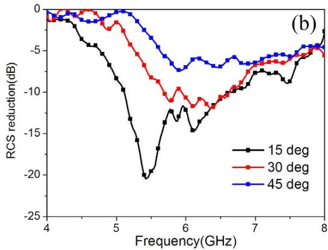  
Figure 10. RCS reduction versus frequency. (a) The measurement results under normal incidence. The corresponding simulated results are also depicted for comparison. (b) The measurement results under oblique incidence. For all the measured results in (a,b), the reflectivity of the metasurface and the metallic board are separately measured first. Then, subtraction is made between their values.

## Methods

Backscattering measurement is conducted in an anechoic chamber to minimize interference from the environment. For normal incidence, two identical horn antennas are placed adjacently in front of the sample with a distance of 1.5 m to meet the condition of far-field test, so that the beam from the transmitting antenna can be approximated as plane wave. The transmitting and receiving antennas are connected to the two ports of Agilent N5230C VNA. Then, the reflection performance can be evaluated by S21 parameter. To further eliminate the noises in the environment, gate-reflect-line calibration in time-domain analysis kit of VNA is employed. We rotate the sample around its central axis to obtain its performances under different polarizations. For oblique incidence, the transmitting and receiving antennas are set as TM polarization and placed with a same angle with respect to the normal direction of the sample.

## References

1. N. F. Yu et al. Light propagation with phase discontinuities: generalized laws of reflection and refraction. Science 334, 333–337 (2011).

2. X. J. Ni et al. Broadband Light bending with plasmonic nanoantennas. Science 335, 427–427 (2012).

3. X. Ma et al. Multi-band circular polarizer using planar spiral metamaterial structure. Opt. Expr. 20, 16050–16058 (2012).

4. J. Y. Yin et al. Ultra wideband polarization-Selective conversions of electromagnetic waves by metasurface under large-range incident angles. Sci. Rep. 5, 12476(2015).

5. H. Zhu, S. Cheung, K. L. Chung & T. Yuk. Linear-to-circular polarization conversion using metasurface. IEEE Trans. Antenn. Propag. 61, 4615–4623 (2013).

6. Y. Z. Cheng et al. Ultrabroadband reflective polarization convertor for terahertz waves. Applied Physics Letters 105, 181111 (2014).

7. X. Z. Chen et al. Dual-polarity plasmonic metalens for visible light. Nat Commun. 3, 1198 (2012).

8. S. L. Sun et al. Gradient-index metasurfaces as a bridge linking propagating waves and surface waves. Nat Mater. 11, 426–431 (2012).

9. R. L. Fante & M. T. Mc Cormack. Reflection properties of Salisbury screen. IEEE Trans. Antenn. Propag. 36, 1443–1454 (1988).

10. Q. Gao, Y. Yin, D. B. Yan & N. C. Yuan. Application of metamaterials to ultra-thin radar-absorbing material design. Electron. Lett. 41, 936–937 (2005).

11. N. I. Landy et al. A Perfect metamaterial absorber. Phy. Rev. Lett. 100, 207402 (2008).

12. M. Paquay, J.C. Iriarte, I. Ederra, R. Gonzalo & P. de Maagt. Thin AMC Structure for Radar Cross-Section Reduction. IEEE Trans. Antennas Propag. 55, 3630–3638 (2007).

13. Y. Fu, Y. Li & N. Yuan. Wideband composite AMC surfaces for RCS reduction. Microw. Opt. Technol. Lett. 53, 712–715 (2011).

14. J. C. Iriarte et al. Broadband radar cross-section reduction using AMC technology. IEEE Trans. Antennas Propag. 61, 6136–6143 (2013).

15. Y. Zhang, R. Mittra, B. Z. Wang & N. T. Huang. AMCs for ultra-thin and broadband RAM design. Electron. Lett. 45, 484–485 (2009).

16. W. G. Chen, C. A. Balanis & C. R. Birtcher. Checkerboard EBG surfaces for wideband radar cross section reduction. IEEE Trans. Antennas Propag. 63, 2636–2645 (2015).

17. X. M. Yang et al. Suppression of specular reflections by metasurface with engineered nonuniform distribution of reflection phase. International Journal of Antennas and Propagation, 5, 560403 (2015).

18. K. Wang et al. Broadband and broad-angle low-scattering metasurface based on hybrid optimization algorithm. Sci. Rep. 4, 5935 (2014).

19. X. M. Yang et al. Diffuse reflections by randomly gradient index metamaterials. Opt. Lett. 35, 808–810 (2010).

20. A. Edalati & K. Sarabandi. Wideband, wide angle, polarization independent RCS reduction using nonabsorptive miniaturizedelement frequency selective surfaces. IEEE Trans. Antennas Propag. 62, 747–754 (2014).

21. T. J. Cui et al. Coding metamaterials, digital metamaterials and programmable metamaterials. Light: Science & Applications 3, e218 (2014).

22. C. D. Giovampaola & N. Engheta. Digital metamaterials. Nat. Mater. 13, 1115–1121 (2014).

23. D. S. Dong et al. Terahertz broadband low-reflection Metasurface by controlling phase distributions. Adv. Optical Mater. 3, 1405–1410 (2015).

24. L. H. Gao et al. Broadband diffusion of terahertz waves by multi-bit coding metasurfaces. Light: Science & Applications 4, e324 (2014).

25. F. Yang & Y. Rahmat-Samii. Reflection phase characterizations of the EBG ground plane for low profile wire antenna applications. IEEE Trans. Antennas Propag. 51, 2691–2703 (2003).

26. F. Yang & Y. Rahmat-Samii. Polarization-dependent electromagnetic band gap (PDEBG) structures: designs and applications. Microwave Opt. Technol. Lett. 41, 439–444 (2004).

27. Z. Y. Song et al. Broadband cross polarization converter with unity efficiency for terahertz waves based on anisotropic dielectric meta-reflect arrays. Mater. Lett. 159, 269–272 (2015).

28. A. Arbabi et al. Dielectric metasurfaces for complete control of phase and polarization with subwavelength spatial resolution and high transmission. Nat. Nanotechnol. 10, 937–943 (2015).

29. C. A. Balanis. Antenna Theory: Analysis and Design, 3rd ed., New York, NY, USA: Wiley (2005).

30. S. Kirkpatrick, C. D. Gelatt & M. P. Vecchi. Optimization by Simulated Annealing. Science 220, 671–680 (1983).

## Acknowledgements

This work was supported by the National Natural Science Foundation of China (Grant Nos 61271100 and 61471389), the Doctoral Foundation of Air Force Engineering University under Grant (Nos KGD080914002 and KGD08091502).

## Author Contributions

Y.Z. and X.Y.C. conceived the idea, did the simulations, interpreted the experiments and wrote the manuscript. J.G. suggested the numerical simulations. Y.S. and H.H.Y. participated in the mathematical optimization procedure. X.L., Y.L.Z., T.H. and W.C. contributed to sample fabrication and measurements.

## Additional Information

Competing financial interests: The authors declare no competing financial interests.

How to cite this article: Zhao, Y. et al. Broadband diffusion metasurface based on a single anisotropic element and optimized by the Simulated Annealing algorithm. Sci. Rep. 6, 23896; doi: 10.1038/srep23896 (2016).

(cc ④ This work is licensed under a Creative Commons Attribution 4.0 International License. The images BY or other third party material in this article are included in the article’s Creative Commons license, unless indicated otherwise in the credit line; if the material is not included under the Creative Commons license, users will need to obtain permission from the license holder to reproduce the material. To view a copy of this license, visit http://creativecommons.org/licenses/by/4.0/