PHOTONICS Research

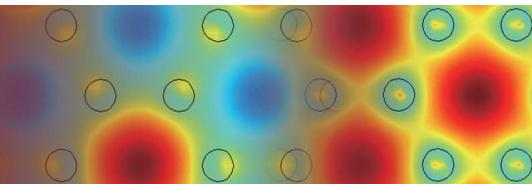

# Ultra-broadband nanophotonic phase shifter based on subwavelength metamaterial waveguides

DAVID GONZÁLEZ-ANDRADE,1,\* JOSÉ MANUEL LUQUE-GONZÁLEZ,2 J. GONZALO WANGÜEMERT-PÉREZ,2 ALEJANDRO ORTEGA-MOÑUX,2 PAVEL CHEBEN,3 ÍÑIGO MOLINA-FERNÁNDEZ,2,4 AND AITOR V. VELASCO1

1 Instituto de Óptica Daza de Valdés, Consejo Superior de Investigaciones Cientı´ficas (CSIC), Madrid 28006, Spain   
2 Departamento de Ingenierı´a de Comunicaciones, ETSI Telecomunicación, Universidad de Málaga, Málaga 29071, Spain   
3 National Research Council Canada, Ottawa K1A 0R6, Canada   
4 Bionand Center for Nanomedicine and Biotechnology, Parque Tecnológico de Andalucı´a, Málaga 29590, Spain   
\*Corresponding author: david.gonzalez@csic.es

Received 19 July 2019; revised 27 November 2019; accepted 24 December 2019; posted 24 December 2019 (Doc. ID 373223); published 27 February 2020

Optical phase shifters are extensively used in integrated optics not only for telecom and datacom applications but also for sensors and quantum computing. While various active solutions have been demonstrated, progress in– passive phase shifters is still lacking. Here we present a new type of ultra-broadband 90° phase shifter, which exploits the anisotropy and dispersion engineering in subwavelength metamaterial waveguides. Our Floquet Bloch calculations predict a phase-shift error below 1.7° over an unprecedented operation range from 1.35 to 1.75 μm, i.e., 400 nm bandwidth covering the E, S, C, L, and U telecommunication bands. The flat spectral response of our phase shifter is maintained even in the presence of fabrication errors up to 20 nm, showing greater robustness than conventional structures. Our device was experimentally demonstrated using standard 220 nm thick SOI wafers, showing a fourfold reduction in the phase variation compared to conventional phase shifters within the 145 nm wavelength range of our measurement setup. The proposed subwavelength engineered phase shifter paves the way for novel photonic integrated circuits with an ultra-broadband performance. © 2020 Chinese Laser Press

https://doi.org/10.1364/PRJ.373223

## 1. INTRODUCTION

Silicon-on-insulator (SOI) technology has attracted significant attention in recent years as a promising platform for monolithic integration of optical and electronic circuits [1]. Its compatibility with mature CMOS manufacturing processes has also led to cost-effective and high-volume fabrication of integrated photonic devices such as optical modulators [2], switches [3,4], tunable filters [5,6], and telecom and datacom transceivers [7,8], to name a few. Optical phase shifters (PSs) are key components in the aforementioned devices and in recently proposed large-scale quantum silicon photonic circuits [9] for linear quantum computing [10]. Several solutions to achieve phase shifting have been reported in silicon photonics, including active and passive structures, which produce a phase offset between the involved signals by altering the propagation constant of the waveguide modes or by adjusting their optical path lengths.

Active PSs allow us to dynamically tune the phase-shift response for different wavelengths and also to compensate for nominal phase-shift deviations arising from fabrication imperfections. This can be achieved by on-chip resistive microheaters to modify locally the effective refractive index of the waveguides [11], leveraging the high thermo-optic coefficient of silicon [12]. Active PSs based on free-carrier plasma dispersion effects and electro-mechanical actuators have also been demonstrated [13–16] with a substantial faster response compared to thermo-optic devices. Furthermore, PSs based on nonlinear optical effects [17], resonant structures [18], and ring resonators [19] have also been proposed. Active PSs present inherent drawbacks such as high power consumption, intricate designs, and the need for a control element, which increases the overall device complexity. Although the variability of the tuning can be broadband, the spectral response of these PSs is still narrowband after tuning.

Passive PSs obviate the requirements for driving power and complex control elements, and they are suitable for many applications including mode-division multiplexing (MDM) [20], 90° hybrids [21], arbitrary-ratio power splitters [22,23], etc., particularly where power consumption is a critical constraint. However, as the response of passive PS cannot be actively tuned, it is also difficult to compensate for fabrication errors. Despite the growing interest they have attracted, passive PSs have evolved little in the last decade. Most of the structures typically use adiabatic tapers [24] and waveguides with dissimilar lengths [25,26] to modify the optical path and hence induce a phase shift. PSs based on 1 × 1 multimode interference (MMI) couplers [27] and MMIs with a tilted joint [28] have also been proposed. However, to address the operational requirements for the next generation of photonic integrated circuits, PSs’ bandwidth and resilience to fabrication errors need to be significantly improved. Since the early demonstrations of a silicon wire waveguide with a subwavelength grating (SWG) metamaterial core [29,30], metamaterial engineered waveguide structures have emerged as fundamental building blocks for integrated photonics [31,32]. These structures are arrangements of different dielectric materials with a scale substantially smaller than the operating wavelength, and hence they suppress diffractive effects. The SWG metamaterials have been successfully used to control refractive index, anisotropy, and dispersion in nanophotonic structures [29,33–35], including evanescent field sensors [36], spectral filters [37], fiber-to-chip edge couplers [38] and surface grating couplers [39], polarization management devices [40], ultra-broadband directional couplers [41], and MMI devices [42]. For recent comprehensive review see Refs. [31,32].

In this work, we propose a new type of 90° PS for transverseelectric (TE) polarization, leveraging the advantages of SWG metamaterial engineering. The structure is schematically shown in Fig. 1(a). We exploit SWG anisotropy and dispersion engineering to achieve ultra-broadband performance. As a design reference, we also analyze the performance of conventional PSs in silicon wire waveguides [see Figs. 1(b) and 1(c)]. Floquet– Bloch simulations of our 90° SWG PS predict a phase deviation below $\pm 1 . 7 ^ { \circ }$ over an unprecedented bandwidth exceeding 400 nm, while conventional PSs are limited to ∼50 nm. Moreover, fabrication errors up to 20 nm induce a phase deviation of only $7 . 1 ^ { \circ }$ over full design wavelength range of our device, compared to $1 8 . 7 ^ { \circ }$ for conventional PSs. Our experimental results validate simulation predictions, showing a phase slope of only $1 6 ( ^ { \circ } ) / \mu \mathrm { m }$ within a 145 nm bandwidth, compared to 64(°)/μm for the conventional PS structures.

## 2. PRINCIPLE OF OPERATION

Figure 1 shows the schematics of the proposed SWG PS [Fig. 1(a)] as well as two common alternatives known in the state of the art. In all cases, two waveguides of the same length are used to establish a differential phase shift by means of geometric differences in the PS section. The tapered PS shown in Fig. 1(b) comprises two trapezoidal tapers in back-to-back configuration that modify the width of one arm from $W _ { I }$ to $W _ { \mathrm { P S } } ,$ while the other arm remains unaltered. The asymmetric PS in Fig. 1(c) utilizes two conventional (continuous) strip waveguides with different widths, $W _ { U }$ and $W _ { L } ,$ which are connected to the input and output ports via adiabatic tapers. In our SWG PS [Fig. 1(a)], the conventional waveguides are replaced with SWG metamaterial waveguides.

We first investigate bandwidth limitations of conventional PSs. We study two parallel Si wire waveguides with different widths, $W _ { U }$ and $W _ { L } ,$ as shown in the PS section of Fig. 1(c). The accumulated phase difference between both waveguides along the section of length $L _ { \mathrm { P S } }$ is given by the following expression:

$$
\Delta \Phi ( \lambda ) = [ \beta _ { U } ( \lambda ) - \beta _ { L } ( \lambda ) ] L _ { \mathrm { P S } } = \frac { 2 \pi } { \lambda } \Delta n _ { \mathrm { e f f } } ( \lambda ) L _ { \mathrm { P S } } ,\tag{1}
$$

where $\beta _ { U } ( \lambda )$ and $\beta _ { L } ( \lambda )$ are the propagation constants of the fundamental modes supported by the wide and narrow waveguides, respectively. The free-space wavelength is denoted as $\lambda ,$ and $\Delta n _ { \mathrm { e f f } } ( \lambda )$ is the difference between the effective indexes of the fundamental modes propagating through the upper and lower arms, i.e., $\Delta n _ { \mathrm { e f f } } ( \lambda ) \stackrel { \cdot } { = } \tilde { n } _ { \mathrm { e f f } , U } ( \lambda ) \stackrel { \cdot } { - } n _ { \mathrm { e f f } , L } \bar { ( } \lambda )$ . The influence of the input and output tapers is considered negligible at this instance due to their comparatively short lengths. Equation (1) shows that the phase shift is primarily governed by the wavelength, given the length $L _ { \mathrm { P S } }$ is constant. This length $L _ { \mathrm { P S } }$ is typically chosen to generate a specific phase shift $\Delta \Phi _ { 0 }$ at the design wavelength $\lambda _ { 0 }$ according to $L _ { \mathrm { P S } } = ( \lambda _ { 0 } \Delta \Phi _ { 0 } ) /$ $[ 2 \pi \Delta n _ { \mathrm { e f f } } ( \lambda _ { 0 } ) ]$ . Thus, the wavelength dependence of the phase shift can be calculated as

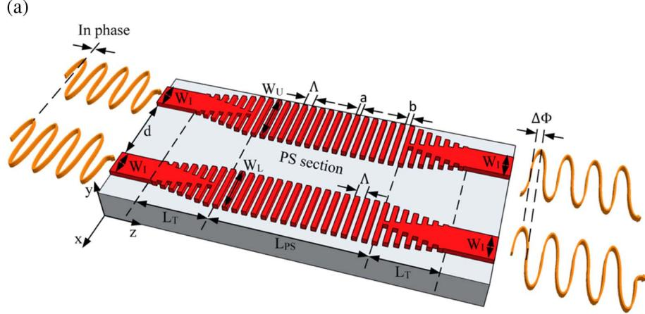  
(b)

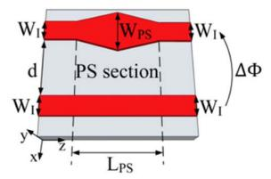

(c)  
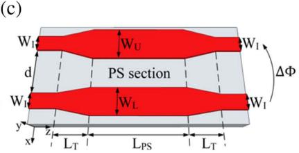  
Fig. 1. Schematics of three types of passive phase shifters: (a) our proposed ultra-broadband PS comprising two SWG waveguides with the same period (Λ) and duty cycle (DC) but with dissimilar widths $W _ { U }$ and $\bar { \boldsymbol { W } _ { L } } ;$ (b) state-of-the-art tapered PS consisting of a straight waveguide and two trapezoidal tapers in back-to-back configuration; and (c) state-of-the-art asymmetric PS based on two non-periodic waveguides with different widths $\bar { W _ { U } }$ and $\mathbb { W } _ { L }$

$$
\left. { \frac { \mathrm { d } \Delta \Phi ( \lambda ) } { \mathrm { d } \lambda } } \right| _ { \lambda = \lambda _ { 0 } } = - \frac { \Delta \Phi _ { 0 } } { \lambda _ { 0 } } \left[ 1 - \lambda _ { 0 } \frac { \mathrm { d } \Delta n _ { \mathrm { e f f } } ( \lambda ) / \mathrm { d } \lambda | _ { \lambda = \lambda _ { 0 } } } { \Delta n _ { \mathrm { e f f } } ( \lambda _ { 0 } ) } \right] .\tag{2}
$$

For comparatively wide waveguides and assuming the paraxiality condition holds, propagation constants are $\beta ( \lambda )$ ≈ $k _ { 0 } n _ { \mathrm { c o r e } } - ( \pi \lambda ) / ( 4 n _ { \mathrm { c o r e } } W _ { e } ^ { 2 } )$ [43]. In this way, the difference between effective indexes is $\Delta n _ { \mathrm { e f f } } ( \lambda ) = \lambda ^ { 2 } \cdot ( W _ { e , L } ^ { - 2 } - W _ { e , U } ^ { - 2 } ) /$ $( 8 n _ { \mathrm { c o r e } } )$ and Eq. (2) can be simplified to $\mathrm { d } \Delta \Phi ( \lambda ) / \mathrm { d } \lambda | _ { \lambda = \lambda _ { 0 } } \approx$ $\Delta \Phi _ { 0 } / \lambda _ { 0 }$ (see Appendix A for the complete mathematical development). Here $k _ { 0 }$ is the wavenumber, $n _ { \mathrm { c o r e } }$ is the effective index of the equivalent 2D waveguide, and $\boldsymbol { W } _ { e }$ is the effective waveguide width, which is assumed to be invariant with wavelength. This approximation of Eq. (2) unveils the lack of freedom to engineer the dependence on wavelength, whereas the choice of greater phase shifts results in narrower bandwidth responses. For example, a 90° PS operating at $\lambda _ { 0 } = 1 . 5 5$ μm has a phase slope of $\bar { \mathrm { d } } \Delta \Phi ( \lambda ) / \mathrm { d } \lambda \approx \bar { 5 } 8 ( ^ { \circ } ) / \bar { \mu \mathrm { m } }$

Our ultra-broadband PS leverages the inherent anisotropy of subwavelength grating photonic structures. The conventional waveguides are now replaced with two SWG waveguides of widths $W _ { U }$ and $W _ { L } ,$ both with the same period Λ and duty cycle $\mathrm { D C } = a / ( a + b )$ [see the PS section in Fig. 1(a)]. The SWG waveguides are modeled as a two-dimensional equivalent anisotropic medium described by an effective index tensor: $n _ { \mathrm { c o r e } } = \mathrm { d i a g } [ n _ { x x } , n _ { z z } ]$ [42]. The effective index of the fundamental Floquet–Bloch mode in a wide SWG waveguide is $n _ { \mathrm { e f f } } ( \lambda ) \approx n _ { x x } \bar { } - ( \lambda ^ { 2 } n _ { x x } ) / ( 8 W _ { e } ^ { 2 } n _ { z z } ^ { 2 } )$ , and the accumulated phase shift is

$$
\Delta \Phi _ { \mathrm { S W G } } ( \lambda ) \approx \left[ \frac { \pi \lambda } { 4 } \frac { n _ { x x } } { n _ { z z } ^ { 2 } } \left( \frac { 1 } { W _ { e , L } ^ { 2 } } - \frac { 1 } { W _ { e , U } ^ { 2 } } \right) \right] L _ { \mathrm { P S } } ,\tag{3}
$$

where $\boldsymbol { W } _ { e , L }$ and $\boldsymbol { W } _ { e , U }$ are the effective widths of the narrow and wide waveguides, respectively. Halir et al. [42] recently reported that the term $n _ { z z } ^ { 2 } / n _ { x x }$ can be engineered to be proportional to λ by means of simulation and judiciously selecting the values of Λ and DC. Therefore, the wavelength dependence of Eq. (3) disappears and the derivative is $\mathrm { d } \Delta \bar { \Phi } _ { \mathrm { S W G } } ( \lambda ) /$ $\mathrm { d } \lambda | _ { \lambda = \lambda _ { 0 } } \approx 0$ , providing a broadband flat response. Hence, SWG metamaterial waveguides offer an interesting opportunity to substantially extend the operational wavelength range of integrated phase shifters.

## 3. DEVICE DESIGN AND SIMULATION RESULTS

As a reference, we first revisit the performance of conventional PSs shown in Figs. 1(b) and 1(c). The separation between the input and output waveguides, $d = 1 . 5$ μm, is chosen to avoid power coupling, and typical interconnection waveguide widths of $W _ { I } = 0 . 5$ μm are assumed. We consider a 220 nm thick silicon platform surrounded by a silicon dioxide $( \mathrm { { S i O } } _ { 2 } )$ upper cladding and buried oxide (BOX) layer. Si and $\mathrm { S i O } _ { 2 }$ refractive indexes are $n _ { \mathrm { S i } } ( \lambda _ { 0 } ) = 3 . 4 7 6$ and $n _ { \mathrm { S i O } _ { 2 } } ( \lambda _ { 0 } ) = 1$ .444 at the central wavelength of $\lambda _ { 0 } = 1 . 5 5 ~ \mu \mathrm { m }$ . The dispersion of both materials was taken into account in the simulations [44,45].

Tapered PSs can be modeled as the concatenation of multiple sections of parallel waveguides, where the width of one of the arms is different for each section. The length of the PS section is determined by the maximum difference between waveguide widths, i.e., $\Delta \dot { W } = W _ { \mathrm { P S } } - 0 . 5$ μm, and the target phase shift. Modal analysis with the finite element method (FEM) [46] was used to design a $9 0 ^ { \circ }$ tapered PS for TE polarization at $\lambda _ { 0 } = 1 . 5 5$ μm. The taper width was set to $W _ { \mathrm { P S } } = 0 . 7$ μm, and the length was then computed, yielding $L _ { \mathrm { P S } } = 3 . 4 1$ μm. In this design, it is apparent that tapered PSs only possess one degree of freedom, which greatly limits the possibility of reducing wavelength dependence and improving fabrication tolerances.

In the asymmetric PS, the width difference between upper and lower arms is selected as $\Delta W = W _ { U } - W _ { L } = 0 . 2$ μm, for consistency with the previous design. When the widths of both waveguides are larger than 1 μm, effective indexes of the fundamental modes vary less than for narrow waveguides and the resilience against fabrication errors is improved. For this reason, we choose $\bar { W } _ { L } = 1 . 6$ μm and $W _ { U } = 1 . 8 ~ \mu \mathrm { m }$ . The length of the input and output tapers is $L _ { T } = 3$ μm. Taking into account the phase shift introduced by the tapers, the length of the PS section results in $L _ { \mathrm { P S } } = 3 6 . 1 9$ μm for $\mathrm { ~ a ~ } 9 0 ^ { \circ }$ phase shift of the entire structure at $\lambda _ { 0 } = 1 . 5 5$ μm and TE polarization.

The figure of merit used to quantify the PS performance is the phase-shift error (PSE), which is defined as the deviation from the nominal (90°) phase shift:

$$
\mathrm { P S E } ( \lambda ) = \Delta \Phi ( \lambda ) - 9 0 ^ { \circ } .\tag{4}
$$

The calculated PSE is shown in Fig. 2 for the designed nonperiodic PSs (blue and green curves), yielding almost identical narrowband performance near the central operating wavelength of 1.55 μm, according to Eq. (2). The response of the tapered PS has a phase slope of ∼64 ° ∕μm, whereas the asymmetric PS yields ${ \sim } 7 1 ( ^ { \circ } ) / \mu \mathrm { m }$ , close to the theoretical prediction. Some small differences can be attributed to the use of a 2D model for our first theoretical approximation. Simulations results predict a PSE less than $\pm 1 3 . 5 ^ { \circ }$ and $\pm 1 4 . 4 ^ { \circ }$ for tapered and asymmetric PSs, respectively, within the entire simulated wavelength range (1.35–1.75 μm).

To overcome the bandwidth limitations of state-of-the-art PSs, we propose to replace conventional waveguides of asymmetric PSs with SWG metamaterial waveguides. As discussed above, we use comparatively wide waveguides of $W _ { L } = 1 . 6$ μm in order to increase robustness against fabrication errors. A width difference between the two arms of $\Delta W = 0 . 2$ μm is chosen to limit the maximum length of the PS to $L _ { \mathrm { P S } } \approx 2 5$ μm and avoid potential jitter problems in wide SWG waveguides for lengths over 30 μm [47]. The dependence on the wavelength is studied by Floquet–Bloch analysis [36] of the SWG waveguides in the PS section. A duty cycle of 50% maximizes the minimum feature size, whereas several SWG period (pitch) values are examined to optimize the bandwidth response [42]. Figure 3(a) shows the PSE as a function of the wavelength for different periods. A very flat response around the central operating wavelength of 1.55 μm is found for Λ 200 nm and thus ensures a minimum feature size of 100 nm. The SWG tapers were then designed to perform an adiabatic transition between interconnection and periodic waveguides, yielding a length of $L _ { T } = 3 ~ \mu \mathrm { m }$ . The phase shift introduced by the SWG tapers (∼20°) was calculated using the 3D finite-difference time-domain (FDTD) method and added to the response of the SWG waveguides shown in Fig. 3(a) by adjusting the length of the PS section. Figure 3(b) shows the PSE as a function of wavelength for $\Lambda = 2 0 0$ nm and different number of periods (P), including the influence of the SWG tapers. The resolution to adjust the PSE wavelength response is 0.8° per period. We finally select the length $L _ { \mathrm { P S } } = P \cdot \Lambda = 8 4 \times 0 . 2 = 1 6 . 8$ μm, yielding a minimum PSE over the full simulated bandwidth.

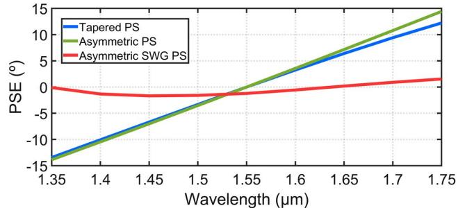  
Fig. 2. Comparison of the PSE as a function of wavelength for the three designed PSs: tapered PS (blue curve), asymmetric PS (green curve), and asymmetric SWG PS (red curve).

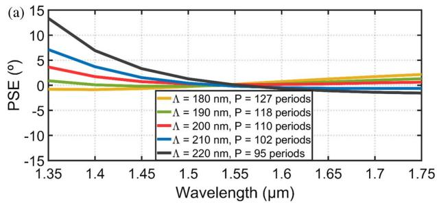

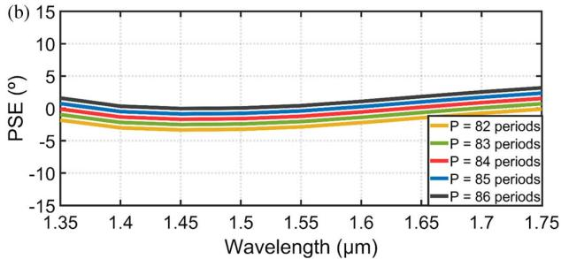  
Fig. 3. (a) PSE as a function of wavelength for two parallel SWG waveguides with DC 50%, $W _ { L } = 1 . 6$ μm, and $W _ { U } = 1 . 8$ μm obtained via Floquet–Bloch analysis. An almost flat response is achieved for $\Lambda = 2 0 0$ nm. (b) PSE response of the entire SWG PS with a period Λ  200 nm, including the effect of SWG tapers.

The wavelength response of our SWG PS is also shown in Fig. 2 (red curve), for comparison with conventional devices. It is observed that our subwavelength engineered PS leverages additional degrees of freedom offered by SWG engineering to mitigate the wavelength dependence, achieving an almost flat response with an unprecedented PSE of only $\pm 1 . 7 ^ { \circ }$ over the 400 nm bandwidth.

The mesh used for our 3D-FDTD simulations was 10 nm in all directions (transversal and longitudinal), ensuring 20 samples per period (z axis) and 22 samples along the height of the waveguide (y axis). Regarding the simulation window, a distance of 0.8 μm was preserved on each side of the waveguides (x axis) and of 1.5 μm on the top and bottom (y axis). PMLs were used outside the simulation window. Finally, the value of the time step was set as 0.01 μm as proposed by the simulator to meet the condition of Courant. Note that time $s \mathrm { { t e p } } = { { c T } }$ , where c is the speed of light (m/s) and T is the temporary step (s).

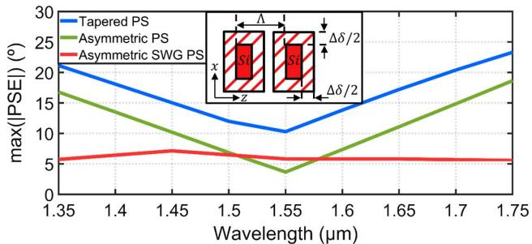  
Fig. 4. Simulated maximum PSE in the wavelength range 1.35– 1.75 μm. For each wavelength, the highest error between $\mathrm { P S E } ( \Delta \delta = + 2 0 \ \mathrm { n m } )$ and PSE Δδ  −20 nm is represented. Inset: longitudinal and transversal variations for each SWG segment were considered.

Tolerance to fabrication errors was also studied using 3D-FDTD simulations. Dimensional errors of $\Delta \delta = \pm 2 0$ nm were assumed in both transversal and longitudinal directions for SWG segments [see Fig. 4, inset], which thus changes the SWG duty cycle according to the width variations to perform a trustworthy study. For each case under study, dimensional error was maintained constant along all SWG segments and hence mimicked under-etching/over-etching effects. For conventional PSs, the influence of waveguide width variation was examined. Figure 4 shows the maximum absolute value of PSE for the nominal and biased PSs. It is observed that the worst-performing device is the tapered PS with a PSE of up to 23.3° within the (1.35–1.75 μm) wavelength range. This is due to width changes resulting in an offset of the phase-shift curve error, since the length is no longer optimal for the actual PS geometry. This offset is reduced for greater waveguide widths, which leads to a reduced error of $1 8 . 7 ^ { \circ }$ in the case of asymmetrical PS. In our SWG PS, the maximum phase error is further reduced to 7.1° by maintaining the advantage of greater waveguide width of an asymmetrical PS and further benefiting from the reduced effective index inherent to SWG structures. Moreover, the flat spectral response is achieved even in the presence of dimensional errors as large as 20 nm, yielding a remarkable resilience to typical etching errors.

## 4. FABRICATION AND MEASUREMENTS

Device fabrication was performed in a commercial foundry using a standard SOI wafer with 220 nm thick silicon layer and 2 μm BOX. The pattern was defined using 100 keV electron beam lithography, and a reactive ion etching process with an inductively coupled plasma etcher (ICP-RIE) was used to transfer the pattern to the silicon layer. To protect the devices, a 2.2 μm thick $\mathrm { S i O } _ { 2 }$ cladding was deposited using a chemical vapor deposition (CVD) process. The experimental characterization of the PSs was carried out using a Mach– Zehnder interferometer (MZI) with 14 PSs connected in series, yielding an intensity modulated signal with a period depending on the optical path delay between the arms of the MZI. Owing to space limitations on the chip, only two different types of devices were fabricated, one based on 14 tapered PSs and the other based on 14 asymmetric SWG PSs, as shown in Figs. 5(a) and 5(b), respectively. Tapered PSs were included instead of asymmetric PSs, since the former have smaller footprint and similar bandwidth response and are thus typically more often used in photonic integrated circuits. In these test structures, the fundamental mode injected to port 1 is equally divided by the SWG engineered MMI, inducing a 90° phase between its outputs. Then each PS delays the mode propagating through the upper arm an additional 90°, up to a total of 1260° in 14 concatenated PSs. Combining both factors and wrapping to the interval [0°–360°], a phase shift of 270° is achieved, which results in the fundamental mode being coupled into output port 3 of the SWG MMI. When the fundamental mode is injected through port 2, it exits from the output port 4. The accumulated phase errors due to deviations from design central wavelength result in power oscillations between ports 3 and 4 that enable us to characterize the spectral response of each PS.

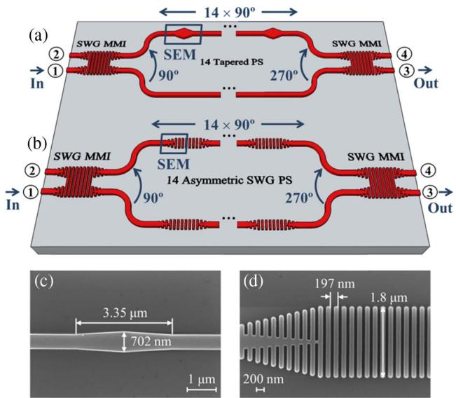  
Fig. 5. Schematic of the test structures used to experimentally characterize (a) the tapered PS and (b) the asymmetric SWG PS. Each structure is composed of two ultra-broadband SWG MMIs and 14 PSs connected in series, forming an MZI. SEM images of the fabricated (c) tapered PS and (d) asymmetric SWG PS as indicated by the blue box in the schematic.

It should be noted that two SWG MMIs were included to ensure ultra-broadband behavior and circumvent the wavelength limitations of conventional beam splitters in terms of loss, imbalance, and phase errors. The dimensions of the SWG MMIs were taken from Halir et al. [42], although in our case an optimal length of 77 periods was used for the multimode SWG MMI region. Since modes are more delocalized in SWG waveguides compared to conventional (continuous) waveguides, we increased the separation between the arms of the MZI to 21.5 μm by means of 90° bends to minimize power coupling. Identical bends were used in the upper and lower arms with a radius of 5 μm, with negligible bend losses for TE polarization [48]. Finally, the dimensions of the PSs were taken as specified in the device design section, and different flavors varying the number of periods of the PS section were introduced in the mask to compensate for under- or overetching errors. The best measured performance for the tapered PS was achieved for the nominal design with $L _ { \mathrm { P S } } \approx 3 . 4 1$ μm, while the optimal number of periods for the SWG PS was P 86, i.e., only 2 periods more than the nominal design. Scanning electron microscope (SEM) images of the fabricated PSs are shown in Figs. 5(c) and 5(d).

The fabricated devices were characterized using a tunable laser with the wavelength range of 1.495–1.64 μm. The light was coupled in and out of the chip by using high-performance SWG edge couplers [30,38]. Input light polarization was controlled with a lensed polarization maintaining fiber (PMF) assembled in a rotating mount, and TE polarization was selected with a Glan–Thompson polarizer. Transmittance spectra of the MZIs were obtained by sweeping the wavelength of the tunable laser while sequentially measuring the power at both output ports with a germanium photodetector placed at the output of the chip.

Negligible insertion losses under 0.2 dB were measured for a single SWG PS. The auxiliary SWG MMI presented losses under 0.6 dB, imbalance below 1 dB, and a phase error smaller than 5° within the measured (1.495–1.64 μm) wavelength range. Finally, the losses per SWG edge coupler were less than ∼4.5 dB. Measured jitter (variations in SWG period) in the SEM images was of the order of only ∼3 nm, resulting in negligible impact on the flatness of the spectral response. Furthermore, PS length was maintained under 30 μm to avoid potential jitter problems in wide SWG waveguides [47].

The comparison between the measured spectra for the two test structures is shown in Figs. 6(a) and 6(b). The SWG PS shows substantially reduced variations of the output power compared to tapered PSs within the entire measured wavelength range. It can be observed that maxima and minima from the MZI are shifted with respect to the design wavelength of 1.55 μm. This spectral shift originates from the phase errors produced by the fabrication deviation in the two SWG MMIs and the 14 PSs. PS deviation from the ideal 90° at $\lambda _ { 0 } = 1 . 5 5$ μm can be modeled as a constant offset added to the simulated PS response, which is then multiplied by a factor of 14 (number of PSs) in the overall test structure. Given this shift and the reduced wavelength dependence of the SWG PS response, the maximum value of the extinction ratio cannot be observed in Fig. 6(b). To estimate the error introduced by these fabrication defects, we developed a circuit model in which the S-parameter matrices of the two SWG MMIs and the 14 PSs were concatenated to obtain the S-parameter matrix of the complete MZI. In order to accurately characterize the SWG MMI and isolate the PSs’ errors, auxiliary MZIs including SWG MMIs were fabricated. The resulting experimental losses, imbalance, and phase error were used to construct the SWG MMI S-parameter matrix. On the other hand, the PS matrix was constructed with the data of 3D-FDTD simulations, further incorporating a variable offset to characterize the additional phase shift caused by fabrication errors (see Appendix B). This offset was then computed by adjusting the curves of the full circuit model to the measured curves through an iterative method. Errors of only −6.5° and 6° were obtained for a single tapered PS and a single asymmetric SWG PS, respectively.

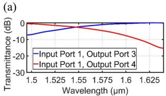  
(c)

(b)  
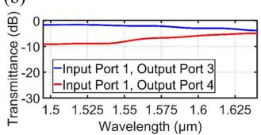

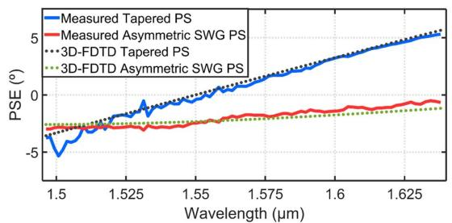  
Fig. 6. Measured spectra of the MZIs (a) with 14 tapered PSs and (b) with 14 SWG PSs. The light was injected through port 1, and both outputs of the test structure (ports 3 and 4) were measured. (c) Measured PSE for a single tapered PS (solid blue line) and a single asymmetric SWG PS (solid red line). Dotted lines correspond to the simulation results obtained via 3D-FDTD.

The PSE was derived directly from the transfer functions of the test structures using the measured spectra in Figs. 6(a) and 6(b). For the comparison with simulation results, the phase error introduced by fabrication deviations was subtracted from the measured PSE. Figure 6(c) shows that the measured PSEs for both tapered PS (blue curve) and SWG PS (red curve) are in excellent agreement with the 3D-FDTD simulations (dotted lines). The absolute value of the error in the middle of the measured wavelength range is near 2° for both PSs, although the measured slope is only 16(°)/μm for our SWG PS, whereas 63(°)/μm is attained for the tapered PS. Peakto-peak ripple in the SWG PS is also reduced to under 0.5° (even in the presence of errors introduced by the MMIs and the computation method). Note that the phase error response of the SWG PS does not cross zero at the wavelength of 1.55 μm because our design was carried out to obtain a minimum error over the simulated wavelength range. The resulting offset in PSE can be compensated for by increasing the number of periods in the PS section. Notwithstanding, the concept of flattening the phase response has been experimentally verified for our SWG PS within a measured 145 nm wavelength range, limited by our measurement setup. For the sake of comparison, Table 1 shows the performance of other active and passive PSs.

## 5. CONCLUSIONS

We have proposed and experimentally demonstrated an ultrabroadband passive PS using a subwavelength grating metamaterial structure. Anisotropy and dispersion engineering of SWG waveguides are leveraged to overcome the bandwidth limitations of conventional PSs. Our Floquet–Bloch simulations predict an unprecedented PSE below 1.7° within a 400 nm wavelength range (1.35–1.75 μm) for our device, compared to bandwidths of only ∼50 nm for conventional devices (tapered and asymmetric PSs). Ultra-broadband SWG PSs were fabricated on an SOI platform, and a very good agreement was found between experimental and simulation results. The phase slope within the measured wavelength range (1.495–1.64 μm) was only 16(°)/μm. Compared to other reported passive PSs, simulation results of our SWG PS show a fourfold enhancement in terms of bandwidth with much lower value of PSE. Furthermore, the tolerance study shows that SWG devices are more robust to fabrication errors.

We believe that SWG PSs demonstrated in this paper open promising prospects for the next generation of photonic integrated circuits and could find potential applications in coherent communications, quantum photonics, and high-performance mode-division multiplexing circuits for simple and ultrabroadband mode splitters-combiners and higher-order mode converters. Performance could be further enhanced through iterative SWG design and tailored tapers. Moreover, the application of SWG structures to PSs paves the way for future PS applications benefiting from other SWG capabilities such as birefringence engineering for polarization-independent PSs or waveguide athermalization for temperature-independent PSs. Our proposed topology could also be turned into a tunable device through known active methods such as thermo-optic effects.

Table 1. Comparison Between Active and Passive Phase Shiftersa
<table><tr><td rowspan=1 colspan=1>Ref./Active or Passive?</td><td rowspan=1 colspan=1>Technol.</td><td rowspan=1 colspan=1>Phase ()</td><td rowspan=1 colspan=1>PSE </td><td rowspan=1 colspan=2>BW (nm)             IL (dB)</td></tr><tr><td rowspan=1 colspan=1>[11]/Active*</td><td rowspan=1 colspan=1>SOI</td><td rowspan=1 colspan=1></td><td rowspan=1 colspan=1></td><td rowspan=1 colspan=1></td><td rowspan=1 colspan=1>0.23</td></tr><tr><td rowspan=1 colspan=1>[15]/Active</td><td rowspan=1 colspan=1>SOI</td><td rowspan=1 colspan=1>0-540</td><td rowspan=1 colspan=1>−</td><td rowspan=1 colspan=1></td><td rowspan=1 colspan=1>1.00</td></tr><tr><td rowspan=1 colspan=1>[2 1]/Passive</td><td rowspan=1 colspan=1>GaInAsP</td><td rowspan=1 colspan=1>45</td><td rowspan=1 colspan=1>&lt; ± 2</td><td rowspan=1 colspan=1>70</td><td rowspan=1 colspan=1>0.1*</td></tr><tr><td rowspan=1 colspan=1>[2</td><td rowspan=1 colspan=1>4]/Passie</td><td rowspan=1 colspan=1>SOI</td><td rowspan=1 colspan=1>90</td><td rowspan=1 colspan=1>&lt;±5</td><td rowspan=2 colspan=1>110100                 0.70</td></tr><tr><td rowspan=1 colspan=1>[27]/Passive</td><td rowspan=1 colspan=1>InP</td><td rowspan=1 colspan=1>180</td><td rowspan=1 colspan=1>&lt; ± 10</td><td></td></tr><tr><td rowspan=1 colspan=1>[27]/Passive</td><td rowspan=1 colspan=1>Si</td><td rowspan=1 colspan=1>90</td><td rowspan=1 colspan=1> $< \pm 1 3$ </td><td rowspan=1 colspan=1>100</td><td rowspan=2 colspan=1>1.250.22</td></tr><tr><td rowspan=1 colspan=1>[28]/Passive</td><td rowspan=1 colspan=1>SOI</td><td rowspan=1 colspan=1>90</td><td rowspan=1 colspan=1></td><td rowspan=1 colspan=1></td></tr><tr><td rowspan=1 colspan=1>This work (simulated)</td><td rowspan=1 colspan=1>SOI</td><td rowspan=1 colspan=1>90</td><td rowspan=1 colspan=1>&lt; ± 1.7</td><td rowspan=1 colspan=1>400</td><td rowspan=1 colspan=1>0.15</td></tr><tr><td rowspan=1 colspan=1>This work* (measured)</td><td rowspan=1 colspan=1>SOI</td><td rowspan=1 colspan=1>90</td><td rowspan=1 colspan=1>&lt; ± 3</td><td rowspan=1 colspan=1>145</td><td rowspan=1 colspan=1>0.20</td></tr></table>

a Values marked with an asterisk correspond to experimental results.

## APPENDIX A: WAVELENGTH DEPENDENCE OF THE PHASE SHIFT FOR WIDE WAVEGUIDES

For conventional waveguides, the wavelength dependence of the phase shift shown in Eq. (2) can be simplified assuming large waveguide widths to hold the paraxiality condition. Propagation constants of the fundamental mode can be approximated by the following expression [43]:

$$
\beta ( \lambda ) \approx k _ { 0 } n _ { \mathrm { c o r e } } - \frac { \pi \lambda } { 4 n _ { \mathrm { c o r e } } W _ { e } ^ { 2 } } ,\tag{A1}
$$

where $k _ { 0 }$ is the wavenumber, $n _ { \mathrm { c o r e } }$ is the effective index of the equivalent 2D waveguide, and $\boldsymbol { W } _ { e }$ is the effective waveguide width, which is assumed to be invariant with wavelength. The effective index of the fundamental mode propagating through the wide waveguide is

$$
n _ { \mathrm { e f f } } ( \lambda ) = \beta ( \lambda ) \frac { \lambda } { 2 \pi } \approx n _ { \mathrm { c o r e } } - \frac { \lambda ^ { 2 } } { 8 n _ { \mathrm { c o r e } } W _ { e } ^ { 2 } } .\tag{A2}
$$

The difference between the effective indices of the upper and lower waveguides is calculated as

$$
\begin{array} { l } { \displaystyle \Delta n _ { \mathrm { e f f } } ( \lambda ) = n _ { \mathrm { e f f } , U } ( \lambda ) - n _ { \mathrm { e f f } , L } ( \lambda ) } \\ { \displaystyle = \frac { \lambda ^ { 2 } } { 8 n _ { \mathrm { c o r e } } } \bigg ( \frac { 1 } { W _ { e , L } ^ { 2 } } - \frac { 1 } { W _ { e , U } ^ { 2 } } \bigg ) . } \end{array}\tag{A3}
$$

The derivative of Eq. (A3) is therefore

$$
\frac { \mathrm { d } n _ { \mathrm { e f f } } ( \lambda ) } { \mathrm { d } \lambda } = \frac { 2 \lambda } { 8 n _ { \mathrm { c o r e } } } \bigg ( \frac { 1 } { W _ { e , L } ^ { 2 } } - \frac { 1 } { W _ { e , U } ^ { 2 } } \bigg ) .\tag{A4}
$$

Finally, the wavelength dependence of the phase shift between wide waveguides is simplified by replacing Eq. (A4) in Eq. (2):

$$
\left. { \frac { \mathrm { d } \Delta \Phi ( \lambda ) } { \mathrm { d } \lambda } } \right| _ { \lambda = \lambda _ { 0 } } = - { \frac { \Delta \Phi _ { 0 } } { \lambda _ { 0 } } } [ 1 - 2 ] = { \frac { \Delta \Phi _ { 0 } } { \lambda _ { 0 } } } .\tag{A5}
$$

On the other hand, for wide SWG waveguides, the effective index of the fundamental Floquet–Bloch mode is given by the following expression [42]:

$$
n _ { \mathrm { e f f } } ( \lambda ) \approx n _ { x x } - \frac { \lambda ^ { 2 } } { 8 W _ { e } ^ { 2 } } \frac { n _ { x x } } { n _ { z z } ^ { 2 } } .\tag{A6}
$$

The difference between the effective refractive indices of the upper and the lower waveguides is

$$
\Delta n _ { \mathrm { e f f } } ( \lambda ) = \frac { \lambda ^ { 2 } } { 8 } \frac { n _ { x x } } { n _ { z z } ^ { 2 } } \left( \frac { 1 } { W _ { \ e , L } ^ { 2 } } - \frac { 1 } { W _ { \ e , U } ^ { 2 } } \right) .\tag{A7}
$$

Since $n _ { z z } ^ { 2 } / n _ { x x }$ can be engineered to be proportional to λ,

$$
\Delta n _ { \mathrm { e f f } } ( \lambda ) \approx \frac { \lambda } { 8 } \left( \frac { 1 } { W _ { e , L } ^ { 2 } } - \frac { 1 } { W _ { e , U } ^ { 2 } } \right) \cdot c ,\tag{A8}
$$

where c is a constant. Therefore, the derivative of Eq. (3) is

$$
\frac { \mathrm { d } \Delta \Phi ( \lambda ) } { \mathrm { d } \lambda } \bigg | _ { \lambda = \lambda _ { 0 } } \approx - \frac { \Delta \Phi _ { 0 } } { \lambda _ { 0 } } \left[ 1 - \frac { \frac { \lambda _ { 0 } } { 8 } \left( \frac { 1 } { W _ { e , L } ^ { 2 } } - \frac { 1 } { W _ { e , U } ^ { 2 } } \right) \cdot c } { \frac { \lambda _ { 0 } } { 8 } \left( \frac { 1 } { W _ { e , L } ^ { 2 } } - \frac { 1 } { W _ { e , U } ^ { 2 } } \right) \cdot c } \right] \approx 0 .\tag{A9}
$$

## APPENDIX B: CIRCUIT MODEL AND EXPERIMENTAL PSE DERIVATION

The main objective of the circuit model is to simulate the response of the test structure (T ) used for the experimental characterization [see Figs. 5(a) and 5(b)]. For this purpose, it is necessary to define S-parameter matrices for each device of the test structure. The S-parameter matrices of the SWG MMIs (M ) are built from measured insertion loss, imbalance, and phase error obtained from the characterization of an MZI containing only two SWG MMIs. On the other hand, the 3D-FDTD simulation response sim λ is used for the S-parameter matrices of the 14 PSs. An offset (named “error”) is added to the PS simulation response, which is the offset introduced by fabrication deviations. Considering the reflections negligible, the concatenation of S-parameter matrices can be written as follows (using only transmissions):

$$
\overline { { { \overline { { T } } } } } = \overline { { { \overline { { M } } } } } \left[ \begin{array} { c c } { { 1 } } & { { 0 } } \\ { { 0 } } & { { e ^ { j [ \sin ( \lambda ) + \mathrm { e r r o r } ] } } } \end{array} \right] ^ { 1 4 } \overline { { { \overline { { M } } } } } .\tag{B1}
$$

The variable “error” is computed through an iterative method until the simulated response from the circuit model matches the experimental interferogram curves of Figs. 6(a) and 6(b). The adjustment achieved is shown in Figs. 7(a) and 7(b) for tapered PSs and SWG PSs, respectively.

Finally, the spectral response of each fabricated PS is obtained by solving the previous matrix for each wavelength point, since only the wavelength response of each PS is undetermined. In order to compare experimental PSE with simulation results, the error introduced by fabrication errors calculated previously needs to be extracted. This result is the experimental PSE shown in Fig. 6(c). Therefore, the residual PSE is the wavelength dependence of tapered PSs and SWG PSs.

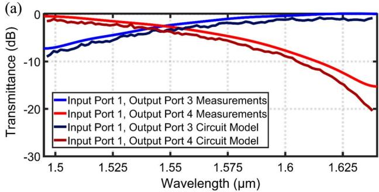

(b)  
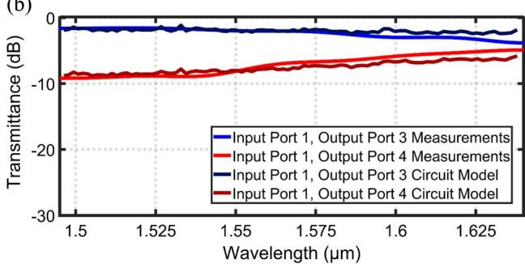  
Fig. 7. Fitting of the circuit model to the measured spectra of the MZIs with (a) 14 tapered PSs and (b) 14 SWG PSs.

Funding. Spanish Ministry of Science, Innovation and Universities (MICINN) (IJCI-2016-30484, RTI2018-097957- B-C33, TEC2015-71127-C2-1-R with FPI Scholarship BES-2016-077798, TEC2016-80718-R, Alcyon Photonics S.L. Through CDTI SNEO-20181232); Spanish Ministry of Education, Culture and Sport (MECD) (FPU16/06762); Community of Madrid - FEDER Funds (S2018/NMT-4326); Horizon 2020 Research and Innovation Program (Marie Sklodowska-Curie 734331).

## REFERENCES

1. R. A. Soref, “Silicon-based optoelectronics,” Proc. IEEE 81, 1687 1706 (1993).

2. G. T. Reed, G. Mashanovich, F. Y. Gardes, and D. J. Thomson, “Silicon optical modulators,” Nat. Photonics 4, 518 526 (2010).

3. J. Van Campenhout, W. M. J. Green, S. Assefa, and Y. A. Vlasov, “Low-power, 2×2 silicon electro-optic switch with 110-nm bandwidth for broadband reconfigurable optical networks,” Opt. Express 17, 24020 24029 (2009).

4. Y. Xiong, R. B. Priti, and O. Liboiron-Ladouceur, “High-speed two-mode switch for mode-division multiplexing optical networks,” Optica 4, 1098 1102 (2017).

5. S. S. Djordjevic, L. W. Luo, S. Ibrahim, N. K. Fontaine, C. B. Poitras, B. Guan, L. Zhou, K. Okamoto, Z. Ding, M. Lipson, and S. J. B. Yoo, “Fully reconfigurable silicon photonic lattice filters with four cascaded unit cells,” IEEE Photon. Technol. Lett. 23, 42 44 (2011).

6. P. Orlandi, C. Ferrari, M. J. Strain, A. Canciamilla, F. Morichetti, M. Sorel, P. Bassi, and A. Melloni, “Reconfigurable silicon filter with continuous bandwidth tunability,” Opt. Lett. 37, 3669 3671 (2012).

7. D. Hillerkuss, M. Winter, M. Teschke, A. Marculescu, J. Li, G. Sigurdsson, K. Worms, S. Ben Ezra, N. Narkiss, W. Freude, and J. Leuthold, “Simple all-optical FFT scheme enabling Tbit/s real-time signal processing,” Opt. Express 18, 9324 9340 (2010).

8. C. R. Doerr, P. J. Winzer, Y. K. Chen, S. Chandrasekhar, M. S. Rasras, L. Chen, T.-Y. Liow, K.-W. Ang, and G. Q. Lo, “Monolithic polarization and phase diversity coherent receiver in silicon,” J. Lightwave Technol. 28, 520 525 (2010).

9. N. C. Harris, D. Bunandar, M. Pant, G. R. Steinbrecher, J. Mower, M. Prabhu, T. Baehr-Jones, M. Hochberg, and D. Englund, “Large-scale quantum photonic circuits in silicon,” Nanophotonics 5, 456 468 (2016).

10. E. Knill, R. Laflamme, and G. J. Milburn, “A scheme for efficient quantum computation with linear optics,” Nature 409, 46 52 (2001).

11. N. C. Harris, Y. Ma, J. Mower, T. Baehr-Jones, D. Englund, M. Hochberg, and C. Galland, “Efficient, compact and low loss thermooptic phase shifter in silicon,” Opt. Express 22, 10487 10493 (2014).

12. J. H. Schmid, M. Ibrahim, P. Cheben, J. Lapointe, S. Janz, P. J. Bock, A. Densmore, B. Lamontagne, R. Ma, W. N. Ye, and D.-X. Xu, “Temperature-independent silicon subwavelength grating waveguides,” Opt. Lett. 36, 2110 2112 (2011).

13. R. A. Soref and B. R. Bennett, “Electrooptical effects in silicon,” IEEE J. Quantum Electron. 23, 123 129 (1987).

14. C. K. Tang and G. T. Reed, “Highly efficient optical phase modulator in SOI waveguides,” Electron. Lett. 31, 451 452 (1995).

15. T. Ikeda, K. Takahashi, Y. Kanamori, and K. Hane, “Phase-shifter using submicron silicon waveguide couplers with ultra-small electromechanical actuator,” Opt. Express 18, 7031 7037 (2010).

16. M. Poot and H. X. Tang, “Broadband nanoelectromechanical phase shifting of light on a chip,” Appl. Phys. Lett. 104, 061101 (2014).

17. L. McKay, M. Merklein, A. Casas-Bedoya, A. Choudhary, M. Jenkins, C. Middleton, A. Cramer, J. Devenport, A. Klee, R. DeSalvo, and B. J. Eggleton, “Brillouin-based phase shifter in a silicon waveguide,” Optica 6, 907 913 (2019).

18. M. Burla, L. Romero-Cortés, M. Li, X. Wang, L. Chrostowski, and J. Azaña, “On-chip programmable ultra-wideband microwave photonic phase shifter and true time delay unit,” Opt. Lett. 39, 6181 6184 (2014).

19. Q. Chang, Q. Li, Z. Zhang, M. Qiu, T. Ye, and Y. Su, “A tunable broadband photonic RF phase shifter based on a silicon microring resonator,” IEEE Photon. Technol. Lett. 21, 60 62 (2008).

20. J. Leuthold, J. Eckner, E. Gamper, P. A. Besse, and H. Melchior, “Multimode interference couplers for the conversion and combining of zero- and first-order modes,” J. Lightwave Technol. 16, 1228 1239 (1998).

21. S. H. Jeong and K. Morito, “Novel optical 90° hybrid consisting of a paired interference based 2×4 MMI coupler, a phase shifter and a 2×2 MMI coupler,” J. Lightwave Technol. 28, 1323 1331 (2010).

22. M. Cherchi, S. Ylinen, M. Harjanne, M. Kapulainen, T. Vehmas, and T. Aalto, “Unconstrained splitting ratios in compact double-MMI couplers,” Opt. Express 22, 9245 9253 (2014).

23. T. Saida, A. Himeno, M. Okuno, A. Sugita, and K. Okamoto, “Silicabased 2×2 multimode interference coupler with arbitrary power splitting ratio,” Electron. Lett. 35, 2031 2033 (1999).

24. D. González-Andrade, J. G. Wangüemert-Pérez, A. V. Velasco, A. Ortega-Moñux, A. Herrero-Bermello, I. Molina-Fernández, R. Halir, and P. Cheben, “Ultra-broadband mode converter and multiplexer based on sub-wavelength structures,” IEEE Photon. J. 10, 2201010 (2018).

25. S. Yegnanarayanan, P. D. Trinh, F. Coppinger, and B. Jalali, “Compact silicon-based integrated optic time delays,” IEEE Photon. Technol. Lett. 9, 634 635 (1997).

26. A. Herrero-Bermello, A. V. Velasco, H. Podmore, P. Cheben, J. H. Schmid, S. Janz, M. L. Calvo, D.-X. Xu, A. Scott, and P. Corredera, “Temperature dependence mitigation in stationary Fouriertransform on-chip spectrometers,” Opt. Lett. 42, 2239 2242 (2017).

27. P. E. Morrissey and F. H. Peters, “Multimode interference couplers as compact and robust static optical phase shifters,” Opt. Commun. 345, 1 5 (2015).

28. L. Han, S. Liang, H. Zhu, L. Qiao, J. Xu, and W. Wang, “Two-mode de/multiplexer based on multimode interference couplers with a tilted joint as phase shifter,” Opt. Lett. 40, 518 521 (2015).

29. P. Cheben, P. J. Bock, J. H. Schmid, J. Lapointe, S. Janz, D.-X. Xu, A. Densmore, A. Delâge, B. Lamontagne, and T. J. Hall, “Refractive index engineering with subwavelength gratings for efficient microphotonic couplers and planar waveguide multiplexers,” Opt. Lett. 35, 2526 2528 (2010).

30. P. Cheben, D.-X. Xu, S. Janz, and A. Densmore, “Subwavelength waveguide grating for mode conversion and light coupling in integrated optics,” Opt. Express 14, 4695 4702 (2006).

31. P. Cheben, R. Halir, J. H. Schmid, H. A. Atwater, and D. R. Smith, “Subwavelength integrated photonics,” Nature 560, 565 572 (2018).

32. R. Halir, A. Ortega-Moñux, D. Benedikovic, G. Z. Mashanovich, J. G. Wangüemert-Pérez, J. H. Schmid, Í. Molina-Fernández, and P. Cheben, “Subwavelength-grating metamaterial structures for silicon photonic devices,” Proc. IEEE 106, 2144 2157 (2018).

33. J. M. Luque-González, A. Herrero-Bermello, A. Ortega-Moñux, Í. Molina-Fernández, A. V. Velasco, P. Cheben, J. H. Schmid, S. Wang, and R. Halir, “Tilted subwavelength gratings: controlling anisotropy in metamaterial nanophotonic waveguides,” Opt. Lett. 43, 4691 4694 (2018).

34. A. Herrero-Bermello, J. M. Luque-González, A. V. Velasco, A. Ortega-Moñux, P. Cheben, and R. Halir, “Design of a broadband polarization splitter based on anisotropy-engineered tilted subwavelength gratings,” IEEE Photon. J. 11, 6601508 (2019).

35. R. Halir, P. J. Bock, P. Cheben, A. Ortega-Moñux, C. Alonso-Ramos, J. H. Schmid, J. Lapointe, D.-X. Xu, J. G. Wangüemert-Pérez, Í. Molina-Fernández, and S. Janz, “Waveguide sub-wavelength structures: a review of principles and applications,” Laser Photon. Rev. 9, 25 49 (2015).

36. J. G. Wangüemert-Pérez, P. Cheben, A. Ortega-Moñux, C. Alonso-Ramos, D. Pérez-Galacho, R. Halir, I. Molina-Fernández, D.-X. Xu, and J. H. Schmid, “Evanescent field waveguide sensing with subwavelength grating structures in silicon-on-insulator,” Opt. Lett. 39, 4442 4445 (2014).

37. J. Ctyroký, J. G. Wangüemert-Pérez, P. Kwiecien, I. Richter, J.ˇ Litvik, J. H. Schmid, Í. Molina-Fernández, A. Ortega-Moñux, M. Dado, and P. Cheben, “Design of narrowband Bragg spectral filters

in subwavelength grating metamaterial waveguides,” Opt. Express 26, 179 194 (2018).

38. P. Cheben, J. H. Schmid, S. Wang, D.-X. Xu, M. Vachon, S. Janz, J. Lapointe, Y. Painchaud, and M.-J. Picard, “Broadband polarization independent nanophotonic coupler for silicon waveguides with ultrahigh efficiency,” Opt. Express 23, 22553 22563 (2015).

39. D. Benedikovic, P. Cheben, J. H. Schmid, D.-X. Xu, B. Lamontagne, S. Wang, J. Lapointe, R. Halir, A. Ortega-Moñux, S. Janz, and M. Dado, “Subwavelength index engineered surface grating coupler with sub-decibel efficiency for 220-nm silicon-on-insulator waveguides,” Opt. Express 23, 22628 22635 (2015).

40. Y. Xiong, J. G. Wangüemert-Pérez, D.-X. Xu, J. H. Schmid, P. Cheben, and N. Y. Winnie, “Polarization splitter and rotator with subwavelength grating for enhanced fabrication tolerance,” Opt. Lett. 39, 6931 6934 (2014).

41. R. Halir, A. Maese-Novo, A. Ortega-Moñux, I. Molina-Fernández, J. G. Wangüemert-Pérez, P. Cheben, D.-X. Xu, J. H. Schmid, and S. Janz, “Colorless directional coupler with dispersion engineered sub-wavelength structure,” Opt. Express 20, 13470 13477 (2012).

42. R. Halir, P. Cheben, J. M. Luque-González, J. D. Sarmiento-Merenguel, J. H. Schmid, J. G. Wangüemert-Pérez, D.-X. Xu,

S. Wang, A. Ortega-Moñux, and Í. Molina-Fernández, “Ultrabroadband nanophotonic beamsplitter using an anisotropic subwavelength metamaterial,” Laser Photon. Rev. 10, 1039 1046 (2016).

43. L. B. Soldano and E. C. Pennings, “Optical multi-mode interference devices based on self-imaging: principles and applications,” J. Lightwave Technol. 13, 615 627 (1995).

44. C. D. Salzberg and J. J. Villa, “Infrared refractive indexes of silicon, germanium and modified selenium glass,” J. Opt. Soc. Am. 47, 244 246 (1957).

45. I. H. Malitson, “Interspecimen comparison of the refractive index of fused silica,” J. Opt. Soc. Am. 55, 1205 1208 (1965).

46. “FullWAVE and FemSIM, available from RSoft,” https://www .synopsys.com/optical-solutions/rsoft/component-design.html.

47. A. Ortega-Moñux, J. Ctyroký, P. Cheben, J. H. Schmid, S. Wang, ˇ Í. Molina-Fernández, and R. Halir, “Disorder effects in subwavelength grating metamaterial waveguides,” Opt. Express 25, 12222 12236 (2017).

48. W. Bogaerts and S. K. Selvaraja, “Compact single-mode silicon hybrid rib/strip waveguide with adiabatic bends,” IEEE Photon. J. 3, 422 432 (2011).
