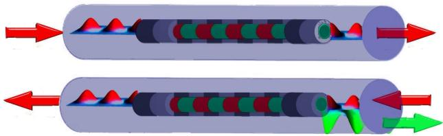
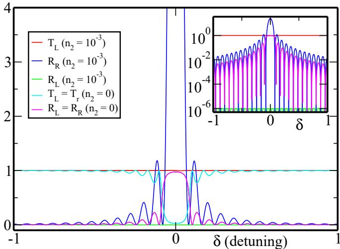
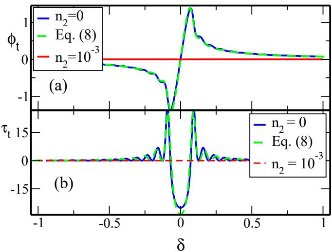
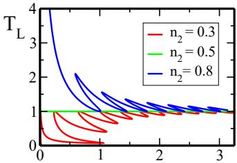
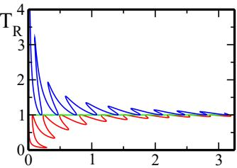
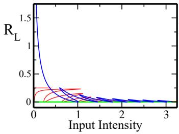
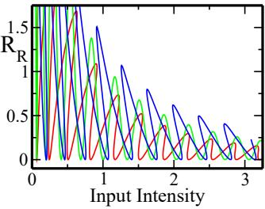

# Unidirectional Invisibility induced by PT-Symmetric Periodic Structures

Zin Lin1, Hamidreza Ramezani1, Toni Eichelkraut2, Tsampikos Kottos1, Hui Cao3, and Demetrios N. Christodoulides2

1Department of Physics, Wesleyan University, Middletown, Connecticut 06459, USA

2College of Optics & Photonics-CREOL, University of Central Florida, Orlando, Florida 32816, USA and

3Department of Applied Physics, Yale University, New Haven, Connecticut 06520, USA

(Dated: November 27, 2016)

We show that parity-time (PT ) symmetric Bragg periodic structures, near the spontaneous PT - symmetry breaking point, can act as unidirectional invisible media. In this regime, the reflection from one end is diminished while it is enhanced from the other. At the same time the transmission coefficient and phase, are indistinguishable from those expected in the absence of a grating. The phenomenon is robust even in the presence of Kerr non-linearities, and it can also effectively suppress optical bistabilities.

In the last few years considerable research effort has been invested in developing artificial materialsappropriately engineered to display properties not found in nature. In the electromagnetic domain, such metamaterials make use of their structural composition, which in turn allows them to have complete access of all four quadrants of the real −µ plane. Several exotic effects ranging from negative refraction to superlensing and from negative Doppler shift to reverse Cherenkov radiation can be envisioned in such systems [1, 2]. Quite recently, the possibility of synthesizing a new family of artificial optical materials that instead rely on balanced gain/loss regions has been suggested [3–7]. This class of optical structures deliberately exploits notions of parity (P)and time (T ) symmetry [8–10] as a means to attain altogether new functionalities and optical characteristics [3]. Under PT symmetry, the creation and absorption of photons occurs in a controlled manner, so that the net loss or gain is zero. In optics, PT symmetry demands that the complex refractive index obeys the condition $n ( \vec { r } ) = n ^ { * } ( - \vec { r } )$ in other words the real part of the refractive index should be an even function of position, whereas the imaginary part must be odd. PT -synthetic materials can exhibit several intriguing features. These include among others, power oscillations [3, 5, 11], absorption enhanced transmission [6], double refraction and non-reciprocity of light propagation [3]. In the nonlinear domain, such pseudo-Hermitian nonreciprocal effects can be used to realize a new generation of on-chip isolators and circulators [7]. Other exciting results within the framework of PT -optics include the study of Bloch oscillations [12], and the realization of coherent perfect laser absorbers [13] and nonlinear switching structures [14].

To date, most of the studies on optical realizations of $\mathcal { P T }$ synthetic media have relied on the paraxial approximation which maps the scalar wave equation to the Schr¨odinger equation, with the axial wavevector playing the role of energy. This formal analogy, allows one to investigate experimentally fundamental $\mathcal { P T }$ -concepts that may impact several other areas, ranging from quantum field theory and mathematical physics [8–10], to solid state [15] and atomic physics [16]. Among the various themes that have fascinated researchers, is the existence of spontaneous PT symmetry breaking points (exceptional points) where the eigenvalues of the effective non-Hermitian Hamiltonian describing the dynamics of these systems abruptly turn from real to complex [10]. Recently interest in PT -scattering configurations [17–20] has been revived in connection with using such devices under a dual role, that of a lasing and a perfect coherent absorbing cavity [13, 21].

  
FIG. 1: (color online) Unidirectional invisibility of a PT - symmetric Bragg scatterer. The wave entering from the left (upper figure) does not recognize the existence of the periodic structure and goes through the sample entirely unaffected. On the other hand, a wave entering this same grating from the right (lower figure), experiences enhanced reflection.

In this Letter we explore the possibility of synthesizing PT -symmetric objects which can become unidirectionally invisible at the exceptional points. In recent years the subject of cloaking physics has attracted considerable interest, specifically in connection to transformation optics [1, 22]. Here, our notion of invisibility stems from a fundamentally different process. As opposed to surrounding a scatterer with a cloak medium, in our case the invisibility arises because of spontaneous PT -symmetry breaking. This is accomplished via a judicious design that involves a combination of optical gain and loss regions and the process of index modulation. Specifically, we consider scattering from PT -synthetic Bragg structures (see Fig. 1) and investigate the consequences of PT symmetry in the scattering process. It is well known that passive gratings (involving no gain or loss) can act as high efficiency reflectors around the Bragg wavelength. Instead, we find that at the $\mathcal { P T }$ symmetric breaking point, the system is reflectionless over all frequencies around the Bragg resonance when light is incident from one side of the structure while from the other side its reflectivity is enhanced. Furthermore, we show that in this same regime the transmission phase vanishes-a necessary condition for evading detectability. Even more surprisingly, is the fact that these effects persist even in the presence of Kerr non-linearities.

To demonstrate these effects we consider an optical periodic structure or grating having a PT -symmetric refractive index distribution $n ( z ) = n _ { 0 } + n _ { 1 } \cos ( 2 \beta z ) +$ $i n _ { 2 } \sin ( 2 \beta z )$ for $| z | < L / 2$ This grating is embedded in a homogeneous medium having a uniform refractive index $n _ { 0 }$ for $| z | > L / 2$ (see Fig. 1). Here $n _ { 1 }$ represents the peak real index contrast and $n _ { 2 }$ the gain/loss periodic distribution. In practice, these amplitudes are small, e.g. $n _ { 1 } , n _ { 2 } \ll n _ { 0 }$ . The grating wavenumber $\beta$ is related to its spatial periodicity Λ via $\beta = \pi / \Lambda$ and in the absence of any gain modulation $( n _ { 2 } = 0 )$ the periodic index modulation leads to a Bragg reflection close to the Bragg angular frequency $\omega _ { \beta } = c \beta / n _ { 0 }$ (where c is the speed of light in vacuum). In this arrangement, a time-harmonic electric field of frequency ω obeys the Helmholtz equation:

$$
\frac { \partial ^ { 2 } E ( z ) } { \partial z ^ { 2 } } + \frac { \omega ^ { 2 } } { c ^ { 2 } } n ^ { 2 } ( z ) E ( z ) = 0 .\tag{1}
$$

For $| z | \ge L / 2$ , Eq. (1) admits the solution $E _ { 0 } ^ { - } \left( z \right) =$ $E _ { f } ^ { - } \exp ( i k z ) + E _ { b } ^ { - }$ exp(−ikz) for $z < - L / 2$ and $E _ { 0 } ^ { + } ( z ) =$ $\begin{array} { r } { E _ { f } ^ { + } \exp ( i k z ) + E _ { b } ^ { + } \exp ( - i k z ) } \end{array}$ for $z \ > \ L / 2$ where the wavevector $k = n _ { 0 } \omega / c .$ The amplitudes of the forward and backward propagating waves outside of the grating domain are related through the transfer matrix M:

$$
\left( \begin{array} { c } { { E _ { f } ^ { + } } } \\ { { E _ { b } ^ { + } } } \end{array} \right) = \left( \begin{array} { c c } { { M _ { 1 1 } } } & { { M _ { 1 2 } } } \\ { { M _ { 2 1 } } } & { { M _ { 2 2 } } } \end{array} \right) \left( \begin{array} { c } { { E _ { f } ^ { - } } } \\ { { E _ { b } ^ { - } } } \end{array} \right)\tag{2}
$$

The transmission and reflection amplitudes for left (L) and right (R) incidence waves, can be obtained from the boundary conditions $E _ { b } ^ { + } = 0 ~ ( E _ { f } ^ { - } = 0 )$ respectively, and are defined as $\begin{array} { r } { t _ { L } \equiv \frac { E _ { f } ^ { + } } { E _ { f } ^ { - } } , r _ { L } \equiv \frac { E _ { b } ^ { - } } { E _ { f } ^ { - } } ; ( t _ { R } \equiv \frac { E _ { b } ^ { - } } { E _ { b } ^ { + } } ; r _ { R } \equiv \frac { E _ { f } ^ { + } } { E _ { b } ^ { + } } ) } \end{array}$ These can be expressed in terms of the transfer matrix elements as follows[17, 18]

$$
t _ { L } = t _ { R } = t = { \frac { 1 } { M _ { 2 2 } } } \ ; \ r _ { L } = - { \frac { M _ { 2 1 } } { M _ { 2 2 } } } \ ; \ r _ { R } = { \frac { M _ { 1 2 } } { M _ { 2 2 } } }\tag{3}
$$

While the transmission for left or right incidence is the same, this is not necessarily the case for the reflection. From the above relations one can deduce the form of the scattering matrix S [18] in terms of the M -matrix elements. For PT -symmetric systems, the eigenvalues of the S-matrix either form pairs with reciprocal moduli or they are all unimodular. In the latter case the system is in the exact PT -phase while in the former one it is in the broken-symmetry phase [13, 17]. For the complex periodic structure considered here, the transition from one phase to another (spontaneous PT -symmetry breaking point) takes place when $n _ { 1 } = n _ { 2 } \ [ 2 3 ]$

To analyze this structure we decompose the electric field inside the scattering domain $E ( z )$ , in terms of forward $E _ { f } ( z )$ and backward $E _ { b } ( z )$ traveling envelopes as

$$
E ( z ) = E _ { f } ( z ) \exp ( i k z ) + E _ { b } ( z ) \exp ( - i k z ) .\tag{4}
$$

Next by employing slowly varying envelopes for the field i.e. $E _ { f } ( z ) = \mathcal { E } _ { f } ( z ) \exp ( i \delta z )$ and $E _ { b } ( z ) = \mathcal { E } _ { b } ( z ) \exp ( - i \delta z )$ where $\delta = \beta - k$ is the detuning. Substituting these expressions in Eq. (1), and keeping only synchronous terms while eliminating second order corrections in $n _ { 1 }$ ,and $n _ { 2 }$ we can then express the field at a point z inside the sample in terms of the field at $z = - L / 2$ . For $k \approx \beta$ close to the Bragg point, we get

$$
\left( \begin{array} { c c } { E _ { f } ( z ) } \\ { E _ { b } ( z ) } \end{array} \right) = e ^ { i z \delta \hat { \sigma } _ { 3 } } \hat { U } e ^ { i L \delta \hat { \sigma } _ { 3 } / 2 } \left( \begin{array} { c c } { E _ { f } ( - \frac { L } { 2 } ) } \\ { E _ { b } ( - \frac { L } { 2 } ) } \end{array} \right)\tag{5}
$$

where $\hat { U } \ = \ \cos [ \lambda ( z + L / 2 ) ] \hat { 1 } - i \sin [ \lambda ( z + L / 2 ) ] \hat { \sigma } \cdot \hat { e } ,$ $\hat { \sigma }$ are the Pauli matrices, and the unit vector ˆe is defined as $\hat { e } = ( 1 / \lambda ) ( - k n _ { 2 } / 2 n _ { 0 } ; - i k n _ { 1 } / 2 n _ { 0 } ; \delta )$ , while $\lambda =$ $\sqrt { \delta ^ { 2 } - k ^ { 2 } ( n _ { 1 } ^ { 2 } - n _ { 2 } ^ { 2 } ) / 4 n _ { 0 } ^ { 2 } }$ . By imposing continuity of the field at $z = \pm L / 2 ,$ Eq. (5) becomes equivalent to $\operatorname { E q . } \left( 2 \right)$ The transmission $T \equiv | t | ^ { 2 }$ and reflection coefficients $R _ { L } \equiv | r _ { l } | ^ { 2 }$ and $R _ { R } \equiv | r _ { r } | ^ { 2 }$ are in this case

$$
T = \frac { | \lambda | ^ { 2 } } { | \lambda | ^ { 2 } \cos ^ { 2 } ( \lambda L ) + \delta ^ { 2 } | \sin ( \lambda L ) | ^ { 2 } }
$$

$$
R _ { L } = { \frac { ( n _ { 1 } - n _ { 2 } ) ^ { 2 } k ^ { 2 } / 4 n _ { 0 } ^ { 2 } } { \delta ^ { 2 } + | \lambda \cot ( \lambda L ) | ^ { 2 } } } \quad ; \quad R _ { R } = { \frac { ( n _ { 1 } + n _ { 2 } ) ^ { 2 } k ^ { 2 } / 4 n _ { 0 } ^ { 2 } } { \delta ^ { 2 } + | \lambda \cot ( \lambda L ) | ^ { 2 } } }\tag{6}
$$

For $n _ { 2 } = 0$ one recovers the standard scattering features of periodic Bragg structures. Namely, $R _ { L } = R _ { R }$ , while close to the Bragg point $\delta = 0$ the reflection/transmission becomes unity/zero (in the large L-limit), see Fig. 2. Instead if $n _ { 2 } \neq 0 ,$ , an “asymmetry” in the left/right reflection coefficient starts to develop [23]. We would like to note that the PT arrangement considered here is fundamentally different from that encountered in distributed feedback lasers (DFBs) [24]. In DFB systems both the index and gain/loss profile vary in phase and thus no PT -symmetry breaking is possible.

At $n _ { 1 } ~ = ~ n _ { 2 }$ , this asymmetry becomes most pronounced. Even more surprising is the fact that at the Bragg point $\delta = 0$ , the transmission is identically unity i.e. T = 1, while the reflection for left incident waves is $R _ { L } = 0$ (see Fig. 2). This is a direct consequence of the PT - nature of this periodic structure. At the same time, the reflection for right incident waves grows with the size L of the sample as

$$
R _ { R } = L ^ { 2 } \left( k \frac { n _ { 1 } } { n _ { 0 } } \right) ^ { 2 } ( \frac { \sin ( L \delta ) } { L \delta } ) ^ { 2 } \overset { \delta \to 0 } { \longrightarrow } L ^ { 2 } \left( k \frac { n _ { 1 } } { n _ { 0 } } \right) ^ { 2 }\tag{7}
$$

  
FIG. 2: (color online) Exact numerical evaluation (from $\operatorname { E q } .$ (1)) of transmission $\mathit { \check { T } } \equiv | t | ^ { 2 }$ and reflection $\boldsymbol { R } \stackrel { \cdot } { = } | \boldsymbol { r } | ^ { 2 }$ coefficients for a Bragg grating [25]. We have used $n _ { 0 } ~ = ~ 1$ $n _ { 1 } = 1 0 ^ { - 3 } , L = 1 2 . 5 \pi$ and $\beta = 1 0 0$ . In case of a $\mathcal { P T }$ grating, the system is at the exceptional point when $n _ { 2 } = n _ { 1 }$ . In this case, $R _ { L }$ is diminished (up to $n _ { 1 , 2 } ^ { 2 } \sim 1 0 ^ { - 6 }$ –see inset) for a broad frequency band, while $R _ { R }$ is enhanced. These exact numerical results are in excellent agreement with Eqs. (6,7).

Such quadratic increase of the field intensity is a hallmark of exceptional point dynamics [11]. This behavior is directly confirmed by our numerical simulations. We will refer to this phenomenon as unidirectional reflectivity. Furthermore, Eqs. (6) indicate that a transformation $n _ { 2 } \to - n _ { 2 }$ , reverts the reflectivity of the system, allowing for reflectionless behavior for right incident waves i.e. $R _ { R } = 0$ , while the reflection from the left $R _ { L }$ is now following the prediction of Eq. (7). In other words, the phase lag between real and imaginary refractive index dictates the unidirectional reflectivity of the system.

Reflectionless potentials in one-dimensional scattering configurations are not in general invisible. This is due to the fact that the phase of the transmitted wave might depend on energy, thus leading to wavepacket distortion after the potential barrier. In this respect, a transparent potential can be detected from simple time-of-flight measurements. It is therefore crucial to examine the phase $\phi _ { t }$ of the transmission amplitude $t = | t | \exp ( i \phi _ { t } )$ and compare it with the phase acquired by a wave propagating in a grating-free environment $( \phi _ { t } = 0 ) [ 2 9 ]$ Using Eq. (5), we deduce that the phase $\phi _ { t }$ close to the Bragg point is

$$
\phi _ { t } = \arctan \left( - \frac { \delta } { \lambda } \tan ( \lambda L ) \right) + L \delta .\tag{8}
$$

At $n _ { 1 } = n _ { 2 }$ we find that $\delta = \lambda$ , which results to a transmission phase $\phi _ { t } = 0$ Thus interference measurements will fail to detect this periodic structure. Although the above theoretical analysis is performed close to the Bragg point $\delta \approx 0$ , our numerical results reported in Fig. 3a, indicate that these effects valid over a very broad range of frequencies. For comparison, we also report in Fig. 3a, $\phi _ { t }$ for the case of a passive $( n _ { 2 } = 0 )$ Bragg grating.

  
FIG. 3: (color online) (a) Transmission phase $\phi _ { t }$ as a function of the detuning δ for the $\mathcal { P T }$ -periodic system of Fig. 2 [25]. For comparison we plot together with the results of the $\mathcal { P T } .$ -exceptional point $\left( n _ { 2 } = n _ { 1 } \right)$ , also the transmission phase for the passive structure $( n _ { 2 } ~ = ~ 0 )$ . (b) The corresponding transmission delay times $\tau _ { t }$ as a function of detuning.

Next, we analyze the dependence of the transmission delay time $\tau _ { t } ~ \equiv ~ d \phi _ { t } / d k ~ [ 2 6 , ~ 2 7 ]$ , on the detuning δ. This quantity provides valuable information about the time delay (or advancement) experienced by a transmitted wavepacket when its average position is compared to the corresponding one in the absence of the scattering medium. Using Eq. (8) we find that at the spontaneous PT -symmetry breaking point the transmission delay time is $\tau _ { t } = 0$ . In Fig. 3b, we show results for a PT -structure at $n _ { 1 } = n _ { 2 }$ together with those expected from the passive case.

It is also interesting to investigate the robustness of the above phenomena in the presence of Kerr nonlinearities. To this end, we assume the presence of a Kerr term in the refractive index profile i.e. $n ( z ) = n _ { 0 } + n _ { 1 } \cos ( 2 \beta z ) +$ in2 sin $( 2 \beta z ) + \chi | E ( z ) | ^ { 2 }$ . By decomposing the optical field into two counter-propagating waves and by considering only synchronous terms [23, 28], we can then obtain a set of equations describing the field envelopes $\mathcal { E } _ { b } ( z )$ and $\mathcal { E } _ { f } ( z )$ , in terms of Stokes variables [30]

$$
\begin{array} { c } { { \dot { S } _ { 0 } ( z ) = 2 \kappa S _ { 3 } ~ ; ~ \dot { S } _ { 1 } ( z ) = 2 g S _ { 3 } ~ ; ~ \dot { S } _ { 2 } ( z ) = 2 \delta S _ { 3 } - 3 \rho S _ { 0 } S _ { 3 } } } \\ { { \dot { S } _ { 3 } ( z ) = - 2 \delta S _ { 2 } + 3 \rho S _ { 0 } S _ { 2 } + 2 \kappa S _ { 0 } - 2 g S _ { 1 } } } \end{array}\tag{9}
$$

where $\rho ~ = ~ k \chi / n _ { 0 } , ~ \kappa ~ = ~ k n _ { 1 } / 2 n _ { 0 }$ and $g \ = \ k n _ { 2 } / 2 n _ { 0 }$ It can be shown [23] that this non-linear system has the following conserved quantities $g S _ { 0 } ~ - ~ \kappa S _ { 1 } ~ = ~ \mathcal { C } _ { 1 }$ $3 \rho g S _ { 0 } ^ { 2 } - 4 \kappa \delta S _ { 1 } + 4 \kappa g S _ { 2 } = { \mathcal C } _ { 2 }$ . Using these constants of the motion, one can solve exactly Eqs. (9). Because of lack of space we will not discuss the detail derivations here [23] but rather cite the final results for the transmission and reflection coefficients

$$
\begin{array} { l } { { T _ { L } = \displaystyle \frac { ( \kappa + g ) S _ { 0 } ( \frac { L } { 2 } ) - \mathcal { C } _ { 1 } } { ( \kappa + g ) S _ { 0 } ( - \frac { L } { 2 } ) - \mathcal { C } _ { 1 } } ; R _ { L } = \displaystyle \frac { ( \kappa - g ) S _ { 0 } ( - \frac { L } { 2 } ) + \mathcal { C } _ { 1 } } { ( \kappa + g ) S _ { 0 } ( - \frac { L } { 2 } ) - \mathcal { C } _ { 1 } } } } \\ { { T _ { R } = \displaystyle \frac { ( \kappa - g ) S _ { 0 } ( - \frac { L } { 2 } ) + \mathcal { C } _ { 1 } } { ( \kappa - g ) S _ { 0 } ( \frac { L } { 2 } ) + \mathcal { C } _ { 1 } } ; R _ { R } = \displaystyle \frac { ( \kappa + g ) S _ { 0 } ( \frac { L } { 2 } ) - \mathcal { C } _ { 1 } } { ( \kappa - g ) S _ { 0 } ( \frac { L } { 2 } ) + \mathcal { C } _ { 1 } } } } \end{array}
$$

In contrast to the linear case, now $T _ { L } \ne T _ { R }$ for $n _ { 1 } \neq n _ { 2 }$ indicating a diode action [7, 23] (see Fig. 4) However, of interest here is the behavior of the system at the exceptional point $n _ { 1 } = n _ { 2 }$ . We find that $T _ { L } = T _ { R } = 1$ , while $R _ { L } = 0$ , as in the linear case. These results are valid for any input intensity as shown in Fig. 4. At the same time we have found that the transmission phase is again independent of the detuning δ and equal to $\phi _ { t } = 0$ . We thus conclude that the phenomenon of unidirectional invisibility of $\mathcal { P T } .$ -periodic system at the exceptional point is entirely unaffected by the presence of Kerr non-linearities.

  
FIG. 4: (color online) Transmission and reflection coefficients in the nonlinear regime vs. left (left column) and right (right column) input intensities for $\delta = 0$ (the same behaviour is observed for other values of $\delta )$ . The parameters used are $n _ { 0 } ~ = ~ 1 , ~ n _ { 1 } ~ = ~ 0 . 5 .$ , and $L \ = \ 7 .$ Three different values of n2 (below, above and at the exceptional point) are used. If $n _ { 2 } \neq$ n one can observe the standard bistability behavior of non -linear media. For $n _ { 2 } = n _ { 1 }$ , the bistability disappears, signifying the appearance of the spontaneous PT symmetric breaking point. At this point $R _ { L } = 0$

We have shown that the interplay of Bragg scattering and PT symmetry allows for unidirectional invisibility which can be observed over a broad range of frequencies around the Bragg point. This process was found to be robust against perturbations. In the presence of nonlinearities this unidirectional invisibility still persists and non- reciprocal transmission is possible. Of interest will be to investigate if these phenomena can also occur in higher dimensions and under vectorial conditions.

Useful discussions with V. Kovanis are acknowledged. (ZL), (HR) and (TK) acknowledge support by a grant from AFOSR No. FA 9550-10-1-0433 and by the US-Israel Binational Science Foundation, Jerusalem, Israel.

[1] J. B. Pendry, D. Schurig, and D. R. Smith, Science 312, 1780 (2006).

[2] V. M. Shalaev, Nat. Photon. 1, 41 (2007).

[3] K. G. Makris, R. El-Ganainy, D. N. Christodoulides and Z.H. Musslimani, Phys. Rev. Lett. 100, 103904 (2008).

[4] Z. H. Musslimani, K. G. Makris, R. El-Ganainy, D. N. Christodoulides, J. Phys. A: Math. Theor. 41, 244019 (2008).

[5] C. E. Ruter et. al, Nat. Phys. 6, 192 (2010).

[6] A. Guo, A. et. al., Phys. Rev. Lett. 103, 093902 (2009).

[7] H. Ramezani, T. Kottos, R. El-Ganainy, D. N. Christodoulides, Phys. Rev. A 82, 043803 (2010)

[8] C. M. Bender, S. Boettcher, Phys. Rev. Lett. 80, 5243 (1998); C. M. Bender, D. C. Brody, H. F. Jones, Phys. Rev. Lett. 89, 270401 (2002).

[9] M. Znojil, Phys. Lett. A 285, 7 (2001); H. F. Jones, J. Phys. A 42, 135303 (2009).

[10] C. M. Bender, Rep. Prog. Phys. 70, 947 (2007); C. M. Bender, D. C. Brody, H. F. Jones, B. K. Meister, Phys. Rev. Lett. 98, 040403 (2007).

[11] M. C. Zheng, D. N. Christodoulides, R. Fleischmann and T. Kottos, Phys. Rev. A 82, 010103 (2010).

[12] S. Longhi, Phys. Rev. Lett. 103, 123601 (2009).

[13] S. Longhi, Phys. Rev. A 82, 031801 (2010); Y. D. Chong, L. Ge, A. D. Stone, Phys. Rev. Lett. 106, 093902 (2011)

[14] A. A. Sukhorukov, Z. Xu, Y. S. Kivshar, Phys. Rev. A 82, 043818 (2010).

[15] O. Bendix, R. Fleischmann, T. Kottos, B. Shapiro, Phys. Rev. Lett. 103, 030402 (2009); C. T. West, T. Kottos, T. Prosen, Phys. Rev. Lett. 104, 054102 (2010).

[16] E. M. Graefe, H. J. Korsch, A. E. Niederle, Phys. Rev. Lett. 101, 150408 (2008).

[17] F. Cannata, J.-P. Dedonder and A. Ventura, Ann. of Phys. 322, 397 (2007).

[18] A. Mostafazadeh, Phys. Rev. Lett. 102, 220402 (2009).

[19] S. Longhi, Phys. Rev. Lett. 105, 013903 (2010).

[20] H. Schomerus, Phys. Rev. Lett. 104, 233601 (2010).

[21] Y. D. Chong, L. Ge, H. Cao, A. D. Stone, Phys. Rev. Lett. 105, 053901 (2010).

[22] U. Leonhardt, Science 312, 1777 (2006)

[23] H. Ramezani, Z. Lin, T. Kottos, H. Cao, T. Eichelkraut, D. N. Christodoulides, in preparation (2011).

[24] H. Kogelnik, C. Shank, Appl. Phys. Lett. 18, 152 (1971).

[25] We have check (via exact numerical evaluations of T , RL, RR and φt, using Eq. (1)), the generality of our results for other Bragg scattering potentials (e.g. PT -slab grating)

[26] R. Landauer, Th. Martin, Rev. Mod. Phys. 66, 217 (1994).

[27] E. H. Hauge, J. P. Falck, T. A. Fjeldly, Phys. Rev. B 36, 4203 (1987).

[28] H. G. Winful, J. H. Marburger, E. Garmire, Appl. Phys. Lett. 35, 379 (1979).

[29] We do not consider the trivial phase kL associated with free propagation.

[30] The Stokes variables are defined as $\begin{array} { r c l } { S _ { 0 } } & { = } & { | { \mathcal E } _ { f } | ^ { 2 } ~ + } \end{array}$ |Eb|2, S1 = |Ef |2 − |Eb|2, S2 = Ef E ∗b + E ∗f Eb, S3 = i(E ∗f Eb − $\mathcal { E } _ { f } \mathcal { E } _ { b } ^ { * } )$ and they satisfy the identity $S _ { 1 } ^ { 2 } + S _ { 2 } ^ { 2 } + S _ { 3 } ^ { 2 } = S _ { 0 } ^ { 2 }$