# SCIENTIFIC REPORTS

OPEN

# Controlling Fano resonances in multilayer dielectric gratings towards optical bistable devices

Received: 24 July 2018

ThuTrang Hoang1,2, Quang Minh Ngo 1,2, Dinh LamVu1,2 & Hieu P.T. Nguyen 3

Accepted: 19 October 2018

Published: xx xx xxxx

The spectral properties of Fano resonance generated in multilayer dielectric gratings (MDGs) are reported and numerically investigated in this paper. We examine the MDG consisting of numerous identically alternative chalcogenide glass $( A s _ { 2 } \mathsf { S } _ { 3 } )$ and silica $( \mathsf { S i O } _ { 2 } )$ multilayers with several grating widths inscribed through the structure, emphasizing quality (Q) and asymmetric (q) factors. Manipulation of Fano lineshape and its linear characteristics can be achieved by tailoring the layers’ amount and grating widths so that the proposed structure can be applicable for several optical applications. Moreover, we demonstrate the switching/bistability behaviors of the MDG at Fano resonance which provide a signifcant switching intensity reduction compared to the established Lorentzian resonant structures.

Ever since the appearance of the celebrated Fano resonance more than ffy years ago1 , it has been well-known to be the product of the interference between the discrete state and continuum background in classical or quantum systems. To date, Fano resonance can be achieved not only in classical and quantum systems but also in the photonic structures2 , such as quantum dots3–5 , two dimensional (2D) planar photonic crystals6–10, guided-mode resonances in 2D photonic crystals, single- and multi-layer grating structures11–19, plasmonic nanostructures20–25, and metamaterials25–29. One of the major features of the Fano resonance is an asymmetric lineshape in the spectral response which is defned by the quality (Q) and asymmetric (q) factors. Te sharp asymmetric lineshape of a Fano resonance indicates an extremely high change in response that is in a narrower range than the linewidth of the resonance itself. Such critical factor is benefcial in the design of efcient optical devices. Moreover, the asymmetric sharp lineshape of a Fano resonance provides several promising photonic device applications including flters3–5,12–14, modulators6,8 , sensors20,22, broadband refectors14, lasers6,14,18, and switching/bistability7,11,15–17.

In the context of guided-mode resonances in single-layer grating structures and photonic crystal slabs11,13–16, the asymmetry of Fano resonance originates from a close coexistence of resonant transmission/refection and can be reduced to the interaction of a guided-mode in the slab waveguide (discrete state) with an external radiation (continuum background) of incident light. Tese structures have been known as promising designs for many optical applications due to their simple, easy fan-in/out, and their low-cost fabrication processes. Whereas in the multilayer grating structures12,16–19, the phase resonances are added to the structure that produce circulated modes, trapped and stopped waves, and interference between waves refected back and forth at the guided-mode resonances. Therefore, the corresponding linewidths become significantly reduced, resulting in increased Q-factors. Although, metal-dielectric multilayer structures have been proposed for photo-tuning and optical flters18,19; there are extremely inherent losses in the metals’ visible and near infrared spectral regions. In recent works11,16,17, guided-mode resonances in nonlinear slab waveguide gratings and coupled nonlinear slab gratings have been studied to obtain diferent Fano resonances, which can be applied for efcient optical switching/ bistability due to their sharps and asymmetric resonant profles. Te numerical results have shown that the performance efciency of optical switching/bistability devices, such as incident intensity for switching and contrast (between high and low states), not only depends on the Q-factor but is also strongly dependent on the q-factor of the Fano resonant lineshape. Even though the Fano resonance has ofered the potential for low input intensity and high contrast for optical switching/bistability compared with Lorentzian lineshapes at the same Q-factor16; there is not any completed investigation of the dependency of switching intensity reduction on Q-factor. Te q-factor describing the interference between the resonant and non-resonant pathways can be either positive or negative values; thus changing its amplitude and sign that afect the degree of asymmetric lineshape and reversal of Fano profles. In addition, a detailed analysis of q-factor can help determine the switching/bistability confgurations for better performance such as low switching intensity and high contrast. To study the Fano resonant generation in depth, the spectral properties of Fano resonance are numerically investigated in this work. Te multilayer dielectric gratings (MDGs) consist of various identically alternative chalcogenide glass $( \mathrm { A } s _ { 2 }  { \mathrm { S } } _ { 3 } )$ and silica $( \dot { \mathrm { S i O } } _ { 2 } )$ multilayers with several grating widths. Tese gratings are inscribed through structures associated with the combined efects of a guided-mode resonance of MDGs and its photonic band gap with an emphasis on Q- and q-factors. As the numbers of layers and grating widths are changed, they support the controlling of Fano resonance with well-shaped and linear characteristics. Tus, this simple design allows for easy and robust control tuning the Q- and q-factors, which can have widespread and practical applications in various electronic, photonic, and integration systems. For all-optical switching/bistability applications, this structure enables low input intensity switching/bistability behaviors. Additionally, we quantitatively show that Fano resonance-based structures provide more signifcant switching intensity reduction than the corresponding Lorentzian resonance structure. Furthermore, because of the transparency in the telecom wavelengths, ${ \mathrm { A s } } _ { 2 } { \mathrm { S } } _ { 3 }$ which is an optical material with high third-order nonlinearity coefcient and ease of synthesis in thin flms, can be combined with SiO to form hybrid multilayer structures. Given the low thermal expansion coefcient of $\mathrm { S i O } _ { 2 }$ and the thinness of ${ \mathrm { A s } } _ { 2 } { \mathrm { S } } _ { 3 }$ layer in this design, the contributions from thermal expansion of these materials are found to be negligible when high optical intensity is applied16.

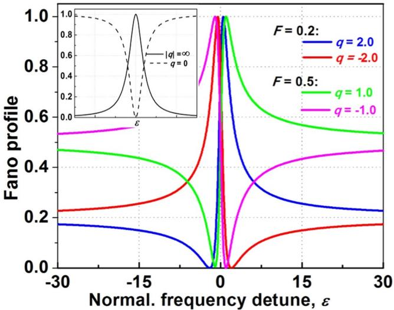  
Figure 1. Fano profles with the formula $F ^ { * } ( \varepsilon + q ) ^ { 2 } / ( \varepsilon ^ { 2 } + 1 )$ for various values of the asymmetry factor q. Te Ffactor is chosen for maximum response of 1. Te special cases are shown in the inset (Lorentzian lineshapes).

## Computational Setup

Te linear and nonlinear characteristics of the proposed structures were carried out using the fnite-diference time-domain (FDTD) method combined with perfectly matched layers (PML), as implemented in the MEEP sofware package with subpixel smoothing for increased accuracy30–32.

In general, the Fano resonant lineshape in the photonic system $^ { 2 , 1 7 }$ is given:

$$
R ( \varepsilon ) = F \frac { ( \varepsilon + q ) ^ { 2 } } { 1 + \varepsilon ^ { 2 } }\tag{1}
$$

where $\varepsilon = 2 \ : \frac { \omega - \omega _ { o } } { r } ; q$ and F are the asymmetric and constant factors; $\omega _ { \mathrm { o } }$ and Γ are resonant frequency and linew-Γidth at half-maximum, respectively. Te $Q \mathrm { \cdot }$ -factor is defned by the ratio between $\omega _ { \mathrm { o } }$ and Γ. Equation (1) has seen widespread use in Fano resonance photonics. It suggests that there is a sharp transition from the total transmission to refection supplied by this resonance.

Figure 1 shows the Fano profles according to Eq. (1) for several q-factors. Te F-factor is chosen for maximum response of unity. Te lineshapes for special q-factors are shown in the inset. $\mathrm { A } s  q   \infty$ , the transition to the continuum is too weak, therefore, the lineshape is entirely determined by the transition through the discrete state only with the standard Lorentzian. As $q = 0 ,$ , it describes a symmetric dip, which are called the inverted Lorentzian lineshapes. Illustrated in Fig. 1, the degree and asymmetry of Fano lineshape depend on the q-factor. For $| q | = 1$ , the resonant frequency is located exactly at half the distance between the peak (maximum response) and the dip (the minimum response). In addition, the reversed Fano lineshape is also plotted and the correspond ing q-factor changes sign. As a consequence, the amplitude and sign of q-factor hold signifcant implications for various photonic devices and structures, such as high Q-factor flters, refectors, lasers, detectors, sensors, as well as switching/bistability.

We present the following numerical results to demonstrate the validity and general applicability of Fano resonance in the MDG structure depicted in $\mathrm { F i g . } 2 ( \mathrm { a } )$ . It is composed of identically alternate layers of ${ \mathrm { A s } } _ { 2 } { \mathrm { S } } _ { 3 }$ $( n _ { o } = 2 . 3 8 ) ^ { 3 3 }$ and $\mathrm { S i O } _ { 2 }$ with thickness of $t = N ^ { * } ( \breve { d } _ { \mathrm { H } } + d _ { \mathrm { L } } )$ ) for the structure, where N are the repetitive identical bilayers of ${ \mathrm { A s } } _ { 2 } { \mathrm { S } } _ { 3 }$ and $\mathrm { S i O } _ { 2 } ,$ and $d _ { \mathrm { H } }$ and $d _ { \mathrm { L } }$ are the thickness of ${ \mathrm { A s } } _ { 2 } { \mathrm { S } } _ { 3 }$ and $\mathrm { S i O } _ { 2 }$ layers, respectively. If N is an odd number of layers, there is an extra ${ \mathrm { A s } } _ { 2 } { \mathrm { S } } _ { 3 }$ or $\mathrm { S i O } _ { 2 }$ layer so the standard arrangement is with the ${ \mathrm { A s } } _ { 2 } { \mathrm { S } } _ { 3 }$ or $\mathrm { S i O } _ { 2 }$ layers being the frst and last layer. Te periodicity and width of the grating structure are P and w, respectively. A transverse electric (TE) polarized normally incident plane wave means the electric feld is parallel to the strip or along the x direction. Perfectly matched layers are set for the top and bottom sides (z direction) while in the y direction periodic boundary conditions are applied30. In our design, the optical thicknesses of $\mathrm { A s } _ { 2 } \mathrm { S } _ { 3 }$ and $\mathrm { S i O } _ { 2 }$ layers are chosen to satisfy the quarter-wavelength condition, that means $\bar { n _ { \mathrm { H } } } ^ { * } d _ { \mathrm { H } } = { n _ { \mathrm { L } } } ^ { * } d _ { \mathrm { L } } = \lambda _ { \mathrm { c e n t } } / 4 ,$ , where $n _ { \mathrm { H } }$ and $n _ { \mathrm { L } }$ are the refractive indices of ${ \mathrm { A s } } _ { 2 } { \mathrm { S } } _ { 3 }$ and $\mathrm { S i O } _ { 2 } ,$ respectively. In calculations, the center wavelength $\lambda _ { \mathrm { c e n t e r } } { = } 1 5 5 0 \mathrm { n m }$ $d _ { \mathrm { H } } = 1 6 2 . 8 \mathrm { n m } .$ , and $d _ { \mathrm { L } } = 2 6 7 . 2$ nm are used.

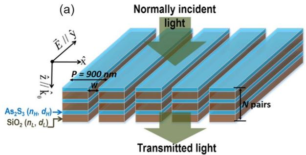

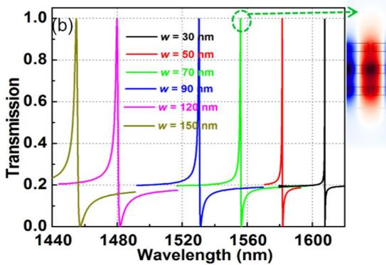

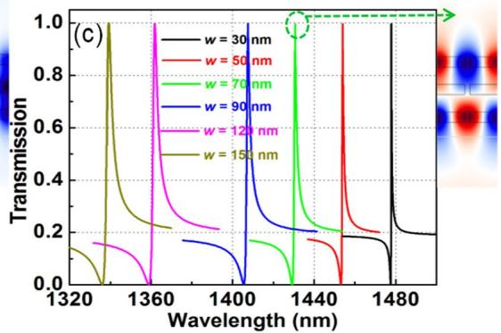  
Figure 2. (a) Multilayer nonlinear dielectric grating structure with normally incident light. Te structure consists of N-pair of bilayer $\mathrm { A s } _ { 2 } \mathrm { S } _ { 3 } / \mathrm { S i O } _ { 2 }$ gratings; the thickness of ${ \mathrm { A s } } _ { 2 } { \mathrm { S } } _ { 3 }$ and $\mathrm { S i O } _ { 2 }$ are set at $n _ { \mathrm { H } } { } ^ { * } d _ { \mathrm { H } } { = } n _ { \mathrm { L } } { } ^ { * } d _ { \mathrm { L } } { = } \lambda _ { \mathrm { c e n t e r } } { \bar { / } } 4 ,$ , where the center wavelength $\bar { \lambda } _ { \mathrm { c e n t e 1 } }$ is 1550 nm; $( n _ { \mathrm { H } } , d _ { \mathrm { H } } )$ and $( n _ { \mathrm { L } } , d _ { \mathrm { L } } )$ are the refractive index and thickness of ${ \mathrm { A s } } _ { 2 } { \mathrm { S } } _ { 3 }$ and $\mathrm { S i O } _ { 2 }$ layers, respectively. Te periodicity and width of gratings are $P$ $( P { = } 9 0 0 \mathrm { n m } )$ and w, respectively; where (b) and (c) represent the enlarged regions of long and short resonances, respectively for $N = 3 .$ . Te simulations alongside (b) and (c) show feld distribution at resonant peaks. TE polarization in which the electric-feld is along to the strip of gratings, is used.

## Results and Discussion

First, we set N = 3 pairs of $\mathrm { A s } _ { 2 } \mathrm { S } _ { 3 } / \mathrm { S i O } _ { \it 4 }$ layers. Te photonic band gap is obtained by using the plane-wave expansion method34. Te calculated results show that the MDG structure has a TE band gap with the wave vector component along the z direction at $0 . 3 7 6 < P / \lambda < 0 . 7 8 6$ . Indeed, with the periodicity of gratings $P { = } 9 0 0 \mathrm { n m }$ , there exists the photonic TE band gap from 1145 nm to 2394 nm, in which the center wavelength 1550 nm is located in this band gap.

Te transmission spectra of TE-polarized light at normal incidence for several grating widths w from 30 nm to 150 nm, when $N = 3$ pairs of $\mathrm { A s } _ { 2 } \mathrm { \bar { S _ { 3 } } / S i O } _ { 2 }$ layers are calculated as shown in Fig. 2(b,c). Tere exist two Fano resonances within the interested wavelength regimes, which are associated with the guided-mode resonances in the MDGs, enhanced by the photonic band gap efect along the z direction, due to 3 pairs of $\mathrm { A s } _ { 2 } \mathrm { S } _ { 3 } / \mathrm { S i O } _ { 2 }$ layers. Te long and short resonant spectra from 1460 nm to 1610 nm and from 1340 nm to 1480 nm are shown in Fig. $2 ( \mathrm { b , c } ) ,$ which correspond to the $\mathrm { \bar { T E } } _ { 0 } -$ like and $\mathrm { T E } _ { 1 } \cdot$ -like modes, respectively. Te other TE-like transmission spectra and feld profles, such as $\mathrm { T E } _ { 2 } .$ -like, $\mathrm { T E } _ { 3 } – \mathrm { l i k e } , \ldots$ modes, depending on the number of layers, $N ,$ whose characteristics are not shown here (see Supporting Information, Fig. S1 and Table S1). Te $\mathrm { T E } _ { 2 }$ resonant lineshape is similar to the $\mathrm { T E } _ { 0 }$ mode (same sign of q-factor). In addition, Q-factor of $\mathrm { T E } _ { 2 }$ mode is smaller than that of $\mathrm { T E } _ { 0 }$ mode. Similarly, with the $\mathrm { T E } _ { \Xi }$ -like mode, it has similar lineshape and Q-factor smaller than TE -like mode. Terefore, we ignored $\mathrm { T E } _ { 2 ^ { - } }$ and $\mathrm { T E } _ { 3 }$ -like modes in switching/bistability discussion. Te analytical theory of the generated high Fano resonant modes has been reported previously35 and is not discussed in detail here. As it is shown, the increase of grating width w makes the resonance shifs to the short wavelength and the Q-factor decreases. Te spectral resonances show that the side band degrees of Fano lineshapes do not change; it even shows that the linewidths and peaks of resonances change when the grating widths change. In addition, the lineshapes of long and short resonances are reversible, which means that their q-factors show the opposite signs. Te feld profles at long and short resonant peaks are shown in the insets, they spread along the slabs and exhibit coupling between the guided-modes and external radiations. Te linear characteristics of the Fano resonances in case N = 3 of the long and short resonances for several grating widths w are summarized in Table 1.

<table><tr><td rowspan=1 colspan=1>Grating width, w (nm)</td><td rowspan=1 colspan=1>30</td><td rowspan=1 colspan=1>50</td><td rowspan=1 colspan=1>70</td><td rowspan=1 colspan=1>90</td><td rowspan=1 colspan=1>120</td><td rowspan=1 colspan=1>150</td></tr><tr><td rowspan=1 colspan=7>Long resonance</td></tr><tr><td rowspan=1 colspan=1>F-factor</td><td rowspan=1 colspan=1>0.196</td><td rowspan=1 colspan=1>0.193</td><td rowspan=1 colspan=1>0.191</td><td rowspan=1 colspan=1>0.190</td><td rowspan=1 colspan=1>0.189</td><td rowspan=1 colspan=1>0.188</td></tr><tr><td rowspan=1 colspan=1>Asym. factor $( q { \mathrm { - f a c t o r } } )$ </td><td rowspan=1 colspan=1>2.04</td><td rowspan=1 colspan=1>2.05</td><td rowspan=1 colspan=1>2.06</td><td rowspan=1 colspan=1>2.07</td><td rowspan=1 colspan=1>2.08</td><td rowspan=1 colspan=1>2.09</td></tr><tr><td rowspan=1 colspan=1>Resonant peak, λ (nm)</td><td rowspan=1 colspan=1>1607.7</td><td rowspan=1 colspan=1>1581.8</td><td rowspan=1 colspan=1>1556.0</td><td rowspan=1 colspan=1>1530.5</td><td rowspan=1 colspan=1>1480.0</td><td rowspan=1 colspan=1>1455.3</td></tr><tr><td rowspan=1 colspan=1>Quality factor (Q-factor)</td><td rowspan=1 colspan=1>17,647</td><td rowspan=1 colspan=1>6,430</td><td rowspan=1 colspan=1>3,926</td><td rowspan=1 colspan=1>2,039</td><td rowspan=1 colspan=1>1,009</td><td rowspan=1 colspan=1>772</td></tr><tr><td rowspan=1 colspan=7>Short resonance</td></tr><tr><td rowspan=1 colspan=1>F-factor</td><td rowspan=1 colspan=1>0.185</td><td rowspan=1 colspan=1>0.187</td><td rowspan=1 colspan=1>0.189</td><td rowspan=1 colspan=1>0.191</td><td rowspan=1 colspan=1>0.192</td><td rowspan=1 colspan=1>0.193</td></tr><tr><td rowspan=1 colspan=1>Asym. factor (q-factor)</td><td rowspan=1 colspan=1>-2.09</td><td rowspan=1 colspan=1>-2.08</td><td rowspan=1 colspan=1>-2.07</td><td rowspan=1 colspan=1>-2.06</td><td rowspan=1 colspan=1>-2.05</td><td rowspan=1 colspan=1>-2.04</td></tr><tr><td rowspan=1 colspan=1>Resonant peak, λb (nm)</td><td rowspan=1 colspan=1>1477.8</td><td rowspan=1 colspan=1>1453.9</td><td rowspan=1 colspan=1>1430.4</td><td rowspan=1 colspan=1>1407.0</td><td rowspan=1 colspan=1>1361.5</td><td rowspan=1 colspan=1>1338.5</td></tr><tr><td rowspan=1 colspan=1>Quality factor (Q-factor)</td><td rowspan=1 colspan=1>4,983</td><td rowspan=1 colspan=1>2,046</td><td rowspan=1 colspan=1>1,222</td><td rowspan=1 colspan=1>860</td><td rowspan=1 colspan=1>609</td><td rowspan=1 colspan=1>544</td></tr></table>

Table 1. Linear characteristics of 3-pairs of $\mathrm { A s } _ { 2 } \mathrm { S } _ { 3 } / \mathrm { S i O } _ { 2 }$ grating layers for several grating widths w.

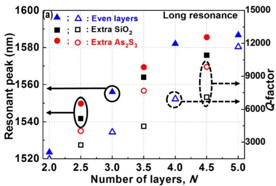

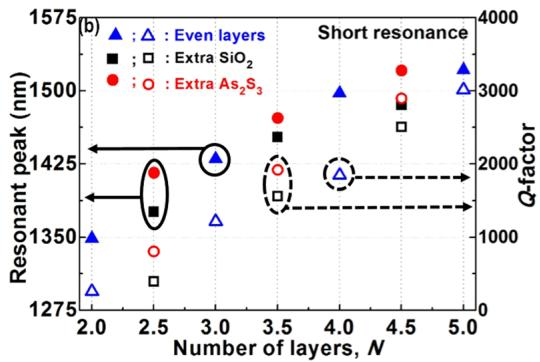  
Figure 3. Resonant peaks and Q-factors of the structure as depicted in Fig. 2(a) for several number of layers N. (a) and (b) are with long and short resonances, respectively. Te grating width w = 70 nm is used for these calculations. Te solid (square, triangle, and circle) and hollow (square, triangle, and circle) dots are the resonant peaks and Q-factors, respectively.

Te resonant peak $\lambda _ { \mathrm { o } } ,$ constant factor F, quality factor Q, and asymmetric factor q are extracted by ftting Eq. (1) to the numerical spectrum. It is seen that Fano formulas mostly match the FDTD simulation results around the resonances. Te interesting feature here is the similar q-factors as a given number of layers. For the grating widths w of 30 nm and 150 nm and long resonance, the Fano resonant parameters are $( \lambda _ { \mathrm { o } } = 1 6 0 7 . 7$ nm, $\mathbf { \bar { Q } } = 1 \bar { 7 } , 6 4 9 .$ , and $q = 2 . 0 4 )$ and $( \lambda _ { \mathrm { o } } = 1 4 5 5 .$ 3nm, $\mathbf { \bar { Q } } = 7 7 2 ,$ and $q = 2 . 0 9 )$ , respectively. Whereas, for the short resonance, these are $( \lambda _ { \mathrm { o } } { = } 1 4 7 7 . 8 $ nm, $Q = 4 { , } 9 8 3$ 3, and $q = - 2 . 0 8 )$ and $\textstyle \left( \lambda _ { \mathbf { o } = } 1 3 3 8 . 5 \right.$ nm, $Q = 5 4 4$ , and $q = - 2 . 0 4 )$ for the grating widths $w = 3 0$ nm and 150 nm, respectively.

We investigated and found that the Fano lineshapes were reproducible and readily controlled via the number of layers N and the grating width w, demonstrating the robustness of the suggested structure. With the given grating width w of 70 nm and for the high number of layers, the $\mathrm { T } _ { 0 } \mathrm { - } \mathrm { l i k e }$ (long resonance) and T -like (short resonance) mode linewidths are generally narrower as shown in Fig. S2; therefore, the longer optical path leads to higher Q-factors. In addition, increasing the efective index of the slab caused redshifs in the resonance. Te resonant peaks and Q-factors of the long and short resonances for several number of layers N were evaluated using Fano lineshapes and plotted in Fig. 3. When the number of layers N increase, redshifs in resonance, higher Q-factor, and lower sidebands are obtained. For instance, with the number of layers N of 3 and 5, and grating width w of 70 nm, the resonant peak and the corresponding Q-factor are $( \lambda _ { \mathrm { o } } = \mathrm { i } 5 5 6 . 0$ nm, $Q = 3 , 9 2 6 )$ and $( \bar { \lambda _ { \mathrm { o } } } = 1 5 8 6 . 7$ nm, $Q = 1 0 , 6 8 4 )$ for long resonance, respectively. Whereas, for the short resonance, these are (λ = 1430.4 nm, $Q = 1 , 2 2 2 )$ and $( \lambda _ { \mathrm { o } } = 1 5 \bar { 2 } 1 . 5$ nm, $Q = 2 , 7 1 1 )$ ) for the number of layers N of 3 and 5 and grating width w of 70 nm, respectively. Tese mode profles and the resonant parameters of other modes are also shown in Table S2.

For the results that we have shown above, the number of layers N was an integer. However, in the following calculation, we have studied the Fano lineshapes with a diferent type of N. With $\bar { N } { = } 3 . 5$ pairs, which means the structure consists of 3 pairs of $\mathrm { A s } _ { 2 } \mathrm { S } _ { 3 } / \mathrm { S i O } _ { 2 }$ and an extra layer of ${ \mathrm { A s } } _ { 2 } { \mathrm { S } } _ { 3 }$ or $\mathrm { S i O } _ { 2 }$ layer. Te dependence of resonant peaks and Q-factors on the grating widths w for the structure are shown in Fig. 4(a,b), respectively. As seen in these fgures, similar side band degrees or q-factors have been observed. In addition, the resonant peaks of the long and short resonances are within the range of \~1300 nm to \~1650 nm and Q-factors are within the range of 100 to 20,000 depending on the grating width w. In the insets of Fig. 4(a,b), the Fano lineshapes at resonant peaks associated with the types of structures for both long (noted by blue curves) and short resonances (noted by red curves). Te insets of Fig. 4(a,b) show the feld distributions at resonant peaks. Tey have the same behaviors as those shown in Fig. 2(b,c). Te resonant peaks shif to the short wavelengths and Q-factors decrease as the grating width w increases. Tese are in the same tendencies as the structures of $\stackrel { \cdot } { N } = 3$ pairs. With the grating width w of 70 nm, the resonant peaks and the corresponding Q-factors for various odd numbers of N were shown in Fig. 3.

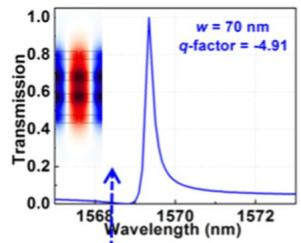

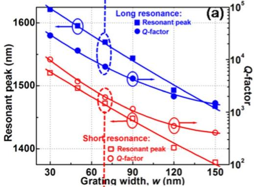

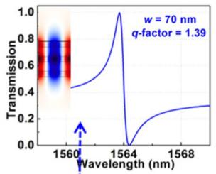

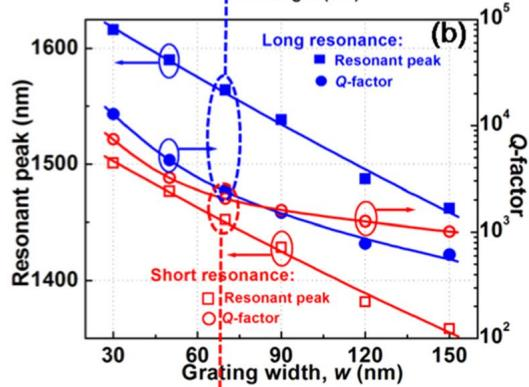

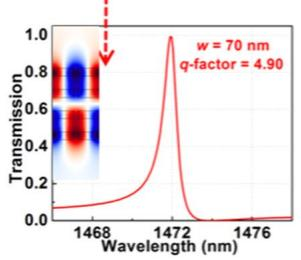

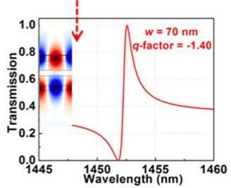  
Figure 4. Transmission spectra of the structure as depicted in Fig. 2(a) with ${ N = 3 . 5 ; ( \mathbf { a } ) }$ and (b) show the dependence of resonant peaks and Q-factors on the grating widths w of an extra ${ \mathrm { A s } } _ { 2 } { \mathrm { S } } _ { 3 }$ and SiO layers, respectively. Te Fano resonant lineshapes for the grating width $w = 7 0$ nm are shown in the insets. Te square and circle dots are the data points. Te lines are the ftting curves.

In optical switching/bistability applications36,37, due to the optical Kerr nonlinear efect, the refractive index of ${ \mathrm { A s } } _ { 2 } { \mathrm { S } } _ { 3 }$ can be modeled as $n ( I ) = n _ { 0 } + n _ { 2 } { ^ * I }$ , where $n _ { 0 } , n _ { 2 } ,$ and I are the linear refractive index, Kerr coefcient, and intensity of incident light, respectively. In the nonlinear calculations, the third-order nonlinearity of ${ \mathrm { A } s } _ { 2 } { S } _ { 3 }$ is $n _ { 2 } { = } 3 . 1 \dot { 2 } \times 1 0 ^ { - 1 8 } \mathrm { m } ^ { 2 } / \mathrm { W } ^ { 3 8 }$ . Te refractive index increases following the intensity of the incident light, the resonant wavelength shifs to longer wavelength, so that the operating wavelength should be larger than the resonant wavelength. We investigate here the switching/bistability characteristics based on Fano resonances of the structure depicted in Fig. 2(a) with $N = 3$ pairs for both long and short resonances. Te fux intensity was calculated by taking the time-averaged Poynting vector, which is an integral of $\begin{array} { r } { \langle \mathrm { S } _ { \mathrm { m } } \rangle = \mathrm { R e } \big ( \frac { 1 } { 2 } \mathrm { E } _ { \mathrm { m } } \times \mathrm { H } _ { \mathrm { m } } ^ { \ast } \big ) . } \end{array}$ , where $\mathrm { { S } } _ { \mathrm { { m } } } , \mathrm { { E } } _ { \mathrm { { m } } } ,$ and $\mathrm { H } _ { \mathrm { m } }$ are the Poynting vector, electric feld, and magnetic feld phasors, respectively with the direction perpendicular to the output plane, supported by MEEP program32. Figure 5 shows the dependence of transmission (ratio between the transmitted and incident intensities) on the incident intensity of the optical switching/bistability for the long (Fig. 5(a,b)) and short (Fig. 5(c,d)) resonances. For the long resonance, the operating wavelengths are chosen at resonant dip and 10% of transmission as shown in the insets of Fig. 5(a,b).

Te switching/bistability behaviors with one switching point are obtained. Te lower branch (blue curve) is observed by varying the incident intensity of the CW source starting from low intensity. Following the lower branch, as incident intensity increases, the transmission also increases; but at the critical incident intensity the transmission increases abruptly, which is referred to the switching intensity. Te higher branch (red curve) is observed by considering the modulated incident signal at high intensity (above the switching intensity) as the seed, and then the incident intensity decreasing slowly. When the incident intensity decreases over the switching intensity, the transmission sustains in the higher branch due to the feedback of the Kerr nonlinear elements36,37. It jumps down abruptly to the low-transmission state when the transmission reaches a unity. As shown in Fig. 5(a,b), with the operating wavelength at 10% of transmission, blue (arrows pointing up/right) and red curves (arrows pointing lef/down), it shows that the bistability behaviors and the switching intensities are 0.50 MW∕cm2 and 1178.56 MW/cm2 for grating widths w = 30 nm and 150 nm, respectively. Whereas with the operating wavelengths at the resonant dips, the bistability behaviors have not occurred (black curves, on lef) even the switching points at $0 . 0 4 \mathrm { M W } / \mathrm { c m } ^ { 2 }$ and 50.35 MW/cm2 of input intensities and high contrasts are observed for grating widths w = 30 nm and 150 nm, respectively. When the operating wavelength moves away from the resonant dip, the switching intensity is higher and the bistability region is broader. Tis is attributed to the wavelength detuning, which implies a broader detuning bandwidth and, thus, a higher resonance shif amount is required to change the state16. For the short resonance, the operating wavelength is chosen at 1/e transmission as shown in the insets of Fig. $5 ( \mathrm { c } , \mathrm { d } )$ . In all cases, optical bistable switching behavior is clearly formed. Te higher branch (blue curve, with S1) and lower branch (red curve, with S2) are observed by increasing and decreasing the incident intensities starting from low and high intensities, respectively. In fact, there exists two switching points of the optical bistable switching behaviors at the increasing (S1) and decreasing (S2) input intensities. Te presence of S1 and S2 and the mechanism of this bistability behavior in these cases were discussed $\mathrm { i n } ^ { 1 6 } .$ In each bistable curve, the switching intensity can be estimated as the input intensity for which the transmission decreases abruptly in the blue and red curves. For example, in Fig. $5 ( \mathrm { c } , \mathrm { d } )$ , the estimated switching intensities are 25.07 MW∕cm2 and 4757.90 MW∕cm2 (at point S1) and 10.15 MW∕cm2 and 2032.77 MW∕cm2 (at point S2) for the grating widths $w = 3 0$ and 150 nm, respectively. Te switching/bistability characteristics for the operating wavelength at 50% transmission of the short resonance are not shown here, because they do not show the bistability behaviors. Other grating widths (w = 50 nm, 70 nm, 90 nm, and 120 nm), whose switching/bistability behaviors for the operating wavelengths at resonant dip and 10% transmission for long resonance and 1/e for short resonance (not shown here) exhibit the same tendency.

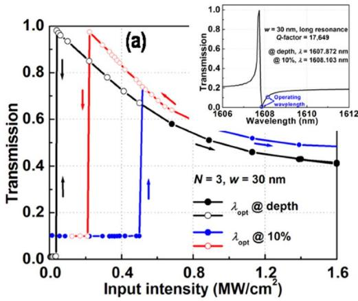

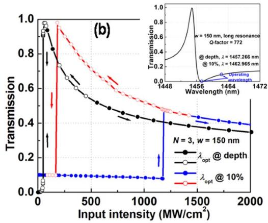

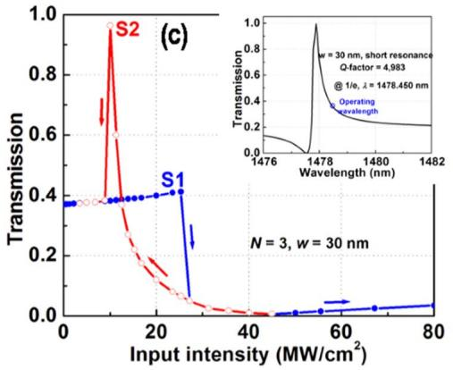

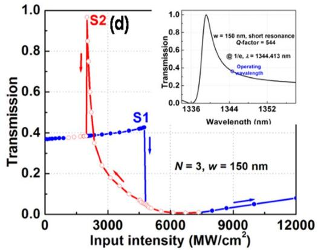  
Figure 5. Optical switching/bistability behaviors in the nonlinear 3-pair-grating layers for grating widths w of 30 nm (a and c) and 150 nm (b and d) with operating wavelengths in the long (a and b) and short (c and d) resonances.

Figure 6 shows the calculated switching intensity (in the units of $\mathrm { M W } / \mathrm { c m } ^ { 2 }$ and 1/n ) for various Q-factors. Te ftting equation and the line for the switching intensity are also noted. It is clearly seen that the switching intensities decrease roughly as $1 / { Q } ^ { 2 . 4 }$ and $1 / Q ^ { 2 . 3 }$ for bistability and switching behaviors, respectively. It is well known that the switching intensities of an established Lorentzian lineshape optical bistable device in photonic crystal slabs or slab waveguide gratings scale as $1 / Q ^ { 2 } \ ^ { 3 9 , 4 0 }$ , where $Q = \lambda _ { \mathrm { o } } / \Delta \bar { \lambda } , \lambda _ { \mathrm { c } }$ and Δλ are the resonant wavelength and full-width at half-maximum, respectively. Tis implies that the switching intensity based on Fano resonances decrease faster than that of the Lorentzian lineshapes. If the nonlinear characteristics of the Fano resonances are similar to that of a Lorentzian lineshape, the normalized switching intensity should be proportional to the $1 / ( \Delta \lambda ) ^ { 2 }$ . Tis implies that the switching/bistability behavior of the Fano resonances is diferent from that of a Lorentzian lineshape and the switching intensity of the Fano resonances cannot be simply estimated from its 1/ (Δλ)2 . Since the optical feld is distributed over grating in the Fano resonant structure in contrast to the single grating-based Lorentzian lineshape. It may be advantageous in terms of prevention of material breakdown or unwanted nonlinear efects.

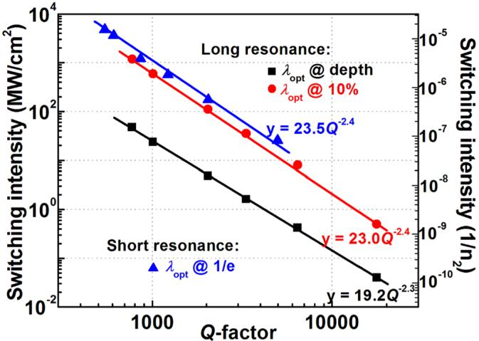  
Figure 6. Optical incident intensity for the switching of optical switching/bistability devices based on 3-pairgrating layers for various Q-factors. Te solid lines are ftting with their noted equations.

As results shown above, the signifcant advantage of the multilayer grating structure is that the Q- and q-factors can be tuned by tailoring the number of layers and the grating widths. Fig. S3 (see Supporting Information) shows the optical incident intensity for the switching of optical switching/bistability for various numbers of layers N for long (TE ) and short (TE ) resonances. Tese results can be estimated by combining the dependences of Q-factor on the number of layers N and of switching intensity on the Q-factor as shown in Figs 3 and 6, respectively. Note that only grating width w of 70 nm and the operating wavelengths at depth and 1/e of transmissions corresponding to the positive and negative of q-factors, respectively are shown here. Te switching intensity decreases as number of layers N increases. Shown in Fig. S3(a), the switching intensity decreased almost by an order of magnitude for increased number of layers N from 3 to 5 for the long resonance. Whereas, the switching intensity is reduced 11 times when 5-pair device is compared to 3-pair grating structure in the same working condition for short resonance as shown in Fig. S3(b).

## Conclusion

In conclusion, the Fano resonance manipulation in the multilayer dielectric gratings has been discussed highlighting the quality and asymmetric factors of the optical spectrum. Te investigated structure shows a possibility for the switching/bistability behaviors in which the switching intensity reduction dependency on a quality factor in a quantitative way can be obtained. We believe that our design and numerical investigation have been a useful guideline for the implementation of Fano resonant confgurations for applications in optical devices, especially in switching/bistability.

## References

1. Fano, U. Efects of confguration interaction on intensities and phase shifs. Phys. Rev. 124, 1866–1878 (1961).

2. Limonov, M. F., Rybin, M. V., Poddubny, A. N. & Kivshar, Y. S. Fano resonances in photonics. Nat. Photonics 11, 543–554 (2017).

3. Chung, C.-H. & Lee, T.-H. Tunable Fano-Kondo resonance in side-coupled double quantum dot systems. Phys. Rev. B 82, 085325 (2010).

4. Lee, W.-R., Kim, J. U. & Sim, H.-S. Fano resonance in a two-level quantum dot side-coupled to leads. Phys. Rev. B 77, 033305 (2008).

5. Katsumoto, S. Coherence and spin efects in quantum dots. J. Phys.: Condens. Matter 19, 233201 (2007).

6. Mork, J., Chen, Y. & Heuck, M. Photonic crystal Fano laser: Terahertz modulation and ultrashort pulse generation. Phys. Rev. Lett. 113, 163901 (2014).

7. Yu, Y. et al. Fano resonance control in a photonic crystal structure and its application to ultrafast switching. Appl. Phys. Lett. 105, 061117 (2014).

8. Mario, L. Y., Darmawan, S. & Chin, M. K. Asymmetric Fano resonance and bistability for high extinction ratio, large modulation depth, and low power switching. Opt. Express 14, 12770–12781 (2006).

9. Chua, S.-L. et al. Low-threshold lasing action in photonic crystal slabs enabled by Fano resonances. Opt. Express 19, 1539–1562 (2011).

10. Nozaki, K. et al. Ultralow-energy and high-contrast all-optical switch involving Fano resonance based on coupled photonic crystal nanocavities. Opt. Express 21, 11877–11888 (2013).

11. D’Aguanno, G., de Ceglia, D., Mattiucci, N. & Bloemer, M. J. All-optical switching at the Fano resonances in subwavelength gratings with very narrow slits. Opt. Lett. 36, 1984–1986 (2011).

12. Shuai, Y. et al. Double-layer Fano resonance photonic crystal flters. Opt. Express 21, 24582–24589 (2013).

13. Nguyen, V. A., Ngo, Q. M. & Le, K. Q. Efcient color flters based on Fano-like guided-mode resonances in photonic crystal slabs. IEEE Photon. J. 10, 2700208 (2018).

14. Chen, L. et al. Polarization and angular dependent transmissions on transferred nanomembrane Fano flters. Opt. Express 17, 8396–8406 (2009).

15. Boutami, S. et al. Broadband and compact 2-D photonic crystal refectors with controllable polarization dependence. IEEE Photon. Technol. Lett. 18, 835–837 (2006).

16. Ngo, Q. M., Le, K. Q., Vu, D. L. & Pham, V. H. Optical bistability based on Fano resonances in single- and double-layer nonlinear slab waveguide gratings. J. Opt. Soc. Am. B 31, 1054–1061 (2014).

17. Ngo, Q. M. et al. Numerical investigation of tunable Fano-based optical bistability in coupled nonlinear gratings. Opt. Communications 338, 528–533 (2015).

18. Hayashi, S. et al. Light-tunable Fano resonance in metal-dielectric multilayer structures. Scientifc Reports 6, 33144 (2016).

19. Mandel, I. M., Golovin, A. B. & Crouse, D. T. Fano phase resonances in multilayer metal-dielectric compound gratings. Phys. Rev. A 87, 053847 (2013).

20. Wang, J. et al. Double Fano resonances due to interplay of electric and magnetic plasmon modes in planar plasmonic structure with high sensing sensitivity. Opt. Express 21, 2236–2244 (2013).

21. Giannini, V. et al. Fano resonances in nanoscale plasmonic systems: A parameter-free modeling approach. Nano Lett. 11, 2835–2840 (2011).

22. Lee, K.-L., Wu, S.-H., Lee, C.-W. & Wei, P.-K. Sensitive biosensors using Fano resonance in single gold nanoslit with periodic grooves. Opt. Express 19, 24530–24539 (2011).

23. Yoon, J. W. & Magnusson, R. Fano resonance formula for lossy two-port systems. Opt. Express 21, 17751–17759 (2013).

24. Cao, T. et al. Controlling lateral Fano interference optical force with Au-Ge Sb Te hybrid nanostructure. ACS Photon. 3, 1934–1942 (2016).

25. Luk’yanchuk, B. et al. Te Fano resonance in plasmonic nanostructures and metamaterials. Nat. Mater. 9, 707–715 (2010).

26. Cao, T. et al. Fast tuning of Fano resonance in metal/phase-change materials/metal metamaterials. Opt. Mater. Express 4, 1775–1786 (2014).

27. Cao, T. et al. Fast tuning of double Fano resonance using a phase-change metamaterial under low power intensity. Scientifc Reports 4(4463), 1–9 (2014).

28. Cao, T., Zhang, L., Xiao, Z.-P. & Huang, H. Enhancement and tunability of Fano resonance in symmetric multilayer metamaterials at optical regime. J. Phys. D: Appl. Phys. 46, 395103 (2013).

29. Cao, T. & Zhang, L. Enhancement of Fano resonance in metal/dielectric/metal metamaterials at optical regime. Opt. Express 21, 19228–19239 (2013).

30. Tafove, A. Computational electrodynamics (Artech house, 1995).

31. Farjadpour, A. et al. Improving accuracy by subpixel smoothing in the fnite-diference time domain. Opt. Lett. 31, 2972–2974 (2006).

32. Oskooi, A. F. et al. MEEP: A fexible free-sofware package for electromagnetic simulations by the FDTD method. Computer Phys. Communications 181, 687702 (2010)

33. Madden, S. J. et al. Long, low loss etched As2S3 chalcogenide waveguides for all-optical signal regeneration. Opt. Express 15, 14414–14421 (2007).

34. Johnson, S. G. & Joannopoulos, J. D. Block-iterative frequency-domain methods for Maxwell’s equations in a planewave basis. Opt. Express 8, 173–190 (2001).

35. Mandel, I. M., Golovin, A. B. & Crouse, D. T. Analytical description of the dispersion relation for phase resonances in compound transmission gratings. Phys. Rev. A 87, 053833 (2013).

36. Gibbs, H. M. Optical Bistability: Controlling light with light (Academic, 1985).

37. Saleh, B. E. A. & Teich, M. C. Fundamentals of photonics: Chapter 21-Photonic switching and computing, 832–873 (John Wiley & Sons, Inc. 1991).

38. Laniel, J. M., Ho, N. & Vallee, R. Nonlinear-refractive-index measurement in As S channel waveguides by asymmetric self-phase modulation. J. Opt. Soc. Am. B 22, 437–445 (2005).

39. Ngo, Q. M., Kim, S., Song, S.-H. & Magnusson, R. Optical bistable devices based on guided-mode resonance in slab waveguide gratings. Opt. Express 17, 23459–23467 (2009).

40. Ngo, Q. M., Le, K. Q. & Lam, V. D. Optical bistability based on guided-mode resonances in photonic crystal slabs. J. Opt. Soc. Am. B 29, 1291–1295 (2012).

## Acknowledgements

Tis research is funded by Vietnam National Foundation for Science and Technology Development (NAFOSTED) under grant number “103.03-2017.02”.

## Author Contributions

T.T.H. has contributed to the simulation, preparation of the figures, and writing of the paper, Q.M.N. has proposed the model and design, contributed to the simulation, writing of the paper, and supervised the entire work, H.P.T.N. and D.L.V. have contributed to the comments on the model, design, and paper.

## Additional Information

Supplementary information accompanies this paper at https://doi.org/10.1038/s41598-018-34787-9.

Competing Interests: Te authors declare no competing interests.

Publisher’s note: Springer Nature remains neutral with regard to jurisdictional claims in published maps and institutional afliations.

(cc Open Access This article is licensed under a Creative Commons Attribution 4.0 International BY License, which permits use, sharing, adaptation, distribution and reproduction in any medium or format, as long as you give appropriate credit to the original author(s) and the source, provide a link to the Creative Commons license, and indicate if changes were made. Te images or other third party material in this article are included in the article’s Creative Commons license, unless indicated otherwise in a credit line to the material. If material is not included in the article’s Creative Commons license and your intended use is not permitted by statutory regulation or exceeds the permitted use, you will need to obtain permission directly from the copyright holder. To view a copy of this license, visit http://creativecommons.org/licenses/by/4.0/.

© Te Author(s) 2018
