OPEN

Q Check for updates

# Photonic eigenmodes and transmittance of fnite‑length 1D cholesteric liquid crystal resonators

Jaka Zaplotnik1,2, Urban Mur1 , Deepshika Malkar2 , Amid Ranjkesh2 , Igor Muševič1,2 & Miha Ravnik1,2\*

Cholesteric liquid crystals exhibit a periodic helical structure that partially refects light with wavelengths comparable to the period of the structure, thus performing as a one-dimensional photonic crystal. Here, we demonstrate a combined experimental and numerical study of light transmittance spectra of fnite-length helical structure of cholesteric liquid crystals, as afected by the main system and material parameters, as well as the corresponding eigenmodes and frequency eigenspectra with their Q-factors. Specifcally, we have measured and simulated transmittance spectra of samples with diferent thicknesses, birefringences and for various incident light polarisation confgurations as well as quantifed the role of refractive index dispersion and the divergence of the incident light beam on transmittance spectra. We identify the relation between transmittance spectra and the eigenfrequencies of the photonic eigenmodes. Furthermore, we present and visualize the geometry of these eigenmodes and corresponding Q-factors. More generally, this work systematically studies the properties of light propagation in a one-dimensional helical cholesteric liquid crystal birefringent profle, which is known to be of interest for the design of micro-lasers and other soft matter photonic devices.

Te major optical property of cholesteric liquid crystals (CLCs) is selective light refection1–8 due to the periodicity of their spontaneously formed helical birefringent structure. For the incidence of light along the helical axis of a CLC, a birefringent nature of LC molecules in combination with rotating nematic director results in a photonic band gap for the wavelengths, comparable to pitch p, the distance along the helical axis that corresponds to a rotation of the director of 360◦. Such band gap exists only for a circularly polarised light with the same handedness as the helix, which is strongly refected. Due to selective light refection, CLCs are 1D photonic band gap materials and allow for the implementation of tunable optical flters9–11 and isolators12, light shutters13, difractive optical devices5 and band edge lasers14–19.

Te spatially modulated birefringent structure of CLCs performs as an optical resonator, where the resonances occur due to the Bragg refection20. Lasing in such a one-dimensional periodic structure is achieved when the optical gain material—typically, a fuorescent dye—with the emission spectrum overlapping with one of the edges of the band gap is added to the system to amplify the light. When the dye molecules are illuminated by short pulses, they emit photons, which undergo the process of stimulated emission. Eventually, lasing at the frequency determined by the dye emission spectrum and periodic structure of the resonator occurs. CLC lasers are attractive for optical applications due to the ease of fabrication (i.e. the periodic structure is essentially self-assembled) and tunability21: the pitch and consequently the laser emission wavelength can be tuned via temperature22, mechanical strain23,24, external electric felds25, phototuning26, by optically inducing the material fow27 or changing the material composition28. In addition, also the emission direction can be tuned29 and defect mode lasing can be realised30,31.

1D CLC resonators have been extensively explored in the past, both experimentally and with modelling or theory. Teoretically, 1D, 2D or 3D periodic materials are studied in terms of band structures and band gaps, which are normally calculated for infnite materials without boundaries32. In practice, resonators, including 1D CLC resonators, have fnite size (i.e. fnite number of unit cells which are repeated periodically within the boundaries of the material), which signifcantly afects the photonic response. Transmittance and refection coefcients for fnite size CLC layer have been determined numerically by matrix methods33, and fnite element method34 as well as the lasing thresholds35. Similarly, numerical analyses of the efects of dielectric boundaries (substrate) on light localization, light coupling into diferent modes of the cavity, the efects of dielectric boundaries (substrate) on light localization and dependence of light localization on the CLC layer thickness have been done36,37. In $\mathrm { R e f . } ^ { 3 8 }$ it is shown that the rotatory power of cholesterics consists of two parts: one of them is related to the difraction-induced circular dichroism whereas the other one originates from the tails of the Mauguin rotation of the plane of light polarisation, in $\mathrm { R e f . } ^ { 3 9 , 4 0 }$ the density of states and in $\mathrm { R e f . } ^ { 4 1 }$ spectral and polarisation characteristics of the light passing through a CLC are analyzed. Tere has been less research done on the localized modes, which are relevant for lasing. In $\mathrm { R e f . } ^ { 4 2 }$ localized edge modes have been theoretically described and coupling into such modes has been demonstrated numerically for normal36 and oblique incidence43.

In this work, we demonstrate a combined experimental and numerical study of light transmittance spectra through fnite-length helical structure of cholesteric liquid crystals, and the corresponding eigenmodes and frequency eigenspectra. Specifcally, we have measured the transmittance spectra of samples with diferent thicknesses, birefringences and for various incident light polarisation confgurations and compared them with numerical spectra obtained by Finite-Diference Time-Domain (FDTD) method. We quantify the role of refractive index dispersion and of the divergence of the incident light beam on the transmittance spectra. Next, we numerically calculate, using the Finite-Diference Frequency-Domain (FDFD) method, the full spectrum of the (passive) resonant eigenmodes and explore their belonging quality factors. We use the numerical results to identify the relation between transmittance spectra and the eigenfrequencies of the photonic eigenmodes. Furthermore, we present and visualize the geometry of these eigenmodes and calculate the corresponding Q-factors. Compared to previous work on standing optical edge modes, solving Maxwell’s equations in the full vector eigenproblem form gives us the exact solutions for the electric feld within the cavity. Terefore, we gain an in-depth insight into the coupling between light and liquid crystal gain medium, which is essential information when orientable dies are used in lasers44,45. More generally, this work is aimed to contribute to the development of sof matter based photonic platforms for advanced manipulation and control of the fow of light.

## Results

Photonic eigenmodes and transmission spectra are explored in fnite-length cholesteric liquid crystal resonators are using complementary numerical FDTD and FDFD modelling and experiments, as described in Methods. Te cholesteric liquid crystal sample of thickness D with ordinary $n _ { o }$ and extraordinary refractive index $n _ { e }$ is confned between two equal $d _ { G }$ thick glass plates with refractive index $n _ { G } = 1 . 5 ,$ as schematically shown in Fig. 1. Te confguration of the director in the CLC sample with helical axis along x-axis can be written as ${ \bf n } ( x ) { \bf \bar { \Psi } } = ( 0 , \cos ( 2 \pi ( { \bf \bar { x } } - d _ { G } ) / p )$ , sin $\mathfrak { i } ( 2 \pi ( x - d _ { G } ) / p ) )$ ), where $\boldsymbol { p }$ is the cholesteric pitch. Te given director feld corresponds to the following dielectric tensor

$$
\underline { { \varepsilon } } _ { i j } = n _ { o } ^ { 2 } \delta _ { i j } + ( n _ { e } ^ { 2 } - n _ { o } ^ { 2 } ) n _ { i } n _ { j } ,\tag{1}
$$

where $i , j \in \{ x , y , z \} , \delta _ { i j }$ is the Kronecker delta, and $n _ { i }$ are components of the director $\mathbf { n } ( x ) .$

## CLC transmittance spectra

Light with wavelengths $n _ { o } p < \lambda < n _ { e } p$ propagating along the helical axis of a cholesteric liquid crystal is partially refected. Te circular polarisation component with the same handedness as the liquid crystal structure is refected, while the opposite polarisation is transmitted. First, we present transmittance spectra obtained by experimental measurements and FDTD numerical modelling, depending on main system parameters, including refractive indices $( n _ { o }$ and $n _ { e } ) ,$ , pitch length $( p )$ , and thickness $( D ) _ { : }$ , as well as the polarisation of the incident light. We also consider the dispersion relations of refractive indices and experimentally relevant modulation of the incident light, beyond the usual theoretical assumption of plane waves.

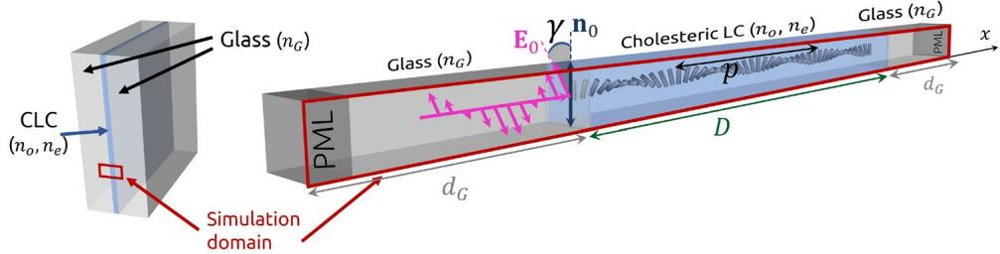  
Figure 1. Schematic of the liquid crystal geometry. CLC sample with ordinary refractive index ${ \boldsymbol { n } } _ { o } ,$ extraordinary refractive index n and pitch p is confned between two thick glass plates with refractive index $n _ { G } .$ 1D simulation domain, marked in red, consists of a CLC layer with thickness D and efectively infnite glass layers on each side, which is achieved by use of PML (perfectly matched layers). Linearly polarised light with polarisation ${ \bf E } _ { 0 }$ enters the CLC at an angle $\gamma ( \mathbf { n } _ { 0 } , \mathbf { E } _ { 0 } ) ;$ , relative to the nematic director orientation at the incident surface $\mathbf { n } _ { 0 } .$ In all simulations, the light source (the incoming light shown in pink here) lies within one of the glass plates confning the CLC.

## Role of sample thickness (for fxed pitch)

Figure 2 demonstrates the role of the fnite size of the cholesteric helical pattern, where we vary the thickness of the cholesteric cell but keep the cholesteric pitch constant, essentially varying the number of Bragg layers of the cholesteric resonator. We observe that with increasing sample thickness, the frequency range at which light is refected does not change signifcantly, but the transmittance spectrum does. Approximately half of linearly polarised light with wavelengths $n _ { o } p < \lambda < n _ { e } p$ is refected by already relatively thin structures; for example, fve pitch lengths thick $( D = 5 p )$ sample with $\Delta n = n _ { e } - n _ { o } = 0 . 3$ give transmittance $T \lesssim 0 . 6$ for the band gap wavelengths. Te spectra of light transmitted through thicker samples contain more oscillations outside the photonic band gap and appear sharper at the band edge.

## Experimentally measured spectra of diferent materials

Te wavelength range at which light is refected on a CLC is most afected by the refractive indices and the pitch length. A systematic experimental study has been performed where we have measured the spectra of transmitted unpolarised light T() for eight diferent liquid crystals with diferent nematic birefringences $\Delta n = n _ { e } - n _ { o }$ and similar pitch lengths p (see Table 1), which are shown in Fig. 3. Te bandwidths $\Delta \lambda = \lambda _ { 2 } - \lambda _ { 1 }$ measured between the edges of the fat bottom of the spectrum, as shown in the Fig. 3, linearly depend on birefringence $\Delta n .$ . Our numerical simulations and also other theoretical approaches3, 34 predict the edges of the photonic band gap at wavelengths $\lambda _ { 1 } = n _ { o } p$ and $\lambda _ { 2 } = n _ { e } p _ { : }$ , and thereby a linear relation $\Delta \bar { \lambda } / p = \Delta n$ , while in this case, the linear relation $\Delta \lambda / p \overset { \cdot } { \approx } 0 . 8 \Delta n \mathrm { h o l d s }$ . Te diference could be a consequence of a combination of several reasons: (i) Te refractive indices of nematic liquid crystals change afer a chiral dopant is added, and it is challenging to measure them afer doping, but typically, the birefringence decreases afer adding the dopant, and (ii) the refractive indices depend on the wavelength of light. In the simplifed numerical model which gives $\Delta \lambda / p = \Delta n ,$ the dispersion relations of refractive indices is neglected. Te impact of the wavelength dependence of the refractive indices on transmittance spectra is shown in Fig. 4.

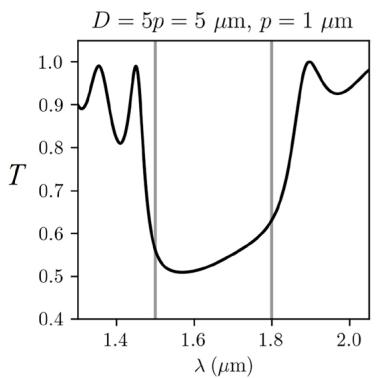

Increasing cell thickness D  
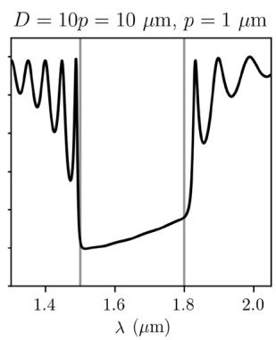

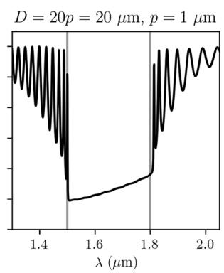

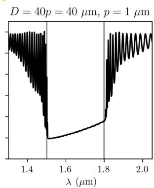  
Figure 2. Simulated transmittance spectra in diferently thick cholesteric liquid crystal cells with refractive indices $n _ { o } = 1 . 5 , n _ { e } = 1 . 8$ and pitch $p = 1 \mu \mathrm { m }$ . Te angle between the electric feld’s polarisation and the director feld at the incident surface is $\gamma ( { \bf n } _ { 0 } , { \bf E } _ { 0 } ) = 0 ^ { \circ }$ here. In all numerical simulations, only glass–CLC– glass transmission is used in calcualation, not taking into account possible refections at the external glass-air interface, possibly relevant in experiments.

<table><tr><td rowspan=1 colspan=1>LC sample</td><td rowspan=1 colspan=1> $T ^ { * } ( { } ^ { \circ } \mathbf { C } )$ </td><td rowspan=1 colspan=1>Δn</td><td rowspan=1 colspan=1> $\mathbf { C } \left( \mathbf { w t \% } \right)$ </td><td rowspan=1 colspan=1>p(nm)</td><td rowspan=1 colspan=1> $\lambda _ { 1 } \left( \mathbf { n m } \right)$ </td><td rowspan=1 colspan=1> $\lambda _ { 2 } \left( \mathbf { n m } \right)$ </td><td rowspan=1 colspan=1>Δλ(nm)</td></tr><tr><td rowspan=1 colspan=1>XV9012-A00(i)</td><td rowspan=1 colspan=1>84</td><td rowspan=1 colspan=1>0.07</td><td rowspan=1 colspan=1>1.125</td><td rowspan=1 colspan=1>335 ± 5</td><td rowspan=1 colspan=1>496</td><td rowspan=1 colspan=1>511.5</td><td rowspan=1 colspan=1>15.4</td></tr><tr><td rowspan=1 colspan=1>YTXH002(ii)</td><td rowspan=1 colspan=1>90</td><td rowspan=1 colspan=1>0.15</td><td rowspan=1 colspan=1>1.114</td><td rowspan=1 colspan=1>318 ± 5</td><td rowspan=1 colspan=1>479.2</td><td rowspan=1 colspan=1>517.8</td><td rowspan=1 colspan=1>38.5</td></tr><tr><td rowspan=1 colspan=1>YTXH004(ii)</td><td rowspan=1 colspan=1>90</td><td rowspan=1 colspan=1>0.19</td><td rowspan=1 colspan=1>1.076</td><td rowspan=1 colspan=1>329 ± 2</td><td rowspan=1 colspan=1>498.9</td><td rowspan=1 colspan=1>545.8</td><td rowspan=1 colspan=1>47.9</td></tr><tr><td rowspan=1 colspan=1>YTXH005(iv)</td><td rowspan=1 colspan=1>84</td><td rowspan=1 colspan=1>0.25</td><td rowspan=1 colspan=1>1.125</td><td rowspan=1 colspan=1>315 ± 5</td><td rowspan=1 colspan=1>482.9</td><td rowspan=1 colspan=1>546.9</td><td rowspan=1 colspan=1>64.0</td></tr><tr><td rowspan=1 colspan=1>GCZS5316(v)</td><td rowspan=1 colspan=1>130</td><td rowspan=1 colspan=1>0.312</td><td rowspan=1 colspan=1>1.046</td><td rowspan=1 colspan=1>338 ± 2</td><td rowspan=1 colspan=1>468.0</td><td rowspan=1 colspan=1>545.6</td><td rowspan=1 colspan=1>77.6</td></tr><tr><td rowspan=1 colspan=1>GCHC10152(vi)</td><td rowspan=1 colspan=1>119</td><td rowspan=1 colspan=1>0.350</td><td rowspan=1 colspan=1>1.073</td><td rowspan=1 colspan=1>330 ± 5</td><td rowspan=1 colspan=1>508.4</td><td rowspan=1 colspan=1>602.0</td><td rowspan=1 colspan=1>93.6</td></tr><tr><td rowspan=1 colspan=1>GCHC10146(vi)</td><td rowspan=1 colspan=1>156.4</td><td rowspan=1 colspan=1>0.402</td><td rowspan=1 colspan=1>1.093</td><td rowspan=1 colspan=1>324 ± 5</td><td rowspan=1 colspan=1>492.0</td><td rowspan=1 colspan=1>601.0</td><td rowspan=1 colspan=1>109</td></tr><tr><td rowspan=1 colspan=1> $\mathrm { N L C l 7 9 1 } ^ { ( \nu i i i ) }$ </td><td rowspan=1 colspan=1>109</td><td rowspan=1 colspan=1>0.452</td><td rowspan=1 colspan=1>1.073</td><td rowspan=1 colspan=1>330 ± 5</td><td rowspan=1 colspan=1>518.4</td><td rowspan=1 colspan=1>631.4</td><td rowspan=1 colspan=1>113</td></tr></table>

Table 1. Properties of liquid crystals used in experiments: clearing temperature $T ^ { * } { } _ { ; }$ , birefringence n as determined in the nematic phase prior to the addition of chiral dopants; and measured quantities: chiral dopant concentration C, pitch length ${ \boldsymbol { p } } ,$ band edges $\lambda _ { 1 } , \lambda _ { 2 } ,$ and bandwidth $\Delta \lambda = \lambda _ { 2 } - { \lambda _ { 1 } } ^ { \dot { 2 } } ( i - \nu i i )$ from Qingdao Grand Winton International Co. Ltd., China; (viii) from Military Univ. of Technology, Poland.

(a)  
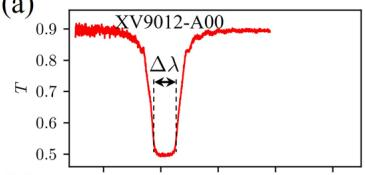  
(e)

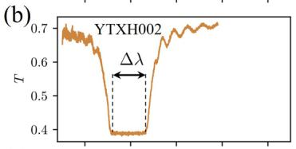

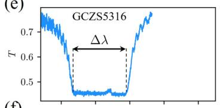  
(f)  
(i)

(c)  
(g)  
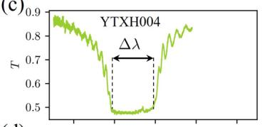

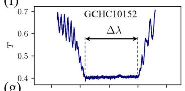

(d)  
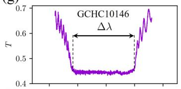

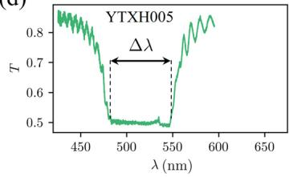

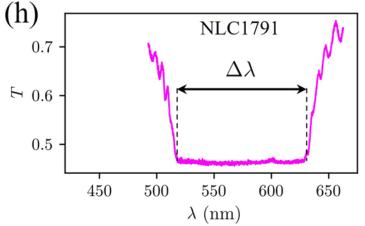

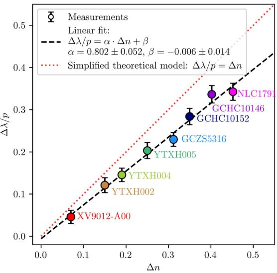  
Figure 3. (a–h) Experimentally measured unpolarised light transmittance spectra for eight cholesteric liquid crystal samples in 8 µm thick cells with diferent birefringences. Note, that experimental measurements include refections on glass-air interfaces of the CLC cells. (i) Corresponding dependence of the normalized bandwidth $\Delta \lambda / p$ on the nematic birefringence n. Cholesteric pitch lengths and other material properties are listed in Table 1.  
(a)

$$
D = 8 ~ \mu \mathrm { m } , p = 0 . 3 0 0 ~ \mu \mathrm { m }
$$

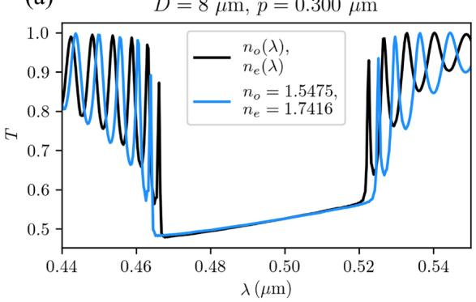

(b)  
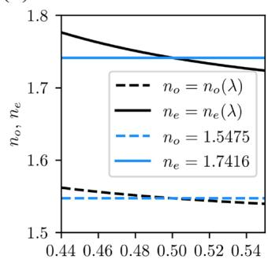  
λ(μm)  
Figure 4. Efect of refractive indices dispersion $( n _ { o } ( \lambda ) , n _ { e } ( \lambda ) )$ on transmittance spectrum. (a) Te blue line shows the calculated spectrum of transmitted light for wavelength-independent refractive indices $( n _ { o } = 1 . 5 4 7 5 , n _ { e } = 1 . 7 4 1 \bar { 6 } )$ , and in black, the spectrum of the transmitted light for wavelength-dependent refractive indices with dispersion relations $n _ { o } ( \dot { \lambda } / \mu \mathrm { m } ) = 1 . 5 1 3 9 + 0 . 0 0 5 2 \lambda ^ { - 2 } + 0 . 0 0 0 8 \lambda ^ { - \check { 4 } }$ , and $n _ { e } ( \lambda / \mu \mathrm { m } ) = 1 . 6 7 0 8 + 0 . { \dot { 0 } } 0 8 1 \lambda ^ { - 2 } + 0 . 0 0 2 4 \lambda ^ { - 4 }$ , are shown. (b) Corresponding dispersion relations.

## Dispersion of refractive index

Figure 4 shows the efect of the refractive index dispersion on the transmittance of a selected cholesteric sample. We compare two numerically calculated transmittance spectra T() in an 8 µm thick CLC cell with pitch length $p = 0 . 3 0 0 \mu \mathrm { m }$ . In one case, we have assumed that the refractive indices vary with wavelength according to some typical exemplary (5CB nematic liquid crystal) dispersion relations, $. n _ { o } ( \lambda )$ and $n _ { e } ( \lambda )$ obtained from46 and given in the caption of Fig. 4. To obtain the second spectrum, we have assumed that the refractive indices are independent of wavelength and equal to the values of these functions at 0.500 µm. It turns out that when taking into account the selected dispersion relations, the photonic band gap of the material becomes signifcantly narrower—for 9% (from 59 nm to 54 nm) for this particular material—than in the calculation where the wavelength dependence of refractive indices is neglected. Te reason for this is that the ordinary refractive index, corresponding to the band edge at the smaller wavelength is efectively larger at the lower band edge wavelength, compared to the value at $0 . 5 0 0 \mu \mathrm { { m } }$ . Contrary, the extraordinary refractive index, corresponding to the band edge at the larger wavelength is efectively smaller at the upper band edge wavelength, compared to the value at 0.500 µm. Terefore, the band edges are moved closer together. In other calculations presented in this paper, we neglect the dispersion relations for simplicity.

## Role of birefringence and angle between polarisation and director at incident plane on the transmittance

Figure 5 shows the calculated transmittance spectra for diferent sample thicknesses D, refractive indices $n _ { o } , n _ { e }$ and angles between the incident linear polarisation of the electric feld and the director feld at the edge of the sample $\gamma ( \mathbf { n } _ { o } , \mathbf { E } _ { 0 } )$ . As shown in panel (a), not only a sufcient number of cholesteric pitches but also a sufciently large birefringence n is required to refect half of the linealry polarised incident light with wavelengths within the band gap. In sufciently thick samples (Fig. 5b, c), the refractive indices determine only the position and the width of the band gap. Panels (d-f) in Fig. 5 show the dependence of the spectrum on the angle $\gamma ( \mathbf { n } _ { o } , \mathbf { E } _ { 0 } )$ Transmittance is practically unafected by this angle at wavelength $\lambda _ { 1 } = n _ { o } p$ and at the peaks of the spectrum, but it can change with $\gamma ( \mathbf { n } _ { 0 } , \mathbf { E } _ { 0 } )$ at wavelengths between $\lambda _ { 1 } = n _ { o } p$ and $\lambda _ { 2 } = n _ { e } p .$ . In particular, on the bandedge at $\lambda _ { 2 } = n _ { e } p ;$ , the transmittance is $T ( n _ { e } p ) \approx 0 . \bar { 6 } \mathrm { i f } \gamma ( \mathbf { n } _ { 0 } , \mathbf { E } _ { 0 } ) = 0 ^ { \circ } ,$ , while at $\begin{array} { r } { { \bf \nabla } \cdot \gamma ( { \bf n } _ { 0 } , { \bf E } _ { 0 } ) = 9 0 ^ { \circ } , } \end{array}$ it is considerably smaller, $T ( n _ { e } p ) \approx 0 . 4$ . Tis efect occurs due to refractive index mismatch between n and $n _ { e } . \mathrm { I f } n _ { G }$ does not match $n _ { o }$ either, similar behaviour is observed at the other band edge too. Te efect of the refractive index of the isotropic material confning the CLC $( n _ { G } )$ on the transmission of linearly polarised light with $\gamma ( { \bf n } _ { 0 } , { \bf E } _ { 0 } ) = 0 ^ { \circ }$ is shown in panel $( \mathbf { g } )$ of Fig. 5. Te slope of the spectral curve within the band gap changes from increasing to decreasing as $n _ { G }$ increases from 1.35 to $1 . 9 5 .$ . Te opposite trend is observed for linearly polarised light with $\gamma ( { \bf n } _ { 0 } , { \bf E } _ { 0 } ) = 9 0 ^ { \circ }$ . In both cases, the spectral curve is horizontal within the bandgap when $n _ { G } \stackrel { . . . } { = } ( n _ { o } + n _ { e } ) \bar { / } 2 = 1 . 6 5 .$ If we calculate the spectra T() for diferent angles $\gamma ( \mathbf { n } _ { 0 } , \mathbf { E } _ { 0 } )$ , and take their mean value at each wavelength, we obtain the transmission spectrum of unpolarised light. Tese spectra are indicated by dashed lines in panels $( \mathrm { d } , \mathrm { e } , \mathrm { f } )$ of Fig. 5. It turns out that the transmission within the bandgap is constant $T \approx 0 . { \dot { 5 } } .$ . Tis is true for diferent refractive indices nG.

## Transmittance spectra of divergent beams

Te simulated transmittance spectra are noticeably diferent in shape from those measured experimentally (Fig. 3). In the simulations, we assume that the plane waves pulses are incident on the cholesteric liquid crystal sample, while in experiments, a non-coherent light source is focused on the sample. Tis allows waves to propagate through the sample not only along the helical axis but also at an angle.

To include these efects in numerical simulations, we study the transmittance of a Gaussian beam pulses with diferent beam divergences $\theta = \lambda _ { 0 } / \pi n _ { G } w _ { 0 }$ given by the waist width $w _ { o } ,$ the central vacuum wavelength of the pulse $\overline { { \lambda _ { 0 } } }$ and the refractive index of glass $n _ { G } .$ Figure 6 shows that larger beam divergence (and thus larger numerical aperture $\mathrm { N A } = \mathrm { n _ { G } } \sin ( \theta ) ) )$ causes the oscillations in the spectra outside the band gap to vanish gradually. Tis could be explained by the shif of the transmittance spectrum when the direction of light propagation through the CLC sample is not parallel to the helical axis6 . In our case, the spectrum is actually the sum of the transmittance spectra for diferent directions, which causes the oscillations outside the band gap to be averaged out.

## Role of incident polarisation on the transmittance

Te transmittance of light through cholesteric samples is strongly afected by the polarisation of the incoming light. Half of the linearly polarised light, which can be considered as the sum of two opposite circular polarisations, is refected, and half is transmitted. Te same is true for unpolarised light. Circularly polarised light with the same handedness as the structure (in this case RCP) is almost completely refected for wavelengths between $n _ { o } p$ and n p, while circularly polarised light with the opposite handedness (LCP) is almost completely transmitted.

For liquid crystal GCHC10146 doped with R-5011 chiral dopant in a $D = 8$ µm-thick cell with refractive indices $n _ { o } = 1 . 5 2 5 , n _ { e } = 1 . 9 0 9$ (measured in a racemic mixture of R and S dopant), transmittance spectra for diferent polarisations of light were measured: for linear polarisation (parallel and perpendicular to the director feld at the cell boundary), unpolarised light, and both circular polarisations, as shown in Fig. 7. Corresponding numerical calculations were performed, where we ftted the pitch length and the divergence of the incoming Gaussian beam to match the band gaps. Te spectrum of unpolarised light was calculated as the average of the spectra of diferent linear polarisations for angles $\gamma ( \mathbf { n } _ { o } , \mathbf { E } _ { 0 } ) = 0 ^ { \circ } , 1 0 ^ { \circ } , . . . , 3 5 0 ^ { \circ }$ . Indeed, a very good qualitative agreement is observed for all polarisations.

## One‑dimensional photonic eigenmodes in fnite‑length CLC resonators

Cholesteric liquid crystals can also perform as photonic resonators for light of diferent frequencies, as determined by diferent photonic eigenmodes. We calculated these eigenfrequencies and eigenmodes using the FDFD method (as explained in Methods). As for transmittance, we consider a cholesteric liquid crystal sample with thickness $D ,$ pitch length p, and refractive indices $n _ { o } , n _ { e }$ confned between two glass plates with refractive index $n _ { G } = 1 . 4 5 ,$ , as shown in Figs. 1 and 8b. Te thickness of glass plates $d _ { G }$ is assumed to be 5 µm, ending by 2 µm thick perfectly matched layers on both sides of the resonator. Te calculated electric feld profles of resonant photonic eigenmodes of the cholesteric sample in the frequency region of the photonic band gap with corresponding eigenfrequencies and Q-factors are shown in Fig. 8. Tese modes can be classifed into two distinct branches—blue (B modes: B1, B2,...on the blue side of the band gap), and red (R modes: R1, R2,...on the red side of the band gap). Modes B and R are all right-circularly polarised (same handedness as the structure) and exist only outside the photonic band gap. Eigenmodes with frequencies closest to the bandgap have the largest Q-factors. Selected modes B1, B2, and R1 are also represented in 3D images of the electric feld profles in

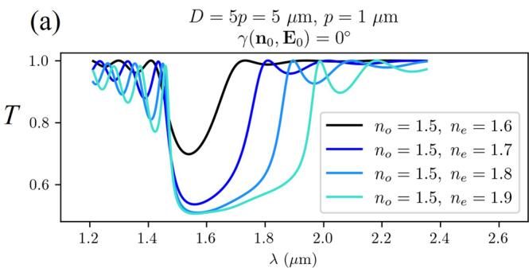  
(d)

$$
\begin{array} { c } { D = 5 p = 5 ~ \mu \mathrm { m } , p = 1 ~ \mu \mathrm { m } } \\ { n _ { o } = 1 . 5 , n _ { e } = 1 . 8 } \end{array}
$$

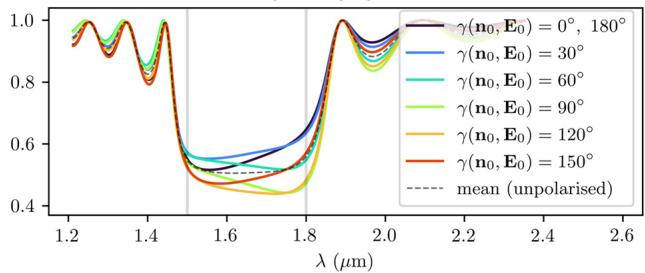  
(b)

$$
\begin{array} { c } { { D = 1 0 p = 1 0 \mu \mathrm { m } , p = 1 \mu \mathrm { m } } } \\ { { \gamma ( \mathbf { n } _ { 0 } , \mathbf { E } _ { 0 } ) = 0 ^ { \circ } } } \end{array}
$$

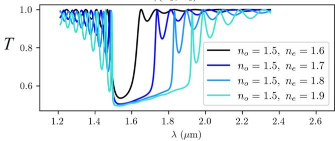  
(e)

$$
\begin{array} { c } { D = 1 0 p = 1 0 ~ \mu \mathrm { m } , p = 1 ~ \mu \mathrm { m } } \\ { n _ { o } = 1 . 5 , n _ { e } = 1 . 8 } \end{array}
$$

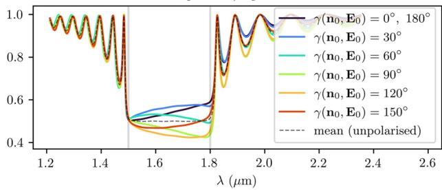

(c)  
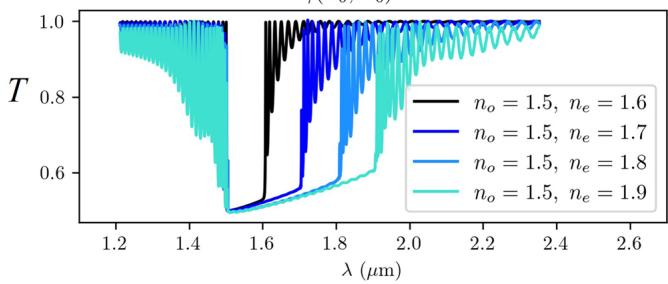  
(g)

(f)  
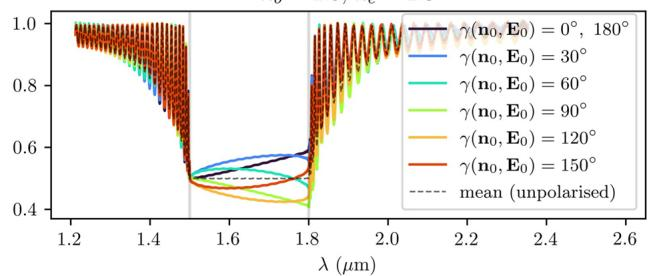

$$
\begin{array} { r } { D = 1 0 p = 1 0 ~ \mu \mathrm { m } , ~ p = 1 ~ \mu \mathrm { m } , \quad } \\ { n _ { o } = 1 . 5 , ~ n _ { e } = 1 . 8 , ~ \gamma ( \mathbf { n } _ { 0 } , \mathbf { E } _ { 0 } ) = 0 ^ { \circ } } \end{array}
$$

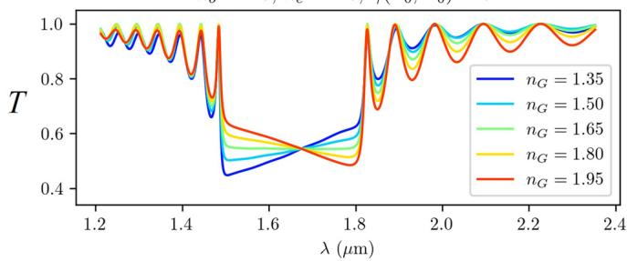  
Figure 5. (a,b,c) Simulated transmittance spectra of CLC cells for diferent combinations of ordinary and extraordinary refractive indices in diferently thick cells for linearly polarised light with polarisation parallel to the director at the incident plane $\gamma ( \mathbf { n } _ { o } , \mathbf { E } _ { 0 } ) \dot { = } 0 ^ { \circ }$ in D/p is 5, 10, and 40 pitch thick cells. (d,e,f) Transmittance spectra of CLC samples with fxed refractive indices $n _ { o } = 1 . 5 , n _ { e } = 1 . 8$ for diferent angles between the electric feld’s polarisation and the director at the incident plane $\gamma ( \mathbf { n } _ { 0 } , \mathbf { E } _ { 0 } )$ in D/p is 5, 10, and 40 pitch thick cells. Te dashed lines represent the spectra of unpolarised light. (g) Transmittance spectra of the CLC with refractive indices $n _ { o } = 1 . 5 , n _ { e } = 1 . 8$ and thickness $D = 1 0 p \overset { \cdot } { = } 1 0$ µm at diferent refractive indices nG of the confning isotropic material (glass). Tis is the only result in which we varied $n _ { G } .$ In all the others, we assumed its value to default at 1.5.

Fig. 9, where the orientation of the electric feld and the orientation of the liquid crystal director are compared. Distinctly, in our cholesteric system, there also exist numerical eigensolutions of Maxwell’s equations, which are lef-circularly polarised (LCP) and emerge at all possible frequencies, also within the band gap, as shown in the spectrum in Fig. 8a. However, these modes have signifcantly smaller Q-factors, which is expected as LCP light of any frequency is fully transmitted through a right-handed CLC and therefore cannot show resonant behaviour. Also, changing the glass thickness $d _ { G }$ in the numerical simulation causes a change in the spectrum

$$
w _ { 0 } = 0 . 2 \mu \mathrm { m } , \ \mathrm { N A } \approx 0 . 7 6
$$

(b) $\gamma ( { \bf n } _ { 0 } , { \bf E } _ { 0 } ) = 9 0 ^ { \circ }$  
(a)  
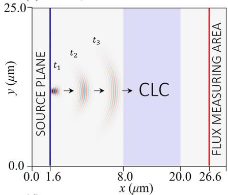  
(b)

$$
w _ { 0 } = 0 . 6 \mu \mathrm { m } , \ \mathrm { N A } \approx 0 . 2 6
$$

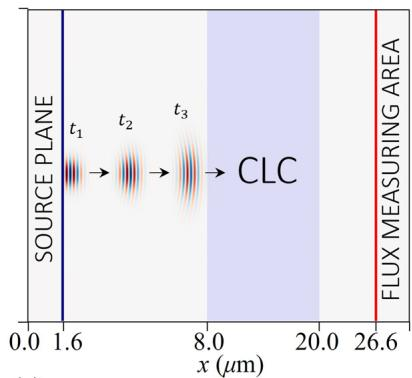  
(d)

(c)  
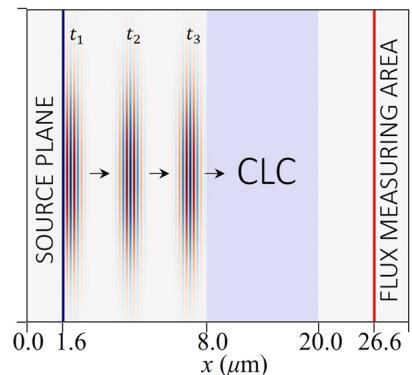

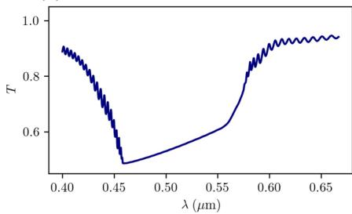

(e)  
(f)  
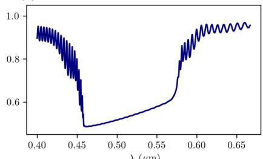

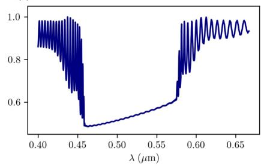  
Figure 6. (a,b,c) Schematics of three diferent simulation setups. (d,e,f) Corresponding transmittance spectra T() of Gaussian beams with linear polarisation $( \gamma ( { \bf n } _ { 0 } , { \bf E } _ { 0 } ) = \bar { 0 } ^ { \circ } )$ and diferent waist thicknesses w . Smaller waist thicknesses correspond to higher numerical aperture NA and, thereby, smoother transmittance spectra. Parameters $p = 0 . 3 0 0 \dot { \mu \mathrm { m } } , n _ { o } = \dot { 1 . 5 } 2 5 , n _ { e } = 1 . 9 0 9 , \overline { { D } } = 1 2$ µm were used in these simulations. Beam focus is chosen to be at the source plane, which is placed 6.4 µm away from the CLC sample. Note that schematics in $\mathbf { \Gamma } ( \mathbf { a } , \mathbf { b } , \mathbf { c } )$ are not to scale.  
(a)

$$
\gamma ( \mathbf { n } _ { 0 } , \mathbf { E } _ { 0 } ) = 0 ^ { \circ }
$$

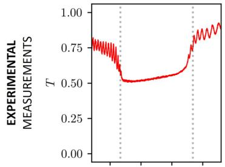

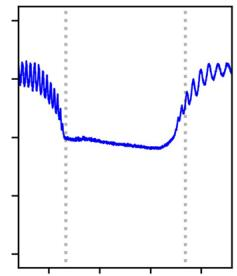

(c)  
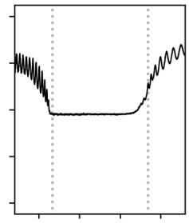

(d)  
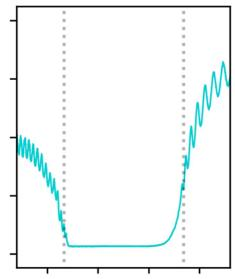

(e)  
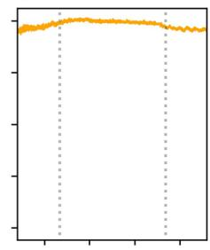

(f)  
(g)  
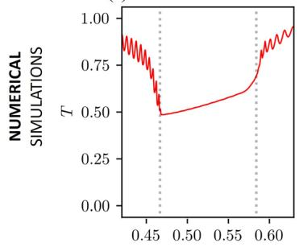  
λ(µ)

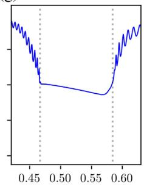  
λ(µ)

(h)  
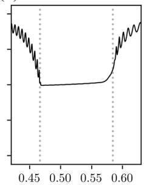  
λ(μm)

(j)  
(i)  
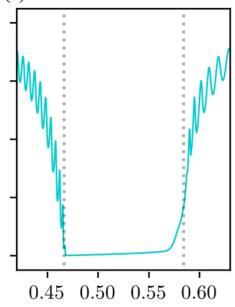  
λ (µm)

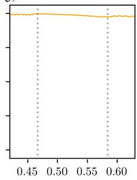  
Figure 7. (a–e) Experimentally measured transmittance spectra of GCHC10146 cholesteric liquid crystal sample with right-handed helix for diferent polarisations: linear parallel (a), linear perpendicular (b), unpolarised light $( \mathbf { c } ) ,$ right-handed circular polarisation (RCP) (d), and lef-handed circular polarisation (RCP) (e) Te experimentally measured transmission spectra also include the refections at the air-glass interface. (f–j) Numerically calculated transmittance spectra of a Gaussian beam pulse with waist size $\dot { w } _ { 0 } = 0 . 3 5$ µm and diferent electric feld polarisation combinations: linear parallel (f), linear perpendicular (g), unpolarised light (h), RCP (i), and $\bar { \mathrm { L C P } ( \mathbf { j } ) }$ . Parameters used: $D = 8 \mu \mathrm { m } , n _ { o } = 1 . 5 2 5 , n _ { e } = 1 . 9 0 9 , p = 0 . 3 0 6$ µm. In numerical simulations, refections on the glass-air interface are ignored as the source is located inside the glass.

(a)

$$
D = 2 0 ~ \mu \mathrm { m } , \ : p = 1 ~ \mu \mathrm { m } , ~ n _ { o } = 1 . 5 , ~ n _ { e } = 1 . 8 , ~ n _ { G } = 1 . 4 5
$$

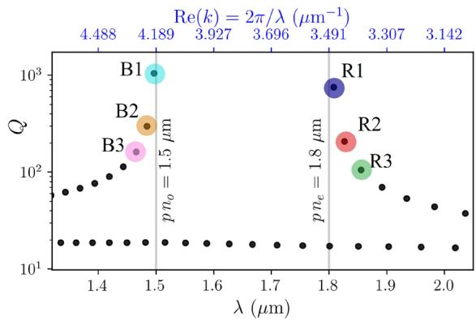  
(b)  
(c)

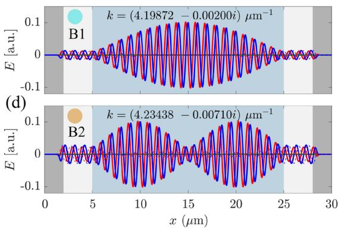

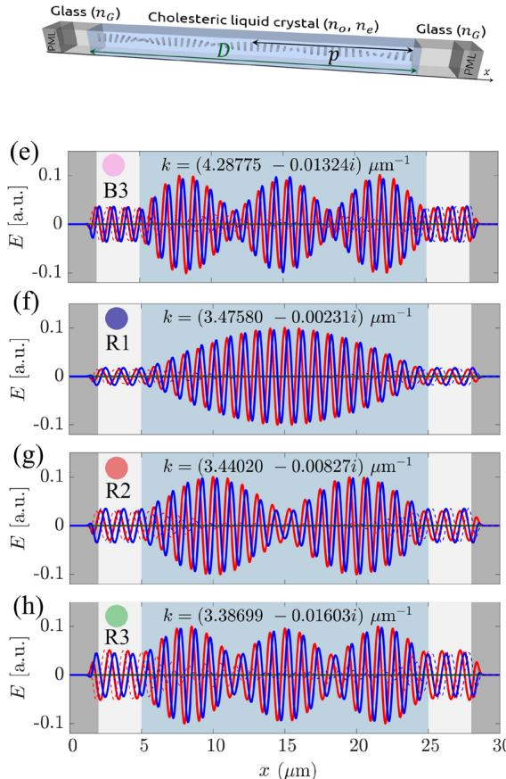  
Figure 8. (a) Q-factors of the eigenmodes in the region of the band gap $\textit { p n } _ { o } < \lambda < \textit { p n } _ { e }$ (b) Schematic of the simulation domain geometry. (c–h) Electric feld profles of selected blue (B) and red (R) photonic eigenmodes in the vicinity of the band gap.

of these modes, whereas the spectrum of B and R modes remains unchanged. In turn, we conclude that these lef-handed modes are physically less relevant in the context of resonators, and we only focus on the resonant B and R modes in the rest of this article.

Te eigenfrequencies of the modes that exist in a CLC resonator are closely related to the transmittance spectra. Figure 10a shows that the peaks in the T() spectrum (where T = 1) correspond to the frequencies of the eigenmodes B and R which means that the electromagnetic plane waves with frequencies corresponding to the eigenfrequencies of the eigenmodes are completely transmitted through the cholesteric liquid crystal, even though the light is trapped within the sample due to internal refections. Plane waves with frequencies somewhere between the eigenfrequencies are partially refected, as shown in the transmission spectra.

Figure 10b shows that in thicker resonators with a larger number of pitches, there are more eigenmodes within a certain frequency range. Tus, the diferences between adjacent eigenfrequencies are smaller. In the context of laser design, this can be important because a certain emission spectrum of a dye in a thicker CLC sample thus efectively overlaps with a larger number of the resonator’s eigenfrequencies. It is also clear that in thicker cells, the Q-factors of all modes are larger. Figure 10c shows the dependence of Q-factors for B1 modes as a function of cell thickness, i.e. the number of cholesteric layers. Te eigenfrequencies of the eigenmodes are also afected by the refractive indices and the birefringence n, as shown in Figure 10d and e. Larger birefringence results in a wider band gap but it also means that the gradient of the efective refractive index for a given polarisation is larger, and hence the refectivity is also larger. Tis leads to more light being trapped within the resonator, which corresponds to a higher Q factor. Te combined infuence of thickness and birefringence on the Q-factor of the mode B1 is shown in Fig. 10f.

In Fig. 8, the eigenmodes B1 and R1 look very similar, as do the B2 and R2, B3 and R3, etc. However, careful observation reveals that in a 20 pitches thick cholesteric sample, in mode R1, the electric feld E rotates from edge to edge by an angle of 19.5 · (2π), and in mode B1 by an angle of 20.5 · (2π). Actually, one can generalize this observation: In a $N _ { p }$ pitches thick sample, the electric feld of the mode R1 rotates by an angle of 2π $( N _ { p } - 1 / 2 ) ,$ and that of mode B1 by an angle of $2 \bar { \pi ( \boldsymbol { N _ { p } } + 1 / 2 ) }$ . Furthermore, it can be observed that for the R mode group, the electric feld of the mode R2 rotates by $2 \pi ( N _ { p } - 1 )$ , of mode R3 by 2π $( N _ { p } - 3 / 2 ) _ { \cdots }$ whereas for B modes, the electric feld of mode B2 rotates by 2π $( N _ { p } + 1 ) ,$ , of mode B3 by $2 \pi ( \dot { N } _ { p } + 3 / 2 ) .$ , etc. Evidently, the electric feld of eigenmodes is, in general, neither parallel nor orthogonal to the liquid crystal director, as shown in Figs. 9 and 11. Nevertheless, the profle of the electric feld in each mode adapts to the liquid crystal director such that the electric feld is either parallel or perpendicular over the largest possible portion of the cell. Indeed, note that the distances at which the electric feld rotates by an angle of 2π are not constant throughout the cell. Figure 9 also shows the comparison between the orientations of the electric feld E and the director feld n in colours, φE and $\phi _ { \mathbf { n } } ,$ respectively, whereas in Fig. 11, the spatial dependence of the relative angle $\gamma ( x ) = \vert \phi _ { \mathbf { E } } - \phi _ { \mathbf { n } } \vert$ between the electric feld and the director is shown for selected modes B1, B2, B3, and R1, R2, R3. If the distances at which the electric feld rotates by a full angle 2π were constant throughout the cell, panels (c) and (e) of Fig. 11 would show linear dependence, but this is not the case. For the R1 eigenmode, it turns out that the electric feld is perpendicular to the director at both cell boundaries, whereas in between, it is parallel over most of the cell. Just the opposite is true for the mode B1. In modes R2, R3,...the feld is perpendicular to the director at the cell boundaries, and in the nodes of the feld envelopes, but in between, it is more or less aligned with the director. Again, the opposite holds for modes B2, $\mathrm { B } 3 , \ldots$ , as shown in panels (c) and (e) in Fig. 11. Finally, efectively, the modes experience diferent efective refractive index profle as determined by the matching alignment between the electric feld and the director, and higher modes see more efective regions of miss-alignment. Overall, this coupling results in diferent number of envelope (amplitude) peaks.

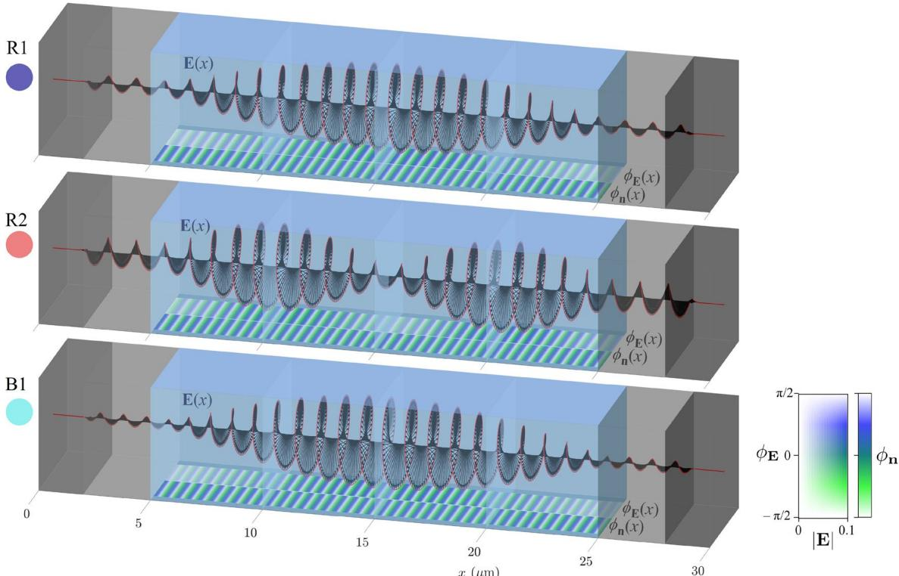  
x (µm)  
Figure 9. Tree-dimensional representation of electric feld vectors E(x) of selected eigenmodes R1, R2, and B1 from Fig. 8. At the bottom surfaces, the orientation of the director $\phi _ { \mathbf { n } } = \arctan ( n _ { z } / n _ { y } )$ and the orientation of the electric feld $\phi _ { \mathrm { E } } = \arctan ( E _ { z } / E _ { y } )$ inside the cell are shown in colours for comparison. Both red and blue modes have the same handedness as the CLC helix. In red modes, E and n are in phase in the areas of high electric feld amplitude, whereas in blue modes, they are shifed by $9 0 ^ { \circ }$ . Relative angle between the electric feld and the director $\gamma = | \phi _ { \mathbf { E } } - \phi _ { \mathbf { n } } |$ is shown in Fig. 11.

Understanding the eigenmodes of the passive resonator without gain is crucial for designing lasers. Te Q-factor of the selected mode is essentially the ratio between the energy stored in the cavity and energy that is dissipated into the surroundings. Terefore the modes with higher Q-factor are more likely to lase or in other words, are expected to have lower lasing thresholds. Te light of such modes is retained in the resonator for a longer time which allows more pumped atoms to be stimulated and emit light. We predict the shape of the mode inside the cavity. Later is important when we want to determine how to efectively pump the laser and efciently use the gain. Additionally, LCs allow for the orientation of dissolved dye molecules44,45 and understanding the angle between the director feld and electric feld of the mode could enable engineering of lasers that emit different light modes. To understand the role of gain, further investigation by using methods that can efectively simulate lasing is needed.

## Discussion

In this work, we have analyzed the light transmittance through cholesteric liquid crystals and the corresponding photonic eigenmodes as conditioned by multiple system parameters and efects: (i) fnite length of the cholesteric helical pattern, (ii) diferent material birefringence, (iii) diferent types of incoming polarisation, and (iv) relative angle between incoming polarisation and director. Experimental measurements of transmittance spectra have been systematically performed for several materials with diferent birefringences and with diferent polarisations of the incident light. Numerically, we calculated transmittance spectra for a general range of typical values of refractive indices, cell thicknesses, and incident polarisations. Additionally, we have analyzed the efect of the refractive indices dispersion on the transmittance spectra and shown how the transmittance spectra change when pulses with curved wavefronts propagate through the CLC cell. We have shown that the peaks in the transmittance spectra coincide with the eigenfrequencies of the CLC resonator eigenmodes and presented the geometry of these modes as well as their Q-factors. Overall, this work explores and outlines the properties of cholesteric liquid crystal helical patterns as photonic resonators and highlights their properties that are important for the design of liquid crystal micro-lasers and other sof-matter-based photonic devices.

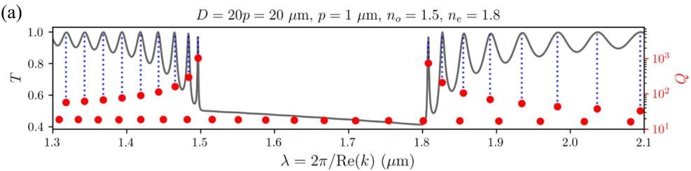

(b)  
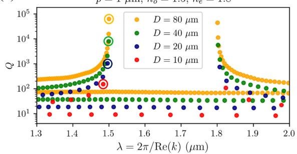

(c)  
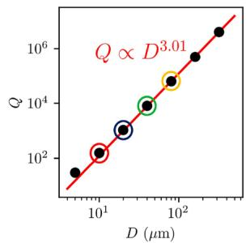

(d)  
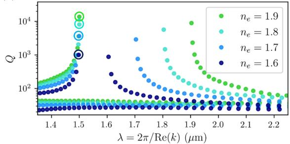

(e)  
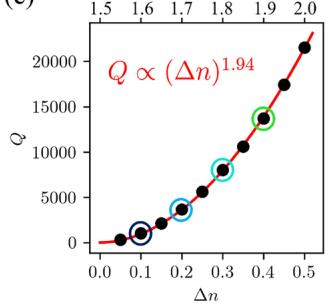

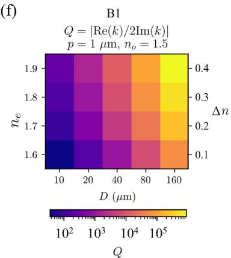  
Figure 10. (a) Overlap between the peaks in the transmittance spectrum and the frequencies of the eigenmodes with the same handedness as the director. (b) Q-factors for diferent thicknesses of the sample. (c) Q-factor of the B1 mode in diferently thick cells. For this example, it can be seen that the Q-factor as a function of the thickness D increases approximately as $Q \propto D ^ { 3 . 0 1 }$ . (d) Q-factors for diferent birefringences (diferent extraordinary refractive indices $n _ { e }$ at constant ordinary refractive index $n _ { o } = 1 . 5 )$ and constant thickness $D = 4 0 \mu \mathrm { m }$ . (e) Q-factor of the B1 mode for diferent birefringences of the sample at constant thickness. Te Q-factor of this particular mode increases with birefringence approximately as $\dot { Q } \propto ( \Delta n ) ^ { 1 . 9 4 }$ . (f) Te combined efect of birefringence n and cell thickness D on the Q-factor of the B1 mode.

## Methods

## Numerical method

In numerical calculations, we assume that the system is infinite along y and z axes, allowing us to perform simulations on a one-dimensional mesh with three-dimensional electric and magnetic feld vectors, $\mathbf { E } ( x ) = \left( E _ { x } ( x ) , E _ { y } ( x ) , E _ { z } ( x ) \right)$ and $\mathbf { H } ( x ) = \left( H _ { x } ( x ) , H _ { y } ( x ) , H _ { z } ( x ) \right)$ , respectively. Open boundary conditions are assumed at the boundaries of the system to prevent any additional refections, which is modelled by adding a few wavelengths thick (2 µm in our simulations) perfectly matched layers $( { \mathrm { P M L s } } ) ^ { 4 7 , 4 8 }$ that absorb electromagnetic felds at the boundaries of the simulation domain, as also shown in Fig. 1.

Transmittance spectra of the CLC samples of diferent thicknesses are calculated using the fnite-diference time-domain (FDTD) method49, using Meep sofware50 which solves Maxwell’s equations in the time domain. Te transmittance spectrum T() is calculated as a ratio between the spectrum of a pulse with Gaussian timedependence transmitted through a CLC sample and a spectrum of an equal pulse transmitted through the isotropic glass. By time-limiting the pulse, we ensure that the spectrum of the pulse is spectrally broad and covers the frequency range of interest. In principle, we could choose any other smooth function with similar time dependence instead of a Gaussian profle. Here, a plane-wave source with time-dependence proportional to exp $( - i \omega t - ( t - t _ { 0 } ) ^ { 2 } / 2 w ^ { 2 } )$ and arbitrary polarisation is placed at $x = d _ { G } / 2$ though and has infnite size along y and z axes. Te area at which the transmitted fux spectra are measured is placed at the same distance from the sample as the source but on the other side of the sample, at $x = d _ { G } + D + \bar { d } _ { G } / 2$ . Te central spectral frequency of the source ω and the spectral width 1/w are set to $\omega = 1 / ( p \overline { { n } } )$ , where $\overline { { n } } = ( n _ { o } + n _ { e } ) / 2$ and 1/w = ω so that the spectrum roughly overlaps with the range of frequencies in which refection of light is observed. In calculations, we take actual experimental values (when making comparisons, typically approx. 300 nm) or a generic value of $p = 1 \mu \mathrm { m }$ . Te simulations are performed until the mean amplitudes of the electromagnetic felds at the fux measuring area decay by a factor $\mathbf { \partial _ { o f } } 5 \cdot 1 0 ^ { - 5 }$ compared to the maximum ones during each run. Numerical simulations were performed for diferent combinations of material parameters $D , n _ { o } ,$ ne and angles between linear light polarisation and anchoring direction at the incident surface $\gamma ( \mathbf { n } _ { 0 } , \mathbf { E } _ { 0 } )$ , shown in Fig. 1.

(b) D = 100p = 100 µm, p = 1 µm, no = 1.5, ne = 1.8, nG = 1.45  
(a)  
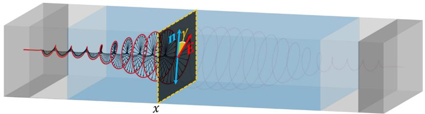

(c)  

(d)  

(e)  
  
Figure 11. Q-factors of the eigenmodes $\mathrm { i n } 1 0 0 \mu \mathrm { m } - \left( \mathbf { b } \right)$ , and 30 µm-thick (d) CLC cells and corresponding spatial dependence of the relative angles $\gamma = \operatorname { a r c c o s } { [ ( \mathbf { n } \cdot \mathbf { E } ) / | \mathbf { E } | }$ ] between the electric feld polarisation E and the director n (as shown in (a)) for selected eigenmodes (c,e). Te electric feld of the mode R1 is perpendicular to the director at the boundaries whereas it is mostly parallel within the cell. Te electric feld of higher modes $( \mathbb { R } 2 , \mathbb { R } 3 , \ldots )$ is perpendicular to the director also in the nodes of their amplitude envelopes and it is parallel at maxima of amplitude envelopes. Opposite holds for the B modes.

The electromagnetic field in resonators can be described as a superposition of photonic modes as $\begin{array} { r } { \mathbf { E } ( \mathbf { r } , t ) = \sum _ { \mu } \Psi _ { \mu } ( \mathbf { \tilde { r } } ) e ^ { - i k _ { \mu } t } } \end{array}$ , where $\Psi _ { \mu } ( \mathbf { r } )$ are the given modes. We calculate the modes as eigensolutions of Maxwell’s equations using the fnite-diference frequency-domain method by solving the eigenproblem32,51:

$$
\nabla \times \nabla \times \Psi _ { \mu } ( { \bf r } ) - k _ { \mu } ^ { 2 } \underline { { { \varepsilon } } } ( { \bf r } ) \Psi _ { \mu } ( { \bf r } ) = 0 ,\tag{2}
$$

where each eigenmode $\Psi _ { \mu } ( \mathbf { r } )$ has its corresponding eigenvalue $k _ { \mu } = \omega _ { \mu } / c _ { 0 } .$ , sometimes also referred to as an eigenfrequency when $c _ { 0 } = .$ 1 is assumed. Te dielectric tensor $\varepsilon ( \mathbf { r } )$ , which describes the liquid crystal structure and confning glass, is taken as real (i.e. without absorption) except in the PML region, where it has an imaginary component to assure absorption and imitate open boundary conditions. Consequently, both the calculated electric feld profle of each resonator mode $\Psi _ { \mu } ( \mathbf { r } )$ and the eigenfrequency $k _ { \mu }$ are always complex. Te decay rate of the modes, is inversely proportional to the quality factor (Q-factor), defned $\mathsf { a s } ^ { 5 2 } \colon$

$$
Q _ { \mu } = \biggl | \frac { \mathrm { R e } [ k _ { \mu } ] } { 2 \mathrm { I m } [ k _ { \mu } ] } \biggr | .\tag{3}
$$

Especially, we focused on frequencies in the vicinity of the photonic band gap, as these modes are most interesting for possible laser design.

## Experimental methods and materials

Experimentally, we studied a series of diferent nematic materials with diferent birefringence ranging from 0.07 to 0.45. Te CLCs investigated in this study were prepared by mixing pure nematic liquid crystals with the righthanded chiral dopant R-5011 (Grandin Chem Co Ltd, China) above the clearing temperature of pure NLCs. Te helical twisting power (HTP) of R-5011 is aroun $\mathsf { I } { \sim } 1 1 6 \mu \mathrm { m } ^ { - 1 } \mathrm { a t } 2 0 ^ { \circ } \mathrm { C } ,$ and the amount of chiral dopant was adjusted to obtain nearly the same pitch in all CLC mixtures at room temperature where the experiments were performed. Te birefringence and the clearing temperature of pure nematic liquid crystals are listed in Table 1.

To study the pitch length and the photonic band gap, as prepared CLCs were introduced into planar-aligned wedge cells by capillary action in the isotropic phase. Te wedge cells were made of two 0.5 mm thick glass plates (Soda-lime glass, AGC Flat Glass (Tailand) Public Company Limited) that were covered by $^ { 2 0 - 3 0 }$ nm thin layer of polyimide (Nissan SE-5291). Te polyimide (PI) was rubbed prior to cell assembling, and the rubbing directions on each glass plate were set antiparallel to prevent any splay due to the surface pre-tilt on the PI. Te thickness of wedge cells was from 1 µm to 10 µm, and the same type of cells was used in all experiments. Te pitch lengths of diferent CLCs were measured by using the conventional Grandjean-Cano wedge method53.

We used a Nikon polarising microscope (ECLIPSE TE2000-U) equipped with an unpolarised white light source (Halogen lamp 12V, 100W) and condenser to measure transmission or refection spectra of CLC samples. Te light, transmitted through the CLC sample was collected using a low numerical aperture 20× objective (Nikon, Plan Fluor 20×/0.5) and sent to a spectrophotometer with 0.5 nm resolution (Andor, Shamrock SR-500i), equipped with cooled EM-CCD camera (Andor, Newton DU 970N). Te photonic band gap was measured for unpolarised white light at a sample thickness of 8 µm for all CLCs. Te transmittance data was collected for 1 s exposure time with a spectrometer slit size of 25 µm.

## Data availability

Data supporting this study’s fndings are available upon reasonable request from the frst author J.Z, and will be archived in Zenodo Community of the ERC project Light-operated logic circuits from photonic sof-matter (LOGOS).

Received: 19 May 2023; Accepted: 29 September 2023

Published online: 06 October 2023

## References

1. De Vries, H. Rotatory power and other optical properties of certain liquid crystals. Acta Crystallogr. A 4, 219–226 (1951).

2. Dreher, R., Meier, G. & Saupe, A. Selective refection by cholesteric liquid crystals. Mol. Cryst. Liq. Cryst. 13, 17–26 (1971).

3. John, W. S., Fritz, W., Lu, Z. & Yang, D.-K. Bragg refection from cholesteric liquid crystals. Phys. Rev. E 51, 1191 (1995).

4. Mitov, M. Cholesteric liquid crystals with a broad light refection band. Adv. Mater. 24, 6260–6276 (2012).

5. Ryabchun, A. & Bobrovsky, A. Cholesteric liquid crystal materials for tunable difractive optics. Adv. Opt. Mater. 6, 1800335 (2018).

6. Stebryte, M., Nys, I., Ussembayev, Y. Y., Beeckman, J. & Neyts, K. Large angle forward difraction by chiral liquid crystal gratings with inclined helical axis. Curr. Comput. Aided Drug Des. 10, 807 (2020).

7. Chilaya, G. Cholesteric liquid crystals: Optics, electro-optics, and photo-optics. Chirality Liq. Cryst. 159–185 (2001).

8. White, T. J., McConney, M. E. & Bunning, T. J. Dynamic color in stimuli-responsive cholesteric liquid crystals. J. Mater. Chem. 20, 9832–9847 (2010).

9. Huang, Y., Zhou, Y., Doyle, C. & Wu, S.-T. Tuning the photonic band gap in cholesteric liquid crystals by temperature-dependent dopant solubility. Opt. Express 14, 1236–1242 (2006).

10. Gao, Y., Luo, Y. & Lu, J. High-refective templated cholesteric liquid crystal flters. Molecules 26, 6889 (2021).

11. Fuh, A.Y.-G., Ho, S.-J., Wu, S.-T. & Li, M.-S. Optical flter with tunable wavelength and bandwidth based on phototunable cholesteric liquid crystals. Appl. Opt. 53, 1658–1662 (2014).

12. Kobashi, J., Yoshida, H. & Ozaki, M. Planar optics with patterned chiral liquid crystals. Nat. Photonics 10, 389–392 (2016).

13. Yang, D.-K., Chien, L.-C. & Doane, J. Cholesteric liquid crystal/polymer dispersion for haze-free light shutters. Appl. Phys. Lett. 60, 3102–3104 (1992).

14. Coles, H. & Morris, S. Liquid-crystal lasers. Nat. Photonics 4, 676–685 (2010).

15. Kopp, V. I., Fan, B., Vithana, H. & Genack, A. Z. Low-threshold lasing at the edge of a photonic stop band in cholesteric liquid crystals. Opt. Lett. 23, 1707–1709 (1998).

16. Morris, S., Ford, A., Pivnenko, M. & Coles, H. Enhanced emission from liquid-crystal lasers. J. Appl. Phys. 97, 023103 (2005)

17. Huang, Y. & Wu, S.-T. Multi-wavelength laser from dye-doped cholesteric polymer flms. Opt. Express 18, 27697–27702 (2010).

18. Taheri, B., Munoz, A., Palfy-Muhoray, P. & Twieg, R. Low threshold lasing in cholesteric liquid crystals. Mol. Cryst. Liq. Cryst. Sci. Technol. Sect. A. Mol. Cryst. Liq. Cryst. 358, 73–82 (2001).

19. Penninck, L., Beeckman, J., De Visschere, P. & Neyts, K. Light emission from dye-doped cholesteric liquid crystals at oblique angles: Simulation and experiment. Phys. Rev. E 85, 041702 (2012).

20. Muševič, I. Liquid-crystal micro-photonics. Liq. Cryst. Rev. 4, 1–34 (2016).

21. Mysliwiec, J., Szukalska, A., Szukalski, A. & Sznitko, L. Liquid crystal lasers: Te last decade and the future. Nanophotonics (2021).

22. Van der Meer, B., Vertogen, G., Dekker, A. & Ypma, J. A molecular-statistical theory of the temperature-dependent pitch in cholesteric liquid crystals. J. Chem. Phys. 65, 3935–3943 (1976).

23. Finkelmann, H., Kim, S. T., Munoz, A., Palfy-Muhoray, P. & Taheri, B. Tunable mirrorless lasing in cholesteric liquid crystalline elastomers. Adv. Mater. 13, 1069–1072 (2001).

24. Varanytsia, A., Nagai, H., Urayama, K. & Palfy-Muhoray, P. Tunable lasing in cholesteric liquid crystal elastomers with accurate measurements of strain. Sci. Rep. 5, 1–8 (2015).

25. Kahn, F. J. Electric-feld-induced color changes and pitch dilation in cholesteric liquid crystals. Phys. Rev. Lett. 24, 209 (1970).

26. White, T. J. et al. Phototunable azobenzene cholesteric liquid crystals with 2000 nm range. Adv. Funct. Mater. 19, 3484–3488 (2009).

27. Dadalyan, T. et al. Light-induced multi-wavelength lasing in dye-doped chiral nematic liquid crystals due to strong pumping illumination. Liq. Cryst. 45, 1272–1278 (2018).

28. Chanishvili, A. et al. Phototunable lasing in dye-doped cholesteric liquid crystals. Appl. Phys. Lett. 83, 5353–5355 (2003).

29. Cho, S., Yoshida, H. & Ozaki, M. Emission direction-tunable liquid crystal laser. Adv. Opt. Mater. 8, 2000375 (2020).

30. Matranga, M. et al. Frequency tunable lasing in a three layer cholesteric liquid crystal cell. Ferroelectrics 395, 1–11 (2010).

31. Sarukhanyan, T. M. et al. Multimode robust lasing in a dye-doped polymer layer embedded in a wedge-shaped cholesteric. Molecules 26, 6089 (2021).

32. Joannopoulos, J., Johnson, S., Winn, J. & Meade, R. Photonic Crystals: Molding the Flow of Light 2nd edn. (Princeton University Press, 2008).

33. Yang, D.-K. & Mi, X.-D. Modelling of the refection of cholesteric liquid crystals using the jones matrix. J. Phys. D Appl. Phys. 33, 672 (2000).

34. Hong, Q., Wu, T. X. & Wu, S.-T. Optical wave propagation in a cholesteric liquid crystal using the fnite element method. Liq. Cryst. 30, 367–375 (2003).

35. Penninck, L., Beeckman, J., De Visschere, P. & Neyts, K. Numerical simulation of stimulated emission and lasing in dye doped cholesteric liquid crystal flms. J. Appl. Phys. 113, 063106 (2013).

36. Gevorgyan, A., Golik, S. & Gevorgyan, T. On peculiarities in localization of light in cholesteric liquid crystals. J. Exp. Teor. Phys. 131, 329–336 (2020).

37. Gevorgyan, A. Specifc properties of light localisation in the cholesteric liquid crystal layer. the efects of layer thickness. Liq. Cryst. 47, 1070–1077 (2020).

38. Dolganov, P., Ksyonz, G., Dmitrienko, V. & Dolganov, V. Description of optical properties of cholesteric photonic liquid crystals based on maxwell equations and kramers-kronig relations. Phys. Rev. E 87, 032506 (2013).

39. Dolganov, P. Density of photonic states in cholesteric liquid crystals. Phys. Rev. E 91, 042509 (2015).

40. Dolganov, P. V. & Dolganov, V. K. Photon density of states in a cholesteric photonic crystal. JETP Lett. 108, 170–174 (2018).

41. Dolganov, P., Baklanova, K. & Dolganov, V. Spectral and polarization characteristics of the light passing through a cholesteric photonic crystal. J. Exp. Teor. Phys. 130, 790–796 (2020).

42. Belyakov, V. & Semenov, S. Optical edge modes in photonic liquid crystals. J. Exp. Teor. Phys. 109, 687–699 (2009).

43. Rafayelyan, M. et al. Light energy accumulation by cholesteric liquid crystal layer at oblique incidence. Liq. Cryst. 46, 1079–1090 (2019).

44. Wright, D., Brasselet, E., Zyss, J., Langer, G. & Kern, W. Dye-doped organic distributed-feedback lasers with index and surface gratings: Te role of pump polarization and molecular orientation. JOSA B 21, 944–950 (2004).

45. Papič, M. et al. Topological liquid crystal superstructures as structured light lasers. Proc. Natl. Acad. Sci. 118, e2110839118 (2021).

46. Li, J., Wen, C.-H., Gauza, S., Lu, R. & Wu, S.-T. Refractive indices of liquid crystals for display applications. J. Display Technol. 1, 51 (2005).

47. Berenger, J.-P. A perfectly matched layer for the absorption of electromagnetic waves. J. Comput. Phys. 114, 185–200 (1994).

48. Oskooi, A. & Johnson, S. G. Distinguishing correct from incorrect pml proposals and a corrected unsplit pml for anisotropic, dispersive media. J. Comput. Phys. 230, 2369–2377 (2011).

49. Tafove, A., Oskooi, A. & Johnson, S. G. Advances in FDTD Computational Electrodynamics: Photonics and Nanotechnology (Artech House, 2013).

50. Oskooi, A. F. et al. Meep: A fexible free-sofware package for electromagnetic simulations by the fdtd method. Comput. Phys. Commun. 181, 687–702 (2010).

51. Esterhazy, S. et al. Scalable numerical approach for the steady-state ab initio laser theory. Phys. Rev. A 90, 023816 (2014)

52. Jackson, J. D. Classical electrodynamics (1999).

53. Podolskyy, D., Banji, O. & Rudquist, P. Simple method for accurate measurements of the cholesteric pitch using a stripe-wedge Grandjean-Cano cell. Liq. Cryst. 35, 789–791 (2008).

## Acknowledgements

Tis result is part of a project that has received funding from the European Research Council (ERC) under the European Union’s Horizon 2020 Research and Innovation Program (Grant Agreement No. 884928-LOGOS). Authors also acknowledge funding from Slovenian Research and Innovation Agency ARIS Grants P1-0099, N1-0195 and J1-2462. U.M. also acknowledges funding from ARIS grant MN-0015.

## Author contributions

J.Z. and U.M. performed numerical simulations and analysed the results. U.M. developed the FDFD method for anisotropic materials. D.M and A.R. performed experiments. M.R. and I.M. proposed and led the study. M.R. supervised numerical simulations. I.M. supervised experiments. All authors contributed to the preparation of the manuscript.

## Competing interests

Te authors declare no competing interests.

## Additional information

Correspondence and requests for materials should be addressed to M.R.

Reprints and permissions information is available at www.nature.com/reprints.

Publisher’s note Springer Nature remains neutral with regard to jurisdictional claims in published maps and institutional afliations.

(cc I Open Access Tis article is licensed under a Creative Commons Attribution 4.0 International BY License, which permits use, sharing, adaptation, distribution and reproduction in any medium or format, as long as you give appropriate credit to the original author(s) and the source, provide a link to the Creative Commons licence, and indicate if changes were made. Te images or other third party material in this article are included in the article’s Creative Commons licence, unless indicated otherwise in a credit line to the material. If material is not included in the article’s Creative Commons licence and your intended use is not permitted by statutory regulation or exceeds the permitted use, you will need to obtain permission directly from the copyright holder. To view a copy of this licence, visit http://creativecommons.org/licenses/by/4.0/.

© Te Author(s) 2023
