<!-- page 1 -->

# Article pubs.acs.org/JACS

Post-transition State Bifurcations in Reactions That Form Pimarenyl Cation Diastereomers—Implications for Terpene Biosynthesis

Yumeng Cao, Wang-Yeuk Kong, and Dean J. Tantillo*

## Abstract

The role of post-transition state bifurcations in carbocation rearrangements
derived from copalyl diphosphate (CPP) and its diastereomers syn-CPP and ent-CPP
were investigated using quantum chemical calculations, ab initio molecular
dynamics (AIMD) simulations, and potential energy surface (PES) analysis based
on principal component analysis (PCA). Proton transfer transition states of
pimarenyl cations, which can give rise to multiple products through bifurcating
pathways, were the focus. For normal CPP-derived systems, AIMD simulations
revealed that Re-face proton transfer leads to a diverse array of products,
whereas Si-face proton transfer predominantly follows a single pathway. In
contrast, syn-CPP and ent-CPP-derived systems showed reduced product diversity,
with bifurcations only observed for the Re-face proton transfer. Orbital
alignment analyses highlight the influence of dynamic momentum effects on
product distributions. PES analyses further demonstrate that the CPP-derived
system possesses the flattest energy landscape. These results highlight how
simple stereochemical changes can dramatically alter dynamical outcomes,
thereby modulating the challenges faced by enzymes in shaping product
selectivity.

## Introduction

Can a single transition state lead directly to more than one product? Yes, via
a post-transition state bifurcation (PTSB).1−5

Cite This: J. Am. Chem. Soc. 2025, 147, 41160−41167 Read Online

ACCESS Metrics & More Article Recommendations * sı Supporting Information

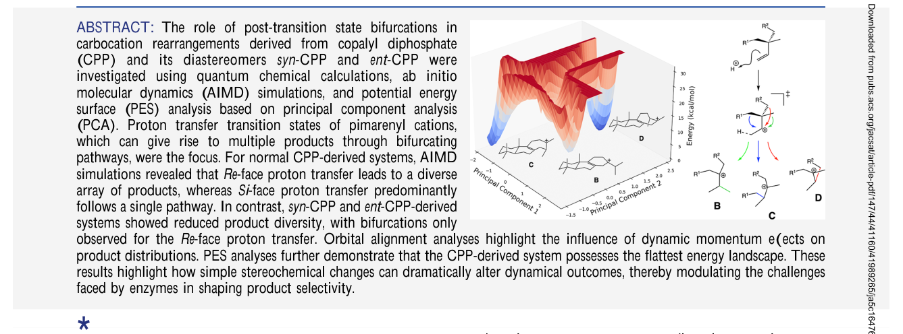

Downloaded from pubs.​acs.​org/​jacsat/​article-pdf/​147/​44/​41160/​41989265/​ja5c16476.​pdf by PEKING UNIV user on 21 August 2026

carbocation rearrangements proceeding along reaction coor- dinates with relatively flat regions (regions where structures change considerably but energy does not)—a scenario that has been encountered in a variety of terpene-forming reac- tions.15,16

Scheme 1. Potential PTSB in Miltiradiene Biosynthesis

While most of the modeling of such reactions has focused on inherent carbocation reactivity,17,18 the inclusion of full terpene synthase enzymes has shown that this inherent reactivity is generally expressed (although sometimes modu- lated in degree).19 In particular, PTSBs have been shown to persist in the context of an explicitly modeled terpene synthase enzyme.20−22 Experiments also support the importance of inherent carbocation reactivity, leading to the view that those interested in terpene synthase mechanisms ought to consider the intrinsic tendencies of reactive carbocations to determine what role a surrounding enzyme actually plays in determining rate and/or selectivity.17

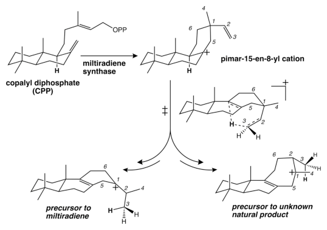

A particularly unusual reaction network containing multiple PTSBs was previously discovered as a potential biosynthetic

Once thought to be curiosities of dubious “real world relevance”, PTSBs have been shown to be relevant to synthetic organic chemistry,1,2,6−10 homogeneous catalysis via organo- metallic species,11−13 and biosynthesis.1,8,14,15 In the lattermost context, PTSBs have been shown to be particularly relevant to

© 2025 The Authors. Published by American Chemical Society

https://doi.org/10.1021/jacs.5c16476 J. Am. Chem. Soc. 2025, 147, 41160−41167

## 41160

<!-- page 2 -->

Journal of the American Chemical Society pubs.acs.org/JACS Article

Scheme 2. Diastereomers of CPP Examined

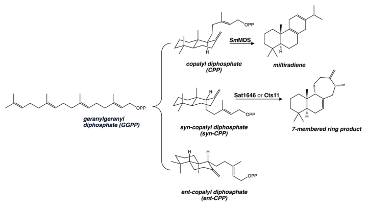

Downloaded from pubs.​acs.​org/​jacsat/​article-pdf/​147/​44/​41160/​41989265/​ja5c16476.​pdf by PEKING UNIV user on 21 August 2026

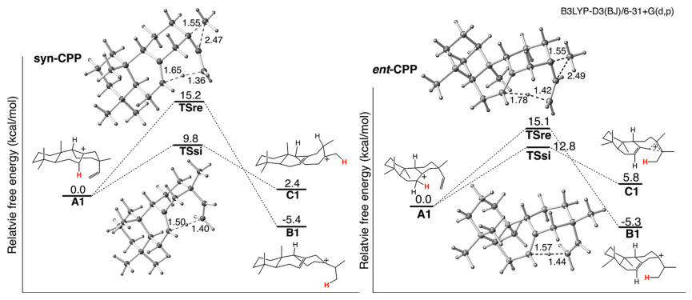

Figure 1. Computed energy profiles for both Re and Si proton transfers in syn-CPP and ent-CPP-derived pimarenyl cations.

route to miltiradiene (Scheme 1).14 In this case, a transition state for intramolecular proton transfer23,24 of the pimar-15-en- 8-yl cation (which would be derived from copalyl diphosphate, CPP, in a miltiradiene synthase enzyme) was followed by a PTSB, which was followed by additional PTSBs and flat regions of the potential energy surface (PES), allowing for direct access to 6−12 product minima (the range is a result of differences resulting from using potential energy, free energy, or molecular dynamics trajectories). This discovery necessarily reshaped the questions one should ask about an enzyme making use of this type of transition state. Instead of asking how such an enzyme forms miltiradiene, one perhaps should ask how it avoids the formation of so many other easily accessible products. One also might ask if any of these other products are formed in Nature. The inherent dynamical tendency of the pimar-15- en-8-yl cation in question was shown to form a carbocation precursor to miltiradiene preferentially,14 indicating that Nature might indeed take advantage of the dynamical properties of substrates (and opening a discussion on the role of these in enzyme evolution). The second most likely product, based on ab initio molecular dynamics (AIMD) simula- tions25−28 initiated from the proton transfer transition state, possessed a skeleton with a 7-membered ring (Scheme 1). While, to our knowledge, a natural product with this skeleton is still not known, a closely related skeleton has been described as

a minor product of terpene synthases that produce a stemodene and several pimaradienes (Scheme 2).29,30 This natural product would be derived from the syn diastereomer of CPP. The disclosure of this structure thus begs the following questions: Do pimar-15-en-8-yl cations derived from diaster- eomers of CPP also have transition states for intramolecular proton transfer followed by reaction pathway bifurcations? If so, what product selectivities are expected based on the inherent dynamical tendencies of the carbocations involved? If not, why not? What, if anything, is unique about the precursor to miltiradiene? It was shown previously that a diastereomor- phic proton transfer transition state derived from CPP (proton transfer to the Si rather than Re face of the alkene that accepts the proton) was not followed by a PTSB and did not have a tendency to form precursors to miltiradiene (which would have been possible, in principle, since proton transfer does not create a stereogenic center),14 suggesting that relatively small changes to structure could have dramatic consequences. Here we investigated pimar-15-en-8-yl cations derived from diastereomers of CPP (Scheme 2) using quantum chemistry and AIMD simulations to determine whether or not PTSBs are present and why and why not. We analyzed the dynamic effects influencing predicted product distributions in terms of geometries and molecular orbitals, along with potential energy surfaces constructed using a new approach based on principal component analysis (PCA).

https://doi.org/10.1021/jacs.5c16476 J. Am. Chem. Soc. 2025, 147, 41160−41167 41161

<!-- page 3 -->

Journal of the American Chemical Society pubs.acs.org/JACS Article

Scheme 3. Three Types of Major Products Expected to Result from Proton Transfer (left) and Structures for Non-target Products (right)

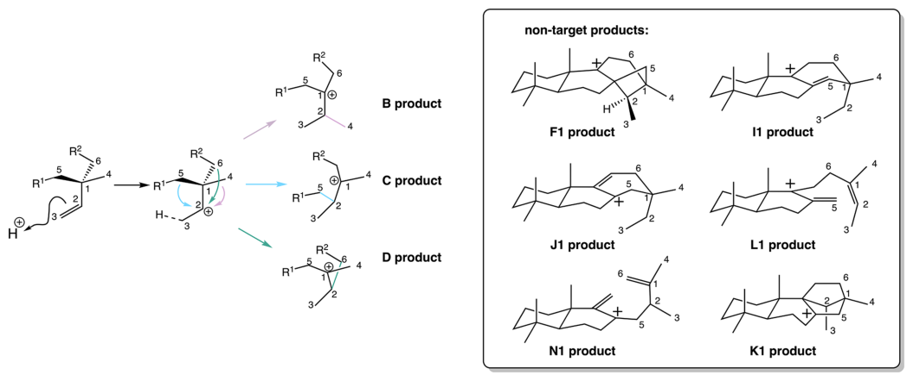

Downloaded from pubs.​acs.​org/​jacsat/​article-pdf/​147/​44/​41160/​41989265/​ja5c16476.​pdf by PEKING UNIV user on 21 August 2026

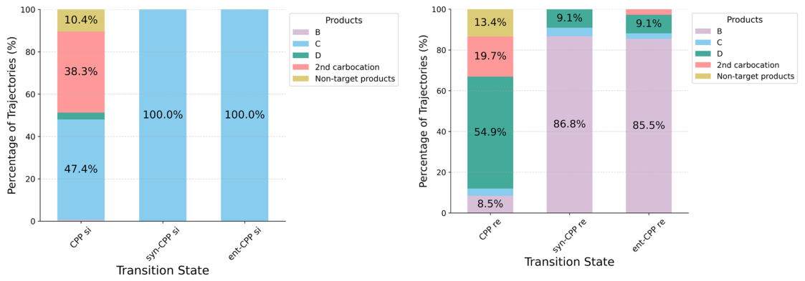

Figure 2. Distribution of trajectory outcomes (B3LYP-D3(BJ)/6-31G(d)) from different transition states for pimarenyl cations derived from CPP, syn-CPP, and ent-CPP. Results with Si transition states are at the left, while those from Re transition states are at the right.

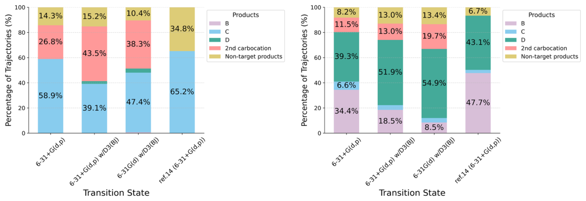

Figure 3. Distribution of trajectory outcomes from Si (left) and Re (right) transition states for pimarenyl cations derived from CPP using different levels of theory.

https://doi.org/10.1021/jacs.5c16476 J. Am. Chem. Soc. 2025, 147, 41160−41167 41162

<!-- page 4 -->

Journal of the American Chemical Society pubs.acs.org/JACS Article

## Computational Methods

MD simulations). PES energies were obtained from relaxed scans, and the surface coordinates were derived from PCA (scikit-learn; see the Supporting Information for additional detiails).44 ■RESULTS AND DISCUSSION

All quantum chemical calculations were performed with Gaussian16.31

All geometries were optimized at the B3LYP-D3(BJ)/6-31+G(d,p) level of theory, which includes dispersion correction.32−38 Harmonic vibrational frequencies were calculated at the same level of theory. Intrinsic reaction coordinate (IRC) calculations were used to confirm the minima connected to the transition structures.39−41 All AIMD simulations were quasiclassical and were performed using Prog- dyn42,43 with trajectories initiated from transition states (using the B3LYP-D3(BJ)/6-31G(d) level of theory; we found that the reduced basis set gives qualitatively similar answers, while allowing for faster

Transition Structures and Barriers. While terpene synthase enzymes facilitate the disconnection of the substrate’s diphosphate group, triggering a cyclization that generates a pimarenyl cation (e.g., Scheme 1), we focused here on the subsequent reaction pathways for the diastereomers of CPP shown in Scheme 2. Two transition structures for intra- molecular proton transfer were expected for each diastereomer since the vinyl group of each pimarenyl cation can abstract a proton with either its Re or Si face. The corresponding energy profiles for pimarenyl cations derived from syn- and ent-CPP are illustrated in Figure 1. For both cases, two transition structures were found and Si proton transfer was preferred, as was the case for pimarenyl cations derived from CPP.14 The magnitude of the preference for Si proton transfer varied, however, which is presumably a result of different strain associated with differences in relative configuration. Note that for the diastereomers examined here, Re proton transfer is coupled to ring expansion and Si proton transfer is coupled to methyl shift based on IRC calculations. However, as described above, previous results indicated that transition states for proton transfer from CPP-derived cations lead to multiple products, an issue that MD simulations are required to address. Dynamical Tendencies. AIMD simulations were per- formed for each system. Trajectories were initiated from both the Si and Re proton transfer transition states. The three main types of products that are formed for the pimarenyl cations examined here are denoted as B (6-membered ring), C (7- membered ring; migration from “front”), and D (7-membered ring; migration from “back”); all other products are considered to be “non-target products” (Scheme 3). Results are summarized in Figure 2. See the Supporting Information for details on the distribution of trajectories forming each nontarget product. In the case of CPP product trajectories, many remain in the region of the secondary carbocation after 500 fs (labeled as the “2nd carbocation” in Figures 2 and 3) (Scheme 3). Trajectories initiated from pimarenyl cations derived from normal CPP lead to more products than do their diastereomers—regardless of whether they originate from the Si or Re transition states. While the product distributions are not quantitatively the same as those found previously,14 the result of the different level of theory used here and variations expected in running modest numbers of trajectories (Figure 3), the significant amounts of products B and D were expected for the AIMD simulations initiated from the Re transition state, as was the formation of multiple products (Figures 2 and 3, right). The product distribution found for the Si transition state is also similar to that found previously (Figures 2 and 3, left).14 Note, however, that in the previously published work, trajectories were propagated past the secondary cation (sometimes for an additional ∼1000 fs) to determine the final product, complicating comparisons.14

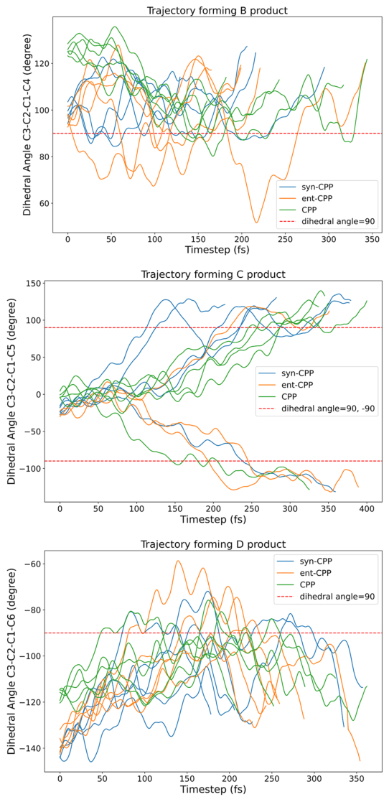

Downloaded from pubs.​acs.​org/​jacsat/​article-pdf/​147/​44/​41160/​41989265/​ja5c16476.​pdf by PEKING UNIV user on 21 August 2026

For both syn-CPP and ent-CPP-derived cations, only one product (the one connected to the transition structure by IRC) is formed from Si proton transfer (Figure 2, left), indicating that there is no PTSB in this system. In contrast, Re proton transfers for these two diastereomers do exhibit bifurcations, but these have strong preferences for products B (again

Figure 4. Evolution of key dihedral angles (C3−C2−C1−CX; X = 4 for B, X = 5 for C, and X = 6 for D) along trajectories leading to the formation of products B (top), C (middle), and D (bottom). Red dashed lines indicate the angle (∼90°) ideal for orbital overlap of the migrating C1−CX bond and the formally empty p-orbital on C2.

https://doi.org/10.1021/jacs.5c16476 J. Am. Chem. Soc. 2025, 147, 41160−41167 41163

<!-- page 5 -->

Journal of the American Chemical Society pubs.acs.org/JACS Article

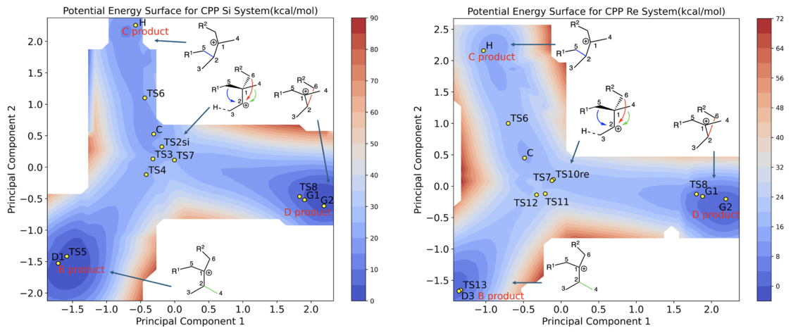

Downloaded from pubs.​acs.​org/​jacsat/​article-pdf/​147/​44/​41160/​41989265/​ja5c16476.​pdf by PEKING UNIV user on 21 August 2026

Figure 5. 2D contour plots of the PESs for Si (left) and Re (right) proton transfer in the CPP-derived systems. The color scale represents relative energy differences in kcal/mol. In both figures, structural labels are preserved from a previously published study to maintain consistency; for specific structural definitions, please refer to the Supporting Information; labels in red denote the corresponding product class used in this study.

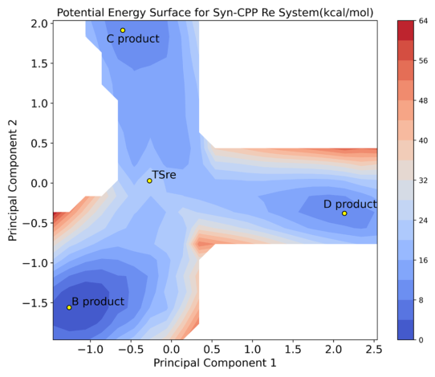

C, X = 6 for D) dihedral angles (Scheme 3) along trajectories (Figure 4) to examine whether appropriate orbital alignment was present when transition states were reached. Here, we focus our discussion on Re proton transfer since this leads to the most products. For each of CPP, ent-CPP, and syn-CPP, we randomly selected five trajectories leading to the formation of B, C, and D products. The evolution of the relevant dihedral angles along these trajectories is summarized in Figure 4. To achieve maximum orbital overlap for shifting, each dihedral angle must approach ±90°. For trajectories leading to products B, dihedral angles for ent-CPP and syn-CPP have already approached 90° as the proton is transferred. However, for normal CPP, ∼150 fs passes before this dihedral angle is reached. This difference is consistent with a momentum effect working against the formation of B products with CPP, the diastereomer for which such products are formed only in small amounts. For trajectories leading to products C, dihedral angles for all three systems are not near 90° as the proton is transferred, consistent with the low amounts of C products observed. For trajectories leading to products D, again dihedral angles for none of the three systems are close to 90° but those for the normal CPP system are closest, consistent with a momentum effect at least contributing to the increased amount of D products in this system. Construction of Potential Energy Surfaces. To further investigate the dynamical tendencies of the reactive species in these reactions, we aimed to construct potential energy surfaces (PESs) and examine how their shapes influence dynamic selectivity. However, the numerous degrees of

Figure 6. 2D contour plot of the PES for Re proton transfer in the syn-CPP-derived system.

matching IRC predictions) (Figure 2, right). Thus, the CPP- based system does appear to be unusual in terms of its dynamic behavior, but why? Trajectory Analysis. Since the migrating σ-bond must align with the formally empty p-orbital of the carbocation for migration to occur (see Supporting Information for NBO data), we tracked the C3−C2−C1−CX (X = 4 for B, X = 5 for

Scheme 4. Proton Transfer Pathways of the CPP Carbocation

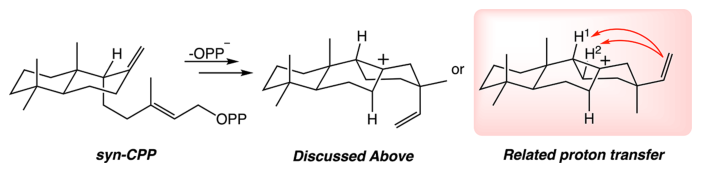

https://doi.org/10.1021/jacs.5c16476 J. Am. Chem. Soc. 2025, 147, 41160−41167 41164

<!-- page 6 -->

Journal of the American Chemical Society pubs.acs.org/JACS Article

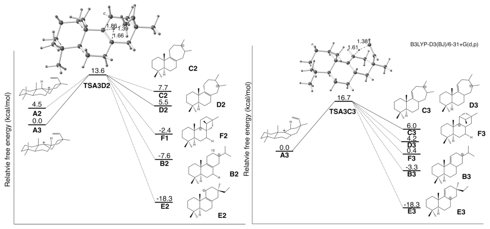

Downloaded from pubs.​acs.​org/​jacsat/​article-pdf/​147/​44/​41160/​41989265/​ja5c16476.​pdf by PEKING UNIV user on 21 August 2026

Figure 7. Optimized geometries of alternative transition states for proton transfer in the syn-CPP system. Solid lines indicate IRC-derived products, while dashed lines represent products obtained from the AIMD simulation.

Table 1. Trajectory Distributions from AIMD Simulationsa

transition state is not as straightforward to rationalize, but the flatness of the PES in the vicinity of the transition structure is consistent with momentum playing a large role, as previously postulated.14 In contrast, the PES for Re proton transfer from the syn-CPP-derived pimarenyl cation (Figure 6) is far less flat. Related Proton Transfers. To further explore how structural differences influence the intrinsic reactivity of different CPP diastereomers, we extended our analysis to include possible additional proton transfer pathways in the syn- CPP system (Scheme 4). For both reactions, transition structures leading to multiple products are found. For H1

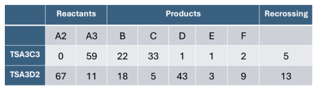

aShown are the product outcomes for trajectories initiated from TSA3C3 and TSA3D2.

deprotonation, AIMD trajectories indicate bifurcating path- ways in both the reactant and product directions. Figure 7 (left) shows the transition structures and all reactants and minima connected to them by either IRC or AIMD calculations. Corresponding product distributions from AIMD simulations are summarized in Table 1. While TSA3C3 leads predominantly to two products, TSA3D2 leads to multiple products, whose relative amounts do not reflect their relative energies. This latter scenario corresponds to comparable diversity as observed previously for Re proton transfer with normal CPP, but with lower inherent dynamical selectivity! Implications. The combination of calculations on energy surfaces and molecular dynamics trajectories described here for intramolecular proton transfers in diastereomeric pimar-15-en- 8-yl carbocations has revealed that post-transition state bifurcations are common for such molecular architectures, but the associated product diversity and inherent dynamical selectivity vary greatly. Consequently, the challenges faced by terpene synthase enzymes chaperoning such chemistry will differ from system to system, with some systems requiring more intervention than others if high selectivity is functionally useful. Of course, product diversity also has utility,48 and here we show how some systems are perhaps better suited to that than others. We believe strongly that attempts to predict terpene synthase function (from sequence or otherwise) should take inherent substrate reactivity into account,17 and that reactivity often involves nonstatistical dynamic effects given the nature of delocalization and flat PESs associated with

freedom involved presented challenges in accurately mapping the PESs.45,46 To tackle this challenge, we employed PCA to reduce the dimensionality to two principal components.47

Specifically, PCA was applied to all changing (breaking/ forming) bond distances, allowing us to identify the two components that capture the most structural variation (see the Supporting Information for details). These components reflect linear combinations of the bond distance changes. The resulting two-dimensional coordinate space was then scanned to construct the PESs. A comparison of Si- and Re-face proton transfer for the CPP- derived pimarenyl cation is shown in Figure 5.14 Relaxed scans were performed at the B3LYP-D3(BJ)/6-31G(d) level. While the two principal components do not fully capture all structural differences—some related structures such as TS8 and G1 are difficult to distinguish on this PES—the PES still captures features useful for interpreting the results of molecular dynamics simulations. As shown in Figure 2, trajectories initiated from the transition state for Si-face proton transfer predominantly yielded products C, whereas those initiated from the transition state for Re-face proton transfer more often produced products B and D. The formation of products C from the Si transition structure is consistent with this transition structure (labeled TS2 here based on the previous study14) being close to the shallow secondary cation intermediate (coincidentally called “C” in the previous study14 and the exit channel to products C. A substantial number of AIMD trajectories initiated from the Si transition state also do not escape from the secondary cation region after 500 fs. The preferential formation of products B and D from the Re

https://doi.org/10.1021/jacs.5c16476 J. Am. Chem. Soc. 2025, 147, 41160−41167 41165

<!-- page 7 -->

Journal of the American Chemical Society pubs.acs.org/JACS Article

carbocations.15 Enzymes do remarkable things, but so do their substrates! ■ASSOCIATED CONTENT * sı Supporting Information The Supporting Information is available free of charge at https://pubs.acs.org/doi/10.1021/jacs.5c16476. Additional computational details, including methods, benchmarking results, NBO analysis, IRC plots (PDF) ■AUTHOR INFORMATION Corresponding Author

(10) Kong, W.-Y.; Hu, Y.; Guo, W.; Potluri, A.; Schomaker, J. M.; Tantillo, D. J. Synthetically Relevant Post-Transition State Bifurcation Leading to Diradical and Zwitterionic Intermediates: Controlling Nonstatistical Kinetic Selectivity through Solvent Effects. J. Am. Chem. Soc. 2025, 147 (6), 5310−5319. (11) Tantillo, D. J. Dynamically Controlled Kinetic Selectivity in Reactions Promoted by Transition-Metal Catalysts. Chem. Catal. 2025, 5 (7), 101431. (12) Tantillo, D. J. Quantum Chemical Interrogation of Reactions Promoted by Dirhodium Tetracarboxylate Catalysts−Mechanism, Selectivity, and Nonstatistical Dynamic Effects. Acc. Chem. Res. 2024, 57 (14), 1931−1940. (13) Schaefer, A. J.; Joy, J.; Davenport, M. T.; Ess, D. H. Dynamic Effects Influencing Mechanisms and Selectivity in Metal-Mediated Organometallic Reactions. Organometallics 2025, 44 (15), 1603− 1619. (14) Hong, Y. J.; Tantillo, D. J. Biosynthetic Consequences of Multiple Sequential Post-Transition-State Bifurcations. Nat. Chem. 2014, 6 (2), 104−111. (15) Hare, S. R.; Tantillo, D. J. Dynamic Behavior of Rearranging Carbocations −Implications for Terpene Biosynthesis. Beilstein J. Org. Chem. 2016, 12 (1), 377−390. (16) Tantillo, D. J. The Carbocation Continuum in Terpene Biosynthesis—Where Are the Secondary Cations? Chem. Soc. Rev. 2010, 39 (8), 2847. (17) Tantillo, D. J. Importance of Inherent Substrate Reactivity in Enzyme-Promoted Carbocation Cyclization/Rearrangements. Angew. Chem., Int. Ed. 2017, 56 (34), 10040−10045. (18) Tantillo, D. J. Interrogating Chemical Mechanisms in Natural Products Biosynthesis Using Quantum Chemical Calculations. Wiley Interdiscip. Rev.: comput. Mol. Sci. 2020, 10 (3), No. e1453. (19) Raz, K.; Levi, S.; Gupta, P. K.; Major, D. T. Enzymatic Control of Product Distribution in Terpene Synthases: Insights from Multiscale Simulations. Curr. Opin. Biotechnol. 2020, 65, 248−258. (20) Hong, Y. J.; Tantillo, D. J. Quantum Chemical Dissection of the Classic Terpinyl/Pinyl/Bornyl/Camphyl Cation Conundrum—the Role of Pyrophosphate in Manipulating Pathways to Monoterpenes. Org. Biomol. Chem. 2010, 8 (20), 4589. (21) Weitman, M.; Major, D. T. Challenges Posed to Bornyl Diphosphate Synthase: Diverging Reaction Mechanisms in Mono- terpenes. J. Am. Chem. Soc. 2010, 132 (18), 6349−6360. (22) Major, D. T.; Weitman, M. Electrostatically Guided Dynamics—The Root of Fidelity in a Promiscuous Terpene Synthase? J. Am. Chem. Soc. 2012, 134 (47), 19454−19462. (23) Hong, Y. J.; Tantillo, D. J. Feasibility of Intramolecular Proton Transfers in Terpene Biosynthesis −Guiding Principles. J. Am. Chem. Soc. 2015, 137 (12), 4134−4140. (24) Liang, J.; Merrill, A. T.; Laconsay, C. J.; Hou, A.; Pu, Q.; Dickschat, J. S.; Tantillo, D. J.; Wang, Q.; Peters, R. J. Deceptive Complexity in Formation of Cleistantha-8,12-Diene. Org. Lett. 2022, 24 (14), 2646−2649. (25) Ma, X.; Hase, W. L. Perspective: Chemical Dynamics Simulations of Non-Statistical Reaction Dynamics. Philos. Transact. A Math. Phys. Eng. Sci. 2017, 375 (2092), 20160204. (26) Jayee, B.; Hase, W. L. Nonstatistical Reaction Dynamics. Annu. Rev. Phys. Chem. 2020, 71, 289−313. (27) Carpenter, B. K. Energy Disposition in Reactive Intermediates. Chem. Rev. 2013, 113 (9), 7265−7286. (28) Pratihar, S.; Ma, X.; Homayoon, Z.; Barnes, G. L.; Hase, W. L. Direct Chemical Dynamics Simulations. J. Am. Chem. Soc. 2017, 139 (10), 3570−3590. (29) Xing, B.; Yu, J.; Chi, C.; Ma, X.; Xu, Q.; Li, A.; Ge, Y.; Wang, Z.; Liu, T.; Jia, H.; Yin, F.; Guo, J.; Huang, L.; Yang, D.; Ma, M. Functional Characterization and Structural Bases of Two Class I Diterpene Synthases in Pimarane-Type Diterpene Biosynthesis. Commun. Chem. 2021, 4 (1), 140. (30) Yu, J.; Shiraishi, T.; Taizoumbe, K. A.; Karasuno, Y.; Yoshida, A.; Nishiyama, M.; Dickschat, J. S.; Kuzuyama, T. Mechanistic

Dean J. Tantillo −Department of Chemistry, University of California, Davis, California 95616, United States; Email: djtantillo@ucdavis.edu

Downloaded from pubs.​acs.​org/​jacsat/​article-pdf/​147/​44/​41160/​41989265/​ja5c16476.​pdf by PEKING UNIV user on 21 August 2026

Authors

Yumeng Cao −Department of Chemistry, University of California, Davis, California 95616, United States Wang-Yeuk Kong −Department of Chemistry, University of California, Davis, California 95616, United States;

orcid.org/0000-0002-4592-0666 Complete contact information is available at: https://pubs.acs.org/10.1021/jacs.5c16476

Notes The authors declare no competing financial interest. ■ACKNOWLEDGMENTS Support from the National Institutes of Health (1R35GM153469) and the National Science Foundation’s ACCESS program (CHE240194) is gratefully acknowledged. We are gratefully to Prof. Reuben Peters for inspiring suggestions. ■REFERENCES

(1) Hare, S. R.; Tantillo, D. J. Post-Transition State Bifurcations Gain Momentum −Current State of the Field. Pure Appl. Chem. 2017, 89 (6), 679−698. (2) Ess, D. H.; Wheeler, S. E.; Iafe, R. G.; Xu, L.; Çelebi-Ölçüm, N.; Houk, K. N. Bifurcations on Potential Energy Surfaces of Organic Reactions. Angew. Chem., Int. Ed. 2008, 47 (40), 7592−7601. (3) Valtazanos, P.; Ruedenberg, K. Bifurcations and Transition States. Theor. Chim. Acta 1986, 69 (4), 281−307. (4) Rehbein, J.; Wulff, B. Chemistry in Motion—off the MEP. Tetrahedron Lett. 2015, 56 (50), 6931−6943. (5) Rehbein, J.; Carpenter, B. K. Do We Fully Understand What Controls Chemical Selectivity? Phys. Chem. Chem. Phys. 2011, 13 (47), 20906. (6) Bekele, T.; Christian, C. F.; Lipton, M. A.; Singleton, D. A. “Concerted” Transition State, Stepwise Mechanism. Dynamics Effects in C2-C6 Enyne Allene Cyclizations. J. Am. Chem. Soc. 2005, 127 (25), 9216−9223. (7) Feng, Z.; Tantillo, D. J. Dynamic Effects on Migratory Aptitudes in Carbocation Reactions. J. Am. Chem. Soc. 2021, 143 (2), 1088− 1097. (8) Patel, A.; Chen, Z.; Yang, Z.; Gutiérrez, O.; Liu, H.; Houk, K. N.; Singleton, D. A. Dynamically Complex [6 + 4] and [4 + 2] Cycloadditions in the Biosynthesis of Spinosyn A. J. Am. Chem. Soc. 2016, 138 (11), 3631−3634. (9) Hare, S. R.; Pemberton, R. P.; Tantillo, D. J. Navigating Past a Fork in the Road: Carbocation−π Interactions Can Manipulate Dynamic Behavior of Reactions Facing Post-Transition-State Bifurcations. J. Am. Chem. Soc. 2017, 139 (22), 7485−7493.

https://doi.org/10.1021/jacs.5c16476 J. Am. Chem. Soc. 2025, 147, 41160−41167 41166

<!-- page 8 -->

Journal of the American Chemical Society pubs.acs.org/JACS Article

Characterization of Diterpene Synthase Pairs for Tricyclic Diterpenes from Cyanobacteria. J. Am. Chem. Soc. 2025, 147 (14), 11896−11905. (31) Frisch, M. J.; Trucks, G. W.; Schlegel, H. B.; Scuseria, G. E.; Robb, M. A.; Cheeseman, J. R.; Scalmani, G.; Barone, V.; Petersson, G. A.; Nakatsuji, H., et al. Gaussian16, Revision C.01; Gaussian, Inc.: Wallingford CT, 2016. (32) Becke, A. D. Density-Functional Thermochemistry III. The Role of Exact Exchange. J. Chem. Phys. 1993, 98, 5648−5652. (33) Lee, C.; Yang, W.; Parr, R. G. Development of the Colle- Salvetti Correlation-Energy Formula into a Functional of the Electron Density. Phys. Rev. B: condens. Matter. 1988, 37 (2), 785−789. (34) Stephens, P. J.; Devlin, F. J.; Chabalowski, C. F.; Frisch, M. J. Ab Initio Calculation of Vibrational Absorption and Circular Dichroism Spectra Using Density Functional Force Fields. J. Phys. Chem. 1994, 98 (45), 11623−11627. (35) Grimme, S.; Antony, J.; Ehrlich, S.; Krieg, H. A Consistent and Accurate Ab Initio Parametrization of Density Functional Dispersion Correction (DFT-D) for the 94 Elements H-Pu. J. Chem. Phys. 2010, 132 (15), 154104. (36) Ditchfield, R.; Hehre, W. J.; Pople, J. A. Self-Consistent Molecular-Orbital Methods. IX. An Extended Gaussian-Type Basis for Molecular-Orbital Studies of Organic Molecules. J. Chem. Phys. 1971, 54 (2), 724−728. (37) Hariharan, P. C.; Pople, J. A. The Influence of Polarization Functions on Molecular Orbital Hydrogenation Energies. Theor. Chim. Acta 1973, 28 (3), 213−222. (38) Clark, T.; Chandrasekhar, J.; Spitznagel, G. W.; Schleyer, P. V. R. Efficient Diffuse Function-Augmented Basis Sets for Anion Calculations. III. The 3−21+G Basis Set for First-Row Elements, Li−F. J. Comput. Chem. 1983, 4 (3), 294−301. (39) Maeda, S.; Harabuchi, Y.; Ono, Y.; Taketsugu, T.; Morokuma, K. Intrinsic Reaction Coordinate: Calculation, Bifurcation, and Automated Search. Int. J. Quantum Chem. 2015, 115 (5), 258−269. (40) Gonzalez, C.; Schlegel, H. B. Reaction Path Following in Mass- Weighted Internal Coordinates. J. Phys. Chem. 1990, 94 (14), 5523− 5527. (41) Fukui, K. The Path of Chemical Reactions - the IRC Approach. Acc. Chem. Res. 1981, 14, 363−368. (42) Kelly, K. K.; Hirschi, J. S.; Singleton, D. A. Newtonian Kinetic Isotope Effects. Observation, Prediction, and Origin of Heavy-Atom Dynamic Isotope Effects. J. Am. Chem. Soc. 2009, 131 (24), 8382− 8383. (43) Ussing, B. R.; Hang, C.; Singleton, D. A. Dynamic Effects on the Periselectivity, Rate, Isotope Effects, and Mechanism of Cycloadditions of Ketenes with Cyclopentadiene. J. Am. Chem. Soc. 2006, 128 (23), 7594−7607. (44) Pedregosa, F.; Varoquaux, G.; Gramfort, A.; Michel, V.; Thirion, B.; Grisel, O.; Blondel, M.; Prettenhofer, P.; Weiss, R.; Dubourg, V.; et al. Scikit-Learn: Machine Learning in Python. J. Mach. Learn. Res. 2011, 12 (85), 2825−2830. (45) Chuang, H.-H.; Tantillo, D. J.; Hsu, C.-P. Construction of Two-Dimensional Potential Energy Surfaces of Reactions with Post- Transition-State Bifurcations. J. Chem. Theory Comput. 2020, 16 (7), 4050−4060. (46) Guo, W.; Hare, S. R.; Chen, S.-S.; Saunders, C. M.; Tantillo, D. J. C−H Insertion in Dirhodium Tetracarboxylate-Catalyzed Reactions despite Dynamical Tendencies toward Fragmentation: Implications for Reaction Efficiency and Catalyst Design. J. Am. Chem. Soc. 2022, 144 (37), 17219−17231. (47) Hare, S. R.; Bratholm, L. A.; Glowacki, D. R.; Carpenter, B. K. Low Dimensional Representations along Intrinsic Reaction Coor- dinates and Molecular Dynamics Trajectories Using Interatomic Distance Matrices. Chem. Sci. 2019, 10 (43), 9954−9968. (48) Yoshikuni, Y.; Ferrin, T. E.; Keasling, J. D. Designed Divergent Evolution of Enzyme Function. Nature 2006, 440 (7087), 1078− 1082.

Downloaded from pubs.​acs.​org/​jacsat/​article-pdf/​147/​44/​41160/​41989265/​ja5c16476.​pdf by PEKING UNIV user on 21 August 2026

https://doi.org/10.1021/jacs.5c16476 J. Am. Chem. Soc. 2025, 147, 41160−41167 41167
