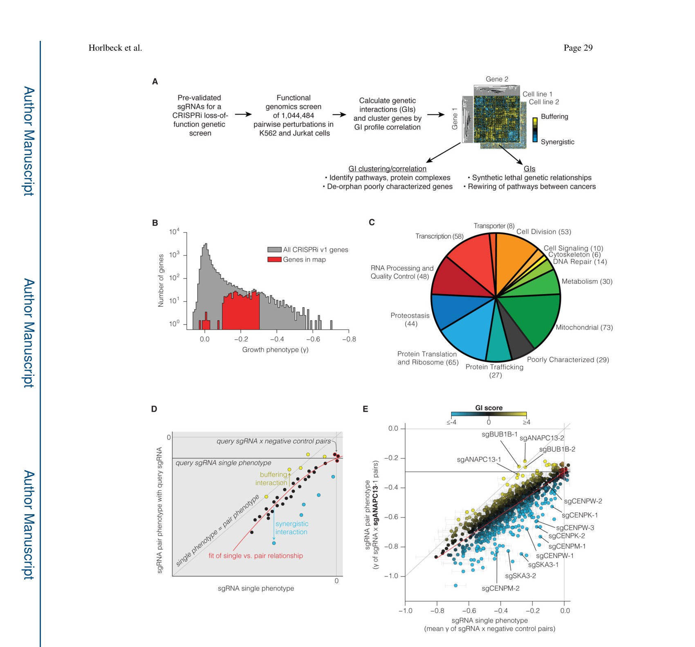
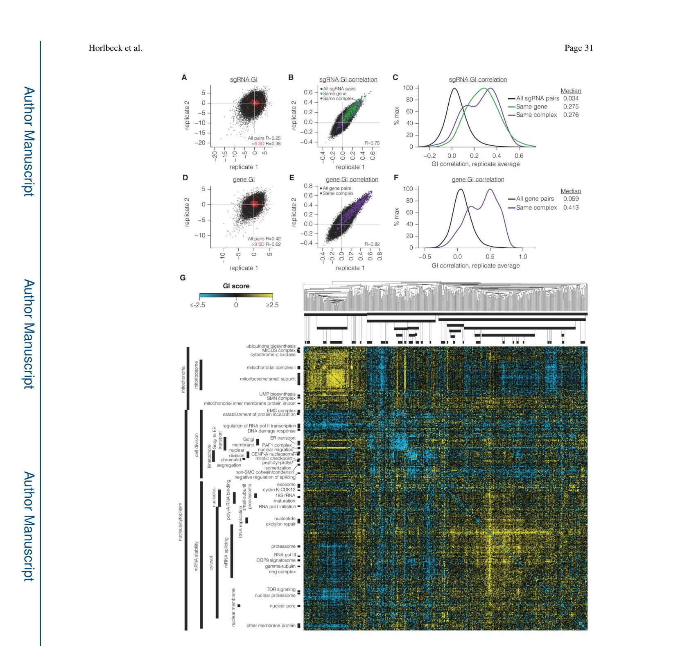
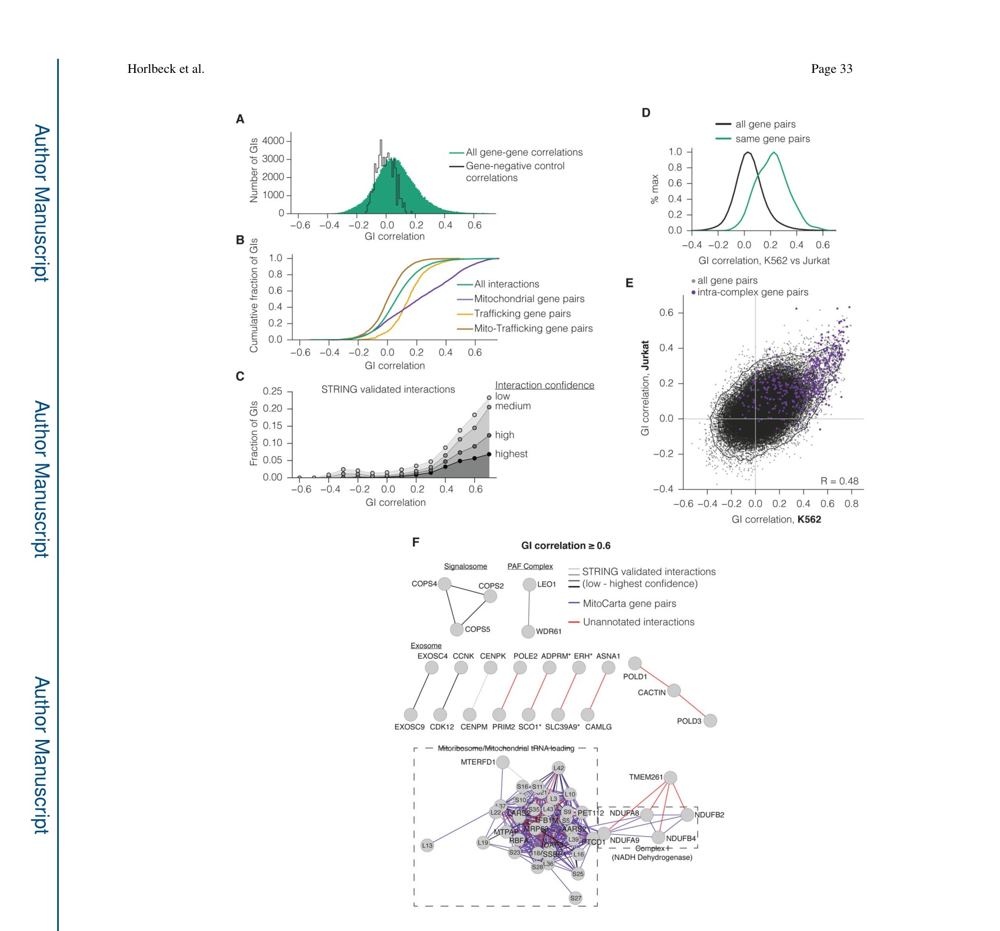
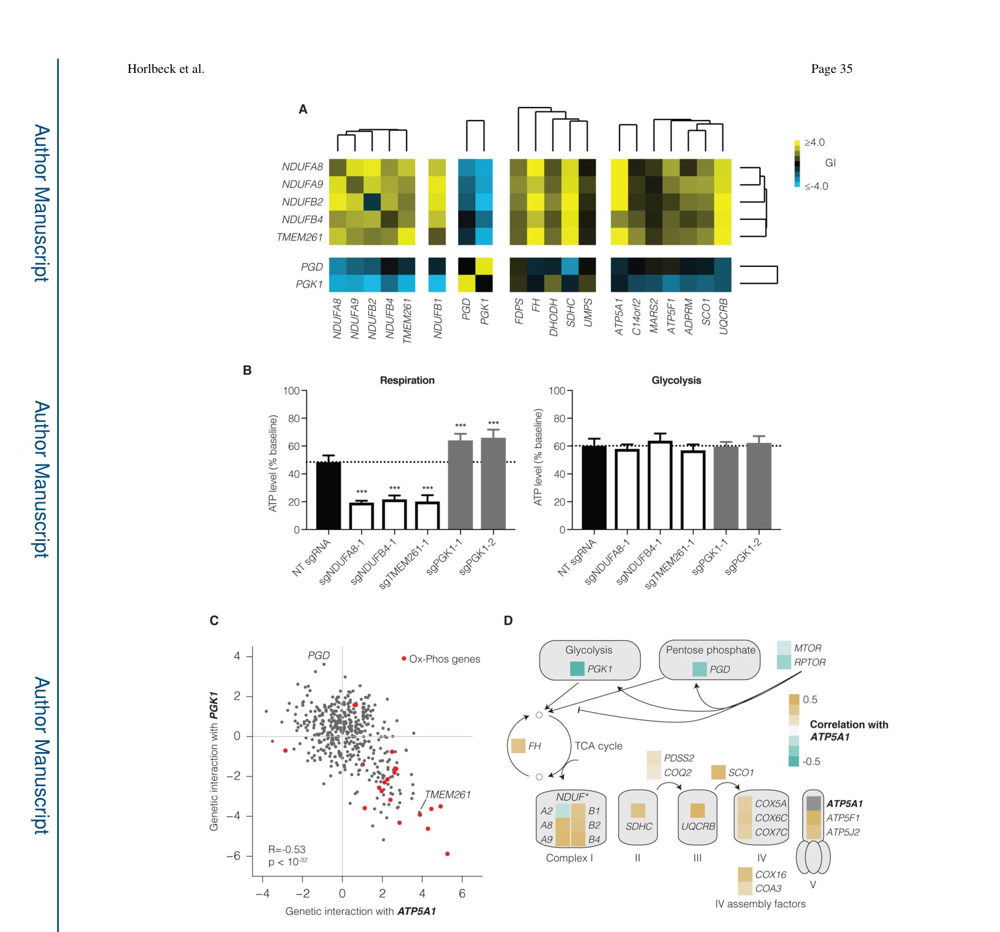
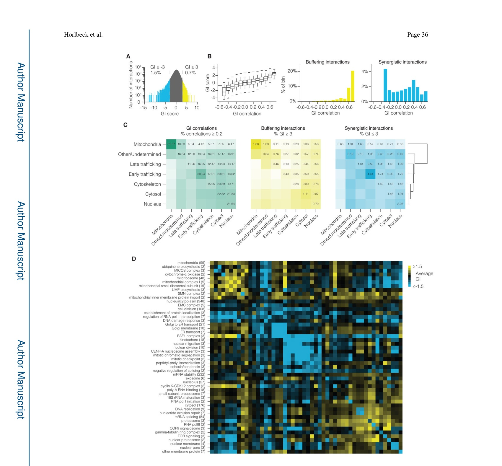
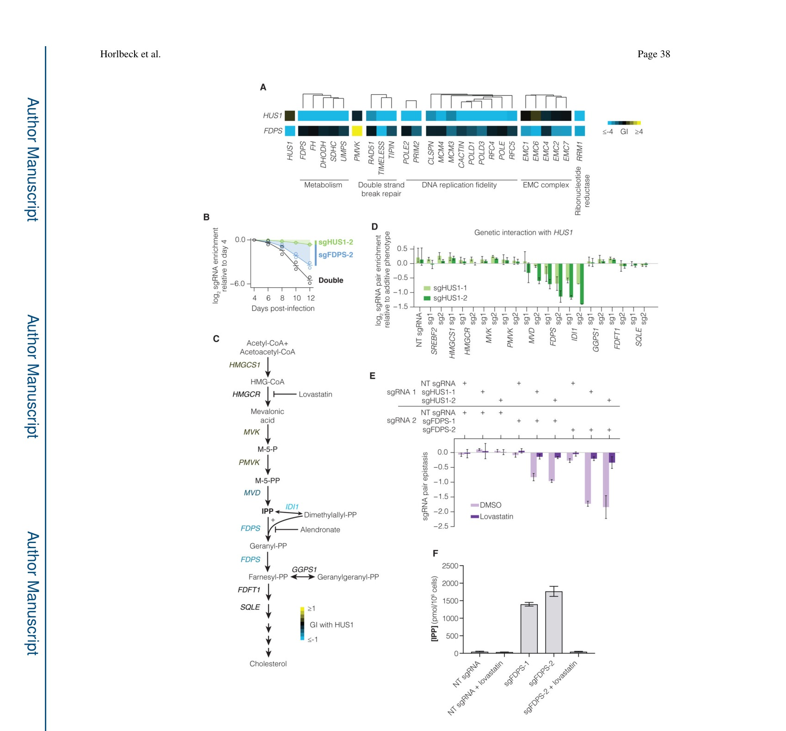
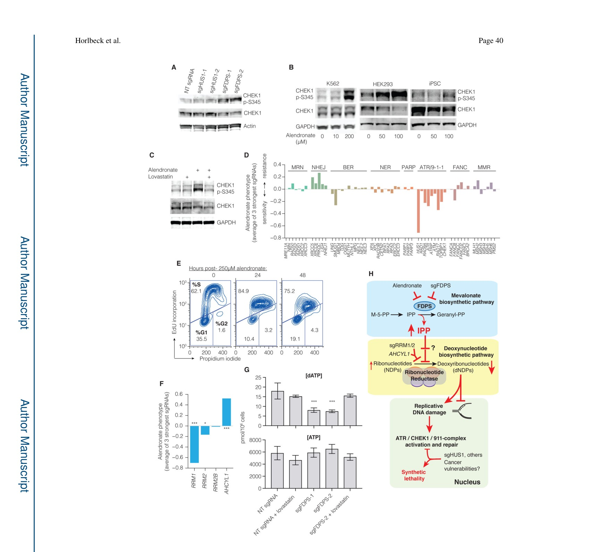

# Mapping the Genetic Landscape of Human Cells

DOI: https://doi.org/10.1016/j.cell.2018.06.010

> Complete text extracted page by page from the supplied original-layout PDF. Use paper.pdf when exact equations, tables, or typography matter.

## PDF Page 1

HHS Public Access
                 Author manuscript
                         Cell. Author manuscript; available in PMC 2019 August 09.

                Published in final edited form as:Author               Cell. 2018 August 09; 174(4): 953–967.e22. doi:10.1016/j.cell.2018.06.010.

         Mapping the genetic landscape of human cellsManuscript
           Max A. Horlbeck1,2,3, Albert Xu1,2,3, Min Wang4, Neal K. Bennett5, Chong Y. Park6,7, Derek
              Bogdanoff8, Britt Adamson1,2,3, Eric D. Chow8, Martin Kampmann9, Tim R. Peterson10, Ken
              Nakamura5,11, Michael A. Fischbach4, Jonathan S. Weissman1,2,3,*,#, and Luke A.
                 Gilbert12,13,*
              1Department of Cellular & Molecular Pharmacology, University of California, San Francisco, San
                Francisco, CA 94158, USA
             2Howard Hughes Medical Institute,Author
                 3California Institute for Quantitative Biomedical Research, University of California, San Francisco,
            San Francisco, CA 94158, USA
              4Department of Bioengineering and ChEM-H, Stanford University, Stanford, CA 94305Manuscript               5Gladstone Institute of Neurological Disease, San Francisco, CA, 94158, USA
                6Innovative Genomics Institute, University of California, San Francisco, San Francisco, CA 94158,
          USA
               7Current Address: Division of Cardiovascular Medicine and Cardiovascular Institute, Stanford
                University School of Medicine, Stanford, CA 94305, USA
               8Center for Advanced Technology, Department of Biophysics and Biochemistry University ofAuthor              California, San Francisco, San Francisco, CA 94158, USA
                  9Institute for Neurodegenerative Diseases and Department of Biochemistry & Biophysics,
                University of California, San Francisco, and Chan Zuckerberg Biohub, San Francisco, CA 94158,
          USAManuscript              10Department of Internal Medicine, Division of Bone & Mineral Diseases, Department of Genetics,
                  Institute for Public Health, Washington University School of Medicine, BJC Institute of Health, 425
                S. Euclid Ave., St. Louis, MO 63110, USA.
              11Department of Neurology, University of California, San Francisco, CA 94158, USA

                    *Correspondence should be addressed to jonathan.weissman@ucsf.edu and luke.gilbert@ucsf.edu.
                  #Lead contactAuthor          AUTHOR CONTRIBUTIONS
                   M.A.H., J.S.W., and L.A.G. were responsible for the conception, design, and interpretation of the experiments and wrote the
                     manuscript. M.K., M.A.F., K.N., T.R.P, B.A. and E.D.C. contributed to the conception and design of the experiments and critically
                      edited the manuscript. L.A.G. constructed GI vectors and libraries. M.A.H. and L.A.G. conducted the GI mapping experiments.
                 M.A.H. performed the GI data analysis. L.A.G., A.X., M.W., N.K.B, C.Y.P, D.B. conducted validation experiments.
              DECLARATION OF INTERESTSManuscript           MAH, LAG, MK, and JSW have filed patent applications related to CRISPRi/a screening and GI mapping. JSW is a founder of KSQ
                      Therapeutics.
                     Publisher's Disclaimer: This is a PDF file of an unedited manuscript that has been accepted for publication. As a service to our
                    customers we are providing this early version of the manuscript. The manuscript will undergo copyediting, typesetting, and review of
                      the resulting proof before it is published in its final citable form. Please note that during the production process errors may be
                     discovered which could affect the content, and all legal disclaimers that apply to the journal pertain.

## PDF Page 2

Horlbeck et al.                                                                                                 Page 2

              12Department of Urology, University of California, San Francisco, San Francisco, CA 94158, USA
               13Helen Diller Family Comprehensive Cancer Center, San Francisco, San Francisco, CA 94158,
          USAAuthor

        SUMMARY

                   Seminal yeast studies established the value of comprehensively mapping genetic interactions (GIs)
                       for inferring gene function. Efforts in human cells using focused gene sets underscore the utility ofManuscript
                         this approach, but the feasibility of generating large-scale, diverse human GI maps remains
                     unresolved. We developed a CRISPR interference platform for large-scale quantitative mapping of
                human GIs. We systematically perturbed 222,784 gene pairs in two cancer cell lines. The resulting
                 maps cluster functionally related genes, assigning function to poorly characterized genes,
                     including TMEM261,a new electron transport chain component. Individual GIs pinpoint
                    unexpected relationships between pathways, exemplified by a specific cholesterol biosynthesis
                      intermediate whose accumulation induces deoxynucleotide depletion, causing replicative DNAAuthor              damage and a synthetic-lethal interaction with the ATR/9-1-1 DNA repair pathway. Our map
                     provides a broad resource, establishes GI maps as a high-resolution tool for dissecting gene
                       function, and serves as a blueprint for mapping the genetic landscape of human cells.

            Graphical AbstractManuscript

Author
Manuscript

             In brief

            A large-scale genetic interaction map in human cells reveals unexpected interdependenciesAuthor               between core pathways and exposes potential combination therapies for cancer

            Keywords
                    Genetic interactions; Functional genomics; epistasis; CRISPR; CRISPRiManuscript

                                                   Cell. Author manuscript; available in PMC 2019 August 09.

## PDF Page 3

Horlbeck et al.                                                                                                 Page 3

         INTRODUCTION

                  A powerful approach to objectively and systematically identify gene function is to mapAuthor                            genetic interactions (GIs)—pair-wise measurements of how the activity of one gene
                             modulates the phenotype of another gene. Applied broadly across many pairs of functionally
                                diverse genes, GI maps provide a signature of interactions for each gene that act as a high-
                                  resolution, quantitative phenotype. This signature can be used to objectively identify genes
                              with similar functions without any aprioriassumptions. The pattern of GIs can also revealManuscript
                                the hierarchical organization of gene products into functional complexes and pathways
                                 (Collins et al., 2007).

                       By far the most mature efforts to exploit GI maps have been in the budding yeast S.
                               cerevisiae.Pioneering work from Boone and colleagues enabled the first large-scale
                           measurement of GIs (Tong et al., 2001,2004). Early GI maps demonstrated the broad utility
                                of such efforts in enabling functional discoveries including the identification of
                               uncharacterized protein complexes, cellular quality control and regulatory strategies, as wellAuthor
                                as unrecognized biosynthetic pathways (Collins et al., 2007; Jonikas et al., 2009; Pan et al.,
                             2004, 2006; Schuldiner et al., 2005; Segrè et al., 2005). GI maps also revealed functional
                               rewiring in yeast response to DNA damage or autophagy stress (Bandyopadhyay et al.,
                             2010; Kramer et al., 2017). More recently, hallmark papers in S.cerevisiaerevealed the firstManuscript                        and only comprehensive functional genetic landscape of a cell (Costanzo et al., 2010, 2016).
                                 Additionally, GI mapping efforts in prokaryotes, as well recent work in S.pombe,fruit fly
                           and human cells, demonstrate the general utility and enormous promise of GI maps across
                                diverse organisms (Babu et al., 2014; Bassik et al., 2013; Boettcher et al., 2018; Du et al.,
                             2017; Fischer et al., 2015; Frost et al., 2012; Han et al., 2017; Roguev et al., 2007, 2013;
                            Rosenbluh et al., 2016; Shen et al., 2017; Wong et al., 2016).

                           Given the success of yeast studies, as well as focused efforts in mammalian cells, it is clearAuthor                                   that large-scale GI maps of human cells could be transformative tools for facilitating the
                               systematic elucidation of the function of protein coding and non-coding genes as well as
                                revealing higher-level principles of cellular organization. Additionally, large-scale GI maps
                            can aid the design of therapeutic efforts both by identifying synthetic-lethal combinations,Manuscript                        which can enable rational design of combination therapies, as well by identifying buffering
                                or suppressive interactions, which can provide molecular targets whose inhibition will
                               ameliorate the consequences of genetic mutations. However, the broader goal of mapping
                                diverse cellular processes in vertebrates comprehensively remains unmet.

                               Multiple challenges have limited large-scale GI mapping efforts in human cells. There are an
                           enormous number of possible gene pair combinations to query (~200 million for a
                         mammalian cell), and strong GIs are typically rare (Hartman et al., 2001). Thus, generatingAuthor                              quantitative genetic interaction maps require a method for robustly perturbing a given gene’s
                                functions while avoiding heterogeneity and off-target effects. Additionally, for large
                           numbers of gene pairs, one must be able to precisely measure the effect of each genetic
                                perturbation and quantitatively evaluate the observed defect for a gene pair relative to that
                              expected from the phenotypes of the individual perturbations. These challenges have beenManuscript
                               mitigated by preselecting smaller subsets of functionally related genes (e.g., involved in

                                                   Cell. Author manuscript; available in PMC 2019 August 09.

## PDF Page 4

Horlbeck et al.                                                                                                 Page 4

                                chromatin-regulation, toxin resistance, regulators of β-catenin activity, or cancer biology)
                               (Bassik et al., 2013; Du et al., 2017; Han et al., 2017; Roguev et al., 2013; Rosenbluh et al.,
                             2016; Shen et al., 2017; Wong et al., 2016) (Table S1). However, it remains unresolvedAuthor                             whether a GI map of diverse human genes can generate a GI signature enabling one to
                                   cluster genes by function and assign function to poorly characterized genes.

                              Here, we describe a mammalian GI mapping platform, based on CRISPR interference
                            (CRISPRi), in which the expression of targeted genes is specifically repressed using aManuscript
                                   catalytically dead version of Cas9 (dCas9) fused to a KRAB transcriptional repression
                            domain, allowing for precise and homogenous gene knockdowns (Gilbert et al., 2013, 2014;
                            Horlbeck et al., 2016a). We present a combined experimental and analytic framework for
                                 high-precision, ultra-rich GI mapping and apply this platform to create a high-content, large-
                                 scale GI map of human genes that are diverse with respect to function and localization of the
                            encoded proteins. Our GI map contains 1,044,484 sgRNA pairs targeting 222,784 gene
                                    pairs, which greatly increases the number of genetic interactions measured in human cellsAuthor                           (Table S1). Our GI platform reveals high-content GI signatures that enable us to group
                                  related genes and assign function to even poorly characterized genes in an unbiased manner.
                         Our CRISPRi GI map also delineates known and new GIs in pathways and protein
                            complexes across diverse cellular processes, revealing unexpected biological principles and
                              demonstrating that this method is well suited for systematic functional analysis ofManuscript
                         mammalian cells. We further show that GI maps can be used to identify robust genetic
                               suppressors and synthetic sick/lethal (SSL) gene pairs, which point to therapeutic strategies
                                  for human diseases. Our maps are both a broad resource and a demonstration that large-scale
                         CRISPRi GI maps can systematically elucidate how sets of genes encode the biology of
                                 protein complexes, pathways and organelles in human cells, providing both the motivation
                           and an experimental and analytic framework for constructing a GI map of the entire human
                                       cell.Author
         RESULTS

          A CRISPRi Platform for Mapping GIs in Human Cells

                    We devised a strategy for creating loss-of-function GI maps in human cells using CRISPRi-Manuscript                               expressing cells transduced with dual sgRNA lentiviral vectors to screen for pairwise
                      sgRNA phenotypes (Figure 1A). CRISPRi has several unique properties that facilitate GI
                          mapping efforts (Gilbert et al., 2014; Horlbeck et al., 2016a; Liu et al., 2017; Qi et al.,
                               2013). Unlike nuclease-active CRISPR/Cas9, CRISPRi does not produce in-frame indels
                           which can generate partially active proteins (Wong et al., 2016). In pooled functional
                           genomic screens, in-frame indels have been shown to generate phenotype heterogeneity that
                                  will be compounded by simultaneously targeting more than one gene (Shalem et al., 2015).
                    We have shown by population and single-cell RNA sequencing that CRISPRi can be used toAuthor
                                    effectively, specifically, and homogeneously silence the expression of up to 3 genes
                              simultaneously (Adamson et al., 2016). Lastly, CRISPRi activity does not generate DNA
                             double stranded breaks that activate a DNA damage response and can lead to non-specific
                                   toxicity phenotypes (Wang et al., 2015).Manuscript

                                                   Cell. Author manuscript; available in PMC 2019 August 09.

## PDF Page 5

Horlbeck et al.                                                                                                 Page 5

                          To construct GI maps, we developed a barcoded, dual-sgRNA lentiviral vector that enabled
                              us to robustly silence pairs of genes and then track each perturbation in a pooled CRISPR
                               screen (Figure S1A). Recombination has been shown to confound quantitative geneticAuthor                                 analysis by scrambling nucleic acid information (Du et al., 2017; Han et al., 2017). To avoid
                                    this issue, we developed a new sequencing strategy and analysis pipeline we named “triple
                             sequencing” that sequences both the barcodes and the sgRNAs encoded by each DNA
                              molecule, allowing us to identify and discard insilicoall recombination events (Figure S1AManuscript                        and see Methods).

          A GI Map of Diverse Cellular Processes

                    We constructed a large loss-of-function GI map primarily by selecting sgRNAs targeting
                             genes that we previously identified in a CRISPRi screen as essential for robust cell
                                  proliferation or viability (see Methods, Figure 1B, and Table S2) (Gilbert et al., 2014). As
                             demonstrated in yeast, partial loss-of-function genetic methods, such as CRISPRi, are
                                  particularly well suited for the study of essential genes (Costanzo et al., 2016; Schuldiner etAuthor                                           al., 2005). The genes in our map represent diverse cellular processes localized to all major
                                   intracellular compartments (Figure 1C and Table S2). We used a custom cloning strategy to
                                construct a dual sgRNA library of 1,044,484 pairwise CRISPRi genetic perturbations
                                  targeting 222,784 gene pairs (472 genes × 472 genes) representing 111,628 uniqueManuscript                          combinations (Figure 1A and S1A-C).

                    We transduced K562 cells stably expressing dCas9-KRAB with our GI library in replicate
                           and conducted two independent cell growth screens to measure how each sgRNA pair
                                perturbs cell proliferation (Figure S1B-D). Using triple sequencing, we measured the growth
                            phenotype (γ) of sgRNA pairs based on their relative abundances at the start (day 5 post-
                                   infection, referred to here as T0) and end of the screen, normalized to the number of cell
                              doublings (Figure S2A). Our triple sequencing analysis clearly revealed recombinationAuthor                        between the A and B sgRNA positions in our vector, with ~5% of sgRNA A and the
                              corresponding barcode mismatched and ~16% of sgRNA B and barcode mismatched,
                                proportional to the distance between those elements in the lentiviral vector. We used this
                                 strategy to remove recombination products, thus correcting this artifact that limited the
                           dynamic range of our screen phenotypes (Figure S2B-D and Table S3).Manuscript

                    We also performed the GI screen in Jurkat cells using the same library and approach (Figure
                             S2E-F). The triple sequencing correction had minimal impact prior to phenotypic selection
                                            (i.e., T0) but had a substantial effect at the screen endpoint (Figure S2G-H). We filtered from
                                  further analysis a subset of sgRNAs that produced growth phenotypes in K562 but not in
                                Jurkat cells (Figure S2I and Table S4).

                    We then calculated sgRNA- and gene-level interactions from the sgRNA pair phenotypesAuthor                             based on a GI paradigm previously established for yeast and shRNA GI screens (Bassik et
                                           al., 2013; Collins et al., 2007; Jonikas et al., 2009; Kampmann et al., 2013; Schuldiner et al.,
                            2005) (Figure S1D). For a given “query” sgRNA, buffering or synergistic (i.e. SSL)
                                  interactions were calculated based on the deviation of the observed double-sgRNAManuscript                         phenotype from the expected phenotype (Figure 1D-E). In our dataset, we found that a

                                                   Cell. Author manuscript; available in PMC 2019 August 09.

## PDF Page 6

Horlbeck et al.                                                                                                 Page 6

                                quadratic fit of single vs. pair sgRNA phenotypes best modeled the expected phenotype
Author                           (FigureFive observationsS3A-B).  argue for the validity and reproducibility of the measured sgRNA GIs in
                        K562 and Jurkat cells. First, GIs for each replicate screen are well correlated especially
                        when GIs distributed near zero, which represent gene pairs that do not interact, are masked
                               (Figure 2A and Table S5). Second, sgRNA GI profiles show substantial correlation across
                              independent replicate screens (R=0.75 and 0.44 for K562 and Jurkat respectively; Figure 2B,Manuscript
                             S3C). Third, sgRNAs targeting the same gene correlated well (the median same-gene
                      sgRNA correlation was 8-fold stronger than background in K562, Figure 2C). Fourth,
                        sgRNAs targeting genes in the same biological complex are similarly well correlated, with
                                the caveat that for extremely sick sgRNA pairs, it is difficult to accurately measure a GI
                                signature (Figure 2B-C, S3C, and interactive sgRNA-level GI map files). Finally, we
                               experimentally validated a number of buffering and SSL GIs in K562 and Jurkat (Figure
                            S4A-F, and Table S6).Author
                          To construct gene-level GI maps, we first averaged interactions for all sgRNA pairs targeting
                              a given gene pair. Gene-level GI scores and GI correlations correlated well, and as with
                            sgRNA-level interactions, intra-complex gene pairs were much more highly correlated than
                            background (Figure 2D-F, S3D, and Table S5). The magnitude of intra-complex correlationsManuscript                             varies by complex, which may be due to the challenge of GI mapping for highly essential
                            gene pairs or may point to functionally distinct complex subunits or sub-complexes (Bassik
                                     et al., 2013; Collins et al., 2007). Our analysis also shows that GI maps containing more than
                          1 sgRNA per gene will boost signal-to-noise at the cost of larger double-sgRNA libraries
                                 (see Mendeley extended data [doi:10.17632/rdzk59n6j4.1]).

              GI Maps Cluster Genes by Function

                         GI maps give two distinct types of information: clustering of genes by similarities of theirAuthor
                                   profile of GIs informs assignment of genes to complexes, pathways, or processes; specific
                           GIs reveal functional connections between gene pairs (Figure 1A). Here, we first describe
                                the structure and insights gained from gene clustering and then discuss the analysis and
                              hypotheses generated by GIs below.Manuscript
                                Hierarchical clustering of our K562 and Jurkat GI maps demonstrates the power of GI
                          mapping for the functional characterization of human genes of diverse or unknown functions
                               (Figure 2G and see Mendeley[doi:10.17632/rdzk59n6j4.1] for annotated Jurkat map and
                                   interactive GI heatmaps and network diagrams). We used a systematic approach to annotate
                                the clusters enriched for genes known to act in a given complex, process, or cellular
                             compartment, assigning Gene Ontology (GO) annotations for clusters at any level of the
                               hierarchy if a given GO term was enriched relative to the full GI map at P≤10−9, and if itAuthor                          was more enriched than at any other cluster. This identified 33 functionally coherent clusters
                                  in K562 at the highest resolution, each containing between 2 and 19 genes (Figure 2G). The
                          same approach in the smaller Jurkat map found 22 clusters and recapitulated many of the
                          same GO-annotated clusters found in K562, highlighting the consistency of these findings.Manuscript                         Prominent highlights include a mitochondrial supercluster with clear sub-clusters
                                 functionally defining mitochondrial metabolism genes, mitochondrial protein translation,

                                                   Cell. Author manuscript; available in PMC 2019 August 09.

## PDF Page 7

Horlbeck et al.                                                                                                 Page 7

                           and Complex I of the Electron Transport Chain (ETC), indicating that our GI mapping
                               platform can reveal interconnected functional processes within an organelle (see
                              Mendeley[doi:10.17632/rdzk59n6j4.1] for GI map excerpts). We also observe two largeAuthor                                   clusters of genes involved in the secretory pathway and in mitosis. We note that repression
                                of several of the ER Membrane Complex (EMC) genes does not confer a primary growth
                              phenotype; however, all EMC genes cluster well together (see Mendeley[doi:10.17632/
                              rdzk59n6j4.1] and see Methods). Future maps targeting genes without primary phenotypesManuscript                              will require robust sgRNA activity predictions. We find that even with genes previously
                            found to be difficult to target (Du et al., 2017), 2 of every 3 sgRNAs predicted to be highly
                                  active by our current algorithm gave greater than 90% repression of the target gene, and all
                             gave greater than 75% repression (Figure S4G) (Horlbeck et al., 2016a). Finally, we
                              reanalyzed both our sgRNA-level and gene-level maps while systematically excluding large
                                   clusters of genes, limiting GIs to only buffering or SSL, or greatly reducing the dynamic
                              range of the GI scores, and found that clustering of the map was robust to each of these
                                perturbations suggesting that GI correlations are driven by broad trends in the GI map ratherAuthor                           than specific interactions (Figure S5A-E).

              GI Maps Reveal a High Degree of Unannotated Gene Function in Human Cells

                          To explore the ability of correlations to uncover new functional relationships moreManuscript                             systematically, we next analyzed the distribution of GI profile correlations (Figure 3A). The
                                 large majority of gene pairs showed poor correlation, as expected; however, many gene-gene
                                  correlations were stronger than any gene-negative control correlation (20,464 correlations >
                                0.178, 20.4% of all interactions), suggesting enrichment for functional relationships. Gene
                                  correlations within a given cellular compartment were enriched for strong correlations
                           compared to the total distribution or to cross-compartment relationships (Figure 3B), and
                               highly correlated gene pairs were enriched for known physical interactions annotated by the
                      STRING physical interaction database (Figure 3C and S5F). Notably, many of the mostAuthor                               highly correlated gene pairs were not captured by STRING annotation (315 unannotated
                                  pairs of 390 at GI correlation > 0.6), suggesting both unidentified physical interactions and
                                 functionally related genes that do not physically interact (Figure 3C). Conversely, GI
                                  correlations captured the majority of STRING-annotated interactions (79.3% of highestManuscript                          confidence interactions at GI correlation > 0.1; Figure S5F) and also could predict gene pairs
                                   that frequently co-occurred in GO terms (Figure S5G). Between K562 and Jurkat, we found
                                   that both the GI profiles for each gene and the gene-gene GI correlations within each cell
                                   line were well correlated (Figure 3D-E).

                          To explore the ability our GI map to identify known and previously unannotated functional
                                  relationships further, we examined all 390 gene pairs with a correlation above 0.6 in the
                        K562 GI map. Within this set of highly correlated genes, we found strong enrichment forAuthor                         genes that encode physical protein complexes annotated by STRING (grey lines, Figure 3F).
                    We also observed highly correlated gene pairs (166 of all 390 top correlated gene pairs) that
                           were not annotated to interact but were both annotated as important for mitochondrial
                                function in MitoCarta (purple lines, Figure 3F). We also noted that two gene pairs with
                              unannotated associations have closely neighboring gene transcription start sites (TSS). WeManuscript
                           and others have shown CRISPRi can repress expression of TSSs within ~1kb of the target

                                                   Cell. Author manuscript; available in PMC 2019 August 09.

## PDF Page 8

Horlbeck et al.                                                                                                 Page 8

                                        site, so in these cases orthogonal methods are required to separate the contribution of each
                            gene perturbation to the GI profile (Figure 3F starred pairs, S5H-I). We have annotated all
                            gene pairs within the map that could have a neighbor effect that convolutes analysis (TableAuthor                                S2). Even after considering STRING, MitoCarta, and neighboring genes, we identified 35
                              unannotated functional associations at this high threshold of GI correlation (red lines, Figure
                                3F).

                               Further inspection of these 35 unannotated functional correlations reveals novel predictionsManuscript
                                  for ER protein trafficking, DNA synthesis, and the ETC. For example, we identify a strong
                                 correlation between the genes ASNA1and CAMLG.ASNA1/CAMLGare homologous to
                                the yeast genes GET3/2; we provide unbiased invivosupport that these genes coordinate
                                 protein import to the ER (see Mendeley[doi:10.17632/rdzk59n6j4.1] GI map excerpts). We
                                 also identify strong GI correlations associated with canonical DNA replication genes such as
                            between POLE2and PRIM2as well as POLD1,POLD3and CACTIN(Figure 3F). We were
                                 intrigued by the strong correlation of CACTINwithin a DNA replication gene cluster thatAuthor                            includes canonical DNA replication genes such as POLD1,POLD3,POLE,MCM3,MCM4,
                   RFC4and RFC5(Figure 2G). While the biology of CACTINis poorly characterized, it is
                                 evolutionarily conserved and physically associated with the spliceosome (Baldwin et al.,
                               2013). In our GI map, the CACTINGI profile is more strongly correlated (R > 0.6) with
                   DNA replication genes than with core splicing factors (R = 0.16–0.32), although a numberManuscript
                                of genes considered to be splicing cofactors correlate well with CACTIN (see Mendeley[doi:
                              10.17632/rdzk59n6j4.1] extended data for CACTINanalysis and validation). We provide
                               support for similarities between loss of CACTIN and core components of DNA polymerase
                ∂Repression of CACTINmore closely phenocopies repression of polymerase ∂subunits
                               than several tested splicing factors. Specifically, repression of CACTIN and POLD1/3
                                   results in S phase arrest, decreased DNA replication, and activation of CHEK1S345
                              phosphorylation (p-Ser345 CHEK1), a hallmark of DNA damage signaling activated byAuthor                             defects in DNA replication (Harper and Elledge, 2007).

                    We were also intrigued by the observation that the poorly characterized gene TMEM261is
                           most strongly correlated with four ETC Complex I genes present in the K562 GI map and
                                 also exhibits buffering genetic interactions with these and other genes functioning in theManuscript                 TCA cycle and ETC in K562 and Jurkat (Figure 2G, 3F, 4A and see Mendeley[doi:
                               10.17632/rdzk59n6j4.1]).Validation studies revealed that repression of TMEM261decreased
                      ATP levels in respiratory but not glycolytic conditions in a manner quantitatively
                                 indistinguishable from repression of core Complex I genes (Figure 4B). Together with recent
                                physical evidence showing that TMEM261is associated with Complex I components
                               (Stroud et al., 2016), our data suggest TMEM261is indeed a functionally critical component
Author                            ofWeComplexalso observedI.     that the GI pattern for glycolytic genes, such as PGDand PGK1,was anti-
                                 correlated with TMEM261as well as with other genes required for oxidative
                              phosphorylation (OX-PHOS). In one highlighted example, we found that PGK1was
                                strongly anti-correlated with ATP5A1(R = −0.53), a core component of ATP synthase.
                              Repression of ATP5A1is buffering with repression of genes required for mitochondrialManuscript
                               processes such as OX-PHOS, while repression of PGK1results in a synergistic phenotype

                                                   Cell. Author manuscript; available in PMC 2019 August 09.

## PDF Page 9

Horlbeck et al.                                                                                                 Page 9

                              with the same genes (Figure 4C). Broadly, genes upstream of the TCA cycle were anti-
                                 correlated with ATP5A1,while genes downstream of the TCA cycle were correlated with
                    ATP5A1(Figure 4C-D). We measured ATP produced by respiration or by glycolysis uponAuthor                          knockdown of PGK1.Surprisingly, repression of PGK1reproducibly increased the amount
                                of ATP produced by respiration, while ATP associated with glycolysis was unchanged
                               (Figure 4B). Although additional experiments will be required to elucidate the underlying
                                 biology, we believe these experiments support the anti-correlated phenotype in the GI mapManuscript                        and we hypothesize that the anti-correlated gene sets reveal unanticipated bioenergetic
                                  regulation.

            The Structure of GIs in Human Cells

                                   Finally, we investigated the overall structure of GIs. We first analyzed the distribution of
                               gene-negative control interactions in our K562 dataset and used this to both define a 5%
                    FDR threshold for GIs as well as a “strong” GI cut-off of +/− 3, essentially beyond the
                                  distribution of all negative controls (Figure S6A). By this definition, strong GIs are rare,Author                                representing just 2.2% of total gene-gene interactions measured (Figure 5A). The frequency
                                of strong GIs in human cells is similar to the frequency observed in yeast (Costanzo et al.,
                             2010; Schuldiner et al., 2005), although we note that our gene set is enriched for genes
                                required for cell growth and therefore may not reflect an average frequency of GIs across allManuscript                           genes. We observed that strong buffering interactions are most frequent between genes with
                               highly correlated GI profiles, while synergistic interactions were found across all levels of
                         GI correlation (Figure 5B). These GI observations are recapitulated in our Jurkat GI map
                               (Figure S6C-E).

                         GI correlations between gene pairs are most enriched within genes encoding proteins
                                 localized to specific cellular compartments (Figure 5C). Strong buffering interactions mirror
                                    this distribution and are enriched within certain cell compartments, while for SSLAuthor                              interactions there is less enrichment for interactions within subcellular compartments.
                                  Instead, we see the majority of SSL interactions occur across subcellular compartments
                               (Figure 5C). Gene pairs that co-occurred in GO annotations were also enriched among the
                                 strongest buffering and SSL interactions (Figure S6B), but to a lesser extent than among
                            gene pairs with the highest GI correlations (Figure S5G).Manuscript

                           While the above analysis reflects the trend of strong interactions across the full dataset, we
                             asked whether this observed structure holds true at the level of functional clusters. Using the
                            GO-annotated clusters presented in Figure 2G, we calculated average GIs within clusters
                           and between clusters across all levels of the cluster hierarchy. Within clusters, average GIs
                           were broadly distributed but most were SSL rather than neutral or buffering, consistent with
                                findings in yeast for essential gene clusters (Figure S6F) (Costanzo et al., 2016). The nature
                                of genes present in the map dictates these observed GI relationships and will need to beAuthor
                               evaluated in a genome-scale human GI map. This analysis also revealed strong and coherent
                           GIs between both closely related gene sets and across disparate processes (Figure 5D and
                              S6F). Comparative analysis of cluster-cluster interactions in K562 and Jurkat cells found
                                   that average GIs were highly correlated (R=0.62), but also highlighted instances of possibleManuscript                            functional rewiring (Figure S6G). In one intriguing example, we observed a strong buffering

                                                   Cell. Author manuscript; available in PMC 2019 August 09.

## PDF Page 10

Horlbeck et al.                                                                                                Page 10

                                  interaction between the MICOS complex and ATP synthase in Jurkat but not K562 despite
                               conservation of a strong TIMM9/22 buffering interaction with MICOS in both lines. This
                       may represent a differential requirement for maintenance of the oxidation of theAuthor                            intermembrane space or for the assembly of ATP synthase. Our cluster-level analysis also
                                highlighted numerous interactions mediated by components of the PAF1transcription
                                 control complex, which represent a substantial fraction of the both the top buffering and
                                  synergistic cluster pairs (Figure S6F).These include suppressor interactions betweenManuscript                            repression of LEO1,a component of the PAF1,and mitochondrial dysfunction induced by
                                repression of essential mitochondrial genes (Figure S6H-I). We experimentally validated
                                strong buffering interactions between LEO1and several mitochondrial genes (Figure S6J-
                              K). Broadly, these findings emphasize that GI maps can reveal unexpected genetic
                                perturbations that suppress the phenotype of a loss-of-function mutation.

             Accumulation of a Specific Metabolite in Cholesterol Biosynthesis Causes Replicative
          DNA DamageAuthor                  A major goal of GI maps is to uncover unexpected synergistic and buffering interactions that
                            can drive new discoveries in cell biology and inform the design of therapies (Hartman et al.,
                               2001). With that in mind, we were intrigued by an unexpected SSL interaction between
                     HUS1,a gene encoding a component of the 9-1-1 cell-cycle checkpoint response complexManuscript                               that plays a major role in DNA repair, and FDPS,an enzyme in the mevalonate pathway that
                                catalyzes production of farnesyl pyrophosphate, an intermediate product in sterol
                                biosynthesis (Figure 6A) (Cerqueira et al., 2016; Harper and Elledge, 2007). Also evident in
                              our GI map were SSL interactions between HUS1and other DNA repair genes, between
                   FDPSand the EMC complex, and between both FDPSand HUS1and RRM1,the catalytic
                                subunit of the ribonucleotide reductase complex (RNR), required for deoxynucleotide
                              production (Figure 6A) (Arnaoutov and Dasso, 2014). We validated the SSL between FDPS
                           and HUS1(Figure 6B). Intriguingly, HUS1is not SSL with repression of PMVK,an enzymeAuthor                             upstream of FDPSin the canonically linear mevalonate biosynthetic pathway (Figure 6A,C).
                        As PMVKand FDPSare the only genes annotated to be in the mevalonate pathway in our
                         GI map, this either represents an artifact in the GI map or points to a specific interaction
                            between HUS1and FDPSrather than HUS1and the mevalonate biosynthesis pathway.Manuscript
                          To elucidate this discrepancy, we systematically repressed each gene in mevalonate
                                biosynthesis and the pathway leading to cholesterol and other biosynthetic products.
                              Repression of only FPDSand IDI1was SSL with HUS1knockdown, validating our GI map
                                   results and suggesting that repression of the mevalonate pathway perseis not SSL with
                  HUS1(Figure 6C-D, S7A-C). Rather, because FDPSand IDI1both utilize the metabolite
                                isopentenyl pyrophosphate (IPP), our results suggest that accumulation of IPP resulting from
                                repression of FDPSor IDI1leads to DNA damage. To further support this conclusion, weAuthor                         used lovastatin, a chemical inhibitor of HMGCR,an enzyme upstream of PMVK,FDPSand
                       IDI1in the mevalonate biosynthesis pathway, or alendronate, a chemical inhibitor of FDPS,
                                  to recapitulate this genetic phenotype (Bergstrom et al., 2000). We found that chemical
                                  inhibition of HMGCRby lovastatin does not interact with repression of HUS1,consistent
                              with the genetic data. By contrast, lovastatin strongly buffers growth defects induced byManuscript
                                genetic or chemical repression of FDPSactivity (Figure S7D-E). This implied that lovastatin

                                                   Cell. Author manuscript; available in PMC 2019 August 09.

## PDF Page 11

Horlbeck et al.                                                                                                Page 11

                          was likely preventing accumulation of IPP, a potentially toxic metabolite, and that the
                             observed phenotypes do not relate to sterol biosynthesis or protein prenylation, a proposed
                          mechanism for alendronate cytotoxicity (Bergstrom et al., 2000)Author
                                        If IPP is indeed responsible for the SSL interaction between HUS1and FDPS/IDI1,then
                                  inhibition upstream of FDPSshould also rescue the genetic interaction between HUS1and
                        FDPS. We knocked down both HUS1and FDPSin the presence or absence of lovastatin and
                             observed that, as predicted, inhibition of HMGCRrescues the SSL phenotype betweenManuscript
                  HUS1and FDPS,providing strong support for the hypothesis that IPP drives this SSL
                            phenotype with HUS1(Figure 6E). In further support of this hypothesis, we observed that
                           IPP levels are strongly induced upon knockdown of FDPSand this accumulation of IPP is
                             blocked by inhibition of HMGCRwith lovastatin (Figure 6F).

                          To explore the mechanism by which accumulation of IPP leads to DNA damage, we
                                 genetically or chemically repressed FDPSactivity in disparate cell lines (K562, HEK293
                           and iPSC) and then measured p-Ser345 CHEK1, a canonical molecular marker of DNAAuthor
                         damage signaling induced by DNA replication stress and DNA damage (Harper and Elledge,
                               2007). We observed that repression of FDPSinduced an increase in p-Ser345 CHEK1,
                               suggesting decreased FDPSactivity is associated with activation of DNA damage signaling
                               (Figure 7A-B). Importantly, repression of HUS1 does not induce p-Ser345 CHEK1. ToManuscript                              further demonstrate that a specific metabolite in the mevalonate biosynthetic pathway drives
                                  activation of DNA damage signaling, we chemically inhibited both FDPSand HMGCRand
                             observed that lovastatin rescues induction of p-Ser345 CHEK1 by alendronate (Figure 7C).

                          To better understand the nature of the DNA damage induced by accumulation of IPP, we
                             surveyed the sensitivity of cells to alendronate following knockdown of key components of
                             each major DNA repair pathway. We observed that repression of the ATRsignaling or 9-1-1
                   DNA repair, but not other DNA damage signaling or repair pathways, strongly sensitizesAuthor                                    cells to chemical inhibition of FDPSactivity (Figure 7D). ATR and the 9-1-1 complex are
                              hallmark proteins required for repair of replicative DNA damage (Harper and Elledge,
                               2007). In support of this, we found that chemical inhibition of FDPSby alendronate induces
                             S-phase arrest and decreases DNA synthesis, which, together with our genetic and signalingManuscript                              data, is consistent with the hypothesis that accumulation of IPP induces replicative DNA
                         damage (Figure 7E).

                         Our GI map revealed that repression of RRM1is synthetic lethal with repression of both
                   FDPSand HUS1(Figure 6A). We also observed repression of RRM1and to a lesser extent
                 RRM2but not its p53-inducible homolog RRM2Bsensitizes cells to alendronate while
                                repression of AHCYL1,a negative regulator of RNR (Arnaoutov and Dasso, 2014),
                            promotes resistance to alendronate (Figure 7F). Together, these genetic data suggest that theAuthor                          accumulation of IPP resulting from repression of FDPSdirectly or indirectly inhibits RNR,
                               leading to decreased dNTP levels and replicative DNA damage. To test this hypothesis, we
                               repressed FDPSand measured cellular nucleotide and deoxynucleotide levels. Knockdown
                                of FDPScauses decreased levels of dATP and dCTP but not NTPs (Figure 7G and Figure
                              S7F). Consistent with the idea that IPP accumulation leads to decreased dNTP levels,Manuscript

                                                   Cell. Author manuscript; available in PMC 2019 August 09.

## PDF Page 12

Horlbeck et al.                                                                                                Page 12

                                addition of lovastatin reversed the depletion of dATP and dCTP induced by FDPS
Author                      knockdownThese data support(Figurethe7Gdetailedand FigurehypothesisS7F).  suggested by the GI map data, in which increased
                           IPP decreases the cellular pool of the dNTPs, leading to replicative DNA damage that must
                            be sensed and repaired for viability (Figure 7H). Decreased dNTP levels must result from
                                   either a decrease in dNTP production by RNR or an increase in dATP degradation or
                             consumption. Allosteric regulation of RNR is complex and it is tempting to speculate thatManuscript
                                 IPP, a pyrophosphate, is an allosteric modulator of RNR activity.

                            These experiments illustrate the potential of GI maps to reveal unexpected druggable SSL
                           GIs between genes that do not have a known physical association or correlated GI
                              phenotype. Our work demonstrates we can use GI maps as a high-precision tool to decipher
                                the cellular consequences of re-wired or dysregulated metabolic processes with clinical
                                 implications, since bisphosphonates, such as alendronate, are widely used to treat
                                osteoporosis as well as bone metastatic prostate cancer and breast cancer.Author

           Discussion

                           Here we present a combined experimental and analytic framework for high-precision ultra-
                                  rich GI mapping. We apply this platform to create two high-content large-scale GI maps ofManuscript
                                 functionally and spatially diverse human genes each targeting 222,784 gene pairs. Our maps
                               serve as a broad resource, and our experimental and analytic platform will enable future GI
                          mapping efforts. Analysis of these GI maps supports three main conclusions.

                                      First, we establish mammalian GI maps as a powerful tool for the unbiased functional
                                 characterization of highly diverse genes. The GI signature of a gene yields a high-resolution
                            phenotype enabling one to robustly cluster genes of known biological function and assignAuthor                            function to poorly characterized genes. Specifically, principled annotation of our GI map
                                revealed 33 high-resolution distinct functional gene clusters spanning diverse biological
                               processes such as mitochondrial protein translation, electron transport, ER/Golgi protein
                                    trafficking, kinetochore and centromere biology and DNA replication. We highlight several
                              novel functional inferences from GI signatures in our map, establishing the ability of thisManuscript                             approach to reveal new biology not anticipated by other methods. Within a cluster, buffering
                           GIs can be used to identify highly related genes as exemplified here by TMEM261and
                         Complex 1 of the ETC. We also show that most, but not all, gene pair GI correlations are
                             conserved between two related hematopoietic cancer cell types.

                             Second, we establish the ability to identify unexpected SSL and buffering gene pairs to link
                                diverse processes and dissect complex pathways. A striking example of an unexpected SSL
                                  link between disparate processes was the ability of systematic epistasis analysis to identifyAuthor
                            an endogenous chemical metabolite whose accumulation strongly enhances the cells
                            dependence on an intact DNA damage response pathway. Further analysis of this SSL in our
                         GI map revealed a complex hypothesis in which accumulation of a specific intermediate in
                                 cholesterol biosynthesis (IPP) causes deoxynucleotide depletion, which in turn leads toManuscript                              replicative DNA damage, S phase arrest, and thus exquisite dependence on an intact DNA

                                                   Cell. Author manuscript; available in PMC 2019 August 09.

## PDF Page 13

Horlbeck et al.                                                                                                Page 13

                         damage response. Indeed, the specific pattern of GIs observed in the map supports each step
                                of this hypothesis, which we have now verified with genetic, metabolomic and biochemical
                               experiments. Identifying the mechanism of action of a metabolite in normal physiology orAuthor                                disease can be a daunting challenge. Building on the ability of genetic screens to pinpoint
                             drug targets (Jost and Weissman, 2018), GI maps provide a strategy for linking a specific
                               metabolite to its physiologic target by enabling one knock down to promote accumulation of
                              a metabolite and the second to probe its physiological impact. Additionally, SSL andManuscript                            buffering interactions have important implications for the design of therapeutic strategies.
                             For example, genetic suppressors of loss-of-function perturbations can guide development of
                                 therapeutic strategies for recessive loss-of-function diseases, and identification of SSL pairs
                            can inform the design of combination therapies.

                                Third, at a broader level our data begins to shed light on the nature and frequency of GIs in
                        human cells. Strong buffering and SSL interactions are rare and this scarcity illustrates the
                            need for large-scale, systematic and robust methods such as GI mapping capable ofAuthor                             identifying and characterizing interacting gene pairs. Expanding the analysis of GI
                              frequency to more genes and cell types will provide insight into polygenic diseases as well
                                as the role of GIs in contributing to missing inheritance seen in association studies (Manolio
                                     et al., 2009).Manuscript                      Our work provides a robust platform for future GI mapping efforts that will complement the
                                  rich insights obtained from recent large-scale efforts that use comparative genome-scale
                       CRISPR or RNAi screens in the context of naturally occurring cancer-associated genome
                                  variations across cancer cell lines to define gene function (Hart et al., 2015; Tsherniak et al.,
                             2017; Wang et al., 2017). Beyond the cancer genome, we envision applying CRISPR-based
                           methods to model disease-associated cellular states (genomic variants, transcriptional
                                   profiling, epigenetic profiling) and then using GI maps to dissect specific disease states with
                              high resolution. While we focus here on cell growth, we anticipate that these approaches canAuthor
                            be applied to any quantifiable measure of cellular phenotype (e.g. expression of fluorescent
                                  reporters) (Adamson et al., 2016; Jonikas et al., 2009). Given the rich information from the
                                present map and the precedent set by yeast, such efforts will be transformative for the study
                                of normal biology and pathological states.Manuscript
         STAR METHODS

           CONTACT FOR REAGENT AND RESOURCE SHARING

                               Further information and requests for resources and reagents should be directed to and will be
                                     fulfilled by the Lead Contact, Jonathan Weissman (Jonathan.Weissman@ucsf.edu).

           EXPERIMENTAL MODELS: CELL LINES and LENTIVIRUSAuthor
                               All cell lines were cultured at 37°C 5% CO2 in standard tissue culture incubators. HEK293T
                               (female) cells used for packaging lentivirus or for experiments were maintained in
                             Dulbecco’s modified eagle medium (DMEM) in 10 % FBS, 100 units/mL streptomycin and
                          100 μg/mL penicillin with 2mM glutamine. K562 (female) and Jurkat (male) cells wereManuscript                       grown in RPMI-1640 with 25mM HEPES and 2.0 g/L NaHCo3 in 10 % FBS, 2 mM

                                                   Cell. Author manuscript; available in PMC 2019 August 09.

## PDF Page 14

Horlbeck et al.                                                                                                Page 14

                               glutamine, 100 units/mL streptomycin and 100 μg/mL penicillin (Gibco). WTC Gen1c
                           iPSCs (male) were maintained under feeder-free conditions on growth factor-reduced
                               Matrigel (BD Biosciences) and fed daily with mTeSR medium (STEMCELL Technologies)Author                               (Liu et al., 2017). Accutase (STEMCELL Technologies) was used to enzymatically
                                 dissociate iPSCs into single cells. To promote cell survival during enzymatic passaging, cells
                           were passaged with the p160-Rho-associated coiled-coil kinase (ROCK) inhibitor Y-27632
                              (10 μM; Selleckchem). iPSCs were frozen in 90% fetal bovine serum (HyClone) and 10%Manuscript                DMSO (Sigma). Lentivirus was produced by transfecting HEK293T with standard
                             packaging vectors using TransIT®-LTI Transfection Reagent (Mirus, MIR 2306). Viral
                               supernatant was harvested 72 hours following transfection and filtered through a 0.45 μm
                     PVDF syringe filter. To construct the CRISPRi K562 cell line, we lentivirally transduced
                        K562 cells, originally obtained from ATCC, to stably express dCas9-BFP-KRAB (Gilbert et
                                           al., 2014). We then sorted the CRISPRi K562 cells by flow cytometry using a BD FACS
                             Aria2 for stable BFP signal which marks dCas9-BFP-KRAB expression to create a pure
                               polyclonal CRISPRi K562 line. CRISPRi Jurkat cells (Clone NH7) were obtained from theAuthor                          Berkeley Cell Culture Facility. WTC Gen1c iPSCs cells are a gift from Bruce Conklin. All
                                     cell lines were routinely tested for mycoplasma (MycoAlert, Lonza).

          METHOD DETAILSManuscript                     Plasmid design and construction—The GI sgRNA library vector is a modified version
                                of a published sgRNA lentiviral plasmid (Figure S1A) (Horlbeck et al., 2016a). In the final
                         GI library sgRNA vector, the 5’ sgRNA is expressed from a modified mouse U6 promoter
                              while the 3’ sgRNA is expressed from a modified human U6 promoter (Figure S1A). Both
                        sgRNAs expressed from this vector employ the same optimized S.pyogenessgRNA
                                constant region. The GI library sgRNA vector also encodes 4 randomized 16 base pair DNA
                              barcodes allowing us to measure vector recombination by Illumina sequencing (Figure
                            S1A). The GI lentiviral sgRNA construct co-expresses BFP and a puromycin resistanceAuthor                                  cassette separated by a T2A sequence from a Ef1Alpha promoter. The lentiviral sgRNA
                                vectors for the dual color competition assay to confirm GI phenotypes are previously
                               described but briefly each vector encodes a modified mouse U6 promoter that drives
                               expression of the sgRNA described above as well as either GFP or BFP and a puromycinManuscript                             resistance cassette separated by a T2A sequence from an Ef1Alpha promoter.

                    We used previously described lentiviral vectors to express the CRISPRi dCas9-KRAB
                                 protein (Gilbert et al., 2013). The CRISPRi fusion encodes mammalian codon optimized S.
                         pyogenesdCas9 (DNA 2.0) fused at the C-terminus with two SV40 nuclear localization
                             sequences (NLS), BFP and the Kox1 KRAB domain expressed from either the SFFV or
                           Ef1Alpha promoter.
Author                      GI library design—The gene set was obtained from all genes that had a growth phenotype
                              (γ) less than −0.1 and greater than −0.3 in a CRISPRi v1 growth screen (Gilbert et al.,
                               2014). Genes were further filtered to require that all genes had a “discriminant score” based
                          on both effect size and P-value greater than 30 in our sgRNA activity dataset (Horlbeck et
                                           al., 2016b), to ensure that multiple sgRNAs targeting each gene were active. To evaluateManuscript                             whether these genes were also deleterious for growth when disrupted by CRISPR nuclease,

                                                   Cell. Author manuscript; available in PMC 2019 August 09.

## PDF Page 15

Horlbeck et al.                                                                                                Page 15

                             genes in the GI map were checked against genes scoring above the cell line-specific Bayes
                               Factor threshold from (Hart et al., 2015) and below adjusted P-value of 0.05 from (Wang et
                                           al., 2015). 90.6% of the CRISPRi v1 genes with negative growth phenotypes incorporatedAuthor                                  into the map were deleterious to growth in at least two of ten CRISPR nuclease screens,
                               suggesting many of the genes in this gene set can be considered essential to cell viability in a
                              range of contexts. Two sgRNAs targeting each gene were selected using the top two sgRNAs
                          by activity score; in arbitrary cases, the third sgRNA was also included to assess theManuscript                        improvement in gene GI measurement with additional sgRNAs/gene. CRISPRi v1 sgRNAs
                           were of variable length (18-25bp); for the GI map, all were standardized to G[N19]NGG as
                              with our CRISPRi v2 libraries (Horlbeck et al., 2016a). sgRNAs targeting several genes in
                            complexes of interest (e.g., EMC), including several genes that do not exhibit a growth
                            phenotype upon repression, were included manually.

                         GI library cloning—Our GI CRISPRi libraries were prepared by library cloning protocols
                                 similar to those previously described for sgRNA libraries with the following differences. OurAuthor                                final GI sgRNA library vector is assembled in four steps. Vectors are listed in the Key
                             Resources table.

                    We first cloned the sgRNA constant region and two 16 base pair random DNA barcodes into
                              a modified pSICO vector PCR (pLG_GI1). The PCR product and parental vector wereManuscript                                    restriction digested with XbaI/BamHI, gel purified and the appropriate fragments were
                                  ligated together. The 5’ and 3’ barcode are upstream and downstream of the sgRNA constant
                                 region. The randomized barcodes were encoded on oligonucleotides purchased from IDT.
                              This starting vector lacks a U6 promoter.

                                In a second step, a starting pool of oligonucleotides encoding 1016 sgRNAs targeting 508
                             genes (2 sgRNAs/gene) was synthesized by Agilent. The library was amplified by PCR, the
                                   library and library vector were digested with either BstXI and BlpI, and then ligated andAuthor
                              cloned as a pooled library into the barcoded promoterless vector described above
                           (pLG_GI1). We Sanger sequenced ~4000 bacterial colonies from the pooled library of 1000
                        sgRNAs that we had cloned. We retained DNA and glycerol bacterial stocks from each
                            sequenced colony to create an arrayed library of 750 unique sgRNAs. To complete ourManuscript                           arrayed GI library we then filled in the remaining 250 sgRNAs desired for our GI map by
                               ordering arrayed oligos and cloning sgRNAs in an arrayed fashion by oligo annealing (Liu et
                                           al., 2017). By Sanger sequencing all 1,022 sgRNA plasmids we are able to ensure that out
                                   library should have no mutations or errors and to assign each sgRNA in the library with two
                             unique barcodes. We then pooled the 1,022 sgRNA plasmids targeting 472 genes (1-3
                           sgRNAs/gene, Figure S1C) including 18 negative control sgRNAs at even stoichiometry. We
                             used Illumina sequencing to ensure our pooled library was intact and evenly distributed, and
                            found that 1,008 were well represented (Table S3).Author
                              Next, we next cloned either a modified human or modified mouse U6 promoter into our
                             pooled sgRNA library, creating two libraries where each vector encodes 1 U6-sgRNA
                                  cassette and 2 unique barcodes (pLG_GI2 and pLG_GI3). We restriction digested parental
                         mouse or human U6- sgRNA vectors or the GI library library with XhoI/BstXI and thenManuscript

                                                   Cell. Author manuscript; available in PMC 2019 August 09.

## PDF Page 16

Horlbeck et al.                                                                                                Page 16

                                  ligated the appropriate fragments together. We used Illumina sequencing to ensure each
Author                              libraryFinally,waswe thenintact.restriction digested the mouse U6-sgRNA library with AvrII and KpnI and
                                the human U6-sgRNA library with XbaI and KpnI, isolated the appropriate DNA fragment
                           and ligated these two libraries together creating our final GI sgRNA library vector that
                             encodes 2 sgRNAs expressed from the 5’ position by the mouse U6 promoter and the 3’
                                 position by the human U6 promoter and 4 unique DNA barcodes (pLG_GI4 and FigureManuscript
                            S1A). By constructing an arrayed library and then pooling the library evenly each sgRNA in
                              our intermediate library assembly steps is well represented, enabling us to randomly ligate
                                the two intermediate libraries together to create a final pool of sgRNA pairs while
                              maintaining even sgRNA representation within the library. We used Illumina sequencing to
                              ensure the final library was assembled properly. We note that even with this strategy, because
                       we cloned this library at only 25-fold coverage we lost a number of sgRNAs resulting in a
                                    final pool of 964,621 sgRNA pairs represented (Figure S1C).Author
                         High-throughput pooled GI screening—CRISPRi K562 or Jurkat cell lines were
                                 infected with sgRNA libraries by spinoculation for 2 hours at 1000g in the presence of 8
                         μg/mL polybrene (Gilbert et al., 2014). The lentiviral infection was scaled to achieve an
                                   effective multiplicity of infection of less than one lentiviral integration per cell as measuredManuscript                          by BFP signal encoded on the GI sgRNA library vector. Throughout the GI screen, cells
                           were maintained at a density of between 500,000 and 1,500,000 cells / mL continually
                              maintaining a library coverage of at least 500 cells per sgRNA except at the initial infection
                           where we infected 250 cells per sgRNA. Two days after lentiviral infection, cells were
                                 selected with 0.75-1 μg / mL puromycin (Sigma) for 2 days, and recovered with addition of
                                 fresh media ~24-48 hour recovery. For the screen, populations of K562 or Jurkat cells
                               expressing this GI library were harvested at the outset of the experiment or after ~10
                               population doublings. Two biological replicates of each screen were performed. GenomicAuthor
                   DNA was harvested from all samples; the sgRNA-encoding regions were then amplified by
                     PCR and sequenced on an Illumina HiSeq 2500 or 4000 using custom primers described in
                                the Key Resources table at high coverage. For triple sequencing, minimum cycle lengths
                           were 19bp for reads 1 and 2, 6bp for the index read, and 38bp in read 3, although in someManuscript                               cases cycle lengths were extended due to other samples on the sequencer but additional
                                cycles were discarded in demultiplexing. From this data, we quantified the frequencies of
                                    cells expressing different sgRNA pairs in each sample.

                         GI validation and GI mechanism experiments.—Individual phenotype re-test
                              experiments for sgRNA pair phenotypes from the GI screens were performed as dual color
                          (BFP/GFP) competitive growth experiments on a partially transduced population of
                         CRISPRi K562 or Jurkat cells. The sgRNA vectors for validation experiments are listed inAuthor
                                the Key Resources table; sgRNAs were selected based on their inclusion in the GI map, their
                                   activity score, or, for cholesterol biosynthesis genes, their alendronate resistance or
                                   sensitivity phenotype from (Yu et al., 2018). Briefly, cells were co- transduced at ~5-60%
                                 infection with two lentiviral vectors marked with either BFP or GFP each encoding a singleManuscript                      sgRNA. This assay enables us to track uninfected cells, cells that express each single sgRNA

                                                   Cell. Author manuscript; available in PMC 2019 August 09.

## PDF Page 17

Horlbeck et al.                                                                                                Page 17

                                or cells that express a pair of sgRNAs within one internally controlled sample by flow
                             cytometry over time to quantify how each sgRNA or pair of sgRNAs influences cell
                                  proliferation (Figure S4A). Three or four days following infection, cells were counted andAuthor                             seeded in 24 well plates at 0.25 million cells / mL and diluted 1:2 or 1:4 every 2 or 3 days as
                                    cells reached ~1,000,000/mL. Duplicate or triplicate samples for each GI re-test experiment
                           were grown under standard conditions described above. The absolute cell number and
                              percentage of cells that express BFP or GFP (indicating sgRNA expression) was measuredManuscript                              for each sample at the indicated time points. The epistasis results from sgRNA pair
                                 validation experiments are summarized in Table S6.

                             For chemical inhibitor studies, cells were treated with alendronate at the stated concentration
                                or 4 μM lovastatin for 48 hours unless otherwise noted. For the FDPS/HUS1rescue
                               experiments, cells were treated with 4 or 6 μM lovastatin or a DMSO control as indicated
                              every 3 or 4 days over the time course of the experiment.

                          To genetically manipulate cells for the downstream assays described, cells were partiallyAuthor
                                    lentivirally transduced with individual sgRNA constructs encoding the indicated sgRNAs
                           and BFP or GFP and a Puromycin resistance cassette. For cell cycle analysis relating to
                     CACTIN,we analyzed a mixed population of sgRNA+ and sgRNA− cells allowing for
                                   internal normalization of EdU incorporation and cell cycle. For experiments includingManuscript                          metabolomics, western blotting and gene knockdown for individual sgRNAs, at 2 or 3 days
                                post infection cells were selected with 3 μg / mL puromycin. Cells were allowed to recover
                           from selection and expanded for analysis for 3-6 days and then were harvested for
                             metabolomics, western blotting, or RT-qPCR. For glycolysis/respiration ATP assays and for
                              western blotting experiments relating to CACTIN, infected cell populations were sorted by
                             flow cytometry using a BD FACS Aria2 or a Sony SH800S Cell Sorter for stable BFP or
                      GFP signal which marks sgRNA expression 2-3 days following infection and then cultured
                                  for additional 4-5 days. The sgRNA sequences are listed in the Table S6.Author

                           Quantitative RT-PCR—Cells were harvested and total RNA was isolated using the Direct-
                               zol-96 RNA (Zymo Research), according to manufacturer’s instructions. RNA was
                               converted to cDNA using Superscript III reverse transcriptase under standard conditionsManuscript                          with oligo dT primers and RNaseOUT (ThermoFisher). Quantitative PCR reactions were
                              prepared with a 2x SYBR Select master mix according to the manufacturer’s instructions
                              (ThermoFisher). Reactions were run on a QuantStudio7 thermal cycler (Applied
                              Biosystems). Primer sequences for qPCR reactions are listed in Table S6.

                        Western Blotting—K562s were harvested by centrifugation and resuspended in lysis
                                 buffer (1% Triton-X, 0.15M NaCl, 1mM EDTA, 50mM Tris-HCl pH 7.5, 1X Halt Protease
                                  Inhibitor Cocktail (Thermo Fisher Scientific), 1X Phosphatase Inhibitor Cocktail A and BAuthor                                (Biotool Chemicals)). Cells were lysed by vortexing for 1 min, and incubating on ice for 30
                             min. Lysate was clarified by centrifugation at 10,000 g for 30 min. Protein concentration was
                            measured by the Pierce BCA Protein Assay (Thermo Fisher Scientific). Cell lysates were
                              denatured at 100°C for 5 min in 1X NuPAGE LDS Sample Buffer (Thermo Fisher
                                    Scientific). Proteins were separated on a Bolt 4-12% Bis-Tris gel (Thermo Fisher Scientific),Manuscript
                                 transferred to a TransBlot Turbo Mini-size nitrocellulose membrane (Bio-Rad) according to

                                                   Cell. Author manuscript; available in PMC 2019 August 09.

## PDF Page 18

Horlbeck et al.                                                                                                Page 18

                                the manufacturer’s instructions, blocked with Odyssey Blocking Buffer (LiCor), and
                              subsequently probed. Chk1 was detected with the Chk1 mouse antibody (Cell Signaling
                             #2360, 1:1000 dilution). Phospho-Chk1 was detected with the Phospho-Chk1 (Ser345)Author                                  rabbit antibody (Cell Signaling #2348, 1:1000 dilution). Actin was detected with the anti-β-
                              Actin mouse antibody (Sigma Aldrich #A5441, 1:5000 dilution). IRDye 680RD Goat anti-
                              Rabbit (Odyssey) and IRDye 800CW Donkey anti-Mouse (Odyssey) secondary antibodies
                           were used at a 1:5000 dilution. All blots were visualized using the Odyssey Clx Li-CorManuscript                           systems. All antibodies are listed in the Key Resources table.

                             Cell cycle and DNA synthesis analysis—To measure DNA replication, EdU (5-
                                ethynyl-2'-deoxyuridine) was added at 10 μM final concentration to each sample for 2.5-3
                                hours. 500,000-1,000,000 cells were harvested and processed as per manufacturers
                                  instruction for the Click-iT™ EdU Alexa Fluor™ 647 Flow Cytometry Assay
                              (ThermoFisher). To measure cellular DNA content, cells were incubated in a FxCycle™
                            Propidium Iodide / RNase solution (ThermoFisher) for at least 30 minutes. EdUAuthor                            incorporation and PI signal was quantified by flow cytometry on a BD LSR-II flow
                                cytometer. For CACTIN experiments, we also measure BFP signal associated with sgRNA+
                                    cells within the population. Analysis was performed with FlowJo 8.8.6 (FlowJo, LLC).
                           Commercial cell cycle analysis reagents are listed in the key Resources Table.Manuscript
                          Bioenergetics assays for ATP production—For the ATP measurement assay, 20,000
                        K562 cells were seeded per well in an opaque 96-well plate. ATP levels were measured for
                                    cells after treatment with 10 mM 2-deoxy-D-glucose and 10 mM pyruvate (acute
                                 respiration-only conditions), or 2 mM glucose, 3 mM 2-deoxy-D-glucose and 5 μM
                             oligomycin (acute glycolysis-only conditions) for 1 hour, and compared to ATP levels
                            measured from cells not exposed to either acute treatment conditions (all reagents from
                             Sigma). In the acute glycolysis-only condition, 3 mM 2-deoxy-D-glucose is supplemented toAuthor                            increase the dynamic range for ATP levels relative to baseline. Cell ATP levels were
                            measured using a luciferase-based assay, with the CellTiterGlo 2.0 kit (Promega, Madison,
                            WI), and luminescence was measured on a Biotek H4 plate reader.

                     LC-MS/MS Measurement of IPP and NTPs/dNTPs—Target metabolites wereManuscript                                 extracted and analyzed using a modified published protocol as described below (Zhu et al.,
                               2018). Cell pellets of ~10 million cells per replicate with indicated genetic or chemical
                                conditions were spun down, washed once in ice cold PBS and frozen. Briefly, 200 μL of pre-
                               cold MeOH/ACN (v/v, 50:50) containing 250 μM internal standards was directly added to
                                     cell pellets. The cells were scraped off the bottom, and incubated for 20 min at 4 °C prior to
                                sonication at 0 °C for 5 min. After p rotein precipitation, 800 μL of ice cold water was added
                                  to extract the target compounds. The samples were vortexed and centrifuged at 13000 rpm
                                  for 15 min at 4 °C. A 10 μL aliquot of the resulting supernatants was then injected into theAuthor
                      LC-MS/MS system for dNTP measurement and for NTP measurement a separate 10 μL
                                 aliquot of the 20× dilution supernatants was used.

                         Compounds were separated using an Agilent 1290 Infinity LC equipped with an HypercarbManuscript                       column (100 × 4.6 mm, 5 μm) from Thermo Fisher Scientific and detected with an Agilent
                          6470 Triple Quad mass spectrometer. Mobile phase A was composed of 0.5 % (v/v)

                                                   Cell. Author manuscript; available in PMC 2019 August 09.

## PDF Page 19

Horlbeck et al.                                                                                                Page 19

                       ammonium hydroxide in H2O containing 10 mM NH4HCO3, and mobile phase B consisted
                                of 0.5 % (v/v) ammonium hydroxide in acetonitrile/ H2O (95/5, v/v) and 10 mM NH4HCO3.
                         The separation of target compounds was achieved using the following gradient program at aAuthor                             flow rate of 0.6 mL/min: the eluting gradient started with 5% B, followed by a linear
                                gradient to 15% B in 5.0 min, then linearly increased to 30% B in 3.0 min, to 55% in 2.0
                             min, returned to the initial conditions in 1.0 min to equilibrate for 4.0 min between sample
                                   injections. The mass spectrometric detection was operated in electrospray negativeManuscript                             ionization mode and multiple reaction monitoring (MRM) functions were used for the
                                 quantification of analytes. The [M-H]− precursor ions were used for the target compounds
                           and internal standards. Nitrogen was used as the nebulizing and collision gas. The ESI
                              source settings were a capillary voltage of −3500 V, a gas flow of 5 L min−1 at a temperature
                                of 300 °C, a sheath gas flow of 11 L min−1 at a temperature of 400 °C, and a nebulizer
                                pressure of 45 psi. The optimal mass spectrometric conditions and multiple reaction mass
                                   transitions for individual IPP, NTPs, dNTPs and isotope labeled internal standards are shown
                                  in Table S7. Peak areas were normalized using the internal standard (except IPP for the lackAuthor                            of isotopic standard), and concentrations were determined by comparison to calibration
                              curves prepared from series dilution of authentic standards for each compound.

            QUANTIFICATION AND STATISTICAL ANALYSISManuscript                      GI map data analysis
                          Sequence alignment: Triple sequencing raw data was generated in the form of 3 parallel
                     FASTQ files corresponding to Read 1, Read 2, and Read 3 (see Figure S1A), and were
                              processed as follows using the tripleseq_fastqgz_to_counts script written in Python 2.7
                               (https://github.com/mhorlbeck/GImap_tools). Read 1 and read 2 were stripped to yield only
                                the 19bp corresponding to the N19 of sgRNA A and B, respectively, and each were mapped
                                 separately to the sgRNAs included in the GI map library. Read 3 was reverse complemented
                           and stripped to yield two 16bp barcodes corresponding to BC2 (the downstream barcode ofAuthor
                      sgRNA A) and BC3 (the upstream barcode of sgRNA B), and each were mapped separately
                                  to the list of downstream or upstream barcodes included in the GI map library. All mappings
                                  tolerated up to one mismatch; typically, 98% of sgRNAs mapped to the library and 50-70%
                                of barcodes mapped due to degradation of sequencing quality in the reverse reads.Manuscript
                             For “sgRNAs only” and “barcodes only” analysis (Figure S2B-C,F), sgRNA A/B pair
                                 representation was counted from the sgRNA reads or the barcode reads without further
                                      filtering. For triple sequencing-based analysis (all other data), the identity of sgRNA A was
                                required to match BC2 and sgRNA B was required to match BC3 before including that
                             sequence in the count of sgRNA A/B pair representation. In K562, ~5% of sgRNA A and
                      BC2 reads did not match while ~16% of B/BC3 reads did not match, proportional to the
                                distance between those elements in the lentiviral vector. In Jurkat, the mismatch rates wereAuthor                   ~10% and ~30%, respectively, consistent with the hypothesis that these mismatches arise
                           due to template switching during lentiviral reverse transcription, a process that occurs within
                                the infected cell and is modified by host cell factors (Sack et al., 2016). In addition, the use
                                of triple sequencing would be expected to filter out both the effects of RNA template
                               switching due to reverse transcription and DNA template switching by DNA polymeraseManuscript
                              during sequencing sample PCR. Of note, K562 T0 read counts only use barcodes, as we

                                                   Cell. Author manuscript; available in PMC 2019 August 09.

## PDF Page 20

Horlbeck et al.                                                                                                Page 20

                             developed the triple sequencing strategy after initial experiments with barcode-only
                             sequencing and no further sample was available for re-processing. However, we found using
                                the Jurkat screen dataset that using barcode-only sequencing at T0 prior to growth selectionAuthor                                pressure had a minimal effect on sgRNA pair phenotypes (Figure S2G-H). All pair read
                              counts are included in Table S3.

                             Calculating sgRNA pair phenotypes: Phenotypes for sgRNA pairs were calculated using
                                the GImap_analysis script (GI analysis pipeline summarized in Figure S1D; https://Manuscript
                              github.com/mhorlbeck/GImap_tools). For a given screen replicate, T0 and endpoint sgRNA
                        A/B pair counts were first filtered by requiring that all single sgRNAs (in A or B position)
                           had a median representation of at least 35 reads in the endpoint sample across all pairs in
                           which that sgRNA was a member. This filter was imposed because sgRNAs that depleted
                                  significantly by the end of the screen did not yield robust GI measurements (see Mendeley
                             extended data[doi:10.17632/rdzk59n6j4.1]), and also enabled us to maintain a square GI
                       map for downstream analysis. Similarly, because read count differences in poorlyAuthor                            represented sgRNA pairs could result in significantly different GI measurements, a
                             pseudocount of 10 was applied to all sgRNA pair counts in both T0 and endpoint samples.
                          Log2 enrichment of pair representation in endpoint relative to T0 samples was then
                                 calculated as the fraction of a given sgRNA pair from all reads in endpoint divided by
                                  fraction at T0. The median enrichment for pairs in which both sgRNAs were non-targetingManuscript
                                 controls was set to zero by subtraction, and growth phenotype (γ) was computed by dividing
                                the log2 enrichment by the number of doublings between T0 and endpoint (K562 Rep1 =
                                 6.91, K562 Rep2 = 7.61, Jurkat Rep1 = 6.15, Jurkat Rep2 = 6.44). sgRNA pair phenotypes
                                are included in Table S4.

                         Computing genetic interaction scores: Replicate pair phenotypes were averaged (except
                                  for replicate-specific analyses) and then sgRNA A/B and B/A pairs were averaged (FigureAuthor                      S2A) to obtain a symmetric phenotype matrix of sgRNA pair phenotypes with reduced
                           measurement noise. sgRNA single phenotypes were calculated for each sgRNA from the
                        mean phenotype of that sgRNA paired with non-targeting control sgRNAs; this method for
                                 calculating single phenotypes correlated well with phenotypes obtained from the CRISPRi
                          v1 growth screen performed with single sgRNA vectors (Figure S2D). For the Jurkat GIManuscript
                           map, 179 sgRNAs (of 833 passing read count filter) with a single phenotype < −0.05 in
                        K562 but > −0.025 in Jurkat were then excluded. Each sgRNA was then treated as the query
                      sgRNA for calculation of GIs (Figure 1D and S3A-B). A quadratic fit of sgRNA single
                             phenotypes and sgRNA pair phenotypes with the query sgRNA, with y-intercept set to the
                                 single phenotype of the query sgRNA, was calculated using the Optimize module of SciPy
                                  0.17.0. GIs were then calculated by subtracting the expected pair phenotype (determined by
                                the quadratic fit function value at the given sgRNA single phenotype) from the measured
                      sgRNA pair phenotype. For each query sgRNA these GIs were z-standardized to theAuthor
                               standard deviation of the negative control/query pair GIs. Finally, the query/sample and
                             sample/query GIs for each sgRNA pair were averaged to obtain a symmetric matrix of
                      sgRNA GIs (Table S5).Manuscript

                                                   Cell. Author manuscript; available in PMC 2019 August 09.

## PDF Page 21

Horlbeck et al.                                                                                                Page 21

                              Gene-level GIs were calculated by simply averaging all sgRNA pairs targeting a given gene
                                  pair (Table S5). Depending on the gene pair, each gene could be represented by 1, 2, or 3
                        sgRNAs (Figure S1C), with 72% of genes targeted by 2 or 3 sgRNAs after read countAuthor                                      filtering. For analyses requiring “negative control genes,” all possible combinations of two
                                non-targeting control sgRNAs were averaged as with sgRNAs targeting the same gene.

                          Analysis of GI mapsManuscript                          Clustering and visualization: To cluster, visualize, and explore sgRNA-level and gene-
                                   level GI maps, symmetric GI matrices excluding non-targeting controls were clustered with
                              average linkage hierarchical clustering using uncentered Pearson correlation in Cluster 3.0
                               (de Hoon et al., 2004) and the output files were loaded in Java TreeView 1.1.6r4 (Saldanha,
                            2004) (Bassik et al., 2013; Kampmann et al., 2013). Cluster/TreeView files are available at
                             weissmanlab.ucsf.edu/CRISPR/GImaps.html and on Mendeley ([doi:10.17632/
Author                            rdzk59n6j4.1]).GI correlations were calculated using NumPy 1.12.1. STRING interactions were obtained
                           from the experimentally validated set from version 10.0, and expressed using the STRING-
                                 specified confidence thresholds (low >= 0.15, medium >= 0.4, high >= 0.7, highest >= 0.9)
                              (Szklarczyk et al., 2017). The MitoCarta2 database was used for analysis of known
                               mitochondrial genes (Calvo et al., 2016). GI correlation network in Figure 3F was generatedManuscript
                                  in Cytoscape 3.5.1 (Smoot et al., 2011) using equally-weighted edges between all gene pairs
                              with GI correlation >= 0.6, with edge length set with force-directed layout. Neighbor TSS
                                 analysis was performed as in (Liu et al., 2017) based on the closest of all P1/P2 TSS
                               annotation pairs from (Horlbeck et al., 2016a), and nearest neighbor identities and distances
                                are included in Table S2.

                              Analysis of clustering robustness in Figure S5A-E was performed with BioPython Cluster
                          module version 1.50 (de Hoon et al., 2004) to manipulate dendrograms and SciPy 0.17.0Author
                                   cluster module to calculate cophenetic correlation. This was done first by reanalyzing GI
                                data for sgRNAs targeting the same gene. Even after eliminating the top 100-400 sgRNAs
                                 correlated with a given sgRNA, the median correlation between two same-gene sgRNAs was
                                            still 7.6-6.5-fold higher than background (Figure S5A). Similarly, same-gene sgRNA pairsManuscript                            remained well correlated (>6.5-fold over background) after eliminating all buffering or
                                  synergistic interaction information (Figure S5B) or limiting the dynamic range of sgRNA GI
                                scores (Figure S5C). To evaluate the robustness of clustering at the gene level, the GI map
                                 clustering hierarchy was divided into the 20 top-level clusters and analyzed for the impact of
                            removing each cluster on GI correlation of the remaining map (Figure S5D). While the
                                 correlation of a given cluster was often most sensitive to exclusion of that cluster’s GI scores
                           from the GI correlation calculation, no intra-cluster correlation was reduced by more than
                      40% and functionally disparate clusters were also highly informative in clustering. Similarly,Author
                                the overall structure of the GI map remained largely intact after removing clusters, as
                            measured by maintenance of top-level clusters, rank correlation of GI profiles, and
                              cophenetic correlation of the map dendrograms (Figure S5E). Contour plots for GI map
                              experiments were generated using the fast_kde script written by Joe Kington (https://Manuscript                           gist.github.com/joferkington/d95101a61a02e0ba63e5). Additional visualization tools

                                                   Cell. Author manuscript; available in PMC 2019 August 09.

## PDF Page 22

Horlbeck et al.                                                                                                Page 22

                                 available on Mendeley ([doi:10.17632/rdzk59n6j4.1]) and at weissmanlab.ucsf.edu/CRISPR/
                            GImaps.html were generated using Bokeh 0.12.15 and Cytoscape.js 3.2.8 with Compound
                              Spring Embedded-Bilkent layout (Dogrusoz et al., 2009).Author
                           Annotation of gene function and localization: For the pie chart in Figure 1C, we annotated
                            gene function using the Entrez Gene Summary and UniProt databases. To generate an
                              unbiased annotation of the localization of the protein products of the genes included in the
                         GI map (e.g. Figure 5C), we leveraged two recently published datasets: the mass-Manuscript
                              spectrometry-based Map of the Cell (Itzhak et al., 2016) and the immunofluorescence-based
                                Cell Atlas (Thul et al., 2017). Together, these annotations contained localization predictions
                                  for the large majority of genes in the GI map and could be used to refine localization in
                               cases where one dataset gave ambiguous calls. To obtain a single “high level” localization
                                  for the product of each gene, Map of the Cell predictions were used wherever available
                                unless the prediction was “Large Protein Complex” or “No Prediction.” If no prediction was
                                   available, the first listed and best available Cell Atlas prediction (of “Approved,”Author                          “Supported,” and “Validated”) was used. If no prediction was available, the gene localization
                          was listed as “Undetermined.” To generate a high-level annotation, these calls were
                               collapsed to cell compartments as follows:

                              Early trafficking: Golgi apparatus, ER_high_curvature, Golgi, Ergic/cisGolgi, ER Cytosol:Manuscript                             Cytoplasmic bodies, Cytosol

                              Late trafficking: Cell Junctions, Peroxisome, Vesicles, Endosome, Plasma membrane
                              Mitochondria: Mitochondria, Mitochondrion

                             Other/Undetermined: Undetermined

                              Nucleus: Nucleoli fibrillar center, Nuclear bodies, Nuclear pore complex, Nucleus, NuclearAuthor                       membrane, Nucleoli, Nucleoplasm, Nuclear speckles

                               Cytoskeleton: Midbody ring, Focal adhesion sites, Microtubules, Actin filaments, Midbody,
                               Cytokinetic bridge, Centrosome, Intermediate filamentsManuscript                            Localization annotations and functional annotations are included in Table S2.

                             For principled GO annotation, terms for all genes in the K562 and Jurkat GI maps were
                              accessed from DAVID 6.8 for the GO_BP_DIRECT, GO_MF_DIRECT, and
                     GO_CC_DIRECT annotations. Terms that included only one gene in the map were
                                discarded, and for each remaining term, the term enrichment P-values compared to the
                            background map gene set for genes linked to each node in the hierarchical clustering
                           dendrogram was calculated using the hypergeometric test survival function (SciPy 0.17.0Author                                stats module). Nodes were then designated key nodes if they had at least one GO term with
                        P ≤ 10−9 and at least one term scored higher than at any other node. To reduce redundancy
                            between similar GO terms, if a key node and the next key node below it in the hierarchy
                              scored with best terms that were similar by Cohen's kappa ≥ 0.4 or the lower node contained
                      80% of the genes of the upper node, the lower node would be removed. GO terms used andManuscript
                                   clusters identified in K562, Jurkat, and combined GI maps are included in Table S5. These

                                                   Cell. Author manuscript; available in PMC 2019 August 09.

## PDF Page 23

Horlbeck et al.                                                                                                Page 23

                  GO terms were also used for the gold standard set in GO co-occurrence precision-recall
                                  analysis, with gene pairs appearing in the same term at least four times were considered
                                  positives and gene pairs appearing in no terms as negatives. In each case only gene pairs inAuthor                           which each gene was annotated by at least five GO terms was included.

                         Alendronate CRISPRi screen analysis—Briefly, we used the ScreenProcessing
                                 analysis pipeline (github.com/mhorlbeck/ScreenProcessing) to process and normalize
                         CRISPRi data for genes that modulate response to alendronate from Yu et al. (Gilbert et al.,Manuscript
                             2014; Horlbeck et al., 2016a; Yu et al., 2018). We extracted data relating to DNA repair
                             genes and deoxynucleotide synthesis from this dataset (Table S7). P-values were calculated
                          by Mann-Whitney test of all 10 sgRNAs targeting a given gene compared to negative
                                  controls.

                           Additional statistical analyses—Correlation analysis (e.g. between experimental
                                  replicates or K562/Jurkat experiments) was performed using SciPy 0.17.0 stats PearsonAuthor                             correlation function. Pearson correlation P-values are throughout the manuscript are <
                              10−300 unless otherwise stated. To compare clustering performance (Figure S5), Spearman
                                 correlation was used to compare the rank similarity of GI correlations (SciPy stats module)
                           and cophenetic correlation was used to compare clustering dendrogram structure (SciPy
                                   cluster module).Manuscript

                               All validation experiments measure two or more (2-16) experimental replicates (denoted by
                         N) as stated in the relevant figure legend. For the bioenergetics experiments, data was
                              analyzed by one-way ANOVA with Dunnett’s multiple comparisons test using Prism 7
                              (GraphPad). For the metabolomics experiments, data displayed was normalized by input cell
                          number for each sample and analyzed relative to NT sgRNA by T-test using Prism 7
                              (GraphPad).
Author
           DATA AND SOFTWARE AVAILABILITY

                               All processed GI map data are available as supplementary tables to this manuscript, and in
                                tab-delimited text format on Mendeley[doi:10.17632/rdzk59n6j4.1]. Raw sequencing data is
                                 available on NCBI GEO (accession GSE116198). Scripts for analyzing triple sequencingManuscript                           and GI mapping data is available at https://github.com/mhorlbeck/GImap_tools.

           Supplementary Material

                                 Refer to Web version on PubMed Central for supplementary material.

        ACKNOWLEDGMENTS

                         We thank Jacob Corn, Mike Bassik, Sean Collins, Erin O’Shea, Marco Jost, Tom Norman, Jeffrey Hussmann,Author
                              Yuwen Chen, Cecilia Cotta-Ramusino, and Min Y. Cho for assistance, discussion, or unpublished reagents and data.
                                     This work was funded by grants from the NIH (P50 GM102706, U01 CA168370, U01 CA217882, and R01
                              DA036858 to J.S.W.; R00 CA204602 to L.A.G.). J.S.W. is a Howard Hughes Medical Institute Investigator. L.A.G.
                                was supported by the NIH/NCI (K99/R00 CA204602) and the Goldberg-Benioff Endowed Professorship in Prostate
                                   Cancer Translational Biology. J.S.W. and L.A.G. were funded by DARPAHR0011-17-2-0043. M.A.H. is a Byers
                                   Family Discovery Fellow. B.A. was funded as an HHMI fellow of the Damon Runyon Cancer Research FoundationManuscript                               (DRG-[2182-14]). M.K. was funded by the NIH/NCI (K99 CA181494), the NIH/NIGMS (DP2 GM119139), and a
                                    Stand Up to Cancer Innovative Research Grant. N.K.B. and K.N. were funded by the NIH (RO1NS091902). M.W.

                                                   Cell. Author manuscript; available in PMC 2019 August 09.

## PDF Page 24

Horlbeck et al.                                                                                                Page 24

                                  and M.A.F. were funded by an NIH grant (DP1 DK113598), and M.A.F. was funded by an HHMI-Simons Faculty
                                      Scholars Award. T.R.P. is funded by the NIH/NIA (R00 01/5R00AG047255-04) and the NIH/NIAMS (P30
                                 AR057235). Oligonucleotide pools were courtesy of the Innovative Genomics Institute.
Author         REFERENCES

                           Adamson B, Norman TM, Jost M, Cho MY, Nuñez JK, Chen Y, Villalta JE, Gilbert LA, Horlbeck MA,
                                Hein MY, et al. (2016). A Multiplexed Single-Cell CRISPR Screening Platform Enables Systematic
                                     Dissection of the Unfolded Protein Response. Cell 167, 1867–1882.e21. [PubMed: 27984733]Manuscript                           Arnaoutov A, and Dasso M (2014). Enzyme regulation. IRBIT is a novel regulator of ribonucleotide
                                      reductase in higher eukaryotes. Science 345, 1512–1515. [PubMed: 25237103]
                            Babu M, Arnold R, Bundalovic-Torma C, Gagarinova A, Wong KS, Kumar A, Stewart G, Samanfar B,
                                Aoki H, Wagih O, et al. (2014). Quantitative genome-wide genetic interaction screens reveal global
                                           epistatic relationships of protein complexes in Escherichia coli. PLoS Genet. 10, e1004120.
                                [PubMed: 24586182]
                              Baldwin KL, Dinh EM, Hart BM, and Masson PH (2013). CACTIN is an essential nuclear protein in
                                    Arabidopsis and may be associated with the eukaryotic spliceosome. FEBS Lett. 587, 873–879.
                                [PubMed: 23454656]
                             Bandyopadhyay S, Mehta M, Kuo D, Sung M-K, Chuang R, Jaehnig EJ, Bodenmiller B, Licon K,Author
                                 Copeland W, Shales M, et al. (2010). Rewiring of genetic networks in response to DNA damage.
                                   Science 330, 1385–1389. [PubMed: 21127252]
                                 Bassik MC, Kampmann M, Lebbink RJ, Wang S, Hein MY, Poser I, Weibezahn J, Horlbeck MA, Chen
                                       S, Mann M, et al. (2013). A systematic mammalian genetic interaction map reveals pathways
                                    underlying ricin susceptibility. Cell 152, 909–922. [PubMed: 23394947]Manuscript                               Bergstrom JD, Bostedor RG, Masarachia PJ, Reszka AA, and Rodan G (2000). Alendronate is a
                                          specific, nanomolar inhibitor of farnesyl diphosphate synthase. Arch. Biochem. Biophys. 373, 231–
                                    241. [PubMed: 10620343]
                                  Boettcher M, Tian R, Blau JA, Markegard E, Wagner RT, Wu D, Mo X, Biton A, Zaitlen N, Fu H, et al.
                                      (2018). Dual gene activation and knockout screen reveals directional dependencies in genetic
                                    networks. Nat. Biotechnol. 36, 170–178. [PubMed: 29334369]
                               Calvo SE, Clauser KR, and Mootha VK (2016). MitoCarta2.0: an updated inventory of mammalian
                                     mitochondrial proteins. Nucleic Acids Res. 44, D1251–1257. [PubMed: 26450961]
                                 Cerqueira NMFSA, Oliveira EF, Gesto DS, Santos-Martins D, Moreira C, Moorthy HN, Ramos MJ,Author                              and Fernandes PA (2016). Cholesterol Biosynthesis: A Mechanistic Overview. Biochemistry
                                    (Mosc.) 55, 5483–5506.
                                   Collins SR, Miller KM, Maas NL, Roguev A, Fillingham J, Chu CS, Schuldiner M, Gebbia M, Recht
                                                   J, Shales M, et al. (2007). Functional dissection of protein complexes involved in yeast
                                chromosome biology using a genetic interaction map. Nature 446, 806–810. [PubMed: 17314980]Manuscript                            Costanzo M, Baryshnikova A, Bellay J, Kim Y, Spear ED, Sevier CS, Ding H, Koh JLY, Toufighi K,
                                    Mostafavi S, et al. (2010). The genetic landscape of a cell. Science 327, 425–431. [PubMed:
                                  20093466]
                               Costanzo M, VanderSluis B, Koch EN, Baryshnikova A, Pons C, Tan G, Wang W, Usaj M, Hanchard J,
                                 Lee SD, et al. (2016). A global genetic interaction network maps a wiring diagram of cellular
                                         function. Science 353.
                              Dogrusoz U, Giral E, Cetintas A, Civril A, and Demir E (2009). A Layout Algorithm for Undirected
                             Compound Graphs. Inf Sci 179, 980–994.
                        Du D, Roguev A, Gordon DE, Chen M, Chen S-H, Shales M, Shen JP, Ideker T, Mali P, Qi LS, et al.
                                       (2017). Genetic interaction mapping in mammalian cells using CRISPR interference. Nat.Author
                                 Methods 14, 577–580. [PubMed: 28481362]
                                   Fischer B, Sandmann T, Horn T, Billmann M, Chaudhary V, Huber W, and Boutros M (2015). A map
                                       of directional genetic interactions in a metazoan cell. ELife 4.
                                    Frost A, Elgort MG, Brandman O, Ives C, Collins SR, Miller-Vedam L, Weibezahn J, Hein MY, Poser
                                                        I, Mann M, et al. (2012). Functional repurposing revealed by comparing S. pombe and S.Manuscript                                         cerevisiae genetic interactions. Cell 149, 1339–1352. [PubMed: 22682253]

                                                   Cell. Author manuscript; available in PMC 2019 August 09.

## PDF Page 25

Horlbeck et al.                                                                                                Page 25

                                    Gilbert LA, Larson MH, Morsut L, Liu Z, Brar GA, Torres SE, Stern-Ginossar N, Brandman O,
                                  Whitehead EH, Doudna JA, et al. (2013). CRISPR-mediated modular RNA-guided regulation of
                                          transcription in eukaryotes. Cell 154, 442–451. [PubMed: 23849981]
                                    Gilbert LA, Horlbeck MA, Adamson B, Villalta JE, Chen Y, Whitehead EH, Guimaraes C, Panning B,Author
                                   Ploegh HL, Bassik MC, et al. (2014). Genome-Scale CRISPR-Mediated Control of Gene
                                     Repression and Activation. Cell 159, 647–661. [PubMed: 25307932]
                          Han K, Jeng EE, Hess GT, Morgens DW, Li A, and Bassik MC (2017). Synergistic drug combinations
                                          for cancer identified in a CRISPR screen for pairwise genetic interactions. Nat. Biotechnol. 35,
                                   463–474. [PubMed: 28319085]Manuscript                            Harper JW, and Elledge SJ (2007). The DNA damage response: ten years after. Mol. Cell 28, 739–745.
                                 [PubMed: 18082599]
                                 Hart T, Chandrashekhar M, Aregger M, Steinhart Z, Brown KR, MacLeod G, Mis M, Zimmermann M,
                                       Fradet-Turcotte A, Sun S, et al. (2015). High-Resolution CRISPR Screens Reveal Fitness Genes
                                  and Genotype-Specific Cancer Liabilities. Cell 163, 1515–1526. [PubMed: 26627737]
                             Hartman JL, Garvik B, and Hartwell L (2001). Principles for the buffering of genetic variation.
                                     Science 291, 1001–1004. [PubMed: 11232561]
                               de Hoon MJL, Imoto S, Nolan J, and Miyano S (2004). Open source clustering software. Bioinforma.
                                    Oxf. Engl. 20, 1453–1454.Author                            Horlbeck MA, Gilbert LA, Villalta JE, Adamson B, Pak RA, Chen Y, Fields AP, Park CY, Corn JE,
                            Kampmann M, et al. (2016a). Compact and highly active next-generation libraries for CRISPR-
                                    mediated gene repression and activation. ELife 5.
                               Horlbeck MA, Witkowsky LB, Guglielmi B, Replogle JM, Gilbert LA, Villalta JE, Torigoe SE, Tjian
                                    R, and Weissman JS (2016b). Nucleosomes impede Cas9 access to DNA in vivo and in vitro.Manuscript                                ELife 5.
                                   Itzhak DN, Tyanova S, Cox J, and Borner GH (2016). Global, quantitative and dynamic mapping of
                                        protein subcellular localization. ELife 5.
                                  Jonikas MC, Collins SR, Denic V, Oh E, Quan EM, Schmid V, Weibezahn J, Schwappach B, Walter P,
                                Weissman JS, et al. (2009). Comprehensive characterization of genes required for protein folding
                                          in the endoplasmic reticulum. Science 323, 1693–1697. [PubMed: 19325107]
                                      Jost M, and Weissman JS (2018). CRISPR Approaches to Small Molecule Target Identification. ACS
                               Chem. Biol. 13, 366–375. [PubMed: 29261286]
                         Kampmann M, Bassik MC, and Weissman JS (2013). Integrated platform for genome-wide screeningAuthor                              and construction of high-density genetic interaction maps in mammalian cells. Proc. Natl. Acad.
                                           Sci. U. S. A. 110, E2317–2326. [PubMed: 23739767]
                             Kramer MH, Farré J-C, Mitra K, Yu MK, Ono K, Demchak B, Licon K, Flagg M, Balakrishnan R,
                                   Cherry JM, et al. (2017). Active Interaction Mapping Reveals the Hierarchical Organization of
                                   Autophagy. Mol. Cell 65, 761–774.e5. [PubMed: 28132844]
                                Liu SJ, Horlbeck MA, Cho SW, Birk HS, Malatesta M, He D, Attenello FJ, Villalta JE, Cho MY, ChenManuscript
                                       Y, et al. (2017). CRISPRi-based genome-scale identification of functional long noncoding RNA
                                            loci in human cells. Science 355.
                              Manolio TA, Collins FS, Cox NJ, Goldstein DB, Hindorff LA, Hunter DJ, McCarthy MI, Ramos EM,
                                 Cardon LR, Chakravarti A, et al. (2009). Finding the missing heritability of complex diseases.
                                    Nature 461, 747–753. [PubMed: 19812666]
                              Pan X, Yuan DS, Xiang D, Wang X, Sookhai-Mahadeo S, Bader JS, Hieter P, Spencer F, and Boeke JD
                                       (2004). A robust toolkit for functional profiling of the yeast genome. Mol. Cell 16, 487–496.
                                 [PubMed: 15525520]
                              Pan X, Ye P, Yuan DS, Wang X, Bader JS, and Boeke JD (2006). A DNA integrity network in the yeastAuthor                                  Saccharomyces cerevisiae. Cell 124, 1069–1081. [PubMed: 16487579]
                             Qi LS, Larson MH, Gilbert LA, Doudna JA, Weissman JS, Arkin AP, and Lim WA (2013).
                                   Repurposing CRISPR as an RNA-guided platform for sequence-specific control of gene
                                        expression. Cell 152, 1173–1183. [PubMed: 23452860]
                            Roguev A, Wiren M, Weissman JS, and Krogan NJ (2007). High-throughput genetic interactionManuscript                             mapping in the fission yeast Schizosaccharomyces pombe. Nat. Methods 4, 861–866. [PubMed:
                                  17893680]

                                                   Cell. Author manuscript; available in PMC 2019 August 09.

## PDF Page 26

Horlbeck et al.                                                                                                Page 26

                            Roguev A, Talbot D, Negri GL, Shales M, Cagney G, Bandyopadhyay S, Panning B, and Krogan NJ
                                       (2013). Quantitative genetic-interaction mapping in mammalian cells. Nat. Methods 10, 432–437.
                                 [PubMed: 23407553]
                               Rosenbluh J, Mercer J, Shrestha Y, Oliver R, Tamayo P, Doench JG, Tirosh I, Piccioni F, Hartenian E,Author
                                Horn H, et al. (2016). Genetic and Proteomic Interrogation of Lower Confidence Candidate Genes
                                     Reveals Signaling Networks in β-Catenin-Active Cancers. Cell Syst. 3, 302–316.e4. [PubMed:
                                  27684187]
                              Sack LM, Davoli T, Xu Q, Li MZ, and Elledge SJ (2016). Sources of Error in Mammalian Genetic
                                       Screens. G3 Bethesda Md 6, 2781–2790.Manuscript                            Saldanha AJ (2004). Java Treeview--extensible visualization of microarray data. Bioinforma. Oxf.
                                      Engl. 20, 3246–3248.
                                  Schuldiner M, Collins SR, Thompson NJ, Denic V, Bhamidipati A, Punna T, Ihmels J, Andrews B,
                               Boone C, Greenblatt JF, et al. (2005). Exploration of the function and organization of the yeast
                                         early secretory pathway through an epistatic miniarray profile. Cell 123, 507–519. [PubMed:
                                  16269340]
                                Segrè D, Deluna A, Church GM, and Kishony R (2005). Modular epistasis in yeast metabolism. Nat.
                                     Genet. 37, 77–83. [PubMed: 15592468]
                             Shalem O, Sanjana NE, and Zhang F (2015). High-throughput functional genomics using CRISPR-Author                                Cas9. Nat. Rev. Genet. 16, 299–311. [PubMed: 25854182]
                             Shen JP, Zhao D, Sasik R, Luebeck J, Birmingham A, Bojorquez-Gomez A, Licon K, Klepper K,
                                    Pekin D, Beckett AN, et al. (2017). Combinatorial CRISPR-Cas9 screens for de novo mapping of
                                        genetic interactions. Nat. Methods 14, 573–576. [PubMed: 28319113]
                            Smoot ME, Ono K, Ruscheinski J, Wang P-L, and Ideker T (2011). Cytoscape 2.8: new features forManuscript                                   data integration and network visualization. Bioinforma. Oxf. Engl. 27, 431–432.
                                 Stroud DA, Surgenor EE, Formosa LE, Reljic B, Frazier AE, Dibley MG, Osellame LD, Stait T,
                                       Beilharz TH, Thorburn DR, et al. (2016). Accessory subunits are integral for assembly and
                                       function of human mitochondrial complex I. Nature 538, 123–126. [PubMed: 27626371]
                                 Szklarczyk D, Morris JH, Cook H, Kuhn M, Wyder S, Simonovic M, Santos A, Doncheva NT, Roth A,
                                 Bork P, et al. (2017). The STRING database in 2017: quality-controlled protein-protein association
                                      networks, made broadly accessible. Nucleic Acids Res. 45, D362–D368. [PubMed: 27924014]
                               Thul PJ, Åkesson L, Wiking M, Mahdessian D, Geladaki A, Ait Blal H, Alm T, Asplund A, Björk L,
                                     Breckels LM, et al. (2017). A subcellular map of the human proteome. Science 356.Author                         Tong AH, Evangelista M, Parsons AB, Xu H, Bader GD, Pagé N, Robinson M, Raghibizadeh S,
                               Hogue CW, Bussey H, et al. (2001). Systematic genetic analysis with ordered arrays of yeast
                                         deletion mutants. Science 294, 2364–2368. [PubMed: 11743205]
                             Tong AHY, Lesage G, Bader GD, Ding H, Xu H, Xin X, Young J, Berriz GF, Brost RL, Chang M, et
                                                  al. (2004). Global mapping of the yeast genetic interaction network. Science 303, 808–813.
                                 [PubMed: 14764870]Manuscript
                                 Tsherniak A, Vazquez F, Montgomery PG, Weir BA, Kryukov G, Cowley GS, Gill S, Harrington WF,
                                       Pantel S, Krill-Burger JM, et al. (2017). Defining a Cancer Dependency Map. Cell 170, 564–
                                      576.e16. [PubMed: 28753430]
                         Wang T, Birsoy K, Hughes NW, Krupczak KM, Post Y, Wei JJ, Lander ES, and Sabatini DM (2015).
                                           Identification and characterization of essential genes in the human genome. Science 350, 1096–
                                    1101. [PubMed: 26472758]
                         Wang T, Yu H, Hughes NW, Liu B, Kendirli A, Klein K, Chen WW, Lander ES, and Sabatini DM
                                       (2017). Gene Essentiality Profiling Reveals Gene Networks and Synthetic Lethal Interactions with
                                  Oncogenic Ras. Cell 168, 890–903.e15. [PubMed: 28162770]Author                         Wong ASL, Choi GCG, Cui CH, Pregernig G, Milani P, Adam M, Perli SD, Kazer SW, Gaillard A,
                               Hermann M, et al. (2016). Multiplexed barcoded CRISPR-Cas9 screening enabled by CombiGEM.
                                       Proc. Natl. Acad. Sci. U. S. A. 113, 2544–2549. [PubMed: 26864203]
                          Yu Z, Surface LE, Park CY, Horlbeck MA, Wyant GA, Abu-Remaileh M, Peterson TR, Sabatini DM,
                                Weissman JS, and O’Shea EK (2018). Identification of a transporter complex responsible for theManuscript                                    cytosolic entry of nitrogen-containing-bisphosphonates. ELife 7.

                                                   Cell. Author manuscript; available in PMC 2019 August 09.

## PDF Page 27

Horlbeck et al.                                                                                                Page 27

                           Zhu B, Wei H, Wang Q, Li F, Dai J, Yan C, and Cheng Y (2018). A simultaneously quantitative
                                 method to profiling twenty endogenous nucleosides and nucleotides in cancer cells using UHPLC-
                             MS/MS. Talanta 179, 615–623. [PubMed: 29310284]
Author
Manuscript

Author
Manuscript

Author
Manuscript

Author
Manuscript

                                                   Cell. Author manuscript; available in PMC 2019 August 09.

## PDF Page 28

Horlbeck et al.                                                                                                Page 28

                                              HIGHLIGHTS

                                           •      Genetic interaction (GI) mapping enables elucidation of human gene functionAuthor
                                           •      Large-scale, diverse maps of 222,784 gene pairs reveal buffering and
                                            synthetic GIs

                                           •      Clustering of GIs identifies novel members of functional complexesManuscript                                      •      Specific GIs can define the physiological impact of biosynthetic metabolites

Author
Manuscript

Author
Manuscript

Author
Manuscript

                                                   Cell. Author manuscript; available in PMC 2019 August 09.

## PDF Page 29

Horlbeck et al.                                                                                                Page 29

Author
Manuscript

Author
Manuscript

Author
Manuscript

                               Figure 1. A large-scale quantitative GI mapping platform in human cells.
                            (A) Schematic of the overall GI mapping approach. (B) Histogram of gene growth
                             phenotypes (γ) from a CRISPRi v1 growth screen (Gilbert et al., 2014). A subset of theseAuthor
                             genes were selected for inclusion in the GI map based on exhibiting a moderate growth
                            phenotype and a high-confidence p-value. (C) Cellular processes represented in GI map,
                              with number of genes in parentheses (see also Table S2). (E) Approach for quantifying
                                   epistasis between sgRNAs, based on the relationship between single sgRNA phenotypes andManuscript                            the corresponding pair phenotypes with a given “query” sgRNA. (F) Example of sgRNA
                                   epistasis with query sgRNA sgANAPC13-1. Negative control sgRNAs are circled in red, and

                                                   Cell. Author manuscript; available in PMC 2019 August 09.

## PDF Page 30

Horlbeck et al.                                                                                                Page 30

                               red line corresponds to quadratic fit of all sgRNA single and pair phenotypes (see also
Author                           Figure S3A).
Manuscript

Author
Manuscript

Author
Manuscript

Author
Manuscript

                                                   Cell. Author manuscript; available in PMC 2019 August 09.

## PDF Page 31

Horlbeck et al.                                                                                                Page 31

Author
Manuscript

Author
Manuscript

Author
Manuscript

                               Figure 2. A large-scale CRISPRi-based GI map.
                            (A-B) sgRNA GI scores (A) and GI correlations (B) from two independent replicates
                            performed in K562. Contours correspond to 99th, 95th, 90th, 75th, 50th, and 25thAuthor                                 percentiles of data density. Pearson correlation (R) is of all sgRNA pair correlations. Due to
                                the size of the dataset, Pearson P-values here and throughout the manuscript are < 10−300
                                unless otherwise stated. (C) Histogram of sgRNA GI correlations calculated from replicate-
                              averaged sgRNA pair phenotypes. Smoothed histograms of all pairs of sgRNAs or onlyManuscript                   sgRNA pairs targeting the same gene or complex were generated with Gaussian kernel
                                density estimation. (D-E) Gene-level GI scores (D) and GI correlations (E), displayed as in

                                                   Cell. Author manuscript; available in PMC 2019 August 09.

## PDF Page 32

Horlbeck et al.                                                                                                Page 32

                           A-B. (F) Histogram of gene GI correlations from replicate-averaged screens, displayed as in
                             C. (G) Full gene-level GI map in K562. Dendrogram indicates average linkage hierarchical
                                 clustering based on uncentered Pearson correlations between genes. Clusters were annotatedAuthor                          by assigning GO annotations if the GO term was significantly enriched in that cluster
                              (hypergeometric P ≤ 10−9) and not more enriched in another cluster.
Manuscript

Author
Manuscript

Author
Manuscript

Author
Manuscript

                                                   Cell. Author manuscript; available in PMC 2019 August 09.

## PDF Page 33

Horlbeck et al.                                                                                                Page 33

Author
Manuscript

Author
Manuscript

Author
Manuscript

                               Figure 3. GI correlations identify members of protein complexes and functionally related
                               pathways.
                            (A) Histogram of all correlations between K562 gene GI profiles (green) or between non-Author                             targeting (NT) control and gene GI profiles (black). (B) Cumulative distribution of GI
                                  correlations for all genes (as in A), for gene pairs within mitochondria or early trafficking, or
                                  for pairs with one gene in each compartment. (C) Fraction of gene pairs with a given GI
                                 correlation annotated by the STRING experimentally validated interaction set. GI
                                  correlations were binned to the next-lowest tenth. (D) Histogram of the correlations betweenManuscript
                         GI score profiles in K562 and Jurkat maps. Only genes present in both K562 and Jurkat are

                                                   Cell. Author manuscript; available in PMC 2019 August 09.

## PDF Page 34

Horlbeck et al.                                                                                                Page 34

                                included. (E) Comparison of GI correlations within each GI map. (F) Gene networks of the
                           most highly correlated genes in K562. Edges represent correlations greater than 0.6. GI
                                  correlations that correspond both to STRING-annotated interactions and to MitoCarta geneAuthor                                  pairs were labeled according to their STRING interaction confidence. Edge lengths were
                             determined by force-directed layout. Asterisks indicate gene pairs that have closely
                              neighboring TSSs.
Manuscript

Author
Manuscript

Author
Manuscript

Author
Manuscript

                                                   Cell. Author manuscript; available in PMC 2019 August 09.

## PDF Page 35

Horlbeck et al.                                                                                                Page 35

Author
Manuscript

Author
Manuscript

Author
Manuscript

                               Figure 4. Oxidative metabolism is highly correlated with poorly characterized gene TMEM261
                           and anti-correlated with glycolytic metabolism.
                            (A) Selected GIs with mitochondrial complex I and glycolytic genes from the K562 GI map.Author                          (B) ATP levels relative to baseline ATP following one-hour incubation in either respiratory
                                or glycolytic conditions. Data show mean ± SEM, and N=16 experimental replicates per
                            group from two independent experiments. *** indicates P<0.001 versus NT sgRNA in each
                               condition by one-way ANOVA with Dunnett’s multiple comparisons test. (C) GI scores forManuscript                         genes paired with ATP5A1and PGK1.(D) GI correlation with ATP5A1for genes involved
                                  in carbon metabolism.

                                                   Cell. Author manuscript; available in PMC 2019 August 09.

## PDF Page 36

Horlbeck et al.                                                                                                Page 36

Author
Manuscript

Author
Manuscript

Author
Manuscript

                               Figure 5. Structure of genetic interactions in the GI map.
                            (A) Histogram of all GI scores between unique gene pairs in K562. Same-gene pairs were
                               not included. (B) Relationship between GI correlation and GI score. GI correlations wereAuthor                             binned to the next-lowest tenth. (Left) Boxplot of scores within each bin. (Middle) Percent
                                strong buffering interactions within each bin. (Right) Percent strong synergistic interactions
                               within each bin. (C) Enrichment of correlations and strong interactions for gene pairs
                            between the indicated cellular compartments. Values indicate the percent of all gene pairsManuscript                        between the compartments that are correlated or have a GI score above the stated thresholds.
                            (D) Average GI score between GO-annotated clusters in the K562 GI map. Clusters

                                                   Cell. Author manuscript; available in PMC 2019 August 09.

## PDF Page 37

Horlbeck et al.                                                                                                Page 37

                              correspond to those displayed in Figure 2G. Numbers in parentheses indicate number of
Author                     member genes.
Manuscript

Author
Manuscript

Author
Manuscript

Author
Manuscript

                                                   Cell. Author manuscript; available in PMC 2019 August 09.

## PDF Page 38

Horlbeck et al.                                                                                                Page 38

Author
Manuscript

Author
Manuscript

Author
Manuscript

                               Figure 6. Repression of FDPS is synthetic lethal with HUS1 and results in accumulation of the
                                   cholesterol intermediate IPP.
                            (A) Selected interactions with HUS1and with FDPSin the K562 GI map. (B) IndividualAuthor                             validation experiments sgRNAs targeting HUS1and FDPS,performed as in Figure S4A.
                              Lines represent mean of two experimental replicates (open circles). (C) Schematic of the
                                 cholesterol biosynthesis pathway. Gene names are colored by mean validation GI (see also
                              Figure 6D) of all sgRNA pairs targeting HUS1and the indicated gene. (D) sgRNA pair
                                   epistasis for sgRNAs targeting HUS1and cholesterol biosynthesis genes. Epistasis wasManuscript
                                 calculated as the measured double-sgRNA phenotype subtracted by the sum of the

                                                   Cell. Author manuscript; available in PMC 2019 August 09.

## PDF Page 39

Horlbeck et al.                                                                                                Page 39

                                 individual phenotypes and by epistasis with non-targeting (NT) sgRNA. Bars represent mean
                                of duplicate experiments and error bars represent the maximum and minimum data points.
                              (E) Epistasis between sgRNAs targeting HUS1and FDPSin the presence of DMSO controlAuthor                                or 4 μM lovastatin. (F) IPP concentration in cells containing NT or FDPS-targeting sgRNAs
                          grown in the presence or absence of 4 μM lovastatin for 48 hours. N=6 replicates each (4 for
                                  lovastatin-treated samples).
Manuscript

Author
Manuscript

Author
Manuscript

Author
Manuscript

                                                   Cell. Author manuscript; available in PMC 2019 August 09.

## PDF Page 40

Horlbeck et al.                                                                                                Page 40

Author
Manuscript

Author
Manuscript

Author
Manuscript

                               Figure 7. Chemical and genetic perturbation of FDPS causes replicative DNA damage via
                                deoxynucleotide depletion.
                            (A) Western blot measuring CHEK1and CHEK1p-S345 abundance in K562 cellsAuthor                               expressing sgRNAs targeting HUS1or FPDS.(B) Western blots measuring CHEK1and
                  CHEK1p-S345 abundance in K562, HEK293T, and iPSC cells treated with the indicated
                                concentrations of alendronate. (C) Western blots measuring CHEK1and CHEK1p-S345
                            abundance in K562 treated with 4 μM lovastatin, 200 μM alendronate, or both drugs. (D)Manuscript                              Sensitivity or resistance to alendronate induced by CRISPRi repression of genes involved
                            major DNA repair pathways, excerpted from an unbiased alendronate screen in K562 cells

                                                   Cell. Author manuscript; available in PMC 2019 August 09.

## PDF Page 41

Horlbeck et al.                                                                                                Page 41

                                 (see methods and Table S7). (E) Cell cycle analysis of K562 cells before and after treatment
                              with 250 μM alendronate. Cells undergoing DNA synthesis incorporate EdU and propidium
                                iodide labels overall DNA content. (F) Sensitivity or resistance to alendronate induced byAuthor                         CRISPRi repression of genes that modify RNR activity, as in Figure 7D. P-values were
                                 calculated by Mann-Whitney test of all 10 sgRNAs targeting a given gene compared to
                                negative controls; * indicates P<0.05, *** indicates P<0.001. (G) dATP and ATP
                               concentration in K562 cells expressing NT or FDPS-targeting sgRNAs grown in theManuscript                          presence or absence of 4 μM lovastatin, measured by LC-MS/MS as in Figure 6F. N=6
                                  replicates each (4 for lovastatin-treated samples). *** indicates P<0.001. (H) Schematic of
                             proposed mechanism of FDPS/RRM1/HUS1synthetic interactions. Red lines indicate the
                             observed consequences of chemical and/or genetic perturbations.

Author
Manuscript

Author
Manuscript

Author
Manuscript

                                                   Cell. Author manuscript; available in PMC 2019 August 09.

## PDF Page 42

Horlbeck et al.                                                                                                Page 42

Author
Manuscript

                                                                                                                                            AB_307275       AB_476744
                                                                              RRID:    RRID:                                                                                                                            AB_331212                                                                                                                                    AB_10694643Author                                                                     RRID:                                                            RRID:                        3;  18;          gr3173999-3;        116M4801V;
                                    lot  lot  lot  lot
                        Ab  Ab  Ab  AbManuscript                                                  2360S    2348S     ab9485    A5441                                                 13642   1530    39784    A2383    C1506    G8877    U6625    D6500    D4635    D4010    T0251     646202      645680      271004    09830     338818
                                    No.  No.  No.  No.                             No.  No.  No.  No.  No.  No.  No.  No.  No.  No.  No.  No.   No.   No.  No.  No.                                                                                 IDENTIFIER          Cat.   Cat.   Cat.   Cat.                                       Cat.   Cat.   Cat.   Cat.   Cat.   Cat.   Cat.   Cat.   Cat.   Cat.   Cat.   Cat.    Cat.    Cat.   Cat.   Cat.

                                                            Tech.    Tech.
                                                                                                                ChemAuthor                                                                                          Signaling       Signaling                                                 SOURCE          Cell   Cell    Abcam    Sigma                                                           Cayman     Tocris          Sigma-Aldrich          Sigma-Aldrich          Sigma-Aldrich          Sigma-Aldrich          Sigma-Aldrich          Sigma-Aldrich          Sigma-Aldrich          Sigma-Aldrich          Sigma-Aldrich          Sigma-Aldrich             Sigma-Aldrich             Sigma-Aldrich          Sigma-Aldrich          Sigma-Aldrich
Manuscript                                                                                                                                                                                            Proteins
                                                                                                                                                                                                                                                                                                                                                                                                    (28.0%)                                                                                                                                                                                                                                                                                        Recombinant                    TABLE                                                                            and                                                                                                                                                                                                                                 solution                                    mAb  mAb        mAb     Strains                                                                 RESOURCE             Mouse     Rabbit  pAb    Mouse    Virus                or                                                                                                                                                   Peptides,                                                                                                                                                                                                                                                                                                  bicarbonate       hydroxide                                                                                             RabbitAuthor                                                                       (S345)        15)  and                 Samples                                    RESOURCES                                     (2G1D5)             (AC                                                                                                                                                                                                                           15N2-dTTP     15N5-GTP                                                         REAGENT       Antibodies   Chk1     P-Chk1    GAPDH    Actin       Bacterial  NA        Biological  NA        Chemicals,         Alendronate        Lovastatin  IPP  ATP  CTP  GTP  UTP   dATP   dCTP   dGTP   dTTP   13C10   13C10          Acetonitrile      Ammonium      Ammonium            KEY
Manuscript
                                                  Cell. Author manuscript; available in PMC 2019 August 09.

## PDF Page 43

Horlbeck et al.                                                                                                Page 43

Author
Manuscript
                                                                                                                                                                                                                                                                                                                                                                                                                                                                                                                                                                                                                                                                                                                                                                                                                                                                                                                                                                                                                                 weissmanlab.ucsf.edu/CRISPR/GImaps.htmlAuthor                                                                      and

                                                                                     S6
                                                                                                                                and                                                                                     S2                                            aatgatacggcgaccaccgaGATCTACACNNNNNNcagcacaaaaggaaactcacc                                                                             caagcagaagacggcatacgaGATggcggtaatacggttatcca                                  tgttttgagactataaGtatcccttggagaaCCAcctTGTTGG                                                                             cgatttcttggctttatatatcttgTGGAAAGCCAcctTGTTGG                                                                               aacacacaattactttacagttagggtgagtttccttttgtgctg                      cgccctccgagagActgcaTtcaggTtcManuscript                                                                                          PE-410-1001         FC-410-1002     C10634                                                                                                                                                                                     GSE116198                               No.  No.  No.                                                                                                                                           Table                                              IDENTIFIER                 Cat.   Cat.   Cat.                     GEO:                    doi:10.17632/rdzk59n6j4.1                    doi:10.17632/rdzk59n6j4.1                    doi:10.17632/rdzk59n6j4.1             N/A                                                                          https://docs.google.com/spreadsheets/d/10q3tkkw__PyFe6WggGVbbVQp3hRzpHfe_e5m1xzehhY/edit#gid=0                           See       Sequence:                Sequence:       Sequence:                Sequence:                Sequence:       Sequence:

                                                                                                                                                                                                                                    Culture
                                                                                                                           2014   Cell
                                                                                             al.
                                                              etAuthor                                                                                           paper    paper    paper    paper                                           Berkley                                             paper    paper         paper    paper         paper         paper    paper                            SOURCE                                   Illumina      Illumina          ThermoFisher                     This   This   This   This                               Gilbert  UCFacility                                This   This       This   This       This       This   This

                                                                                                  in   in       in
                                                 1  1    2                                                                                                                                                                                                                          run)
                                                                                                             PE                                                                                                                                                                                                    Read         Index              ReadManuscript                                                                                                                                                                                                                                                                                                         (NNNNNN                                                       Flow                                                           5'   3'                                                                                                                                                                                                    S1A;       S1A;              S1A;                                         647                                                                                                                                                                                                                                                          sequences                                                                                                                                                                                                                                                                          primer          primer                                                         HiSeq4000                                                                                                                                                                                                                                                                                                     Figure          Figure  a     Figure
                                                                                                             in                               Kit                                                                                                       in                                                                                                                in                                                                                                                                             Lines            dCas9-BFP-KRAB)            dCas9-BFP-KRAB)                                                     primer  PCR                                                                                                                                             PCR  in                                                                                   Fluor™                                                         TreeView                                                      2                                                 1                                                    2                                                                                                                                                                                                                                                                                                                             sample)
                                                                                                                Cell                                                                                                                                                                                                                                                                                                                                                                                                                                                                                                                                                                                                      Organisms/Strains                                                                                        Java                                    Kit                                                                                                                                                                          qPCR                                                                                                                                                                                                                                             validation                                                                     Alexa                                                                                                                                                                                     each                                                                                                                                                                                                                                                    (Read                                                                                                                                                                                                                                                                  (Read                                                                                                                                                                                                                                                                                                                                      (Index                                                                                                                                                                                                                                                                                         (Read                                                                                                                                                                                                                                                                                                                      Library                                                                                                                                                                                                                                                                                                                                          Library                                                                  for                                                                                data
                                                 1                                                    2                                                      3                                                                                                                                and                                                                       and    tools                                                                                                                                                                                                                                                                                                                    expressing        expressing                    PE                                    SBS                                                                                                                                        for                                                                                         GI                                                                                              GI                                                        4run)                                         EdUKit                                     RESOURCE               Assays     Cluster                                             3                                                                                                             files                                                                                                                                                                                                     Models:                                                                                                                                                                                                                                                Models:
                                                                                                                  PE                                                                                                                                                          cells    cells                                                                                                                                                                                                                                  index                Primer          Primer          Primer     Primer         or                                PlusAssay          Data                                   analysis      plotting                                                                                 Commercial                                                                                                                                                                                                         sequencing      cluster                                                                                                                                                                                                                                                                                                                                                                                               sequences      Illuminathe      Illumina  GI   GI   GI  GIAuthor                                                                                            3000/4000       3000/4000                                                                                                                                                          (K562      (Jurkat                                                                                                                                                                                                       run)       run)                                                            map  map
                                                                                                    PE                                                                                                         PE                                                                                                                                                                                                                                                                                                                                                                                                                                                                                                                                  HiSeq4000                                REAGENT                    Critical    HiSeq    HiSeq       Click-iT™Cytometry                      Deposited  GI  GI      Extended         Interactive                              Experimental   cLG1    cIGI1                    Experimental  NA            Oligonucleotides             sgRNA     Customdenotes     Custom     Custom                                                  a     Custom                                                     a     Custom     Custom                                                         a
Manuscript
                                                  Cell. Author manuscript; available in PMC 2019 August 09.

## PDF Page 44

Horlbeck et al.                                                                                                Page 44

Author
Manuscript

Author
                                                           #111592      #111593      #111594      #111595      #111596     #60955
                                                           Plasmid      Plasmid      Plasmid      Plasmid      Plasmid      PlasmidManuscript                                              IDENTIFIER                  Addgene      Addgene      Addgene      Addgene      Addgene      Addgene                               Graphpad.com       FloJo.com                 https://string-db.org                                                                      https://www.broadinstitute.org/files/shared/metabolism/mitocarta/human.mitocarta2.0.html                                https://github.com/mhorlbeck/GImap_tools                                               http://bonsai.hgc.jp/~mdehoon/software/cluster/software.htm                         http://jtreeview.sourceforge.net                                             https://gist.github.com/joferkington/d95101a61a02e0ba63e5                                           https://github.com/cytoscape/cytoscape.js-cose-bilkent                                                                                                                                                                                        https://doi.org/10.1016/j.cell.2014.09.029                               https://doi.org/10.7554/eLife.12677.013                  http://mapofthecell.org                          https://www.proteinatlas.org/cell                             https://doi.org/10.5061/dryad.p6261d6

                                                                                                  2017                                                                                                                                             2009                               2016a                                                                                                                        2004   2004                                                                          al.                                                                                                                                                                   2014                                                                                                                                             al.,                                                                     2014                                                                                                                                                                                 2016                                                                                                                                                                          al.,                                                                                               al.                                                                                          al.                                                 et   2016                                                                                                                                                                                        2017                                                                       et                                                    al.                                                                                                                                                                   al.,                                                                                     et                                                               et                                                            et                                                                                                                                                                                               2018                                                                                                                                                                                 al.,                                                                               al.
                                   et                                                                                 et     et   al.,                                                     et                                                                                            et   al.,                                                                                                                                            paperAuthor                                paper    paper    paper    paper    paper                                                                                                                        Hoon                  Kington                                                                                                et                            SOURCE          This   This   This   This   This      Gilbert                     Graphpad     FlowJo        Szklarczyk    Calvo   This  De      Saldanha  Joe       Dogrusoz,                               Gilbert      Horlbeck     Itzhak   Thul  Yu
Manuscript
                                                                                    promoters)                                                                       vector)      vector)
                 no                                  with                                                                                                                                                                                                                                                                                                                                                                                                phenotypes                                                                       Library      Library
                    GI  GI                                                  vector                               Vector)          Puro-T2A-GFP                                                                                                                                                                                            screen                                                                                                                                                                                                                                                                                                                                                                                                                      phenotypes                                     RESOURCE                                                                                                                                                                                                                            scores                                                                                                                                                                                         Algorithms                    DNA      Library                               Library      Ef1alpha                 EF1Alpha-Puro-T2A-BFP                                                                                                                                                                                                                                                    growth                                           CRISPRi         or                                                                                                                                                                                 Cell                         (GI        (mU6-sgRNA        (hU6-sgRNA  (GI             and                 10.0                              v1Author                   7                                                                                                                  8.8.6                      Tools  3.0      TreeView                                                                              activity  theof    Atlas                                REAGENT         Recombinant      pLG_GI1      pLG_GI2      pLG_GI3      pLG_GI4       pU6-sgRNA       pU6-sgRNA      Software    Prism     FlowJo     STRING          MitoCarta2.0    GImap      Cluster   Java      Fast_kde          CoSE-Bilkent    Other                  CRISPRi    sgRNA  Map   Cell         Alendronate
Manuscript
                                                  Cell. Author manuscript; available in PMC 2019 August 09.
